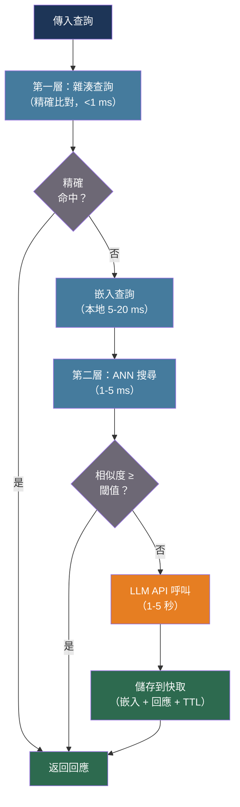

# [BEE-558] LLM 應用程式的語意快取

:::info
精確比對快取只有在查詢字串完全相同時才能重用回應 — 這對自然語言來說是幾乎不可能的嚴格條件。語意快取用向量相似度比對取代字串相等性：當新查詢在語意上等同於已快取的查詢時，直接返回儲存的回應而不呼叫 LLM，可降低 API 成本 30-70%，快取命中延遲降低 50-100 倍。
:::

## 背景脈絡

使用鍵值存儲的標準快取（BEE-200）以鍵的確切位元組來識別快取命中。對於 LLM 查詢，這意味著「法國的首都是什麼？」和「告訴我法國的首都」被視為不同請求並分開計費，儘管任何 LLM 都會產生相同或語意等價的回應。自然語言的同義表達使得真實對話工作負載的精確比對命中率微不足道。

Bang（2023 年，NLP-OSS 工作坊，「GPTCache：為 LLM 應用程式提供更快答案和節省成本的開源語意快取」）介紹了第一個系統性的開源語意快取架構。GPTCache 將每個傳入查詢轉換為嵌入向量，儲存嵌入向量及其相關的 LLM 回應，並使用近似最近鄰（ANN）搜尋來檢測語意相似的未來查詢。相似度閾值決定何時檢索到的條目「足夠接近」可以重用。對 ChatGPT 查詢日誌的研究（MeanCache，arXiv:2403.02694，IPDPS 2025）發現，同一會話中 31% 的用戶查詢在語意上與先前的查詢相似 — 這是每個會話快取命中率的實際上限。

語意快取面臨精確比對快取沒有的挑戰。最優的逐出策略是 NP 困難的：一項理論分析（arXiv:2603.03301）證明計算最優語意快取策略（VOPT）可歸約到最大覆蓋問題，除非 P = NP，否則無法以好於 (1 − 1/e) ≈ 63.2% 的比率近似。在九個真實世界數據集（ELI5、WildChat、MS MARCO、StackOverflow）上的實證評估發現，基於 LFU 的逐出策略始終優於 LRU，因為 LLM 查詢分布遵循 Zipf（重尾）模式而非時間局部性。單一靜態相似度閾值也會產生基本的精確度-召回率權衡：寬鬆的閾值提高命中率但返回語意錯誤的回應；保守的閾值安全但錯過有效的命中。每個提示自適應閾值（vCache，arXiv:2502.03771，ICLR 2026）相比靜態閾值基準實現了 12.5 倍更高的命中率和 26 倍更低的錯誤率。

對後端工程師而言，語意快取是位於應用程式和 LLM API 之間的應用層優化。它不需要更改模型。關鍵實現決策是：嵌入模型選擇、相似度閾值、逐出策略、陳舊內容的 TTL 策略和多租戶安全性。

## 最佳實踐

### 使用兩層架構：語意比對前先精確比對

**必須**（MUST）在呼叫嵌入和向量搜尋之前先檢查精確字串相等性。嵌入步驟對本地推理需要 5-20 毫秒；向量搜尋增加 1-5 毫秒。對完全相同的重複查詢支付此開銷是浪費的：

```python
import hashlib
from dataclasses import dataclass, field

@dataclass
class SemanticCache:
    """
    兩層語意快取。
    第一層：精確鍵比對（雜湊查詢，亞毫秒級）
    第二層：語意比對（嵌入 + ANN 搜尋，5-20 毫秒）
    """
    exact_store: dict = field(default_factory=dict)        # hash -> response
    vector_store: object = None                            # ANN 索引
    embedder: object = None                                # 嵌入模型
    similarity_threshold: float = 0.90                    # 餘弦相似度

    def _hash(self, prompt: str) -> str:
        return hashlib.sha256(prompt.encode()).hexdigest()

    def get(self, prompt: str) -> str | None:
        # 第一層：精確比對
        key = self._hash(prompt)
        if key in self.exact_store:
            return self.exact_store[key]

        # 第二層：語意比對
        embedding = self.embedder.encode(prompt)
        results = self.vector_store.search(embedding, top_k=1)
        if results and results[0].score >= self.similarity_threshold:
            return results[0].response

        return None   # 快取未命中 — 呼叫 LLM

    def set(self, prompt: str, response: str) -> None:
        key = self._hash(prompt)
        self.exact_store[key] = response
        embedding = self.embedder.encode(prompt)
        self.vector_store.upsert(prompt, embedding, response)
```

### 選擇針對同義表達檢測優化的嵌入模型

**不得**（MUST NOT）為語意快取重用與 RAG 管道相同的嵌入模型。RAG 嵌入針對大詞彙表上的文件-查詢相關性進行優化；快取嵌入需要檢測狹窄查詢空間的同義表達。這些目標是不同的：

| 模型 | 維度 | 部署方式 | 快取適用性 |
|---|---|---|---|
| all-MiniLM-L6-v2 | 384 | 本地 | 良好預設；5ms 推理 |
| redis/langcache-embed-v1 | 768 | 本地 / HuggingFace | 專為快取比對訓練 |
| MPNet (paraphrase-mpnet-base-v2) | 768 | 本地 | 快取命中/未命中任務 F1=0.89（MeanCache） |
| text-embedding-ada-002 | 1536 | 雲端 API | 50-200ms 雲端往返；避免用於快取層 |
| Llama-2 變體 | 4096+ | 本地 GPU | 儘管體積更大，F1 較低（0.75）低於 MPNet |

MeanCache（arXiv:2403.02694）在各嵌入模型上測量了同義表達檢測 F1，發現針對同義表達任務訓練的 768 維 MPNet 優於 30 GB Llama-2 變體（F1 = 0.89 對 0.75）。在快取分類任務上，專為同義表達任務訓練的較小模型勝過較大的通用模型。

**應該**（SHOULD）使用本地模型作為快取嵌入層，以避免在每次請求中增加雲端往返。每次請求的雲端嵌入呼叫（50-200 毫秒）在快取未命中時增加的開銷部分抵消了快取命中的優勢。

### 謹慎設置相似度閾值 — 並注意約定

**必須**（MUST）在配置閾值前驗證您的向量存儲使用的是餘弦**相似度**（越高越相似）還是餘弦**距離**（越低越相似）。這兩種約定是相反的：

```python
# RedisVL SemanticCache：使用餘弦距離
# distance_threshold=0.1 ≈ 餘弦相似度 0.9（嚴格）
# distance_threshold=0.5 ≈ 餘弦相似度 0.5（太寬鬆）
from redisvl.extensions.llmcache import SemanticCache

cache = SemanticCache(
    name="llmcache",
    redis_url="redis://localhost:6379",
    distance_threshold=0.1,   # 距離 — 越低越嚴格（與直覺相反）
)

# GPTCache / 大多數函式庫：使用餘弦相似度
# similarity_threshold=0.9 表示「只接受 90% 以上相似度的快取命中」
# similarity_threshold=0.7 是 GPTCache 的預設值（對事實型應用過於寬鬆）
```

**按使用案例的實際閾值建議：**

| 使用案例 | 餘弦相似度 | 理由 |
|---|---|---|
| FAQ / 支援機器人 | 0.65-0.75 | 同義表達率高；錯誤答案影響較低 |
| 通用對話 | 0.85-0.90 | 平衡命中率和準確性 |
| 事實型 / 高風險 | 0.90-0.95 | 誤判快取命中（返回錯誤答案）成本高 |

**應該**（SHOULD）獨立評估誤判率（返回語意錯誤回應的快取命中比例）與命中率。在命中率上看起來不錯的閾值可能對您的內容領域有不可接受的誤判率。Redis 建議生產部署的誤判率保持在 3-5% 以下。

### 應用 LFU 逐出策略，而非 LRU

**應該**（SHOULD）為 LLM 查詢快取配置基於頻率的（LFU）逐出策略，而非基於最近使用的（LRU）逐出策略。LLM 查詢工作負載遵循 Zipf 分布：少量查詢類型佔大多數請求。LRU 根據最後訪問的時間逐出快取條目，這在使用具有時間相關性時效果好。對於 LLM 快取，最有價值的條目是頻繁重複的查詢模式，不一定是最近訪問的條目：

```python
# Redis 配置：使用 LFU 逐出策略
# 在 redis.conf 或通過 CONFIG SET：
#   maxmemory-policy allkeys-lfu
#
# LFU 逐出在記憶體滿時移除最少頻繁訪問的鍵，
# 保留高價值的快取查詢模式。

@dataclass
class LFUSemanticCache:
    frequency: dict[str, int] = field(default_factory=dict)

    def on_hit(self, cache_key: str) -> None:
        self.frequency[cache_key] = self.frequency.get(cache_key, 0) + 1

    def evict_if_needed(self, max_entries: int) -> None:
        if len(self.frequency) > max_entries:
            # 移除最少頻繁使用的條目
            sorted_keys = sorted(self.frequency, key=self.frequency.get)
            for key in sorted_keys[:len(self.frequency) - max_entries]:
                del self.frequency[key]
                # 同時從 exact_store 和 vector_store 移除
```

### 使用 TTL 處理內容陳舊

**必須**（MUST）為隨時間變化的內容在快取條目上設置 TTL。語意快取對更新沒有乾淨的失效機制 — 單一事實變更可能使許多語意相關的快取條目變得錯誤，而沒有辦法枚舉它們：

```python
from datetime import timedelta

# 按內容易變性的 TTL 指南：
CACHE_TTL = {
    "prices_inventory": timedelta(minutes=5),
    "news_current_events": timedelta(minutes=15),
    "product_descriptions": timedelta(hours=4),
    "documentation_faqs": timedelta(hours=24),
    "reference_stable_facts": None,   # 無 TTL — 僅靠逐出
}

async def get_or_fetch(
    prompt: str,
    content_type: str,
    llm_client,
    cache: SemanticCache,
) -> str:
    cached = cache.get(prompt)
    if cached is not None:
        return cached

    response = await llm_client.complete(prompt)
    ttl = CACHE_TTL.get(content_type)
    cache.set(prompt, response, ttl=ttl)
    return response
```

**應該**（SHOULD）用元數據（產品 ID、文件版本、用戶 ID）標記快取條目，以便在來源數據變更時進行針對性的批量失效：

```python
# RedisVL 支援基於過濾器的刪除：
# 刪除所有標記特定 product_id 的快取條目
cache.delete(filter_expression=Tag("product_id") == "SKU-12345")
```

### 使用元數據過濾器強制執行租戶隔離

**不得**（MUST NOT）在多租戶部署中允許一個租戶的快取回應被提供給另一個租戶。不同租戶的用戶可能提出語意相似但正確答案不同的問題（不同價格層級、不同功能訪問、不同數據）：

```python
from redisvl.query.filter import Tag

async def get_cached_response(
    prompt: str,
    tenant_id: str,
    cache,
) -> str | None:
    """
    在快取查詢過濾器中始終包含 tenant_id。
    如果沒有此設置，租戶 A 的快取條目可能被返回給租戶 B。
    """
    return cache.check(
        prompt=prompt,
        filter_expression=Tag("tenant_id") == tenant_id,
    )

async def store_cached_response(
    prompt: str,
    response: str,
    tenant_id: str,
    cache,
) -> None:
    cache.store(
        prompt=prompt,
        response=response,
        metadata={"tenant_id": tenant_id},
    )
```

## 視覺化



## 常見錯誤

**對所有內容領域使用相同的閾值。** 單一全局閾值在命中率和誤判率之間產生的權衡，對您的至少一種內容類型來說是錯誤的。按領域測量誤判率，並設置獨立的快取實例或閾值配置。

**混淆餘弦距離和餘弦相似度。** RedisVL 的 `distance_threshold` 是餘弦距離（0 = 相同，2 = 相反）。大多數學術論文和 GPTCache 使用餘弦相似度（1 = 相同，0 = 正交）。在 RedisVL 上設置 `distance_threshold=0.9` 幾乎毫無用處（允許幾乎任何比對）；「90% 相似」的等效值是 `distance_threshold=0.1`。

**在不進行上下文編碼的情況下快取多輪對話回應。** 像「下一步是什麼？」這樣的查詢，其正確回應完全取決於先前的對話。語意快取必須要麼將對話上下文編碼到嵌入中（MeanCache 的上下文鏈編碼），要麼明確從快取中排除上下文相關的查詢。

**跳過租戶隔離。** 在多租戶系統中，不同租戶的用戶可能詢問「我們的企業計劃定價是什麼？」並收到彼此的快取定價數據。始終使用元數據過濾器將快取查詢限定在租戶上下文中。

**使用 LRU 逐出。** LRU 逐出最近最少訪問的條目。對於查詢分布遵循 Zipf 的 LLM 快取，最有價值的條目是那些頻繁重複查詢的條目 — 不一定是最近訪問的。使用 LFU 或頻率加權策略。

**不測量誤判率。** 僅憑命中率是具有誤導性的指標。30% 命中率加 10% 誤判率意味著 3% 的所有用戶回應在事實上是錯誤的，但看起來正確。通過抽樣 + LLM 裁判評估來測量誤判率，並將其作為生產 SLO 進行追蹤。

## 相關 BEE

- [BEE-9001](../caching/caching-fundamentals-and-cache-hierarchy.md) -- 快取基礎與快取層次：本文擴展的精確比對快取基礎
- [BEE-30024](llm-caching-strategies.md) -- LLM 快取策略：API 層級的提示快取（Anthropic、OpenAI）和 KV 快取重用
- [BEE-30014](embedding-models-and-vector-representations.md) -- 嵌入模型與向量表示：嵌入模型選擇和權衡
- [BEE-30026](vector-database-architecture.md) -- 向量資料庫架構：語意快取層使用的 ANN 搜尋引擎

## 參考資料

- [Bang. GPTCache：為 LLM 應用程式提供更快答案和節省成本的開源語意快取 — NLP-OSS Workshop 2023](https://openreview.net/pdf?id=ivwM8NwM4Z)
- [GPTCache — github.com/zilliztech/GPTCache](https://github.com/zilliztech/GPTCache)
- [Cheng 等人 MeanCache：以用戶為中心的 LLM Web API 語意快取 — arXiv:2403.02694，IPDPS 2025](https://arxiv.org/abs/2403.02694)
- [SCALM：大型語言模型的語意快取 — arXiv:2406.00025，IEEE/ACM 2024](https://arxiv.org/abs/2406.00025)
- [從精確命中到足夠接近：語意快取逐出策略 — arXiv:2603.03301](https://arxiv.org/html/2603.03301)
- [Krites：非同步驗證語意快取（Apple）— arXiv:2602.13165，2026](https://arxiv.org/html/2602.13165v1)
- [vCache：具有每個提示自適應閾值的語意快取 — arXiv:2502.03771，ICLR 2026](https://arxiv.org/abs/2502.03771)
- [RedisVL SemanticCache 文件 — redis.io](https://redis.io/docs/latest/develop/ai/redisvl/user_guide/llmcache/)
