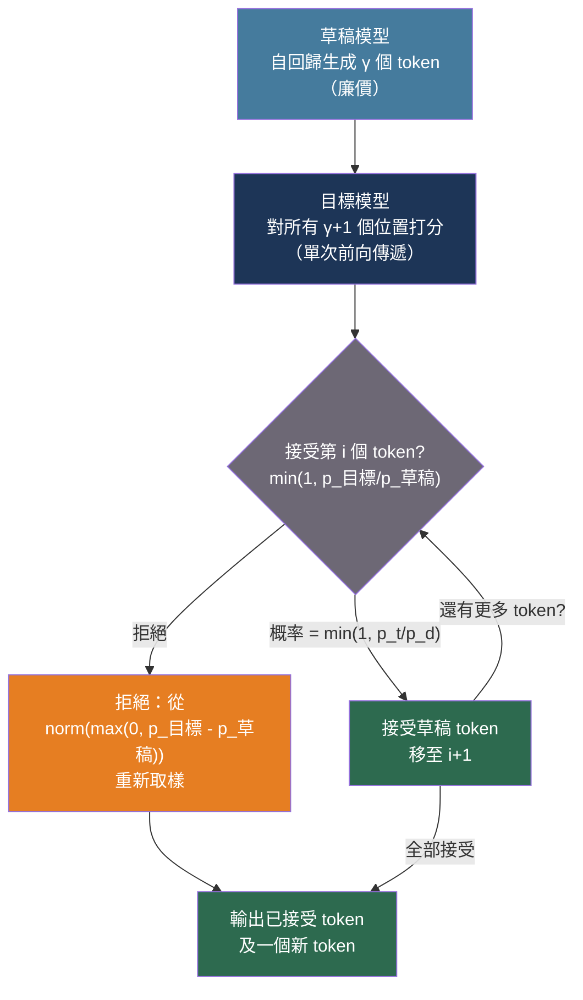
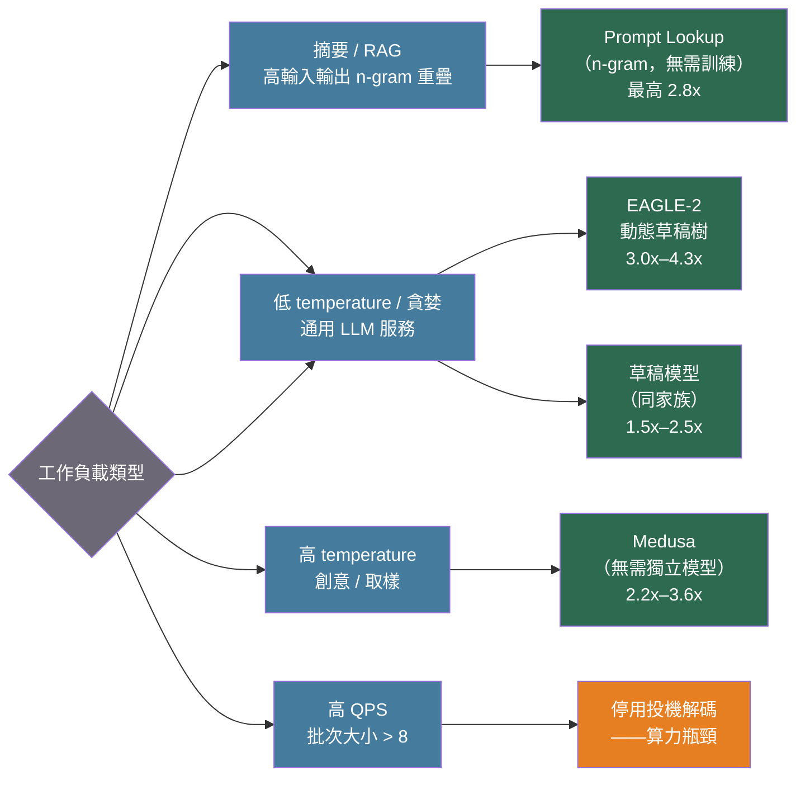

# [BEE-561] LLM 推論的投機解碼

:::info
自回歸 LLM 解碼每次前向傳遞只生成一個 token，在每次傳遞之間 GPU 大量閒置，等待從記憶體載入權重。投機解碼（Speculative Decoding）攤銷這個成本：廉價的草稿模型依序提出多個 token，大型目標模型在單次並行前向傳遞中驗證所有提案，採用修改版拒絕取樣，可在數學上保證輸出分布與目標模型完全相同。
:::

## 背景

標準自回歸解碼在互動式批次大小下受記憶體頻寬瓶頸限制（memory-bandwidth-bound）：GPU 必須為每個輸出 token 從 HBM 載入所有模型權重，但每字節權重所執行的算術運算極少。這個比率——每字節的浮點運算數（FLOP per byte）——遠低於 GPU 的算力/頻寬上限，導致計算核心大部分時間處於閒置狀態。

投機解碼由 Leviathan、Kalman 和 Matias（Google，arXiv:2211.17192，ICML 2023 口頭報告）與 Chen 等人（DeepMind，arXiv:2302.01318，2023）分別獨立提出，其核心思想是將提案與驗證解耦。廉價的草稿模型自回歸生成 γ 個候選 token；目標模型對所有 γ+1 個位置（γ 個草稿 token 加上其後的下一個 token）在單次前向傳遞中進行打分。每個草稿 token 根據修改版拒絕取樣規則被接受或拒絕，所產生的輸出分布與目標模型單獨生成的結果完全相同——不損失品質，並非近似。

位置 i 的草稿 token x 的接受規則：以概率 `min(1, p_目標(x) / p_草稿(x))` 接受。拒絕時，從正規化正殘差 `norm(max(0, p_目標 - p_草稿))` 中重新取樣，可維持精確的目標分布。每次目標模型調用的期望接受 token 數 ≈ `(1 - α^(γ+1)) / (1 - α)`，其中 α 為每個 token 的接受率，γ 為草稿長度。當 α = 0.8、γ = 4 時，一次目標模型調用平均可得約 2.8 個 token。

傳統投機解碼有兩個實際限制：草稿模型與目標模型必須共享相同詞彙表（限制跨家族使用），且在高批次大小時效益遞減（系統變為算力瓶頸而非記憶體頻寬瓶頸）。

後續研究解決了草稿品質問題。EAGLE（Li 等人，arXiv:2401.15077，2024）在特徵（feature）層面而非 token 層面運作：其自回歸草稿頭接收前一個 token 向前移一步後的結果，加上前一個隱藏狀態，預測下一個隱藏狀態，解決了純 token 層面預測的「固有不確定性」。EAGLE 在 LLaMA2-Chat 70B 貪婪解碼上達到 2.7x–3.5x 加速。EAGLE-2（arXiv:2406.16858，2024）新增了上下文感知動態草稿樹：使用草稿頭的信心分數作為各分支接受率的校準代理指標（信心 < 0.05 → 接受率約 0.04；信心 > 0.95 → 接受率約 0.98），在運行時裁剪低概率分支，達到 3.05x–4.26x 加速。

Medusa（Cai 等人，arXiv:2401.10774，2024）通過在凍結主幹上直接添加多個前饋解碼頭完全消除了獨立草稿模型，每個頭預測不同偏移量的未來 token。樹狀注意力掩碼在一次目標前向傳遞中驗證所有笛卡兒積候選序列。Medusa-1（凍結主幹，只訓練頭部）無損地達到 >2.2x 加速；Medusa-2（聯合微調）達到 2.3x–3.6x，且完全避免了詞彙表不匹配限制。

## 最佳實踐

### 對摘要和 RAG 工作負載優先使用 Prompt Lookup

**應該（SHOULD）** 在投入草稿模型之前先嘗試 Prompt Lookup（n-gram 投機解碼）。Prompt Lookup 掃描輸入提示，尋找與當前生成後綴匹配的 n-gram 並用作草稿 token。無需訓練，無詞彙表限制，在輸入輸出重疊度高的任務（摘要、RAG、翻譯）上可達到最高 2.8x 加速：

```python
from vllm import LLM, SamplingParams

llm = LLM(
    model="meta-llama/Llama-3.1-8B-Instruct",
    speculative_config={
        "method": "ngram",
        "num_speculative_tokens": 5,  # 草稿長度 γ
        "prompt_lookup_max": 4,       # 最大 n-gram 匹配長度
        "prompt_lookup_min": 1,       # 最小 n-gram 匹配長度
    },
)
params = SamplingParams(temperature=0.0, max_tokens=512)
outputs = llm.generate(prompts, params)
```

### 對通用加速使用同家族草稿模型

**應該（SHOULD）** 在 Prompt Lookup 效益不足時，使用與目標模型同家族（共享分詞器和詞彙表）的小模型。草稿模型通常約小 10 倍：Llama 3.1 8B 為 Llama 3.1 70B 起草是常見配對。

```python
llm = LLM(
    model="meta-llama/Llama-3.1-70B-Instruct",
    speculative_config={
        "method": "draft_model",
        "model": "meta-llama/Llama-3.1-8B-Instruct",  # 必須共享詞彙表
        "num_speculative_tokens": 5,
        "draft_tensor_parallel_size": 1,  # 草稿模型使用較少 GPU
    },
)
```

**禁止（MUST NOT）** 在未進行負載測試的情況下於高 QPS 環境部署投機解碼。在低批次大小（1–4 個請求）時，系統受記憶體頻寬限制，投機解碼有效。在高批次大小時，GPU 變為算力瓶頸，提案開銷可能降低吞吐量。vLLM 的動態投機解碼可根據系統負載調整草稿長度：

```python
speculative_config={
    "method": "draft_model",
    "model": "meta-llama/Llama-3.1-8B-Instruct",
    "num_speculative_tokens": -1,    # -1 啟用動態調整
    "disable_by_batch_size": 8,      # 批次大小超過此值時停用投機解碼
}
```

### 使用 EAGLE 最大化單用戶延遲降低

**應該（SHOULD）** 在優化生成密集型工作負載的單用戶 p50 和 p99 TTFT 及 ITL（見 BEE-560）時使用 EAGLE 或 EAGLE-2。EAGLE 需要預訓練的草稿頭——官方提供了 LLaMA-2、LLaMA-3、Mistral 和 Vicuna 家族的草稿頭。

```python
# 在 vLLM 中使用 EAGLE-2 動態草稿樹
llm = LLM(
    model="meta-llama/Llama-3.1-8B-Instruct",
    speculative_config={
        "method": "eagle",
        "model": "yuhuili/EAGLE2-LLaMA3.1-Instruct-8B",  # EAGLE-2 草稿頭
        "num_speculative_tokens": 6,
    },
)
```

**必須（MUST）** 在以延遲為首要目標時保持 temperature = 0（貪婪解碼）以最大化接受率。在 temperature ≥ 1.0 時，扁平的輸出分布會顯著降低接受率（EAGLE 降至 1.7x–2.1x 範圍，而貪婪模式下可達 3x 以上）。

### 在無法使用獨立草稿模型時使用 Medusa

**應該（SHOULD）** 在詞彙表不匹配排除獨立草稿模型，或服務基礎設施無法支援第二個模型進程時使用 Medusa：

```python
# TensorRT-LLM 中的 Medusa（temperature 必須為 0）
llm = LLM(
    model="FasterDecoding/medusa-1-vicuna-7b-v1.5",
    speculative_config={
        "method": "medusa",
        "num_speculative_tokens": 5,  # 每個 Medusa 頭一個
    },
)
```

**禁止（MUST NOT）** 在無損（Medusa-1）配置中使用非零 temperature——temperature > 0 時 token 匹配失效。Medusa-2 的聯合微調可以放寬此限制，但代價是輕微的品質偏差。

### 監測接受率以診斷效能不佳的部署

**應該（SHOULD）** 對接受率和每次目標模型調用的平均 token 數進行儀表化，以檢測投機解碼是否弊大於利：

```python
import time
from dataclasses import dataclass, field
from collections import deque

@dataclass
class SpecDecMetrics:
    """投機解碼健康狀況的滾動窗口指標。"""
    window: int = 1000
    _accepted: deque = field(default_factory=lambda: deque(maxlen=1000))
    _drafted: deque = field(default_factory=lambda: deque(maxlen=1000))

    def record(self, drafted: int, accepted: int) -> None:
        self._drafted.append(drafted)
        self._accepted.append(accepted)

    @property
    def acceptance_rate(self) -> float:
        d = sum(self._drafted)
        return sum(self._accepted) / d if d else 0.0

    @property
    def mean_tokens_per_call(self) -> float:
        return sum(self._accepted) / len(self._accepted) if self._accepted else 0.0

    def is_healthy(self, min_acceptance_rate: float = 0.6) -> bool:
        """接受率低於 0.6 時，開銷通常超過收益。"""
        return self.acceptance_rate >= min_acceptance_rate
```

若 `acceptance_rate` 在持續窗口內降至 0.6 以下，請考慮：提高 temperature 閾值、縮短草稿長度 γ，或對該請求類別停用投機解碼。

## 圖解





## 常見錯誤

**在高 QPS 下啟用投機解碼卻未測量吞吐量。** 提案-驗證開銷為每個步驟增加了延遲。在高批次大小時，GPU 是算力瓶頸而非記憶體頻寬瓶頸，因此不存在免費午餐。啟用前後務必比較 Goodput（每秒滿足 SLO 的請求數）。vLLM 的 `disable_by_batch_size` 可防止大規模部署時的性能退化。

**使用來自不同模型家族的草稿模型。** 詞彙表不匹配使 token 層面的草稿提案成為不可能。Llama 3 的 token 與 Mistral 的 token 不同，即使模型外觀相似。家族不一致時使用 EAGLE 或 Medusa。

**在高 temperature 取樣下應用投機解碼而不檢查接受率。** 在 temperature = 1.0 以上時，輸出分布幾乎均勻。大多數 token 的接受率 `min(1, p_目標/p_草稿)` 接近 0，意味著幾乎每個草稿 token 都被拒絕並重新取樣——草稿模型的開銷被浪費。

**將草稿長度 γ 設置過長。** 過長的草稿序列意味著一個被拒絕的 token 會使所有後續草稿 token 失效。實驗表明，對大多數模型家族配對，γ = 4–6 接近最優。只有在接受率非常高（> 0.9）時，更長的草稿才有幫助。

**假設 Medusa-2 對品質無影響。** Medusa-2 涉及主幹和頭部的聯合微調。MT-bench 分數平均偏移 ±0.15——通常可以忽略，但並非為零。在部署到生產環境之前，請在您的任務分布上進行驗證。

**未將互動式與批次工作負載分隔。** 投機解碼有利於單用戶互動式延遲（TTFT、ITL）。批次離線工作負載已受算力瓶頸限制，不應使用。按類型路由工作負載。

## 相關 BEE

- [BEE-30021](llm-inference-optimization-and-self-hosting.md) -- LLM 推論優化與自托管：投機解碼所屬的更廣泛優化領域
- [BEE-30058](llm-load-testing-and-capacity-planning.md) -- LLM 負載測試與容量規劃：測量 TTFT/ITL 以驗證投機解碼收益
- [BEE-30011](ai-cost-optimization-and-model-routing.md) -- AI 成本優化與模型路由：選擇較小模型以降低成本，與投機解碼互補

## 參考資料

- [Leviathan, Kalman, Matias. Fast Inference from Transformers via Speculative Decoding — arXiv:2211.17192, ICML 2023](https://arxiv.org/abs/2211.17192)
- [Chen et al. Accelerating Large Language Model Decoding with Speculative Sampling — arXiv:2302.01318, DeepMind 2023](https://arxiv.org/abs/2302.01318)
- [Li et al. EAGLE: Speculative Sampling Requires Rethinking Feature Uncertainty — arXiv:2401.15077, 2024](https://arxiv.org/abs/2401.15077)
- [Li et al. EAGLE-2: Faster Inference of Language Models with Dynamic Draft Trees — arXiv:2406.16858, 2024](https://arxiv.org/abs/2406.16858)
- [Cai et al. Medusa: Simple LLM Inference Acceleration Framework with Multiple Decoding Heads — arXiv:2401.10774, 2024](https://arxiv.org/abs/2401.10774)
- [Xia et al. Unlocking Efficiency in Large Language Model Inference: A Comprehensive Survey of Speculative Decoding — arXiv:2401.07851, ACL Findings 2024](https://arxiv.org/abs/2401.07851)
- [vLLM. Speculative Decoding — vllm.ai](https://vllm.ai/blog/spec-decode)
- [NVIDIA TensorRT-LLM. Speculative Decoding — nvidia.github.io](https://nvidia.github.io/TensorRT-LLM/advanced/speculative-decoding.html)
