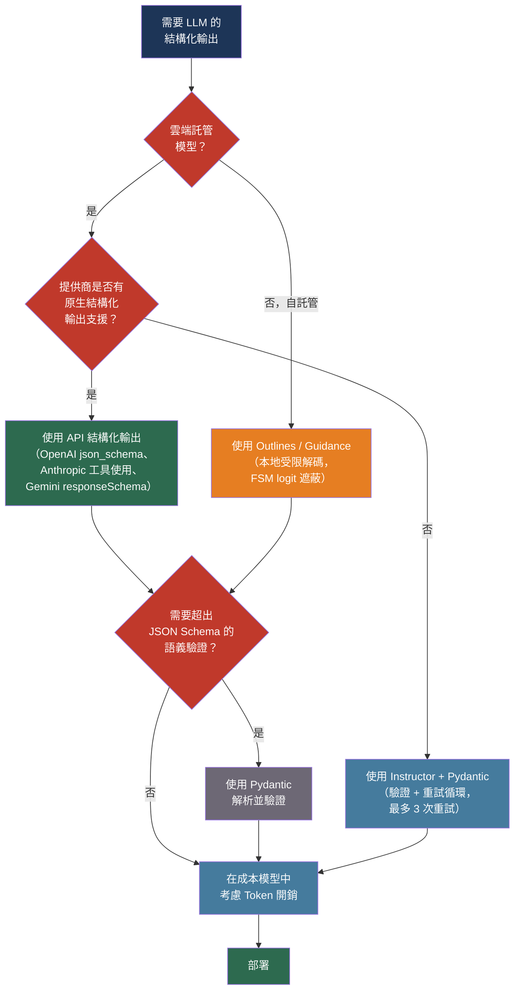

# [BEE-30006] 結構化輸出與受限解碼

:::info
LLM 預設產生自由格式文字，這使得可靠的符合 Schema 的 JSON 在規模化時成為一個解析問題。受限解碼（Constrained Decoding）在 Token 層級解決了這個問題，消除了生產環境中「提示要求 JSON」方法所產生的 8–15% JSON 解析失敗率。
:::

## 背景

從 LLM 提取結構化資料最早的生產模式是提示工程：在系統提示中加入「只回應有效 JSON」然後後處理輸出。這在演示中效果尚可，但在生產環境中的失敗率介於 8% 到 15% 之間——缺少逗號、未閉合的括號、額外的說明文字，以及通過語法驗證但違反 Schema 的列舉值錯誤。

OpenAI 在 2023 年 11 月推出了 JSON 模式，使用 `response_format: {type: "json_object"}`。JSON 模式保證語法上有效的 JSON，但不保證符合 Schema。模型可以回傳 `{}` 或完全不同的鍵結構，仍然滿足約束條件。「有效 JSON」與「符合此 Schema 的 JSON」之間的差距仍然是應用程式的問題。

解決這個差距的底層理論出現在 Willard 和 Louf 的「Efficient Guided Generation for Large Language Models」（arXiv:2307.09702，2023 年）中，該論文將結構化生成重新表述為透過從目標語法衍生的有限狀態機（FSM）進行的轉換。在每個解碼步驟中，只有保持 FSM 處於有效狀態的 Token 才能獲得非零 logit 權重。這保證了輸出的一致性，無需後處理驗證。Geng 等人的「Grammar-Constrained Decoding for Structured NLP Tasks without Finetuning」（arXiv:2305.13971，EMNLP 2023）將此擴展到上下文無關文法，支援遞迴 JSON Schema。

到 2024 年，API 提供商已將受限解碼內化。OpenAI 的結構化輸出（GPT-4o，2024 年 8 月）使用微軟的 llguidance 引擎在伺服器端強制執行 JSON Schema。Anthropic 的工具使用 API 和 Gemini 的 `responseSchema` 參數應用了等效機制。這個領域在不到三年的時間裡從「提示要求 JSON」轉移到了「演算法保證」。

## 設計思維

結構化輸出強制執行在三個層次上運作，具有不同的成本、控制和可移植性取捨：

| 層次 | 機制 | Schema 保證 | 延遲開銷 |
|------|------|------------|---------|
| API 受限解碼 | 提供商在 Token 採樣期間強制執行 Schema | 硬性保證 | ~0ms（伺服器端） |
| 客戶端驗證 + 重試 | 生成後解析並驗證，帶錯誤重試 | 概率性 | 1–3 次完整往返 |
| 本地受限解碼 | 函式庫在本地推理時遮蔽 logit | 硬性保證 | 每 Token ~50µs |

**API 受限解碼**（OpenAI 結構化輸出、Anthropic 工具使用、Gemini responseSchema）是雲端託管模型的正確預設選擇：零客戶端重試成本、保證一致性、無函式庫依賴。其代價是 Schema 複雜性限制和提供商鎖定。

**客戶端驗證 + 重試**（Instructor + Pydantic）是務實的中間方案：適用於任何提供商，包括不支援原生結構化輸出的提供商，並處理任何 Token 層級約束都無法表達的語義驗證（例如「開始日期必須早於結束日期」）。

**本地受限解碼**（Outlines、Guidance、llama.cpp GBNF）適用於需要硬性保證且 API 成本重要的自託管模型。

關鍵洞察：JSON 模式不是受限解碼。它保證語法有效性，不保證 Schema 一致性。不要將 JSON 模式用作結構化輸出或 Schema 驗證的替代方案。

## 最佳實踐

### 使用 API 結構化輸出而非 JSON 模式

**MUST NOT（不得）** 依賴 JSON 模式作為生產系統的主要 Schema 強制執行機制。JSON 模式保證有效的 JSON 值；它不保證該值符合您的 Schema。`{}` 或 `{"unexpected": true}` 的回應滿足 JSON 模式，但會破壞應用程式。

**SHOULD（應該）** 在可用時使用提供商原生的結構化輸出：

```python
# OpenAI 結構化輸出——在伺服器端保證 Schema 一致性
from openai import OpenAI
import json

client = OpenAI()

schema = {
    "type": "object",
    "properties": {
        "status": {"type": "string", "enum": ["success", "failure", "pending"]},
        "items": {
            "type": "array",
            "items": {"type": "object", "properties": {
                "id": {"type": "string"},
                "score": {"type": "number"}
            }, "required": ["id", "score"]}
        }
    },
    "required": ["status", "items"],
    "additionalProperties": False
}

response = client.chat.completions.create(
    model="gpt-4o-2024-08-06",
    response_format={
        "type": "json_schema",
        "json_schema": {"name": "result", "strict": True, "schema": schema}
    },
    messages=[{"role": "user", "content": "提取項目..."}]
)
result = json.loads(response.choices[0].message.content)
```

**MUST（必須）** 在 OpenAI 結構化輸出中設定 `additionalProperties: false` 和 `strict: true`，以防止模型添加未聲明的欄位。沒有這些設定，模型可能包含破壞嚴格反序列化器的額外欄位。

### 使用 Pydantic 驗證並使用 Instructor 進行重試循環

**SHOULD（應該）** 將輸出 Schema 定義為 Pydantic 模型，而非原始 JSON Schema 字典。Pydantic 模型提供 Python 型別安全、IDE 自動完成以及任何 Token 層級約束都無法強制執行的語義驗證器。

**SHOULD（應該）** 在使用缺乏原生結構化輸出支援的提供商，或需要語義驗證時，使用 Instructor 函式庫：

```python
import instructor
from anthropic import Anthropic
from pydantic import BaseModel, field_validator

class OrderExtraction(BaseModel):
    order_id: str
    amount_cents: int
    currency: str

    @field_validator("currency")
    @classmethod
    def must_be_iso4217(cls, v: str) -> str:
        if v not in {"USD", "EUR", "GBP", "JPY"}:
            raise ValueError(f"未知貨幣: {v}")
        return v

client = instructor.from_anthropic(Anthropic())

# Instructor 在驗證失敗時自動重試
order = client.messages.create(
    model="claude-sonnet-4-6",
    max_tokens=512,
    max_retries=3,          # 驗證失敗時重試
    response_model=OrderExtraction,
    messages=[{"role": "user", "content": "從以下內容提取訂單詳情：..."}]
)
# order 是型別化的 OrderExtraction 實例，而非原始 JSON
```

Instructor 將驗證錯誤訊息注入下一次提示嘗試，為模型提供診斷反饋，而不僅僅是盲目重試。

**MUST NOT（不得）** 在生產重試循環中將 `max_retries` 設定超過 3。每次重試都是一次完整的 API 往返。持續需要超過 3 次重試的 Schema 是 Schema 設計問題或模型能力不匹配。

### 在成本模型中考慮 Token 開銷

結構化輸出強制執行並非免費。JSON 結構——括號、引號、冒號、逗號——無論資訊內容如何都會增加 Token 數量。11 個 Token 的資料值可能需要 35 個 Token 的 JSON 結構。

**SHOULD（應該）** 在承諾定價模型之前，測量您特定 Schema 的實際 Token 數量：

| 提供商 | Schema 強制執行開銷 |
|--------|-------------------|
| OpenAI 結構化輸出 | 每次請求 80–120 個 Token（Schema 傳輸） |
| Anthropic 工具使用 | 150–300 個 Token（工具定義 + 系統提示） |
| Gemini responseSchema | Schema 大小計入輸入 Token 限制 |
| JSON 結構（全部） | 結構化資料內容約 3 倍乘數 |

**SHOULD（應該）** 對於高流量應用程式，將大型 Schema 分解為更小的順序呼叫。當 JSON 結構開銷佔主導地位時，在一次呼叫中提取 20 個欄位的成本高於在四次有針對性的呼叫中各提取 5 個欄位。

**SHOULD NOT（不應該）** 對自然是自由格式的回應（摘要、解釋、創意文字）使用結構化輸出。當沒有下游解析器消耗該結構時，開銷是不合理的。

### 對自託管模型使用本地受限解碼

**SHOULD（應該）** 在本地或私有基礎設施上運行開放權重模型時，使用 Outlines 進行 JSON Schema 受限生成：

```python
from outlines import models, generate

model = models.transformers("mistralai/Mistral-7B-Instruct-v0.2")

schema = {
    "type": "object",
    "properties": {
        "sentiment": {"type": "string", "enum": ["positive", "negative", "neutral"]},
        "confidence": {"type": "number"}
    },
    "required": ["sentiment", "confidence"]
}

generator = generate.json(model, schema)
result = generator("分類以下文字的情感：「這個產品超出了我的預期。」")
# result 是保證符合 Schema 的 dict
```

Outlines 從 JSON Schema 建構有限狀態機，並在每個步驟遮蔽 logit 權重，只允許保持 FSM 在有效狀態的 Token。Schema 一致性是數學保證，而非概率性保證。

**SHOULD（應該）** 對 JSON Schema 約束首選 Outlines，對在生成中交錯控制流程（條件、循環、在生成中呼叫工具）首選 Guidance。

### 使用狀態解析器處理流式結構化輸出

流式結構化輸出需要謹慎：中間 Chunk 不是有效的 JSON。在每個 Chunk 上獨立解析的天真實現將在除最後一個 Chunk 之外的所有 Chunk 上失敗。

**SHOULD（應該）** 使用客戶端函式庫內建的流式支援，而非從頭實現有狀態解析：

```python
# 使用 Pydantic 部分驗證的 Instructor 流式傳輸
import instructor
from openai import OpenAI
from pydantic import BaseModel

class Report(BaseModel):
    title: str
    summary: str
    key_points: list[str]

client = instructor.from_openai(OpenAI())

# 在欄位完成時流式傳輸部分模型
for partial_report in client.chat.completions.create_partial(
    model="gpt-4o",
    response_model=Report,
    messages=[{"role": "user", "content": "撰寫一份關於...的報告"}],
    stream=True,
):
    # partial_report 在欄位完成時填充
    if partial_report.title:
        print(f"標題：{partial_report.title}")
```

**MUST NOT（不得）** 對延遲敏感的應用程式在解析前緩衝整個流。部分驗證允許在模型繼續生成剩餘結構的同時，漸進式渲染已完成的欄位。

### 限制 Schema 嵌套深度

**SHOULD（應該）** 將 JSON Schema 嵌套深度保持在五層以下。LLM 在受限 Schema 生成上的性能在此範圍之後明顯下降：模型必須同時追蹤更多結構上下文，這與語義內容生成競爭。

**SHOULD（應該）** 對需要保持在單次 API 呼叫中的 Schema，通過將嵌套物件提取為帶前綴名稱的頂層欄位（`address_city` 而非 `address.city`）來扁平化深度嵌套的 Schema。

**SHOULD（應該）** 在嵌套不可避免時，將複雜提取分解為順序呼叫：

```
呼叫 1：提取頂層實體欄位
呼叫 2：從呼叫 1 的實體提取嵌套行項目
呼叫 3：為每個行項目提取嵌套元數據
```

順序分解提高了每次呼叫的可靠性，並產生更小、更有針對性的提示。

## 視覺化



## 相關 BEE

- [BEE-30001](llm-api-integration-patterns.md) -- LLM API 整合模式：Token 成本管理和語義快取直接適用於結構化輸出呼叫；Schema 傳輸 Token 計入那裡涵蓋的成本模型
- [BEE-30002](ai-agent-architecture-patterns.md) -- AI Agent 架構模式：代理循環中的工具使用依賴結構化輸出進行參數傳遞；每次工具呼叫都是一個受限解碼問題
- [BEE-30004](evaluating-and-testing-llm-applications.md) -- 評估與測試 LLM 應用程式：格式合規性是評估維度表中的維度之一；Schema 違規應作為回歸案例出現在黃金資料集中
- [BEE-7004](../data-modeling/encoding-and-serialization-formats.md) -- 編碼與序列化格式：JSON Schema 作為序列化契約；嚴格與寬鬆 Schema 驗證之間的取捨在資料管道的背景下有所涵蓋

## 參考資料

- [Brandon T. Willard 和 Rémi Louf. Efficient Guided Generation for Large Language Models — arXiv:2307.09702, 2023](https://arxiv.org/abs/2307.09702)
- [Saibo Geng 等人. Grammar-Constrained Decoding for Structured NLP Tasks without Finetuning — arXiv:2305.13971, EMNLP 2023](https://arxiv.org/abs/2305.13971)
- [OpenAI. Structured Outputs — developers.openai.com](https://developers.openai.com/api/docs/guides/structured-outputs)
- [Anthropic. Tool Use — platform.claude.com](https://platform.claude.com/docs/en/agents-and-tools/tool-use/overview)
- [Google. Gemini Structured Output — ai.google.dev](https://ai.google.dev/gemini-api/docs/structured-output)
- [Instructor. Structured LLM Outputs — python.useinstructor.com](https://python.useinstructor.com/)
- [Outlines. Structured Text Generation — github.com/dottxt-ai/outlines](https://github.com/dottxt-ai/outlines)
- [Microsoft Guidance — github.com/guidance-ai/guidance](https://github.com/guidance-ai/guidance)
- [Pydantic. LLM Integration — pydantic.dev](https://pydantic.dev/articles/llm-intro)
