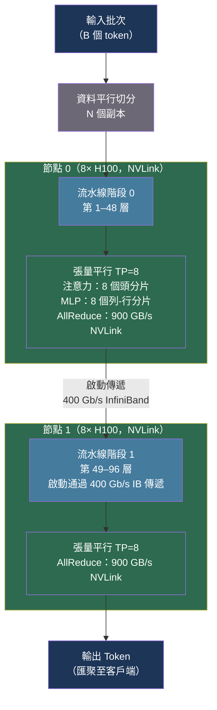

# [BEE-30066] LLM 推論的張量平行與流水線平行

:::info
當大型語言模型超出單張 GPU 的記憶體容量時，必須將其切分至多個裝置。張量平行（Tensor Parallelism）將單個權重矩陣切分至同一節點內的多張 GPU；流水線平行（Pipeline Parallelism）將模型層切分至跨節點的多個階段。正確選擇並組合這些策略，決定了你能從硬體中榨取 90% 還是 50% 的理論吞吐量。
:::

## 背景

多 GPU 推論最簡單的方式是資料平行（Data Parallelism，DP）：在每張 GPU 上複製一份模型，將不同請求路由到不同副本。DP 能擴展吞吐量，但無法解決模型尺寸問題——一個 70B 參數的模型在 BF16 精度下需要約 140 GB 記憶體，無法放入單張 A100（80 GB）或 H100（80 GB）。你需要將模型本身切分至多個裝置。

存在兩種正交策略：**張量平行（TP）** 對層內的單個張量運算進行分片；**流水線平行（PP）** 將層的序列切分至多個階段。兩者的組合——與資料平行共同構成的**三維平行（3D Parallelism）**——由 **Narayanan 等人**在《Efficient Large-Scale Language Model Training on GPU Clusters Using Megatron-LM》（arXiv:2104.04473，SC 2021）中正式確立。論文展示了在 3,072 張 A100 GPU 上以 TP=8、PP=64、DP=6 訓練 1 兆參數模型，達到 502 petaFLOP/s——理論峰值的 52%。

第三種策略——**序列平行（Sequence Parallelism，SP）**——將序列維度分布至多個 GPU，支持數百萬 token 的超長上下文，而無需在單張裝置上耗盡 KV 快取記憶體。

## 張量平行

Megatron-LM 的張量平行利用了 Transformer 線性層的結構特性。每個前饋塊由兩次 GEMM 組成：Y = GeLU(XA) 和 Z = YB。Megatron 以**先列平行、後行平行**的模式切分，在前向傳遞中每層僅需一次 AllReduce：

```
GPU 0：Y₀ = X @ A[:,0:d/2]    GPU 1：Y₁ = X @ A[:,d/2:d]   （列平行，無通訊）
       Z₀ = Y₀ @ B[0:d/2,:]          Z₁ = Y₁ @ B[d/2:d,:]  （行平行）
       Z = AllReduce(Z₀ + Z₁)                                 （每個 MLP 一次 AllReduce）
```

對於注意力機制，TP 按注意力頭切分。每張 GPU 擁有 H/TP 個頭，並對其子集進行完整注意力計算。Q、K、V 投影矩陣按列切分；輸出投影按行切分。這使得**每個 Transformer 層需要 2 次 AllReduce**（注意力後一次，MLP 後一次）。

當 AllReduce 通訊能被計算隱藏時，TP 加速比表現良好。H100 NVL 的 NVLink 提供 900 GB/s 的聚合頻寬，使節點內 AllReduce 的開銷極小：

| TP 度數 | 有效加速比（NVLink） | 有效加速比（PCIe） |
|---|---|---|
| 2 | ~1.9× | ~1.7× |
| 4 | ~3.7× | ~2.5× |
| 8 | ~7.2× | ~4.5× |
| 16 | ~13× | 不可行 |

**約束條件：** TP 度數必須能整除注意力頭數。Llama-3 70B 有 64 個頭，因此 TP ∈ {1, 2, 4, 8}。不建議將 TP 跨越節點邊界：單個 100 Gbps InfiniBand 埠提供約 12 GB/s，而 NVLink 提供 900 GB/s——相差 75 倍，使每層的 2 次 AllReduce 成為嚴重瓶頸。

## 流水線平行

流水線平行將連續的 Transformer 層分配給不同的 GPU（階段）。一個 96 層的模型在 4 個流水線階段中，每個階段負責 24 層。各階段僅傳遞階段邊界的啟動張量——數據量遠少於 TP 中的 AllReduce，使 PP 適合跨節點通訊。

**流水線氣泡問題**：在樸素流水線中，階段 P₀ 處理第一個微批次後將啟動傳遞給 P₁，然後空閒等待 P₁、P₂、P₃ 完成計算。氣泡比例——所有階段同時空閒的時間比例——為：

```
氣泡比率 = (P − 1) / M
```

其中 P 是流水線階段數，M 是微批次數量。**GPipe**（Huang 等人，arXiv:1811.06965，NeurIPS 2019）引入微批次技術以降低氣泡：將每個批次拆分為 M 個微批次，流水線處理，累積梯度。當 M ≥ 4×P 時，氣泡比率低於 25%。

Megatron-LM 的**交錯式 1F1B 排程（Interleaved 1F1B Schedule）** 為每張 GPU 分配多個不連續的層塊（每裝置 k 個塊），將氣泡降至 (P-1)/(k×M)。相比 GPipe，吞吐量提升約 10%，代價是存儲中間啟動的峰值記憶體增加。

```
交錯式 1F1B，P=4，M=8，k=2：
氣泡 = (4−1)/(2×8) = 18.75%  vs  GPipe 氣泡 = (4−1)/8 = 37.5%
```

**推論時的流水線平行與訓練有顯著差異。** 在自回歸解碼過程中，每次迭代生成一個 token——流水線中任意時刻只有一個微批次在流動。這意味著除唯一活躍階段外，其餘階段幾乎始終空閒，使 PP 對解碼吞吐量幾乎無益。PP 僅在預填充長上下文（單次大型前向傳遞）或模型實在無法用其他方式裝載時才對推論有益。

## 序列平行

當即使在 TP 和 PP 分片後，上下文長度仍超出 GPU 記憶體時，序列平行（SP）將序列維度分布至多個 GPU。

**DeepSpeed Ulysses**（arXiv:2309.14509）使用 all-to-all 通訊在注意力前後重新分配序列分片：

```
注意力前：all-to-all 交換 Q/K/V，使每張 GPU 計算其負責頭的所有 token
注意力後：all-to-all 將輸出重新分配回序列分片
```

當序列長度與 GPU 數量等比例擴展時，通訊量保持恆定，比樸素序列平行減少 10 倍通訊量。Ulysses 對百萬 token 序列實現了 2.5 倍吞吐量提升。

**Ring Attention**（arXiv:2310.01889，Liu、Zaharia、Abbeel）將 GPU 組織成環形拓撲，在每張 GPU 對本地 Q 塊計算分塊注意力的同時，循環傳遞 K/V 塊。通訊與計算完全重疊，實現零通訊開銷。Ring Attention 已展示 1 億 token 的序列——比記憶體高效 Transformer 長 500 倍。

## 最佳實踐

### 張量平行必須保持在單個 NVLink 節點內

**MUST NOT**（不得）將張量平行跨越節點邊界。NVLink 900 GB/s vs InfiniBand 50 GB/s 相差 18 倍；在 BF16 精度下，70B 規模每次 AllReduce 約產生 70 MB 資料，每層需傳輸 140 MB。在跨節點 TP=8 的情況下，AllReduce 延遲消耗 40–50% 的推論時間。

```bash
# 正確：TP 在單個 8-GPU H100 節點內，PP 跨節點
vllm serve meta-llama/Llama-3-70b-hf \
  --tensor-parallel-size 8 \      # 同一節點的 8 張 GPU
  --pipeline-parallel-size 1      # 單節點，無需 PP

# 多節點：TP 在節點內，PP 跨節點
# 節點 0（8 張 GPU）+ 節點 1（8 張 GPU）→ 共 16 張 GPU
vllm serve meta-llama/Llama-3-405B-Instruct \
  --tensor-parallel-size 8 \      # 每節點 8 張 GPU
  --pipeline-parallel-size 2      # 2 個節點
```

### 對延遲敏感型工作負載，優先選擇 TP 而非 PP

**SHOULD**（應該）對互動式工作負載（即 Token 間延遲有要求的場景）優先使用張量平行。TP 確保所有 GPU 在每個解碼步驟同時活躍。PP 在單 token 生成時，每一步只有 1/P 的階段處於活躍狀態：

| 策略 | 解碼行為 | 延遲 | 吞吐量 |
|---|---|---|---|
| TP=8, PP=1 | 每步 8 張 GPU 全部活躍 | 低 | 中等 |
| TP=1, PP=8 | 每步僅 1/8 的 GPU 活躍 | 高 | 低 |
| TP=4, PP=2 | 4 張 GPU 活躍，1 個流水線流 | 中等 | 中等 |
| TP=8, PP=2 | 16 GPU 最佳預填充+解碼配置 | 低（預填充） | 高 |

Llama-3 70B 在 8×H100（單節點，無需 PP）上的配置：

```bash
# 最小延遲配置
vllm serve meta-llama/Llama-3-70b-hf \
  --tensor-parallel-size 8 \
  --max-model-len 8192 \
  --dtype bfloat16
```

### 調整微批次數量以抑制流水線氣泡

**SHOULD**（應該）在使用 PP 進行預填充工作負載時，配置 M ≥ 4×P 個微批次。使用 4 個流水線階段時，每個全局批次至少使用 16 個微批次，使氣泡低於 20%：

```python
from tensorrt_llm import LLM, ModelConfig

llm = LLM(
    model="meta-llama/Llama-3-405B-Instruct",
    tensor_parallel_size=8,
    pipeline_parallel_size=4,      # 跨 4 個節點的 4 個流水線階段
)
# 確保批次大小提供至少 4×PP 個微批次：
# global_batch_size / micro_batch_size >= 4 * pipeline_stages
```

### 上下文長度超過 32K token 時使用序列平行

**SHOULD**（應該）在服務長上下文工作負載（>32K token）且 KV 快取壓力限制並發請求時，啟用 SP。Ulysses SP 直接與 TP 整合——all-to-all 取代注意力層的 TP AllReduce，無額外通訊開銷：

```bash
# vLLM：序列平行與張量平行組合
vllm serve meta-llama/Llama-3.1-70B-Instruct \
  --tensor-parallel-size 8 \
  --max-model-len 131072 \
  --enable-chunked-prefill \
  --max-num-batched-tokens 4096
```

## 示意圖



## 常見錯誤

**跨節點應用張量平行。** TP 的 AllReduce 頻率（每層 2 次）會使跨節點互連飽和。一個 80 層的 70B 模型每次前向傳遞需要 160 次 AllReduce。在 50 GB/s InfiniBand 下，這消耗每個請求約 560 ms——是計算時間的 10 倍。務必將 TP 保持在單個 NVLink 域內。

**對延遲敏感型工作負載使用流水線平行。** PP 減少了模型記憶體需求，但不能提升單請求解碼吞吐量——反而會降低。4 個流水線階段在任意時刻僅有 1/4 的 GPU 活躍用於 token 生成。對互動式工作負載，應增加 TP 或添加副本，而非使用 PP。

**將 TP 設置為超過注意力頭數。** 如果 TP=16 但模型只有 8 個注意力頭，部分 GPU 將不分配到任何頭而保持空閒。務必確認：`num_attention_heads % tensor_parallel_size == 0`。對於分組查詢注意力（GQA）模型，需檢查 K-V 頭數：`num_key_value_heads % tensor_parallel_size == 0`。

**忽略吞吐量計算中的流水線氣泡。** 一個 4 個階段的流水線，批次大小 8，微批次大小 2（M=4），氣泡為 (4-1)/4 = 75%——四分之三的 GPU 時間被浪費。應增加微批次數量或減少流水線階段數。

**混淆模型平行策略與資料平行。** DP 在每張 GPU 上複製完整模型並切分批次；TP/PP 將模型切分至多張 GPU 並共同處理完整批次。混淆這些語義導致錯誤的記憶體估算和副本數量。對於 4×A100 80GB 上的 70B 模型：TP=4 每張 GPU 持有一個分片；DP=4 需要 4 份完整副本（不可能，無法裝載）。

## 相關 BEE

- [BEE-30021](llm-inference-optimization-and-self-hosting.md) -- LLM 推論優化與自主託管：硬體選型與整體推論優化
- [BEE-30064](mixture-of-experts-architecture-and-serving.md) -- 混合專家架構與服務：Expert Parallel 與 TP/PP 排程的交互
- [BEE-30065](continuous-batching-and-iteration-level-scheduling.md) -- 連續批次處理與迭代層級排程：PP 的微批次與連續批次排程器的交互
- [BEE-30061](llm-quantization-for-inference.md) -- LLM 推論量化：量化降低每張 GPU 的記憶體需求，從而改變所需的 TP 度數

## 參考資料

- [Narayanan 等人. Efficient Large-Scale Language Model Training on GPU Clusters Using Megatron-LM — arXiv:2104.04473, SC 2021](https://arxiv.org/abs/2104.04473)
- [Huang 等人. GPipe: Efficient Training of Giant Neural Networks Using Pipeline Parallelism — arXiv:1811.06965, NeurIPS 2019](https://arxiv.org/abs/1811.06965)
- [Jacobs 等人. DeepSpeed Ulysses: System Optimizations for Enabling Training of Extreme Long Sequence Transformer Models — arXiv:2309.14509](https://arxiv.org/abs/2309.14509)
- [Liu, Zaharia, Abbeel. Ring Attention with Blockwise Transformers for Near-Infinite Context — arXiv:2310.01889](https://arxiv.org/abs/2310.01889)
- [vLLM. Distributed Serving and Parallelism Scaling — docs.vllm.ai](https://docs.vllm.ai/en/stable/serving/parallelism_scaling/)
- [NVIDIA TensorRT-LLM. Deciding Model Sharding Strategy — nvidia.github.io](https://nvidia.github.io/TensorRT-LLM/performance/performance-tuning-guide/deciding-model-sharding-strategy.html)
