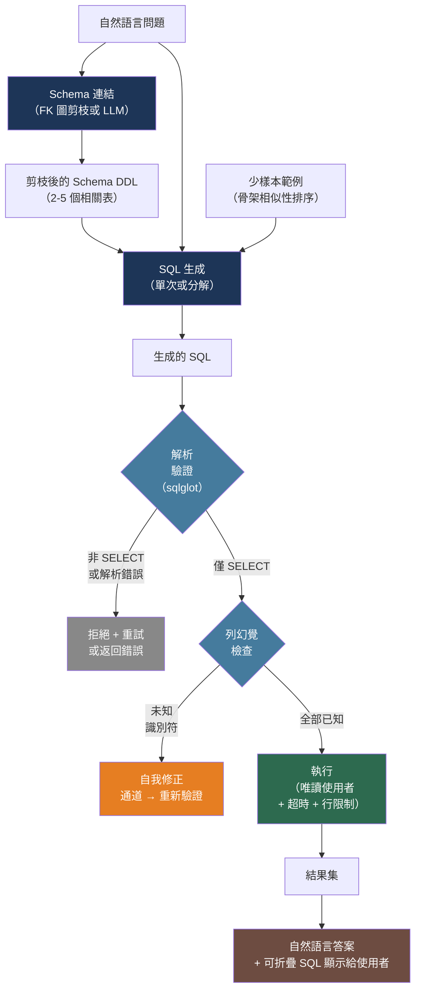

# [BEE-580] Text-to-SQL：自然語言資料庫介面

:::info
Text-to-SQL 使用 LLM 將自然語言問題翻譯為可執行的 SQL 查詢。它讓使用者無需掌握 SQL 即可存取資料庫——同時引入了獨特的攻擊面、回傳看似合理但錯誤結果的幻覺失效模式，以及若不加以處理會隨資料庫大小二次方增長的 Schema 注入成本。
:::

## 情境

Text-to-SQL 早在 LLM 出現之前就已有研究歷史。早期系統（LUNAR、NLIDB，約 1970 年代）使用手工編寫的語法。現代時期始於 Spider 基準測試（Yu 等人，耶魯大學，arXiv:1809.08887，EMNLP 2018）：10,181 個問題涵蓋 200 個資料庫和 138 個領域，訓練集和測試集使用完全不同的資料庫以衡量跨領域泛化能力。發布時，最佳系統達到 12.4% 的精確匹配率。到 2023 年，DAIL-SQL + GPT-4 達到 86.2% 的執行準確率（arXiv:2308.15363，VLDB 2024），使生產部署首次成為可能。

Spider 2.0（arXiv:2411.07763，ICLR 2025 Oral）迅速打破了這種樂觀情緒。它由 632 個真實企業工作流程構建，Schema 超過 1,000 列，使用多種 SQL 方言（BigQuery、Snowflake），查詢超過 100 行，顯示 o1-preview 僅達到 21.3%，GPT-4o 僅達到 10.1%——與 Spider 1.0 學術 Schema 效能相比下降了 4–8 倍。BIRD 基準測試（arXiv:2305.03111，12,751 對，95 個真實世界資料庫，共 33.4 GB）進一步量化了差距：ChatGPT 得分 40.08%，而人類資料工程師達到 92.96%，即使 2025 年的最佳系統（約 82%）也仍有超過 11 個百分點的差距。

實際教訓是 text-to-SQL 是一個範疇，而非二元能力。在 5–15 張表的 Schema 上，措辭明確的簡單單表查詢是可靠可解決的。多跳連接、窗口函數、遞迴查詢，以及需要 Schema 之外業務領域知識的問題，對當前模型來說仍然真實困難。

## Schema 表示

text-to-SQL 中最大的工程槓桿是如何向模型呈現資料庫 Schema。35 個表的 Schema 序列化為 `CREATE TABLE` DDL 在提問之前就消耗約 5,164 個 token。具有數百個表的企業 Schema 可能超過 17,000 個 token。上下文窗口限制、成本和準確率都會隨 Schema 大小的增長而受損。

### Schema 格式

**CREATE TABLE DDL** 是標準格式，作為基準效能最好：

```sql
CREATE TABLE orders (
    order_id INT PRIMARY KEY,
    customer_id INT NOT NULL,
    order_date DATE NOT NULL,
    status VARCHAR(20) NOT NULL,  -- 'pending', 'shipped', 'cancelled'
    total_amount DECIMAL(10, 2),
    FOREIGN KEY (customer_id) REFERENCES customers(customer_id)
);
```

包含外鍵約束至關重要——無法看到 FK 關係的模型會生成錯誤的連接路徑。包含範例列值（枚舉成員、代表性字串）可一致提升對依賴值過濾的查詢的準確率，因為模型需要知道 status 列是包含 `'shipped'`、`'SHIPPED'` 還是 `'Shipped'`。

### Schema 剪枝

為每個查詢發送完整 Schema 是正確但昂貴的做法。Schema 剪枝可在準確率損失最小的情況下減少 83–93% 的 token：

```python
import networkx as nx
from sqlalchemy import inspect, MetaData

def build_fk_graph(engine) -> nx.Graph:
    """建立以外鍵連接的表的無向圖。"""
    meta = MetaData()
    meta.reflect(bind=engine)
    graph = nx.Graph()
    inspector = inspect(engine)
    for table_name in inspector.get_table_names():
        graph.add_node(table_name)
        for fk in inspector.get_foreign_keys(table_name):
            graph.add_edge(table_name, fk["referred_table"])
    return graph

def prune_schema(
    question: str,
    tables: list[str],
    fk_graph: nx.Graph,
    schema_ddl: dict[str, str],  # table_name -> DDL 字串
    relevant_tables: list[str],  # 來自 Schema 連結步驟
    hop_distance: int = 1,
) -> str:
    """
    包含直接相關的表及其直接 FK 鄰居。
    hop_distance 為 1 可捕獲連接所需的橋接表。
    """
    included = set(relevant_tables)
    for table in relevant_tables:
        for neighbor in nx.neighbors(fk_graph, table):
            included.add(neighbor)
    return "\n\n".join(schema_ddl[t] for t in sorted(included) if t in schema_ddl)
```

FK 圖遍歷方法不需要 LLM 呼叫，且是確定性的，可將 35 個表的 Schema 從 5,164 個 token 減少到 157–751 個 token（取決於問題）。高級方法如 RSL-SQL（arXiv:2411.00073）使用投票的雙向 Schema 連結，在削減 83% 輸入列的同時實現 94% 的表召回率。

## 執行安全

Text-to-SQL 創造了新的攻擊面：LLM 是程式碼生成器，使用者可以嘗試注入產生破壞性 SQL 的指令。Pourreza 等人（arXiv:2308.01990）證明，即使系統提示明確禁止 DML 語句，LangChain 的 `SQLDatabaseAgent` 也會在使用者通過自然語言輸入注入指令時執行破壞性查詢。API 存取模型只阻擋了 13.4% 的測試惡意提示。

需要三層防禦：

### 第 1 層：資料庫權限（不可繞過）

建立專用的唯讀資料庫使用者。即使 LLM 生成 `DROP TABLE users`，資料庫也會在權限層面拒絕該命令：

```sql
-- PostgreSQL：建立 text-to-sql 唯讀使用者
CREATE ROLE text_to_sql_reader LOGIN PASSWORD 'changeme';
-- 僅授予特定表的 SELECT——不包括 TRUNCATE、DELETE、INSERT
GRANT SELECT ON orders, customers, products, categories TO text_to_sql_reader;
-- 完全拒絕對敏感表的訪問
REVOKE ALL ON user_credentials, payment_cards, audit_logs FROM text_to_sql_reader;
```

### 第 2 層：Schema 整理（資訊隱藏）

只向 LLM 呈現不包含敏感列的淨化 Schema。不出現在 Schema 中的列就無法被查詢：

```python
EXCLUDED_COLUMNS = {
    "users": {"password_hash", "mfa_secret", "session_tokens"},
    "payments": {"card_number", "cvv", "bank_account"},
}

def sanitize_schema(full_ddl: str, table: str) -> str:
    """在注入 LLM 提示前移除敏感列定義。"""
    excluded = EXCLUDED_COLUMNS.get(table, set())
    lines = []
    for line in full_ddl.splitlines():
        col_name = line.strip().split()[0].lower() if line.strip() else ""
        if col_name not in excluded:
            lines.append(line)
    return "\n".join(lines)
```

### 第 3 層：執行前 SQL 驗證

在任何資料庫呼叫之前解析生成的 SQL 並拒絕非 SELECT 語句：

```python
import sqlglot

def validate_select_only(sql: str, dialect: str = "postgres") -> tuple[bool, str]:
    """
    解析生成的 SQL 並驗證它只包含 SELECT 語句。
    返回 (is_safe, error_message)。
    使用 sqlglot 進行跨 31 種 SQL 方言的 AST 層級驗證。
    """
    try:
        statements = sqlglot.parse(sql, dialect=dialect)
    except sqlglot.errors.ParseError as e:
        return False, f"SQL 解析錯誤：{e}"

    for stmt in statements:
        if not isinstance(stmt, sqlglot.exp.Select):
            stmt_type = type(stmt).__name__
            return False, f"已拒絕：預期 SELECT，得到 {stmt_type}"

    # 驗證沒有子查詢修改（CTE 本質上是 SELECT 限定的）
    for node in statements[0].walk():
        if isinstance(node, (
            sqlglot.exp.Insert, sqlglot.exp.Update,
            sqlglot.exp.Delete, sqlglot.exp.Drop,
        )):
            return False, f"已拒絕：查詢樹中發現 DML 語句"

    return True, ""
```

## 生成架構

### 單次提示工程（DAIL-SQL 風格）

對於具有明確定義問題的 5–20 個表的 Schema，以結構相似性選擇的少樣本示例的單次方法效果良好。DAIL-SQL 提示格式（arXiv:2308.15363，VLDB 2024）注入 Schema、按骨架相似性排序的少樣本示例和問題：

```python
SYSTEM_PROMPT = """您是 SQL 查詢撰寫專家。給定資料庫 Schema 和自然語言問題，請撰寫正確的 SQL SELECT 查詢。

規則：
- 僅返回 SQL 查詢，不要解釋
- 只使用 Schema 中出現的表和列
- 在多表查詢中始終使用表別名
- 根據顯示的外鍵關係使用適當的 JOIN"""

def build_prompt(
    schema_ddl: str,
    question: str,
    few_shot_examples: list[dict],  # [{"question": ..., "sql": ...}]
) -> list[dict]:
    examples_text = "\n\n".join(
        f"問題：{ex['question']}\nSQL：{ex['sql']}"
        for ex in few_shot_examples[:3]
    )
    user_content = f"""Schema：
{schema_ddl}

範例：
{examples_text}

問題：{question}
SQL："""
    return [
        {"role": "system", "content": SYSTEM_PROMPT},
        {"role": "user", "content": user_content},
    ]
```

### 分解生成（DIN-SQL 風格）

對於複雜查詢（多表連接、巢狀子查詢、窗口函數），將問題分解為順序子任務可將準確率提高約 10 個百分點（arXiv:2304.11015）：

```python
async def generate_sql_decomposed(
    llm_client,
    schema_ddl: str,
    question: str,
) -> str:
    # 步驟 1：Schema 連結——識別相關表和列
    linking_prompt = f"""給定此 Schema：
{schema_ddl}

問題：{question}

回答此問題需要哪些表和列？僅列出 table.column 對。"""
    schema_links = await llm_client.complete(linking_prompt)

    # 步驟 2：分類複雜度
    classify_prompt = f"""問題：{question}
相關 Schema 元素：{schema_links}

將查詢分類為：
- SIMPLE：單一表，無需連接
- COMPLEX：需要連接但無巢狀子查詢
- NESTED：需要子查詢、CTE 或窗口函數
僅用一個詞回答。"""
    complexity = await llm_client.complete(classify_prompt)

    # 步驟 3：使用適合複雜度的提示生成 SQL
    generate_prompt = build_generation_prompt(schema_ddl, question, schema_links, complexity)
    raw_sql = await llm_client.complete(generate_prompt)

    # 步驟 4：自我修正通道
    correction_prompt = f"""審查此 SQL 查詢的正確性：
Schema：{schema_ddl}
問題：{question}
SQL：{raw_sql}

如果查詢正確，原樣返回。如果有錯誤，返回修正後的版本。
僅返回 SQL。"""
    return await llm_client.complete(correction_prompt)
```

### 列幻覺防護

生成 SQL 後，在執行之前驗證所有被引用的識別符都存在於實際 Schema 中：

```python
def extract_referenced_identifiers(sql: str) -> set[tuple[str, str]]:
    """從已解析的 SQL 中提取 (表別名或表名, 列) 對。"""
    references = set()
    try:
        tree = sqlglot.parse_one(sql)
        for col in tree.find_all(sqlglot.exp.Column):
            table = col.table or ""
            references.add((table.lower(), col.name.lower()))
    except Exception:
        pass
    return references

def check_column_existence(
    references: set[tuple[str, str]],
    schema_columns: dict[str, set[str]],  # table -> {col1, col2, ...}
) -> list[str]:
    """返回幻覺列引用的列表。"""
    errors = []
    for table, col in references:
        if table and table in schema_columns:
            if col not in schema_columns[table]:
                errors.append(f"{table}.{col} 不存在")
    return errors
```

## 最佳實踐

### 預設使用唯讀資料庫使用者，絕不跳過驗證層

**MUST**（必須）始終在對 text-to-SQL 系統暴露的表上具有 SELECT 限定授權的資料庫使用者後面執行查詢。**MUST** 也要強制執行應用層 SQL 驗證（第 3 層），即使使用唯讀使用者——深度防禦是必要的，因為僅權限邊界無法防止返回使用者不應看到的資料（例如屬於其他租戶的資料）。

### 大型資料庫注入前剪枝 Schema；絕不發送完整 Schema

**MUST NOT**（不得）在沒有剪枝步驟的情況下注入超過 20 個表的資料庫的完整 Schema。Token 成本隨 Schema 大小線性增長，模型在必須搜索不相關表時準確率下降。實作 Schema 連結——透過 FK 圖遍歷（零 LLM 呼叫，確定性）或輕量級分類器——將每個問題的上下文減少到相關的 2–5 個表。

### 將模糊問題視為一類失效模式

**SHOULD**（建議）在 SQL 生成之前實作模糊性偵測步驟。像「顯示頂級客戶」這樣的問題需要澄清「頂級」的含義（按收入、訂單數量還是近期性）。帶有時間參考的問題（「上個月」、「最近」、「本季度」）需要已知的當前日期和業務定義的時間窗口。當問題模糊時，向使用者返回澄清問題，而不是生成默默選擇一種解釋的 SQL。

### 對高風險查詢在執行前向使用者顯示 SQL

**SHOULD** 在結果旁邊或之前，在可折疊的「我是如何回答這個問題的」部分向終端使用者顯示生成的 SQL 查詢，特別是當介面用於業務決策時。能看到查詢的使用者可以發現誤解。這也建立了信任，並訓練使用者提出系統能夠很好處理的問題。

### 對成本敏感的高流量部署使用微調的小型模型

**SHOULD** 評估 SQLCoder-7B 或 SQLCoder-34B（在特定領域 Schema 上微調）與 GPT-4 相比，用於每日超過 10,000 個查詢的部署。Schema 剪枝 + 7B 微調模型可以以 GPT-4o 成本的一小部分達到類似的準確率。在每日 100,000 個查詢時，僅對 35 個表的 Schema 進行 Schema 剪枝，每年在 GPT-4o API 成本上就能節省超過 43 萬美元。

### 在資料庫層面實施結果集大小限制和查詢超時

**MUST** 在資料庫層面而非應用層面強制執行最大行限制和執行超時。LLM 生成的查詢如果執行全表掃描或笛卡爾積，可能會使資料庫資源飽和。為 text-to-SQL 連接池的每個會話使用 `SET statement_timeout = '5s'`（PostgreSQL）或等效的每會話設定：

```python
from contextlib import contextmanager
from sqlalchemy import text

@contextmanager
def safe_execution_context(session, max_rows: int = 1000, timeout_ms: int = 5000):
    """將每查詢安全限制應用到資料庫會話。"""
    session.execute(text(f"SET statement_timeout = '{timeout_ms}'"))
    try:
        yield
    finally:
        session.execute(text("RESET statement_timeout"))

def execute_safe(session, sql: str, max_rows: int = 1000) -> list[dict]:
    with safe_execution_context(session):
        result = session.execute(text(f"SELECT * FROM ({sql}) q LIMIT :limit"), {"limit": max_rows})
        return [dict(row._mapping) for row in result]
```

## 視覺化



## 常見錯誤

**對超過 20 個表的資料庫不進行剪枝就使用完整 Schema。** 在 35 個表時，原始的 CREATE TABLE Schema 在提問之前就消耗 5,164 個 token。在企業規模（數百個表）時，Schema 本身就超過模型上下文窗口，迫使模型使用截斷的 Schema 並幻覺缺失的表。Schema 剪枝應作為任何生產部署的先決條件，而非最佳化手段。

**將 Spider 1.0 的執行準確率視為部署就緒信號。** Spider 1.0 的 85–90% 分數來自有 15–20 個表的乾淨學術 Schema、措辭明確的問題，以及測試已定義 SQL 結構的查詢。真實生產資料庫有模糊的列名、缺失的外鍵、編碼在應用程式碼而非 Schema 中的業務邏輯，以及非技術使用者表達的問題。Spider 2.0 在真實企業 Schema 上的 10–21% 分數是更好的現實世界效能代理。

**從 Schema 中省略範例列值。** Schema 結構告訴模型 `status` 列存在；它不告訴模型應該寫 `WHERE status = 'active'`、`WHERE status = 'ACTIVE'` 還是 `WHERE status = 1`。沒有 Schema 中的代表性樣本值或枚舉定義，依賴值的查詢會以空結果集或錯誤過濾條件靜默失敗。

**對終端使用者隱藏 SQL。** 靜默的 text-to-SQL 是危險的：系統產生看似權威但可能基於錯誤解釋問題的答案。一個查詢「本季度的訂單」使用了錯誤的季度邊界，會返回錯誤的收入數字而沒有任何可見錯誤。向使用者顯示生成的 SQL（或其純文字說明）讓他們在根據錯誤數字採取行動之前發現誤解。

**不在資料庫層面強制執行行限制。** LLM 意外生成的兩個大型表的笛卡爾連接可能返回數百萬行並使資料庫飽和。應用層的 `LIMIT` 子句可通過 SQL 注入繞過；在連接池配置中使用資料庫層面的 `statement_timeout` 和行限制。

## 相關 BEE

- [BEE-30007](rag-pipeline-architecture.md) -- RAG 流水線架構：Schema 連結使用與 RAG 相同的結構化上下文檢索模式；這些技術是可遷移的
- [BEE-30008](llm-security-and-prompt-injection.md) -- LLM 安全性與提示注入：text-to-SQL 中的提示注入攻擊面（arXiv:2308.01990）是提示注入問題的直接實例
- [BEE-18007](../multi-tenancy/database-row-level-security.md) -- 資料庫行級安全：對於多租戶 text-to-SQL，資料庫層面的行級安全是 Schema 整理和唯讀權限的補充
- [BEE-30006](structured-output-and-constrained-decoding.md) -- 結構化輸出與約束解碼：強制模型輸出有效 SQL（約束解碼到 SQL 語法）可減少解析錯誤和幻覺識別符

## 參考資料

- [Yu 等人，「Spider：用於 Text-to-SQL 的大規模人工標記資料集」（EMNLP 2018）— arXiv:1809.08887](https://arxiv.org/abs/1809.08887)
- [Spider 排行榜 — yale-lily.github.io/spider](https://yale-lily.github.io/spider)
- [Spider 2.0（ICLR 2025 Oral）— arXiv:2411.07763](https://arxiv.org/abs/2411.07763)
- [Spider 2.0 專案頁面 — spider2-sql.github.io](https://spider2-sql.github.io/)
- [Li 等人，「LLM 能否作為資料庫介面？BIRD 大型基準測試」— arXiv:2305.03111](https://arxiv.org/abs/2305.03111)
- [BIRD 排行榜 — bird-bench.github.io](https://bird-bench.github.io/)
- [Gao 等人，「DAIL-SQL：LLM 賦能的 Text-to-SQL」（VLDB 2024）— arXiv:2308.15363](https://arxiv.org/abs/2308.15363)
- [Pourreza & Rafiei，「DIN-SQL：分解式上下文學習」— arXiv:2304.11015](https://arxiv.org/abs/2304.11015)
- [Luo 等人，「RSL-SQL：雙向 Schema 連結」— arXiv:2411.00073](https://arxiv.org/abs/2411.00073)
- [Xie 等人，「PET-SQL：多 LLM 跨一致性」— arXiv:2403.09732](https://arxiv.org/abs/2403.09732)
- [SQL 代理中的提示注入 — arXiv:2308.01990](https://arxiv.org/abs/2308.01990)
- [Vanna：基於 RAG 的 text-to-SQL 框架 — github.com/vanna-ai/vanna](https://github.com/vanna-ai/vanna)
- [SQLCoder：微調的 text-to-SQL 模型 — github.com/defog-ai/sqlcoder](https://github.com/defog-ai/sqlcoder)
- [sqlglot：SQL 解析器和轉換器（31 種方言）— github.com/tobymao/sqlglot](https://github.com/tobymao/sqlglot)
- [基於 LLM 的 Text-to-SQL 調查（TKDE 2025）— arXiv:2406.08426](https://arxiv.org/abs/2406.08426)
