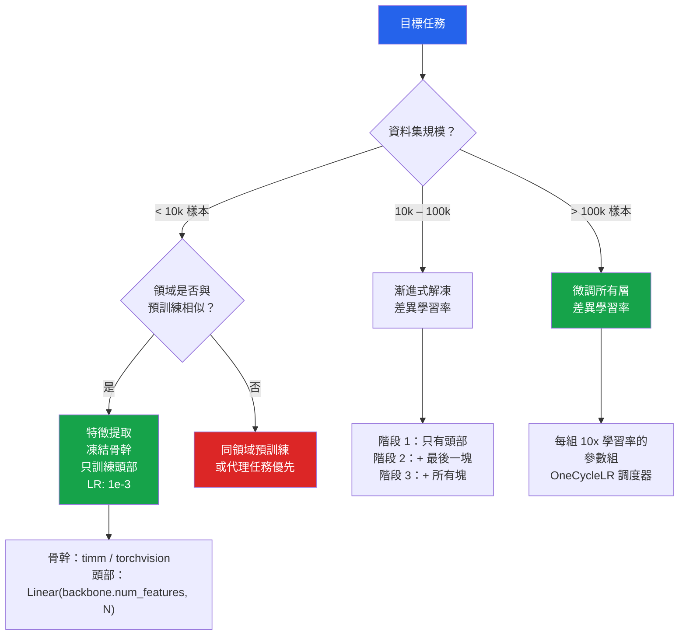

# [BEE-594] 遷移學習與微調模式

:::info
遷移學習將在大型源資料集上學習的表示重新用於標記樣本更少的目標任務，將資料和計算需求降低一個數量級——但前提是源領域和目標領域足夠相似，且微調策略與可用資料規模相匹配。
:::

## 背景

在 120 萬張跨越 1000 個類別的標記圖像上訓練的 ImageNet，產生了一個出乎意料的結果：卷積網絡在這個資料集上學習的特徵幾乎可以遷移到任何視覺識別任務，即使目標類別與 ImageNet 截然不同。He et al. 的 ResNet（arXiv:1512.03385，CVPR 2016）證明，在 ImageNet 上訓練的深度殘差網絡在早期層學習到邊緣偵測器、紋理識別器和物體部件偵測器——這些表示對醫學成像、衛星圖像、產品缺陷偵測等與 ImageNet 沒有共同類別的應用都很有用。

Howard & Ruder（2018）通過 ULMFiT（arXiv:1801.06146，ACL 2018）將這一洞察推廣到 NLP：在維基百科上預訓練的語言模型，僅用 100 個標記樣本就能微調用於文本分類，匹配了此前模型需要 10 倍更多資料才能達到的效果。他們引入了三種現在已成為標準的微調技術：**差異學習率**（每層使用不同的學習率）、**漸進式解凍**（每次解凍一組層）和**斜三角形學習率**（短暫預熱後線性衰減）。這三個想法共同解決了災難性遺忘問題——目標任務的梯度更新覆蓋已學習表示的風險。

實際結果：擁有 5000 個標記訓練樣本的團隊，通過從預訓練骨幹開始而非隨機初始化，可以達到以前需要 50000 個樣本才能實現的效果。代價是選擇正確的骨幹架構、合適的微調策略，以及意識到何時領域不匹配會使遷移有害而非有益。

## 四象限決策框架

Andrej Karpathy 的 CS231n 筆記（http://cs231n.github.io/transfer-learning/）將決策定義為兩個軸的函數：資料集規模和與預訓練資料的領域相似度。

| | 相似領域 | 不同領域 |
|---|---|---|
| **小資料集** | 特徵提取——凍結骨幹，僅訓練頭部 | 困難情況——考慮同領域預訓練或代理任務 |
| **大資料集** | 微調大部分層，早期層使用較低的學習率 | 微調所有層，可能對所有層使用較高的學習率 |

**特徵提取**（凍結骨幹）：預訓練網絡作為固定的特徵提取器。只訓練最終的分類頭。當目標資料集較小（< 10000 個標記樣本）且領域與預訓練源相似時，這是正確的策略。用資料不足進行微調的風險是對小目標資料集中的噪聲過擬合。

**微調**：更新骨幹中的權重，而不僅僅是頭部。使用差異學習率——早期層使用較低的學習率，後期層使用較高的學習率——因為早期層包含通用特徵（邊緣、紋理），變化應該較少，而後期層包含源領域特定的特徵，需要適應目標領域。

Sun et al.（2017，arXiv:1707.02968）表明，更多的預訓練資料持續有幫助但有遞減回報，且效益取決於源-目標領域相似度。當領域差異很大時（例如，將 ImageNet 特徵應用於 X 光片），前幾層仍然有用，但更深的層需要完整微調。

## 使用 TIMM 進行特徵提取

TIMM（PyTorch Image Models，由 Ross Wightman 創建，現由 github.com/huggingface/pytorch-image-models 維護）提供超過 700 個預訓練模型，具有統一的 API。`num_classes=0` 移除分類頭，返回原始特徵向量：

```python
import timm
import torch
import torch.nn as nn
from torch.optim import AdamW

# 不帶分類頭載入骨幹——返回特徵向量
backbone = timm.create_model(
    "resnet50",
    pretrained=True,
    num_classes=0,          # 移除最終的 FC 層
    global_pool="avg",      # 全局平均池化 → (batch, 2048)
)

# 凍結所有骨幹參數
for param in backbone.parameters():
    param.requires_grad = False

# 小型自定義頭部——只有這些參數被訓練
num_target_classes = 10
head = nn.Sequential(
    nn.Dropout(p=0.3),
    nn.Linear(backbone.num_features, num_target_classes),
)

model = nn.Sequential(backbone, head).to("cuda")

# 優化器只看到頭部參數——骨幹被凍結
optimizer = AdamW(
    filter(lambda p: p.requires_grad, model.parameters()),
    lr=1e-3,  # 較高的學習率可接受，因為只更新頭部
)
```

在特徵提取階段，較高的學習率是可接受的，因為隨機初始化的頭部權重需要大步幅才能收斂，而凍結的骨幹不會受損。一旦頭部收斂（通常 3–5 個 epoch），切換到微調。

## 使用差異學習率進行微調

ULMFiT 的核心洞察：網絡的早期層編碼通用的、廣泛可遷移的特徵（邊緣、紋理、句法結構）。後期層編碼源領域特定的特徵。早期層在微調期間變化應該更少。差異學習率通過為早期參數組分配較低的學習率來實現這一點：

```python
import timm
import torch.nn as nn
from torch.optim import AdamW

model = timm.create_model("resnet50", pretrained=True, num_classes=NUM_CLASSES)

# 將模型分為層組進行差異學習率
# ResNet50: layer1/2 = 通用特徵; layer3/4 = 特定; fc = 頭部
param_groups = [
    {"params": model.layer1.parameters(), "lr": 1e-5},  # 最早的，最慢的
    {"params": model.layer2.parameters(), "lr": 3e-5},
    {"params": model.layer3.parameters(), "lr": 1e-4},
    {"params": model.layer4.parameters(), "lr": 3e-4},
    {"params": model.fc.parameters(),     "lr": 1e-3},  # 頭部，最快的
]

optimizer = AdamW(param_groups, weight_decay=0.01)

# 斜三角形學習率：短線性預熱，然後線性衰減
# OneCycleLR 實現了這個模式
scheduler = torch.optim.lr_scheduler.OneCycleLR(
    optimizer,
    max_lr=[g["lr"] for g in param_groups],
    steps_per_epoch=len(train_loader),
    epochs=NUM_EPOCHS,
    pct_start=0.1,  # 10% 的訓練是預熱
)
```

差異學習率的 10× 經驗法則：每個連續層組使用的學習率比前一個高 10 倍。頭部使用最高的速率（1e-3），最早的層使用最低的（1e-5）。

## 漸進式解凍

與其同時解凍所有層，不如每個訓練階段解凍一組層。這通過允許每個解凍的層組逐漸適應來防止災難性遺忘：

```python
def set_layer_group_requires_grad(model, group_name: str, requires_grad: bool):
    layer = getattr(model, group_name, None)
    if layer is None:
        return
    for param in layer.parameters():
        param.requires_grad = requires_grad

# 階段 1：只訓練頭部（所有其他層被凍結）
set_layer_group_requires_grad(model, "layer1", False)
set_layer_group_requires_grad(model, "layer2", False)
set_layer_group_requires_grad(model, "layer3", False)
set_layer_group_requires_grad(model, "layer4", False)
train(model, epochs=3, lr=1e-3)

# 階段 2：解凍 layer4，使用差異學習率微調
set_layer_group_requires_grad(model, "layer4", True)
train(model, epochs=3, lr_groups=[3e-4, 1e-3])

# 階段 3：解凍 layer3
set_layer_group_requires_grad(model, "layer3", True)
train(model, epochs=3, lr_groups=[1e-4, 3e-4, 1e-3])

# 階段 4：解凍所有
set_layer_group_requires_grad(model, "layer2", True)
set_layer_group_requires_grad(model, "layer1", True)
train(model, epochs=5, lr_groups=[1e-5, 3e-5, 1e-4, 3e-4, 1e-3])
```

漸進式解凍增加了訓練階段，但比從一開始就微調所有內容需要的總 epoch 數顯著減少。總計算成本相似；準確率和穩定性提高，因為每個階段在解鎖下一組層之前達到一個好的局部最小值。

## 使用 Torchvision 預訓練模型

Torchvision 使用 `weights=` API（在 v0.13 中引入以取代已棄用的 `pretrained=True`）提供官方預訓練權重：

```python
import torchvision.models as models
from torchvision.models import ResNet50_Weights, EfficientNet_B0_Weights

# 使用最佳可用權重的 ResNet50
model = models.resnet50(weights=ResNet50_Weights.IMAGENET1K_V2)

# 為不同的類別數量替換最終的 FC 層
in_features = model.fc.in_features  # ResNet50 為 2048
model.fc = torch.nn.Linear(in_features, NUM_TARGET_CLASSES)

# EfficientNet-B0（比 ResNet50 更小、更快）
model = models.efficientnet_b0(weights=EfficientNet_B0_Weights.IMAGENET1K_V1)
in_features = model.classifier[1].in_features  # EfficientNet-B0 為 1280
model.classifier[1] = torch.nn.Linear(in_features, NUM_TARGET_CLASSES)

# 使用與預訓練資料集相同的預處理
transforms = ResNet50_Weights.IMAGENET1K_V2.transforms()
```

優先選擇 `IMAGENET1K_V2` 而非 V1——它們使用改進的訓練程序（MixUp、CutMix、AutoAugment）並達到更高的準確率。`weights.transforms()` 方法返回這些權重的正確預處理管道，避免了使用不同正規化統計數據的常見錯誤。

## 視覺 Transformer 和非 CNN 遷移學習

Dosovitskiy et al. 的 ViT（arXiv:2010.11929，ICLR 2021）將遷移學習擴展到 Transformer 架構。HuggingFace 為圖像分類提供 ViT 和 Swin Transformer 預訓練權重：

```python
from transformers import AutoFeatureExtractor, AutoModelForImageClassification
import torch

# 載入預訓練 ViT 用於自定義資料集的微調
feature_extractor = AutoFeatureExtractor.from_pretrained("google/vit-base-patch16-224")
model = AutoModelForImageClassification.from_pretrained(
    "google/vit-base-patch16-224",
    num_labels=NUM_TARGET_CLASSES,
    id2label={i: label for i, label in enumerate(class_names)},
    label2id={label: i for i, label in enumerate(class_names)},
    ignore_mismatched_sizes=True,  # 替換預訓練的分類頭
)
```

ViT 微調需要與 CNN 相同的漸進式解凍和差異學習率策略。關鍵區別：ViT 對學習率計劃更敏感，通常需要更長的預熱（訓練的 10–20% 而非 CNN 的 5%）。



## 常見錯誤

**使用 `pretrained=True` 但預處理不正確。** 預訓練權重針對特定的正規化統計數據（ImageNet 均值/標準差）進行了校準。未能應用這些統計數據——或應用不同的——會移動輸入分佈並降低特徵品質。**始終**使用 torchvision 的 `weights.transforms()` 或 HuggingFace 的 `feature_extractor` 來獲取特定 checkpoint 的正確預處理。

**使用統一學習率進行微調。** 對所有層應用相同的學習率——特別是使用適合從頭訓練的學習率——會破壞花費數百萬個樣本學習的早期層特徵。預訓練 ResNet 的早期層編碼幾乎普遍有用的邊緣和紋理偵測器。應用於 layer1 的 1e-3 學習率將在幾個梯度步驟後覆蓋這些。對早期層使用 1e-5，對頭部使用 1e-3 的差異學習率。

**在載入權重後才替換分類頭。** 在載入權重之前呼叫 `model.fc = nn.Linear(in_features, new_num_classes)` 會隨機初始化新頭部，同時保留骨幹。在載入預訓練權重之後替換頭部，如果類別數量不同，會因為頭部形狀不匹配而失敗。

**跳過漸進式解凍，一次性微調所有內容。** 同時以統一學習率微調所有層，在小到中等資料集上會收斂到比漸進式解凍更差的局部最優解。頭部在骨幹權重能夠有效更新之前需要幾個 epoch 達到穩定點。

**假設遷移學習總是有幫助的。** 當源領域和目標領域差異很大時——例如，將在網絡圖片上預訓練的模型的醫學成像特徵——ImageNet 後期層的特徵可能會主動造成傷害，因為它偏向不相關的視覺特徵。在這種情況下，使用同領域預訓練（如用於放射學的 RadImageNet）或僅限於早期層的遷移。

## 相關 BEE

- [BEE-514 微調與 PEFT 模式](514) — LLM 特定的微調（LoRA、QLoRA、適配器）——與這裡涵蓋的 CV/NLP 微調不同
- [BEE-593 ML 訓練成本最佳化](593) — 混合精度和梯度檢查點直接適用於微調工作負載
- [BEE-591 測試機器學習管道](591) — 微調模型的行為測試應驗證任務特定的不變量
- [BEE-589 線上學習與持續模型更新](589) — 持續學習在流式設定中解決災難性遺忘；與這裡的批次微調方法互補

## 參考資料

- Howard, J., & Ruder, S. (2018). Universal language model fine-tuning for text classification. ACL 2018. arXiv:1801.06146. https://aclanthology.org/P18-1031/
- He, K., Zhang, X., Ren, S., & Sun, J. (2016). Deep residual learning for image recognition. CVPR 2016. arXiv:1512.03385. https://arxiv.org/abs/1512.03385
- Dosovitskiy, A., et al. (2021). An image is worth 16×16 words: Transformers for image recognition at scale. ICLR 2021. arXiv:2010.11929. https://arxiv.org/abs/2010.11929
- Smith, L. N. (2015). Cyclical learning rates for training neural networks. arXiv:1506.01186. https://arxiv.org/abs/1506.01186
- Sun, C., et al. (2017). Revisiting unreasonable effectiveness of data in deep learning era. ICCV 2017. arXiv:1707.02968. https://arxiv.org/abs/1707.02968
- Karpathy, A. CS231n：遷移學習. https://cs231n.github.io/transfer-learning/
- TIMM（PyTorch Image Models）文件. https://huggingface.co/docs/timm/index
- PyTorch Vision 模型文件. https://docs.pytorch.org/vision/stable/models.html
- HuggingFace, 使用 AutoModelForImageClassification 進行圖像分類. https://huggingface.co/docs/transformers/tasks/image_classification
