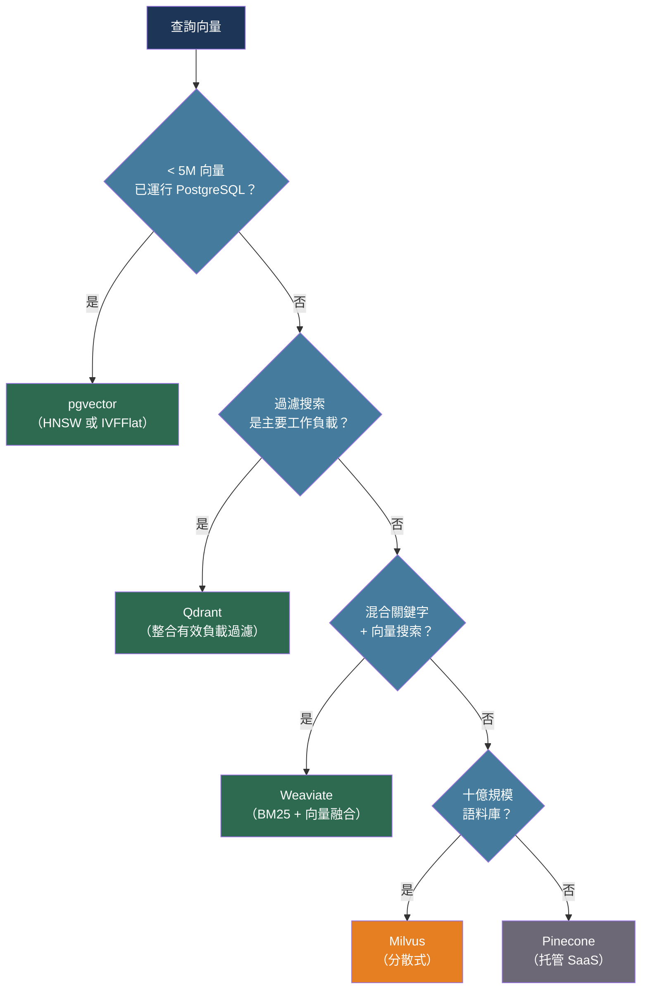

# [BEE-528] 向量資料庫架構

:::info
向量資料庫儲存高維嵌入並在毫秒內回答近似最近鄰查詢——關鍵的工程決策是使用哪種 ANN 演算法、如何為索引調配記憶體，以及如何在不損害召回率的情況下處理元資料過濾。
:::

## 背景

傳統資料庫索引純量值並回答精確的等值或範圍查詢。語意搜索、RAG 管道和推薦系統需要不同的原語：給定一個查詢向量，找到資料庫中與之最相似的 k 個向量。與每個儲存向量的暴力比較——蠻力基線——按 O(n) 每次查詢擴展，在超過幾十萬條記錄時變得不切實際。

理論基礎是近似最近鄰（ANN）問題。Indyk 和 Motwani（STOC 1998）表明，局部敏感哈希可以以亞線性時間回答最近鄰查詢，代價是返回近似而非精確結果。實際突破是 HNSW（層次可導航小世界），由 Malkov 和 Yashunin 發表（arXiv:1603.09320，IEEE TPAMI 2020）。HNSW 構建一個分層圖，每個向量與其最近鄰連接；查詢從頂層向下遍歷，在每層貪婪地跟隨最近鄰，直到到達底層。查詢和插入複雜度為 O(log n)，HNSW 始終在 ANN 基準排行榜（ann-benchmarks.com）上主導召回率-QPS 前沿。

嵌入爆炸——由 Transformer 模型引發並由 OpenAI 的 `text-embedding-ada-002` 於 2022 年普及——創造了對專用向量儲存的需求。Pinecone、Weaviate、Qdrant 和 Milvus 作為專用向量資料庫出現。PostgreSQL 的 `pgvector` 擴展將向量搜索帶入現有的關係型儲存中。在專用向量資料庫和 pgvector 之間的選擇涉及運營簡單性和原始查詢性能之間的權衡。

## 設計思維

三個決策主導向量資料庫架構：

**演算法選擇**以建構時間和記憶體換取查詢召回率和吞吐量。HNSW 是生產的主流選擇：在高 QPS 下接近最優召回率，代價是將整個圖保存在 RAM 中。IVF（倒排文件索引）將向量分區到 Voronoi 單元並在查詢時搜索一部分單元——比 HNSW 記憶體更少，但需要訓練過程且在相同 QPS 下召回率更差。乘積量化（PQ）將向量壓縮成短碼，將 RAM 減少 4-8×，以召回率損失為代價，更適合作為 IVF 之上的壓縮層而非獨立索引。

**過濾架構**是生產中召回率降低的最常見來源。HNSW 是所有向量上的圖；在搜索後應用元資料過濾會丟棄結果，並可能強制查詢檢索比所需多 10 倍的候選。在搜索前應用過濾器會破壞圖遍歷。最乾淨的解決方案是將元資料過濾整合到圖遍歷中的索引——Qdrant 的有效負載索引和 Weaviate 的過濾搜索都這樣做。沒有這種整合，高選擇性過濾器（< 5% 的語料庫匹配）會產生差的召回率，除非積極向上調整 `efSearch`。

**基礎設施放置**——專用向量儲存 vs. pgvector——決定運營複雜性。已經運行 PostgreSQL 的團隊可以添加 pgvector 並避免新的運營依賴；權衡是較低的吞吐量和保存所有內容的單節點 HNSW 索引。具有超過幾百萬向量或在並發負載下嚴格延遲要求的團隊應評估專用向量資料庫。

## 最佳實踐

### 將距離指標與嵌入模型匹配

**MUST**（必須）使用嵌入模型訓練時使用的距離指標。嵌入空間不是各向同性的：用餘弦相似度損失訓練的模型產生角距離有意義的嵌入；對這些嵌入使用 L2 距離會產生不正確的排名。

| 指標 | SQL / API 運算子 | 使用場景 |
|-----|---------------|---------|
| 餘弦相似度 | `<=>` (pgvector) | 文本嵌入、NLP 任務 |
| 內積（點積） | `<#>` (pgvector) | 相關性評分、單位歸一化向量 |
| 歐氏距離 / L2 | `<->` (pgvector) | 空間資料、圖像特徵、幾何模型 |

OpenAI 的 `text-embedding-3-*` 和 `text-embedding-ada-002` 模型使用餘弦相似度。在設置索引指標之前驗證模型卡。

### 為您的工作負載調整 HNSW 參數

HNSW 有三個控制品質-吞吐量權衡的參數：

- **M**：每層每個節點的最大雙向連接數。更高的 M → 更密集的圖 → 更好的召回率，但 RAM 更多、建構時間更長。典型範圍：8-64。一般工作負載從 16 開始。
- **efConstruction**：索引建構期間的候選佇列大小。更高的 efConstruction → 更好的圖品質 → 更好的查詢時召回率，代價是更慢的索引。不影響建構後的 RAM 使用。典型範圍：64-512。
- **efSearch**（查詢時）：搜索期間的候選佇列大小。在不重建索引的情況下調整查詢時召回率 vs. 延遲的主要旋鈕。必須 ≥ k（要返回的鄰居數量）。

**SHOULD** 使用 ANN 基準方法論，對目標延遲百分位（p95）的召回率進行基準測試，使用代表性查詢樣本。提高 `efSearch` 直到召回率達到目標；如果需要更好的索引品質而不犧牲查詢時延遲，則提高 `efConstruction`。

**MUST NOT** 假設固定的 `efSearch` 值適用於所有查詢類型。高選擇性過濾查詢需要更高的 `efSearch` 來維持召回率，因為許多圖鄰居會被過濾器丟棄。

### 在中等規模下使用 pgvector 以獲得運營簡單性

對於已經運行 PostgreSQL、向量少於 5-1000 萬、p95 查詢延遲要求高於 50 毫秒的團隊，pgvector 消除了單獨的運營依賴：

```sql
-- 需要 pgvector 擴展（v0.5.0+ 支援 HNSW）
CREATE EXTENSION IF NOT EXISTS vector;

-- 建立具有 1536 維向量列的表（OpenAI ada-002 / text-embedding-3-small）
CREATE TABLE documents (
    id          BIGSERIAL PRIMARY KEY,
    content     TEXT NOT NULL,
    metadata    JSONB,
    embedding   vector(1536)
);

-- 使用餘弦距離建立 HNSW 索引（pgvector 0.5.0 中添加，2023 年）
CREATE INDEX ON documents
    USING hnsw (embedding vector_cosine_ops)
    WITH (m = 16, ef_construction = 64);

-- 查詢：用餘弦距離找 5 個最近鄰
-- <=> 是餘弦距離；ASC ORDER BY 先返回最相似的
SET hnsw.ef_search = 100;

SELECT id, content, 1 - (embedding <=> $1::vector) AS similarity
FROM documents
ORDER BY embedding <=> $1::vector
LIMIT 5;

-- 過濾最近鄰（通過元資料的租戶隔離）
SELECT id, content
FROM documents
WHERE metadata->>'tenant_id' = 'acme'
ORDER BY embedding <=> $1::vector
LIMIT 5;
```

**SHOULD** 在對低基數列過濾時建立部分索引或在索引述詞中包含過濾列。pgvector 不將元資料過濾整合到圖遍歷中；沒有部分索引，過濾查詢回退到順序掃描。

### 對高吞吐量生產使用專用向量資料庫

當並發查詢負載超過單個 PostgreSQL 實例所能服務的，或索引大小超過可用 RAM 時，移至專用向量資料庫：

**Qdrant**（Rust，開源，Apache 2.0）：將有效負載過濾整合到 HNSW 圖遍歷中，避免預過濾/後過濾的困境。標量量化（float32 → int8，~4× 壓縮）和乘積量化（~8× 壓縮）為內建功能。適合大規模過濾搜索。

**Weaviate**（Go，開源，Apache 2.0）：通過互惠排名融合（Reciprocal Rank Fusion）將 BM25 關鍵字排名與向量搜索結合的原生混合搜索。適合無需單獨搜索引擎即可受益於詞彙和語意檢索的工作負載。

**Milvus**（Go/C++，開源，Apache 2.0）：分離的儲存和計算；可擴展到十億規模的向量集合。支援多種索引類型（HNSW、IVF、DiskANN）和通過資料庫 → 集合 → 分區層次的多租戶。最適合需要橫向擴展的超大語料庫。

**Pinecone**（托管 SaaS）：具有按使用計費的無伺服器層；用於可預測容量的 Pod 層。消除所有基礎設施管理；適合希望將向量搜索作為依賴而非他們運營的服務的團隊。

**SHOULD** 根據運營成熟度和查詢模式進行選擇：
- 新專案，團隊運行 PostgreSQL → pgvector
- 大規模過濾搜索，自主託管 → Qdrant
- 混合關鍵字 + 語意搜索 → Weaviate
- 十億規模語料庫，分散式 → Milvus
- 無需管理基礎設施 → Pinecone

### 為多租戶設計集合

**MUST NOT** 將多個租戶的向量儲存在一個集合中，僅通過元資料欄位區分它們，然後依賴後過濾來隔離租戶。在高選擇性（一個租戶的資料是語料庫的 0.1%）時，ANN 圖在找到 k 個有效結果之前，從其他租戶返回數千個候選。

**SHOULD** 對強隔離使用每租戶命名空間（Pinecone 命名空間、Qdrant 集合、Milvus 分區）。每個命名空間是一個獨立的 ANN 索引；命名空間內的查詢永遠不會觸及其他租戶的資料：

```python
# Qdrant 範例：每個租戶一個集合
from qdrant_client import QdrantClient
from qdrant_client.models import VectorParams, Distance, PointStruct

client = QdrantClient(url="http://localhost:6333")

def ensure_tenant_collection(tenant_id: str):
    collection_name = f"docs_{tenant_id}"
    if not client.collection_exists(collection_name):
        client.create_collection(
            collection_name=collection_name,
            vectors_config=VectorParams(size=1536, distance=Distance.COSINE),
        )
    return collection_name

def upsert_vectors(tenant_id: str, points: list[dict]):
    """points: {id, vector, payload} 的列表"""
    collection = ensure_tenant_collection(tenant_id)
    client.upsert(
        collection_name=collection,
        points=[
            PointStruct(id=p["id"], vector=p["vector"], payload=p.get("payload", {}))
            for p in points
        ],
    )

def search(tenant_id: str, query_vector: list[float], k: int = 5):
    collection = ensure_tenant_collection(tenant_id)
    return client.search(collection_name=collection, query_vector=query_vector, limit=k)
```

**MAY**（可以）對語料庫小（每個 < 10 萬向量）的租戶使用帶有分區鍵的共享集合，在那裡每租戶集合管理的開銷超過隔離優勢。

### 部署前調配記憶體

**MUST** 分配足夠的 RAM 將 HNSW 索引完全保存在記憶體中。HNSW 將整個圖儲存在 RAM 中；即使是部分驅逐到磁碟也會將查詢延遲降低幾個數量級。

HNSW 索引的近似記憶體公式：

```
index_size_bytes ≈ n_vectors × (vector_dim × 4 bytes) × 1.5（圖開銷因子）
```

對於 M=16 的 100 萬個 1536 維向量：

```
1,000,000 × 1536 × 4 × 1.5 ≈ 9.2 GB
```

為活躍查詢的工作集添加 20-30% 的餘量。使用乘積量化（int8 標量），將向量位元組減少 4×：

```
1,000,000 × 1536 × 1 × 1.5 ≈ 2.3 GB（使用標量量化）
```

**SHOULD** 在選擇實例大小之前，使用 Lantern HNSW 記憶體計算器（lantern.dev/blog/calculator）估算記憶體需求。

## 視覺圖



## 何時不使用向量索引

並非每次相似性搜索都需要 ANN。在以下情況下使用平坦（精確）索引：

- 語料庫少於約 10 萬個向量，且精確召回率很重要（例如去重複）。
- 查詢率足夠低，O(n) 窮舉搜索符合延遲預算。
- 過濾選擇性如此之高（< 0.1% 的語料庫），以至於對整個語料庫建立 ANN 索引浪費記憶體；對匹配子集的過濾暴力掃描更快。

當不存在索引時，`pgvector` 預設執行精確搜索。這對小表是可接受的，在確定索引類型之前的開發期間很有用。

## 相關 BEE

- [BEE-30014](embedding-models-and-vector-representations.md) -- 嵌入模型與向量表示：涵蓋嵌入如何生成以及決定索引記憶體需求的維度選擇
- [BEE-30007](rag-pipeline-architecture.md) -- RAG 管道架構：向量資料庫是每個 RAG 系統中的檢索層；集合設計和過濾策略直接影響 RAG 召回率
- [BEE-30015](retrieval-reranking-and-hybrid-search.md) -- 檢索重排序與混合搜索：混合 BM25 + 向量搜索是 Weaviate 的原生功能；重排序階段位於向量資料庫檢索的下游
- [BEE-30024](llm-caching-strategies.md) -- LLM 快取策略：語意快取使用向量索引來偵測近似重複的查詢；相同的 ANN 基礎設施服務於兩種目的

## 參考資料

- [Malkov and Yashunin. 使用 HNSW 圖的高效且穩健的 ANN 搜索 — arXiv:1603.09320, IEEE TPAMI 2020](https://arxiv.org/abs/1603.09320)
- [Jégou, Douze, Schmid. 最近鄰搜索的乘積量化 — arXiv:1102.3828, IEEE TPAMI 2011](https://arxiv.org/pdf/1102.3828)
- [Aumuller et al. ANN 基準：ANN 演算法的基準測試工具 — arXiv:1807.05614](https://arxiv.org/abs/1807.05614)
- [ANN 基準排行榜 — ann-benchmarks.com](https://ann-benchmarks.com/)
- [pgvector：PostgreSQL 的開源向量相似性搜索 — github.com/pgvector/pgvector](https://github.com/pgvector/pgvector)
- [Crunchy Data. HNSW 索引與 pgvector — crunchydata.com](https://www.crunchydata.com/blog/hnsw-indexes-with-postgres-and-pgvector)
- [Qdrant. 向量搜索過濾 — qdrant.tech](https://qdrant.tech/articles/vector-search-filtering/)
- [Weaviate. 混合搜索文件 — docs.weaviate.io](https://docs.weaviate.io/weaviate/search/hybrid)
- [Milvus 架構概覽 — milvus.io](https://milvus.io/docs/architecture_overview.md)
- [Pinecone. 向量資料庫多租戶 — pinecone.io](https://www.pinecone.io/learn/series/vector-databases-in-production-for-busy-engineers/vector-database-multi-tenancy/)
