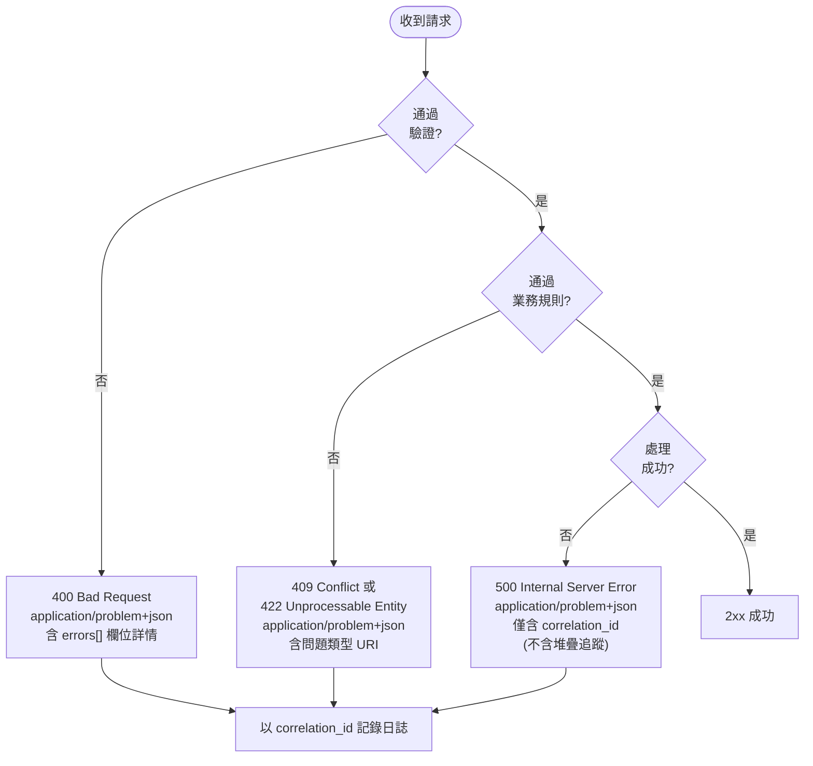

# [BEE-4006] API 錯誤處理與問題詳情

:::info
HTTP 狀態碼作為主要錯誤訊號、RFC 9457 問題詳情格式，以及一致的機器可讀錯誤回應。
:::

:::tip Deep Dive
For comprehensive API error design patterns and error taxonomy, see [ADE (API Design Essentials)](https://alivedise.github.io/api-design-essentials/).
:::

## 背景

錯誤處理是 API 設計中最常被忽視的面向。許多 API 對所有回應都回傳 `200 OK` 並在 body 中嵌入成功旗標、在正式環境洩漏內部堆疊追蹤，或在不同端點之間產生完全不一致的錯誤結構。這些模式會傷害 API 的使用者：錯誤處理程式碼變得脆弱、除錯耗時，客戶端開發者也無法建立可靠的重試或告警邏輯。

RFC 9457（HTTP API 的問題詳情），由 IETF 於 2023 年發佈，作為 RFC 7807 的後繼標準，定義了一種標準 JSON 格式來表達 HTTP 錯誤詳情。Stripe、Google 以及大多數設計完善的公開 API，都獨立收斂到相同的原則：正確使用 HTTP 狀態碼、回傳結構化的機器可讀錯誤、包含足夠的上下文讓對方採取行動，且絕不暴露實作細節。

核心規則很簡單：**HTTP 狀態碼告訴客戶端失敗的*類別*；回應 body 告訴它*發生了什麼*以及*下一步該怎麼做*。**

## 原則

### HTTP 狀態碼作為主要錯誤訊號

RFC 9110 定義了 HTTP 狀態碼的語義。狀態碼不是可選的元資料，而是溝通請求結果的標準通道。堆疊中每個 HTTP 感知元件（負載平衡器、代理、監控工具、CDN、客戶端函式庫）都會檢查狀態碼。繞過它們會破壞整個生態系統。

| 範圍 | 類別 | 客戶端應對 |
|------|------|------------|
| 2xx | 成功 | 正常繼續 |
| 4xx | 客戶端錯誤 | 修正請求；不要盲目重試 |
| 5xx | 伺服器錯誤 | 伺服器失敗；通常可搭配退避策略重試 |

**錯誤情境必須使用的狀態碼：**

| 代碼 | 名稱 | 使用時機 |
|------|------|----------|
| 400 | Bad Request | 格式錯誤、缺少必要欄位、無效的參數類型 |
| 401 | Unauthorized | 缺少或無效的認證憑證 |
| 403 | Forbidden | 已認證但缺乏授權 |
| 404 | Not Found | 資源不存在 |
| 409 | Conflict | 請求與當前資源狀態衝突（重複建立、版本不符） |
| 410 | Gone | 資源曾存在但已永久刪除 |
| 422 | Unprocessable Entity | 語法正確但語意無效（違反業務規則） |
| 429 | Too Many Requests | 超過速率限制；須包含 `Retry-After` 標頭 |
| 500 | Internal Server Error | 非預期的伺服器端失敗 |
| 503 | Service Unavailable | 暫時過載或維護中；須包含 `Retry-After` 標頭 |

`400` 與 `422` 的差異很重要：`400` 用於結構上格式錯誤的請求（無法解析的 JSON、錯誤的 content type）；`422` 用於可正常解析但違反業務規則或語意約束的請求。

---

### RFC 9457 問題詳情格式

RFC 9457 定義了 `application/problem+json` 媒體類型。問題詳情物件是一個 JSON 物件，包含五個標準成員。規範中所有成員都是可選的，但實務上 `type`、`title`、`status` 和 `detail` 都應該提供。

| 欄位 | 類型 | 說明 |
|------|------|------|
| `type` | URI | 識別問題類型。應解析為人類可讀的文件。使用你自己網域下的穩定 URL。 |
| `title` | string | 問題類型的簡短人類可讀摘要。在不同發生情境間不應改變。 |
| `status` | integer | HTTP 狀態碼。為方便起見而包含（客戶端應以實際 HTTP 狀態為準）。 |
| `detail` | string | 對*此次具體發生*的人類可讀說明。可以顯示給終端使用者。 |
| `instance` | URI | 識別*此次具體發生*的 URI 參考。可以是關聯 ID 或日誌 URL。 |

允許擴充：可以根據需要新增任意成員（例如用於欄位級驗證詳情的 `errors`，或用於追蹤的 `correlation_id`）。

問題詳情回應的媒體類型為：

```
Content-Type: application/problem+json
```

---

### 驗證錯誤：欄位級詳情

當請求驗證失敗時，400 回應必須指出哪些欄位無效以及原因。通用的「無效請求」回應會迫使客戶端開發者猜測，或發送第二張支援工單。

使用 `errors` 陣列擴充標準問題詳情物件：

```json
HTTP/1.1 400 Bad Request
Content-Type: application/problem+json

{
  "type": "https://api.example.com/problems/validation-error",
  "title": "Validation Error",
  "status": 400,
  "detail": "The request contains invalid fields.",
  "instance": "/requests/a3f5d812-...",
  "errors": [
    {
      "field": "email",
      "code": "INVALID_FORMAT",
      "message": "Must be a valid email address."
    },
    {
      "field": "due_date",
      "code": "DATE_IN_PAST",
      "message": "due_date must be a future date."
    }
  ]
}
```

每個錯誤項目中的 `code` 欄位是機器可讀且在 API 版本之間穩定的。客戶端程式碼可以對 `errors[n].code` 進行 `switch`，而不需要解析人類可讀的 `message`。

---

### 業務邏輯錯誤：語意失敗

業務規則違反使用 `409 Conflict` 或 `422 Unprocessable Entity`。`type` URI 識別具體問題，允許客戶端以程式方式處理。

```json
HTTP/1.1 409 Conflict
Content-Type: application/problem+json

{
  "type": "https://api.example.com/problems/task-already-completed",
  "title": "Task Already Completed",
  "status": 409,
  "detail": "Task 42 cannot be reassigned because it was completed on 2026-03-15.",
  "instance": "/requests/b7e1c402-...",
  "task_id": 42,
  "completed_at": "2026-03-15T09:41:00Z"
}
```

擴充欄位 `task_id` 和 `completed_at` 為客戶端提供了顯示有意義訊息或採取修正行動所需的一切，無需任何字串解析。

---

### 內部錯誤：不要洩漏堆疊追蹤

當發生非預期錯誤時，伺服器必須回傳 `500 Internal Server Error`。回應中不得包含：

- 堆疊追蹤
- SQL 查詢或 ORM 錯誤訊息
- 內部檔案路徑或類別名稱
- 資料庫連接字串或憑證
- 暴露拓撲的第三方服務錯誤詳情

取而代之，回傳包含關聯 ID 的最小問題詳情物件。關聯 ID 是客戶端看到的內容與伺服器日誌之間的橋樑。

```json
HTTP/1.1 500 Internal Server Error
Content-Type: application/problem+json

{
  "type": "https://api.example.com/problems/internal-error",
  "title": "Internal Server Error",
  "status": 500,
  "detail": "An unexpected error occurred. Use the correlation_id to report this issue.",
  "correlation_id": "req-7f3a9b21-4e2d-11ef-8c3a-0a9b1c2d3e4f"
}
```

在內部記錄完整錯誤（例外、堆疊追蹤、請求上下文），以相同的 `correlation_id` 作為索引鍵。當客戶端回報錯誤時，關聯 ID 是找到完整診斷軌跡所需的唯一資訊。結構化日誌慣例請參見 [BEE-14002](../observability/structured-logging.md)。

---

### 關聯 ID

每個請求都應在 API 閘道或入口點分配一個唯一的關聯 ID。該 ID 必須：

- 傳播至所有下游服務呼叫
- 包含在該請求的所有日誌項目中
- 在錯誤回應中回傳（作為 `correlation_id` 或在 `instance` URI 中）

當客戶端收到錯誤時，他們將關聯 ID 附加到錯誤報告中。值班工程師使用該 ID 查詢日誌，立即看到完整的情況，無需猜測，也不需要在多個服務之間進行日誌考古。

```
X-Correlation-ID: req-7f3a9b21-4e2d-11ef-8c3a-0a9b1c2d3e4f
```

部分 API 使用 `X-Request-ID` 或將 ID 嵌入 `instance` 欄位。具體機制不如保證重要：每個錯誤回應都包含可追蹤的識別符。

---

### 速率限制：Retry-After

`429 Too Many Requests` 必須包含 `Retry-After` 標頭。沒有它，客戶端就沒有依據選擇重試間隔，要麼任意退避（糟糕的使用者體驗），要麼立即再次請求（加劇問題）。

```
HTTP/1.1 429 Too Many Requests
Content-Type: application/problem+json
Retry-After: 30

{
  "type": "https://api.example.com/problems/rate-limit-exceeded",
  "title": "Rate Limit Exceeded",
  "status": 429,
  "detail": "You have exceeded 100 requests per minute. Retry after 30 seconds.",
  "retry_after": 30,
  "limit": 100,
  "window": "60s"
}
```

`Retry-After` 接受整數秒數或 HTTP 日期格式。使用整數秒數較為簡單。

---

### 機器可讀 vs 人類可讀錯誤

每個錯誤回應同時服務兩類受眾：

| 受眾 | 欄位 | 需求 |
|------|------|------|
| 客戶端程式碼 | `type`、`errors[].code`、`status` | 穩定、版本化、可文件化 |
| 人類開發者 | `title`、`detail`、`errors[].message` | 清晰、具體、可採取行動 |
| 支援 / 值班人員 | `correlation_id`、`instance` | 唯一、可追蹤 |

`type` URI 和錯誤 `code` 值是機器可讀的契約。一旦發佈後就不得更改（將它們視為 API 路徑）。`detail` 字串和 `message` 字串是人類可讀的，可以隨時間本地化或改進。

---

## 圖示



---

## 範例

### 正確做法：RFC 9457 驗證錯誤

```
POST /tasks
Content-Type: application/json

{
  "title": "",
  "due_date": "2020-01-01"
}

HTTP/1.1 400 Bad Request
Content-Type: application/problem+json
X-Correlation-ID: req-a1b2c3d4

{
  "type": "https://api.example.com/problems/validation-error",
  "title": "Validation Error",
  "status": 400,
  "detail": "The request body contains 2 invalid fields.",
  "instance": "/requests/req-a1b2c3d4",
  "errors": [
    {
      "field": "title",
      "code": "REQUIRED_FIELD_EMPTY",
      "message": "title must not be blank."
    },
    {
      "field": "due_date",
      "code": "DATE_IN_PAST",
      "message": "due_date must be a future date; received 2020-01-01."
    }
  ]
}
```

### 正確做法：RFC 9457 業務邏輯錯誤

```
POST /tasks/42/complete
Content-Type: application/json

HTTP/1.1 409 Conflict
Content-Type: application/problem+json

{
  "type": "https://api.example.com/problems/task-already-completed",
  "title": "Task Already Completed",
  "status": 409,
  "detail": "Task 42 is already in state 'completed' and cannot transition again.",
  "instance": "/requests/req-b5e7f001",
  "task_id": 42,
  "current_state": "completed"
}
```

### 錯誤做法：body 中使用 200 回傳錯誤（反模式）

```
POST /tasks
Content-Type: application/json

HTTP/1.1 200 OK
Content-Type: application/json

{
  "success": false,
  "error": "Something went wrong",
  "code": -1
}
```

此模式的問題：
- HTTP 狀態 `200` 告訴每個代理、監控和客戶端函式庫請求已成功。
- `code: -1` 對客戶端毫無意義；沒有穩定的契約。
- 沒有關聯 ID、沒有欄位詳情、沒有可採取行動的指引。
- `error` 字串不穩定，任何措辭更改都會破壞客戶端解析。

### 錯誤做法：洩漏內部詳情（反模式）

```json
HTTP/1.1 500 Internal Server Error
Content-Type: application/json

{
  "error": "NullPointerException at com.example.service.TaskService.complete(TaskService.java:142)",
  "caused_by": "org.postgresql.util.PSQLException: ERROR: deadlock detected",
  "stack": "com.example.service.TaskService.complete(TaskService.java:142)\n  com.example.controller..."
}
```

這暴露了類別名稱、行號、資料庫類型和查詢失敗詳情。攻擊者可以利用這些資訊對程式碼庫進行映射並識別注入目標。

---

## 常見錯誤

**1. 對錯誤回傳 200**

最具破壞性的反模式。每個 HTTP 感知工具（監控儀表板、負載平衡器健康檢查、客戶端重試函式庫）都依賴狀態碼。對錯誤回傳 `200` 會破壞整個基礎設施所依賴的訊號。

**2. 在正式環境洩漏堆疊追蹤**

API 回應中的堆疊追蹤暴露了內部類別結構、資料庫查詢、基礎設施拓撲，有時甚至是憑證。對 API 使用者（他們無法修復伺服器程式碼）幾乎沒有幫助，但對攻擊者卻提供了巨大的便利。

**3. 跨端點錯誤形狀不一致**

當每個端點各自發明錯誤格式（`{"message": ...}` vs `{"error": ...}` vs `{"errors": [...]}`）時，客戶端開發者必須為每個端點編寫特定的解析程式碼。統一使用 `application/problem+json` 形狀意味著一條錯誤處理路徑可以處理所有情況。

**4. 沒有關聯 ID**

沒有關聯 ID，跨服務邊界追蹤錯誤需要在多個日誌串流中比對時間戳，這個過程最好情況下需要幾分鐘，在時鐘偏差時更會失敗。關聯 ID 讓這個過程變得即時。

**5. 沒有可採取行動詳情的通用訊息**

「Something went wrong」或「Internal error」對開發者毫無幫助。對於 4xx 錯誤，至少應告知：什麼是錯的、是哪個欄位或參數造成的、有效值是什麼樣的。對於 5xx 錯誤，提供關聯 ID 讓他們可以提交有意義的支援工單。

---

## 相關 BEE

- [BEE-4001](rest-api-design-principles.md) REST API 設計原則
- [BEE-2002](../security-fundamentals/input-validation-and-sanitization.md) 輸入驗證
- [BEE-14002](../observability/structured-logging.md) 結構化日誌

---

## 參考資料

- Nottingham, M., and Wilde, E. 2023. "Problem Details for HTTP APIs". RFC 9457. https://www.rfc-editor.org/rfc/rfc9457.html
- Fielding, R.T., et al. 2022. "HTTP Semantics". RFC 9110. https://www.rfc-editor.org/rfc/rfc9110
- Stripe. "Error Handling". Stripe API Reference. https://docs.stripe.com/api/errors/handling
- Google. "AIP-193: Errors". Google API Improvement Proposals. https://google.aip.dev/193
- Redocly. "RFC 9457: Better information for bad situations". https://redocly.com/blog/problem-details-9457
- Swagger. "Problem Details (RFC 9457): Doing API Errors Well". https://swagger.io/blog/problem-details-rfc9457-doing-api-errors-well/
