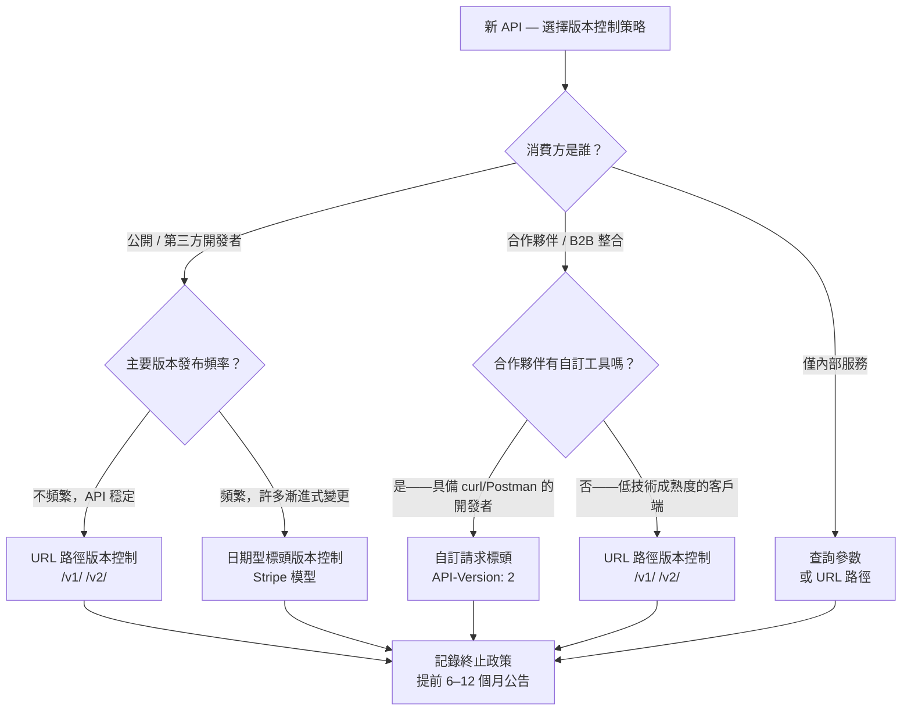

# [BEE-4002] API 版本控制策略

:::info
URL 路徑、標頭、查詢參數與內容協商版本控制——各自的適用時機、如何管理破壞性變更，以及如何退役舊版本。
:::

:::tip Deep Dive
關於完整的 API 版本治理與生命週期管理，請參閱 [ADE (API Design Essentials)](https://alivedise.github.io/api-design-essentials/)。
:::

## 背景

API 是提供方與消費方之間的契約。一旦客戶端依賴這份契約，任何變更都伴隨風險。沒有版本控制策略的話，提供方面臨兩難：要嘛永遠凍結 API 以避免破壞消費方，要嘛持續改進但接受部分整合會靜默失效。

版本控制是讓 API 得以演進、同時維持現有消費方正常運作的機制。它回答了這個問題：當破壞性變更不可避免時，如何在不強迫所有消費方同步升級的情況下導入它？

資安專家 Troy Hunt 在其廣受引用的 API 版本控制文章中直白地說：「比起爭論哪種方式對不對，更重要的是給消費方穩定性。如果他們花費心力寫程式碼來串接你的 API，你最好不要讓它壞掉。」目標不是挑選理論上「正確」的版本控制機制，而是做出一個明確的選擇、記錄下來，並信守穩定性的承諾。

## 原則

### 破壞性變更 vs. 非破壞性變更

第一個紀律是清楚區分哪些是破壞性變更。並非每個變更都需要版本升級。

| 變更類型 | 是否為破壞性？ | 範例 |
|---|---|---|
| 移除回應中的欄位 | **是** | 從 `GET /users/{id}` 移除 `user.phone` |
| 重新命名欄位 | **是** | `created_at` → `createdAt` |
| 更改欄位型別 | **是** | `price` 從字串改為數字 |
| 移除端點 | **是** | 刪除 `DELETE /v1/reports` |
| 更改 HTTP 方法語意 | **是** | `PUT` 改為行為像 `PATCH` |
| 將原本選填的欄位改為必填 | **是** | 請求本文的 `reason` 變為必填 |
| 更改錯誤碼或錯誤結構 | **是** | 驗證錯誤從 `400` 改為 `422` |
| 在回應中新增選填欄位 | 否 | 在現有回應中加入 `user.avatar_url` |
| 在請求中新增選填欄位 | 否 | 新增選填的 `filter` 查詢參數 |
| 新增端點 | 否 | `GET /v1/reports/{id}/summary` 為全新端點 |
| 擴充列舉值 | 否* | 在 `status` 中新增 `"archived"` |
| 放寬驗證限制 | 否 | 允許比原本更長的字串 |

*擴充列舉值在線路層面技術上不破壞，但可能破壞使用窮舉式 switch 的強型別客戶端。對強型別消費方應視為破壞性變更。

判斷原則：若現有客戶端收到新的回應後，無需修改程式碼即可繼續正常運作，則該變更為非破壞性。若客戶端需要修改程式碼才能處理新的回應，則為破壞性變更。

---

### 四種版本控制策略

#### 1. URL 路徑版本控制

將版本嵌入 URI 路徑中。

```
GET /v1/users/42
GET /v2/users/42
```

**優點：**
- 在所有日誌、瀏覽器網址列與連結中立即可見
- 易於測試與分享——URL 本身即自包含
- 易於在閘道或負載平衡器層進行路由
- 對快取友善；CDN 可分別快取 `/v1/` 與 `/v2/`

**缺點：**
- 違反 REST 原則：URI 應識別資源，而非資源的版本
- 升級時強迫消費方更新基礎 URL
- 若按個別端點粒度版本化，會造成 URL 爆炸

**最適用：** 公開 API、面向開發者的 API、主要版本不頻繁更新的 API。

---

#### 2. 自訂請求標頭版本控制

在專用 HTTP 標頭中傳遞版本號。

```
GET /users/42
API-Version: 2
```

或如 Stripe 的做法，使用日期：

```
GET /charges
Stripe-Version: 2024-06-20
```

**優點：**
- URI 保持穩定——資源識別符不因版本變更
- 將版本控制與資源識別分離（更符合 REST 精神）
- 可針對每個請求覆寫版本，方便測試

**缺點：**
- 瀏覽器網址列與純文字超連結中不可見
- 沒有工具支援（curl、Postman 等）較難測試
- 需要額外的文件紀律——消費方必須知道標頭名稱

**最適用：** 消費方為具備工具的開發者的合作夥伴 API；Stripe 風格的日期型版本控制模型。

---

#### 3. 查詢參數版本控制

以查詢字串參數傳遞版本號。

```
GET /users/42?api-version=2
GET /users/42?version=2026-04-01
```

**優點：**
- 在日誌與 URL 中可見，無需特殊工具
- 易於覆寫以進行除錯或測試
- 不改變基礎路徑結構

**缺點：**
- 查詢參數在語意上用於過濾或控制回應，而非識別契約；混用關注點
- 可能被代理或 API 閘道意外剝除
- 對 API 探索的友善度不如路徑版本控制

**最適用：** 內部 API、Azure 風格服務（Azure DevOps 使用 `?api-version=`）、不希望變更路徑結構的工具。

---

#### 4. Accept 標頭版本控制（內容協商）

在 `Accept` 標頭的媒體類型參數中表達版本。

```
GET /users/42
Accept: application/vnd.myapi.v2+json
```

**優點：**
- 完全符合 REST 規範——URI 識別資源；`Accept` 標頭協商表現形式
- 無 URI 氾濫；無查詢參數污染
- 理論上是最清晰的關注點分離

**缺點：**
- 沒有工具支援時測試難度顯著較高
- 無法直接在瀏覽器中輸入
- 難以在 CDN 層快取（需要 `Vary: Accept` 標頭）
- 實務採用率低；大多數消費方不預期此模式

**最適用：** 追求嚴格 REST 合規性的超媒體驅動 API；對通用開發者 API 而言鮮少合適。

---

### Stripe 的日期型版本控制模型

Stripe 是大規模生產環境 API 版本控制的典範案例。Stripe 以發布日期命名版本（如 `2024-06-20`），而非遞增版本號。主要特性：

- 每個帳號**釘定（pinned）**到首次認證時生效的 API 版本。現有整合將持續接收相同行為。
- 新帳號預設使用最新版本。
- 開發者可透過 `Stripe-Version` 標頭**按請求覆寫**版本，在測試環境或生產環境中安全地驗證升級效果。
- Stripe 將 Webhook 酬載結構視為相同版本契約的一部分。
- 舊版本被封裝在**版本變更模組**中——新程式碼只表達新行為；轉換回舊版表現形式的邏輯被隔離在介面卡（adapter）中。

此模型之所以成功，在於 Stripe 從早期就將版本控制視為一等架構關注點，而非事後補救。對新 API 的啟示：在第一個外部消費方上線之前，就確立版本控制策略。

---

### 終止（Sunset）政策與棄用溝通

導入新版本但不退役舊版本，會造成無限擴張的維護負擔。每個活躍版本都是需要監控、確保安全與修復漏洞的生產程式碼。**終止政策（sunset policy）**定義了在新版本發布後，舊版本受支援的期限。

**棄用版本時的最低溝通要求：**

1. **提前公告** — 發布棄用通知，並附上明確的終止日期，而非「未來某個時間」。公開 API 的標準為六至十二個月；內部 API 可使用較短的窗口。
2. **使用 `Sunset` 標頭**（RFC 8594）— 對棄用版本的請求回應加入：
   ```
   Sunset: Sat, 31 Dec 2026 23:59:59 GMT
   Deprecation: true
   Link: <https://api.example.com/v2/users>; rel="successor-version"
   ```
3. **提供遷移路徑文件** — 列出每個破壞性變更及其在新版本中的對應方式。
4. **直接通知消費方** — 電子郵件、更新日誌或儀表板提示；不要只依賴被動的標頭訊號。
5. **執行終止日期** — 在宣告的終止日期後回傳 `410 Gone`；無限期回傳 `200` 會使政策形同虛設。

---

### 向後相容性規則

希望最小化版本升級次數的團隊，應將向後相容性規則作為預設紀律：

- **只增加，不移除，不重新命名** — 新增欄位而非取代現有欄位。當某個欄位確實必須變更時，先在舊欄位旁新增新欄位，並標記舊欄位為棄用。
- **將 Schema 視為只可追加的日誌** — 移除是需要版本升級的事件。
- **謹慎設定新欄位的預設值** — 若在請求中新增必填欄位，應提供合理的伺服器端預設值，使不傳送該欄位的舊客戶端仍可正常運作。
- **不在未事先通知的情況下收緊驗證** — 讓原本被接受的值變得無效是破壞性變更。
- **版本化你的錯誤契約** — 更改錯誤碼、錯誤本文或問題詳情（Problem Details，見 [BEE-4006](api-error-handling-and-problem-details.md)）的結構是破壞性變更。

---

## 視覺化

根據 API 受眾與需求選擇版本控制策略的決策樹：



---

## 範例

### 相同資源在不同版本控制策略下的表示方式

`GET /orders/99` 端點在各策略下的請求形式：

```
# URL 路徑
GET /v1/orders/99

# 自訂標頭
GET /orders/99
API-Version: 1

# 查詢參數
GET /orders/99?api-version=1

# Accept 標頭（內容協商）
GET /orders/99
Accept: application/vnd.myapi.v1+json
```

四種請求形式都指向相同的邏輯資源。差異在於版本訊號放在哪裡。

---

### 版本演進：正確處理破壞性變更

`GET /v1/users/42` 的 **v1 回應**：

```json
{
  "id": 42,
  "name": "Alice Chen",
  "phone": "0912-345-678"
}
```

團隊決定將 `name` 拆分為 `given_name` 與 `family_name`，並移除 `phone`。這些是破壞性變更。正確的處理步驟：

1. 發布具有新結構的 `v2`。維持 `v1` 繼續運行。
2. 在所有 `v1` 回應中加入 `Sunset` 與 `Deprecation` 標頭。
3. 發布遷移指南：`name` → `given_name` + `family_name`；`phone` 移至 `GET /v2/users/42/contact`。
4. 透過電子郵件與開發者入口公告通知消費方。
5. 終止日期到達後，`v1` 回傳 `410 Gone`。

`GET /v2/users/42` 的 **v2 回應**：

```json
{
  "id": 42,
  "given_name": "Alice",
  "family_name": "Chen"
}
```

---

## 常見錯誤

**1. 從一開始就沒有版本控制策略**

最昂貴的錯誤。一旦無版本的 API 有了外部消費方，加入版本控制本身就變成了一個破壞性變更。在任何消費方上線之前，就先確立策略——即使第一個版本是 `v1` 且永遠不會改變。

**2. 同時維護過多活躍版本**

每個活躍版本都是維護負擔。從未退役舊版本的團隊，最終會並行運行同一邏輯的多個版本，每個都需要安全修補與漏洞修復。事先定義終止窗口並確實執行。

**3. 在沒有版本升級的情況下引入破壞性變更**

在維持相同版本號的情況下重新命名欄位、更改型別或將選填欄位改為必填，會靜默破壞現有整合。這類失敗往往在數週後消費方回報 Bug 時才被發現。若變更為破壞性，必須升級版本。

**4. 未向消費方溝通棄用時程**

在沒有明確終止日期的情況下宣告棄用，不是棄用，而是警告。沒有截止日期，消費方不會優先處理升級。公布具體日期並確實執行。

**5. 在錯誤的粒度層級進行版本控制**

按端點版本化（`/users/v2/42`、`/orders/v3/99`）會造成版本組合爆炸，使得無法判斷客戶端使用的是哪個「版本」的 API。應對整個 API 表面進行版本控制，而非個別端點。例外情況是微小的增加性變更（非破壞性），這類變更完全不需要版本升級。

---

## 相關 BEE

- [BEE-4001](rest-api-design-principles.md) REST API 設計原則
- [BEE-4002](api-versioning-strategies.md) API 的冪等性
- [BEE-4006](api-error-handling-and-problem-details.md) API 錯誤處理與問題詳情
- [BEE-7002](../data-modeling/normalization-and-denormalization.md) Schema 演進

---

## 參考資料

- Stripe. "APIs as infrastructure: future-proofing Stripe with versioning". https://stripe.com/blog/api-versioning
- Stripe. "Versioning". Stripe API Reference. https://docs.stripe.com/api/versioning
- Stripe. "API upgrades". https://docs.stripe.com/upgrades
- Microsoft. "Web API Design Best Practices". Azure Architecture Center. https://learn.microsoft.com/en-us/azure/architecture/best-practices/api-design
- Microsoft. "Versions in Azure API Management". https://learn.microsoft.com/en-us/azure/api-management/api-management-versions
- Microsoft. "REST API Versioning for Azure DevOps". https://learn.microsoft.com/en-us/azure/devops/integrate/concepts/rest-api-versioning
- Hunt, T. "Your API versioning is wrong, which is why I decided to do it 3 different wrong ways". https://www.troyhunt.com/your-api-versioning-is-wrong-which-is/
- Nottingham, M. 2021. "The Sunset HTTP Header Field". RFC 8594. https://www.rfc-editor.org/rfc/rfc8594
