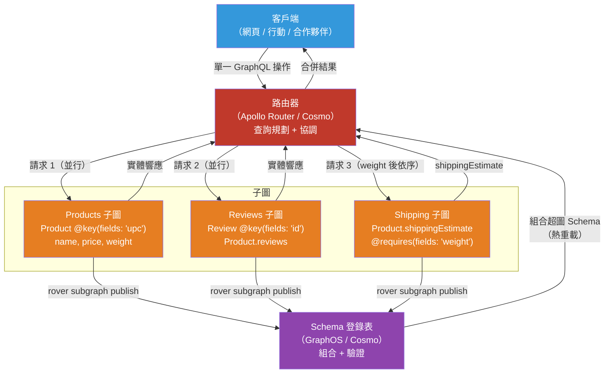

# [BEE-4008] GraphQL 聯合（Federation）

:::info
GraphQL Federation 是一套協議與架構，將多個獨立擁有的 GraphQL 服務（子圖，subgraph）組合成單一統一的 API 介面（超圖，supergraph），並透過路由器提供服務，無需中央 Schema 團隊擁有所有型別。
:::

## 背景脈絡

當組織在多個團隊中採用 GraphQL 時，會出現一個結構性矛盾：每個服務團隊希望擁有自己的 Schema，但客戶端需要單一、一致的 API。最初的解決方案是 Schema 拼接（schema stitching）——一個手動合併 Schema 並為跨服務邊界的型別關聯撰寫自訂解析器邏輯的閘道器。閘道器成為瓶頸：每一個跨服務關係都需要與閘道器團隊協調，合併邏輯是命令式且脆弱的，服務承諾與閘道器預期之間也缺乏靜態合約。

Apollo 於 2019 年 5 月 1 日推出 Federation，將其定位為聲明式的替代方案：子圖以指令（directive）標注 Schema，指令中編碼了跨服務關係，組合工具則從這些標注推導出統一 Schema，無需閘道器層的命令式程式碼。該協議在每個子圖上標準化了兩個根欄位——`Query._service { sdl }`（組合期間用於 Schema 內省）和 `Query._entities(representations: [_Any!]!): [_Entity]!`（執行時用於實體解析）——建立了任何符合規範的實作都能履行的子圖與路由器合約。

Apollo Federation v2（2022 年穩定版）放寬了 v1 中每個欄位必須有單一「主場」子圖的限制，引入了允許多個子圖解析同一欄位的 `@shareable`，以及用於零停機欄位遷移的 `@override`。2023 年 9 月，WunderGraph、Grafbase 等公司以 MIT 授權發布了開放 Federation 規範——記錄了 Apollo 自身規範中含糊帶過的組合規則和閘道器行為——創建了該協議的廠商中立標準。

到 2024 年，大規模生產部署已公開：Netflix 運營 200 個以上的 DGS（Domain Graph Service）子圖，每日處理超過十億次請求；Expedia 報告從 Schema 拼接遷移到 Federation 後運算成本降低了 50%；Shopify、GitHub 和 Twitter 也在內部描述了聯合 GraphQL 方法。

## 設計思維

### 子圖、超圖與路由器

**子圖（Subgraph）**：一個獨立部署的 GraphQL 服務，實作統一 Schema 的一部分。它透過函式庫（JavaScript 的 `buildSubgraphSchema`、`graphql-kotlin-federation`、Netflix DGS 等）公開 Federation 協議欄位（`_service`、`_entities`）。各團隊獨立擁有其子圖 Schema。

**超圖（Supergraph）**：由組合工具（Rover CLI、GraphOS、Cosmo）離線產生的組合統一 Schema。它不是一個獨立服務——它是路由器用作路由藍圖的靜態產物。客戶端看到的 Schema 顯示如同單體服務。

**路由器（Router）**：接收客戶端操作並在子圖上執行的程序。Apollo Router（Rust，2021 年 11 月發布）取代了早期的 Node.js Apollo Gateway；WunderGraph Cosmo Router（Apache 2.0）和 The Guild 的 Hive Gateway 是相容的開源替代方案。路由器：

1. 接收客戶端的 GraphQL 操作。
2. 執行查詢規劃器，將操作分解為子圖請求。
3. 執行請求——獨立的請求並行，有資料依賴的則依序執行。
4. 合併結果並回傳單一響應。

### 實體與 `@key` 指令

以 `@key` 標注的型別是**實體（entities）**：可在子圖邊界之間引用和解析的物件。`@key` 指令指定唯一識別實例的欄位。

```graphql
# Products 子圖：擁有 Product 實體
type Product @key(fields: "upc") {
  upc:   String!
  name:  String!
  price: Float!
}
```

```graphql
# Reviews 子圖：引用 Product 但不擁有它
# 為 Product 實體新增 reviews 欄位
type Product @key(fields: "upc") {
  upc:     String!     # 鍵欄位——必須與擁有子圖一致
  reviews: [Review!]!
}
```

當路由器需要單一 `Product` 在兩個子圖中的欄位時，它先從 Reviews 子圖（若查詢根在此）獲取資料，收集 product `upc` 鍵，然後使用 `_entities` 協議從 Products 子圖獲取：

```graphql
# 路由器向 Products 子圖發送請求，為每個評論解析 product.name
query {
  _entities(representations: [{ __typename: "Product", upc: "abc" }]) {
    ... on Product { name price }
  }
}
```

**引用解析器（reference resolver）**（JavaScript 中的 `__resolveReference`；Netflix DGS 中的 `@DgsEntityFetcher`）接收包含 `__typename` 和鍵欄位的表示，並回傳完整的實體物件。

### 查詢規劃：並行 vs 依序

查詢規劃器組成一棵計劃樹：

- **Fetch 節點**：執行子圖操作。
- **Parallel 節點**：子節點並行執行（獨立請求）。
- **Sequence 節點**：子節點依序執行（B 需要 A 的輸出）。

`@requires` 強制依序執行。若 Shipping 子圖聲明 `shippingEstimate` 需要 Products 子圖的 `weight`，規劃器就會插入一個 Sequence 節點：先從 Products 獲取 `weight`，再將其作為輸入傳給 Shipping 請求。總延遲變為 A + B 而非 max(A, B)。只在資料依賴真實且不可避免時使用 `@requires`；將所需欄位反正規化到擴展子圖自己的資料庫中可以消除這種依序限制。

## 最佳實踐

**MUST（必須）在穩定、不可變的欄位上定義實體鍵。** `@key` 欄位是跨子圖的 JOIN 條件。若它改變（例如 UUID 輪換），所有持有該鍵的子圖都會出現不一致。使用代理主鍵，而非可變的業務屬性。

**MUST（必須）使用 DataLoader 實作引用解析器以防止 N+1 查詢。** 若沒有 DataLoader，解析 10 個評論的 product 會發出 10 次獨立的引用解析器呼叫——每次都可能打到資料庫。DataLoader 在單一事件循環 tick 內將它們合併為一次批次查詢。解析器必須以與輸入表示陣列相同的順序回傳實體。

**MUST（必須）在部署子圖前於 CI 中驗證組合。** 使用 `rover subgraph check`（Apollo）或 Cosmo 等效工具，在子圖上線前於登錄表中執行組合驗證。組合錯誤（型別衝突、缺少 `@external` 欄位、非 `@shareable` 欄位在多個子圖中定義）會阻止超圖更新，並將錯誤暴露給部署團隊而非客戶端。

**SHOULD（應該）在熱點查詢路徑上避免使用 `@requires`。** `@requires` 將並行子圖請求轉為依序請求，至少增加一個往返延遲。對於所需資料變化不頻繁的讀取密集欄位，考慮在擴展子圖中儲存反正規化副本，而非要求實時的跨子圖獲取。

**SHOULD（應該）使用 `@override` 進行零停機欄位遷移。** 將欄位從子圖 A 移至子圖 B 時：在子圖 B 中新增 `@override(from: "A")`，部署 B，然後從 A 中移除該欄位。在上線期間，路由器可以從任一子圖解析該欄位。在 B 部署之前從 A 移除欄位會導致組合錯誤。

**SHOULD（應該）透過登錄表對子圖 Schema 合約進行版本控制，而非透過 URL 版本控制。** GraphQL 設計用於透過欄位新增和廢棄來進行 Schema 演化，而非版本升級。透過登錄表登記 Schema 變更，依靠組合驗證和操作檢查來偵測破壞性變更。

**MAY（可以）使用 `@inaccessible` 隱藏公開 API Schema 中的聯合鍵。** 用作 `@key` 的數字型 `productId` 可以用 `@inaccessible` 從客戶端可見 Schema 中排除，同時仍可用於實體解析。這防止向外部消費者洩漏內部識別符。

**MAY（可以）使用 `@tag` 和合約（contracts）從單一超圖服務多個 API 受眾。** 按消費者群體標記 Schema 元素（例如 `@tag(name: "mobile")`、`@tag(name: "partner")`）。生成包含或排除特定標籤的合約變體。每個合約變體產生一個過濾後的超圖 Schema，由專用路由器端點提供服務。

## 視覺圖示



## 範例

**Products 子圖——實體定義與帶 DataLoader 的引用解析器：**

```javascript
// products-subgraph/schema.graphql
const { gql } = require('graphql-tag');

const typeDefs = gql`
  extend schema
    @link(url: "https://specs.apollo.dev/federation/v2.3",
          import: ["@key", "@shareable"])

  type Query {
    product(upc: String!): Product
    topProducts(limit: Int = 5): [Product!]!
  }

  type Product @key(fields: "upc") {
    upc:    String!
    name:   String!
    price:  Float!
    # weight 是 @shareable——Shipping 子圖可透過 @requires 讀取它
    weight: Float! @shareable
  }
`;

const resolvers = {
  Query: {
    product: (_, { upc }) => db.products.findByUpc(upc),
    topProducts: (_, { limit }) => db.products.findTop(limit),
  },
  Product: {
    // 引用解析器：當路由器需要在另一個子圖的上下文中
    // 透過鍵（upc）解析 Product 實體時呼叫
    __resolveReference(ref, { loaders }) {
      return loaders.productsByUpc.load(ref.upc);
    },
  },
};

// DataLoader：將 N 次引用解析器呼叫合併為一次批次資料庫查詢
function createLoaders() {
  return {
    productsByUpc: new DataLoader(async (upcs) => {
      const rows = await db.products.findByUpcs(upcs);         // 單次查詢
      const byUpc = Object.fromEntries(rows.map(r => [r.upc, r]));
      // 以與輸入完全相同的順序回傳——DataLoader 要求此順序
      return upcs.map(upc => byUpc[upc] ?? new Error(`未知 product: ${upc}`));
    }),
  };
}
```

**Reviews 子圖——使用 `@requires` 擴展 Product：**

```graphql
# reviews-subgraph/schema.graphql
extend schema
  @link(url: "https://specs.apollo.dev/federation/v2.3",
        import: ["@key", "@external", "@requires"])

type Review @key(fields: "id") {
  id:      ID!
  body:    String!
  rating:  Int!
  product: Product!
}

# Reviews 子圖為 Product 實體新增欄位。
# 它不擁有 Product——鍵欄位（upc）引用擁有子圖。
type Product @key(fields: "upc") {
  upc:     String!
  reviews: [Review!]!

  # @external：weight 由 Products 子圖擁有——我們在此聲明它
  # 僅因為下方的 @requires 需要引用它
  weight: Float @external
  # @requires：路由器從 Products 子圖獲取 weight 之前無法解析 shippingEstimate
  # 這強制依序請求
  shippingEstimate: Float @requires(fields: "weight")
}
```

**Netflix DGS（Java/Spring Boot）實體獲取器：**

```java
// ProductsDataFetcher.java — DGS 子圖
@DgsComponent
public class ProductsDataFetcher {

    @Autowired
    private ProductService productService;

    // Product 實體的引用解析器——對應 __resolveReference
    @DgsEntityFetcher(name = "Product")
    public CompletableFuture<Product> fetchProduct(
        Map<String, Object> representation,
        DataFetchingEnvironment env
    ) {
        String upc = (String) representation.get("upc");
        // DataLoader 整合：DGS 框架批次處理並行的實體請求
        DataLoader<String, Product> loader = env.getDataLoader("products-by-upc");
        return loader.load(upc);
    }

    @DgsQuery
    public List<Product> topProducts(@InputArgument Integer limit) {
        return productService.findTop(limit);
    }
}
```

**CI 中的組合驗證（GitHub Actions 節選）：**

```yaml
# .github/workflows/schema-check.yml
- name: 安裝 Rover CLI
  run: |
    curl -sSL https://rover.apollo.dev/nix/latest | sh
    echo "$HOME/.rover/bin" >> $GITHUB_PATH

- name: 檢查子圖組合
  env:
    APOLLO_KEY: ${{ secrets.APOLLO_KEY }}
    APOLLO_GRAPH_REF: my-graph@main
  run: |
    rover subgraph check $APOLLO_GRAPH_REF \
      --name products \
      --schema ./schema.graphql
    # 若組合失敗，或現有客戶端操作受影響，則以非零值退出
```

## 實作注意事項

**Schema 拼接 vs Federation**：Schema 拼接（`graphql-tools` 的 `stitchSchemas`）讓子圖保持為標準的、獨立有效的 GraphQL 服務，無需特定協議要求。合併配置位於閘道器中，對不尋常的模式更靈活。Federation 的聲明式模型更有結構性，支援靜態組合驗證和託管 Schema 登錄表。對於從頭開始的組織，Federation 的 CI 時組合檢查和分散式所有權模型是優勢；對於有現有拼接投入的團隊，The Guild 的 `graphql-tools` v7+ 已將拼接重振為可行的替代方案。

**路由器替代方案**：Apollo Router（Rust，開放核心，商業企業功能透過 GraphOS 提供）是參考實作。WunderGraph Cosmo 是完全開源（Apache 2.0）的替代方案，配備可自行託管的 Schema 登錄表、分析和 CI 工具。The Guild 的 Hive Gateway 透過 GraphQL Mesh 將範圍擴展到 REST/OpenAPI、gRPC 和資料庫來源，適合 API 資產異構的組織。

**訂閱（Subscriptions）**：核心 Federation 規範僅涵蓋查詢和變更。訂閱 Federation 需要額外的實作（Apollo Router 透過 SSE 支援訂閱模式的子集；完整的基於 WebSocket 的訂閱 Federation 因路由器而異）。在為實時用例採用 Federation 之前，請明確評估訂閱支援。

**鍵集設計**：複合鍵（`@key(fields: "orgId userId")`）受支援，但為引用解析器增加複雜性——解析器必須處理多欄位表示。當實體關係能清晰地映射到單一穩定識別符時，優先使用單欄位鍵。同一型別上的多個 `@key` 指令定義了替代鍵集，路由器可根據上下文中可用的欄位選擇使用。

## 相關 BEE

- [BEE-4005](graphql-vs-rest-vs-grpc.md) -- GraphQL vs REST vs gRPC：涵蓋 GraphQL 執行模型和 Schema 設計基礎，Federation 建立在此之上
- [BEE-19042](../distributed-systems/n-plus-1-query-batching.md) -- N+1 查詢問題與批次載入：DataLoader 是聯合引用解析器中 N+1 問題的必要緩解方案
- [BEE-4002](api-versioning-strategies.md) -- API 版本控制策略：GraphQL 的加法演化模型適用於子圖層級；Federation 合約提供面向消費者的 Schema 變體
- [BEE-19048](../distributed-systems/service-to-service-authentication.md) -- 服務間身份驗證：路由器到子圖的請求路徑與任何內部服務呼叫一樣需要身份驗證

## 參考資料

- [Apollo Federation 公告 — Apollo Blog（2019 年 5 月）](https://www.apollographql.com/blog/apollo-federation-f260cf525d21)
- [Apollo Federation v2 公告 — Apollo Blog（2021 年 11 月）](https://www.apollographql.com/blog/announcement/backend/announcing-federation-2/)
- [Apollo Federation 指令參考 — Apollo Docs](https://www.apollographql.com/docs/graphos/schema-design/federated-schemas/reference/directives)
- [Apollo Router：Rust 版 GraphQL Federation 執行時 — Apollo Blog](https://www.apollographql.com/blog/apollo-router-our-graphql-federation-runtime-in-rust)
- [Apollo Federation 中的 N+1 問題 — Apollo Tech Note TN0019](https://www.apollographql.com/docs/technotes/TN0019-federation-n-plus-1)
- [開放 Federation 規範公告 — WunderGraph（2023 年 9 月）](https://wundergraph.com/blog/open_federation_announcement)
- [開源 Netflix Domain Graph Service 框架 — Netflix TechBlog（2021）](https://netflixtechblog.com/open-sourcing-the-netflix-domain-graph-service-framework-graphql-for-spring-boot-92b9dcecda18)
- [演進 Netflix 聯合 GraphQL 平台 — InfoQ](https://www.infoq.com/articles/federated-GraphQL-platform-Netflix/)
- [Expedia：從 Schema 拼接到 Apollo Federation — Apollo Blog](https://www.apollographql.com/blog/expedia-improved-performance-by-moving-from-schema-stitching-to-apollo-federation)
- [WunderGraph Cosmo — GitHub（Apache 2.0）](https://github.com/wundergraph/cosmo)
- [Netflix DGS 框架 — 文件](https://netflix.github.io/dgs/)
