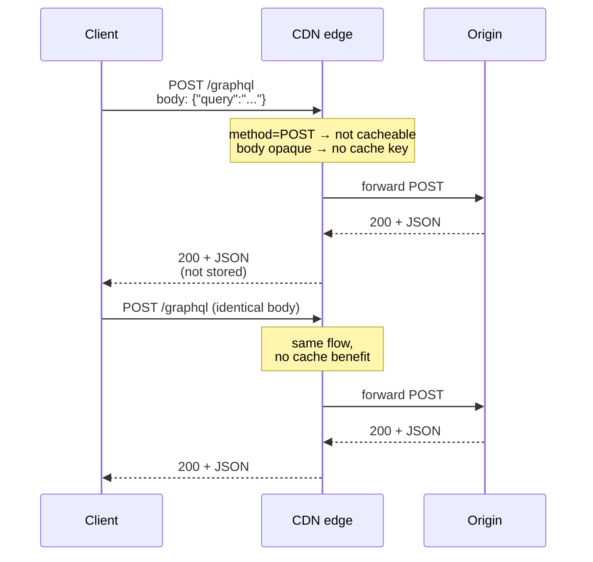
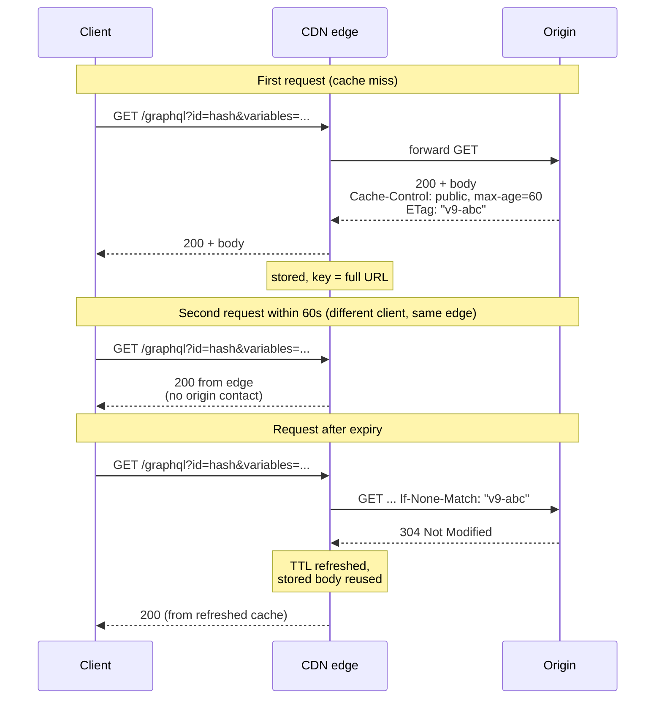
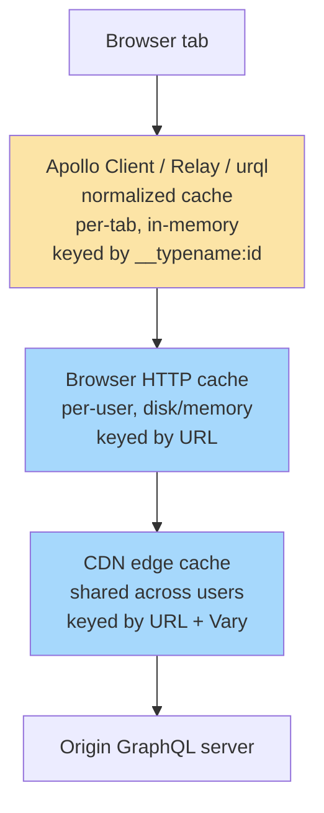

# [BEE-4010] GraphQL 的 HTTP 層快取

:::info
GraphQL 並非以 HTTP 快取為前提設計，但仍可參與其中。可行路徑包含三步：透過 persisted query 改用 GET、為回應加上快取指令、使用 ETag 進行條件式重新驗證。前提是先理解預設的 `POST /graphql` 為什麼會讓 CDN 失去作用。
:::

## 背景

[BEE-9006](../caching/http-caching-and-conditional-requests.md) 將 HTTP 快取視為協議層投資報酬率最高的效能改善手段。`Cache-Control` 指令、條件式請求、共享 CDN 快取，這些機制對 REST GET 端點是免費的，因為請求 URL 就是天然的快取鍵，而 GET 在 [RFC 9111](https://www.rfc-editor.org/rfc/rfc9111.html) 中預設可快取。

GraphQL 為了不同的目標而設計：讓客戶端從單一型別 Schema 中精確取得所需資料。它的標準傳輸方式（由慣例建立、並由 [GraphQL over HTTP](https://github.com/graphql/graphql-over-http) 工作草案編寫）是 `POST /graphql`，並把 query 放在請求主體。這個設計的三個性質與 HTTP 快取對立：

1. **POST 預設不可快取。** RFC 9111 §2 規定，只有當方法定義明確允許、且定義了適當快取鍵時，非 GET 方法的回應才可被快取。瀏覽器與商用 CDN 對 POST 並不滿足這些條件，預設的 GraphQL 請求就走在這條被停用的路徑上。
2. **快取鍵藏在請求主體裡。** CDN 用請求 URL 與 `Vary` 指定的 header 構造快取鍵，並不解析 JSON 主體。語意上不同的兩個 query 對 CDN 來說是完全相同的 `POST /graphql`，請求負載對 CDN 是不透明的。
3. **回應形狀因 query 而異。** 即使前兩個障礙被解決，同一個邏輯資源的回應主體仍會根據客戶端選擇的欄位而變化。快取項目會沿著 query 形狀的維度碎片化。

許多團隊把 GraphQL 部署在 CDN 之後，發現命中率趨近於零，於是放棄邊緣快取，或轉而依賴 GraphQL 客戶端的 normalized cache，並把兩者混為一談。本文整理 GraphQL 在 HTTP 層的快取選項，並說明每一條路在哪裡停止有效。

## 原則

要讓 GraphQL 參與 HTTP 快取，請求**必須（MUST）**能表達為穩定且冪等的 GET URL，**應該（SHOULD）**透過 persisted query 將 query hash 對應到已註冊的 query 文字。伺服器**應該（SHOULD）**為每個回應發出 `Cache-Control` 與 `ETag` header，客戶端**應該（SHOULD）**以 `If-None-Match` 進行重新驗證。團隊**禁止（MUST NOT）**將 HTTP 層快取（共享、網路邊緣、請求作用域）與 GraphQL 客戶端 normalized cache（單一客戶端、記憶體內、物件作用域）混為一談。它們解決不同的問題，互不替代。

## 為什麼預設的 `POST /graphql` 會破壞 HTTP 快取

三個障礙同時生效。

**(a) 方法層級的可快取性。** RFC 9111 §2 規定，POST 回應只有在 POST 方法定義對該資源明確允許快取、且回應帶有明確的新鮮度資訊時才可儲存。主流 CDN 與瀏覽器快取並不對任意端點啟用 POST 快取，所以 `POST /graphql` 預設就被視為不可快取。

**(b) 快取鍵位於請求主體中。** CDN 的快取鍵由請求 URL 加上 `Vary` 列出的 header 組成，並不解析 JSON 請求主體。兩個不同的 GraphQL query 抵達邊緣時，看起來都是同一個 `POST /graphql`，主體是不透明的位元組，CDN 找不到任何可用來區分它們的鍵熵。

**(c) 回應形狀因 query 而異。** 即使前兩個障礙被解決，同一個邏輯資源的回應主體仍取決於客戶端選擇的欄位。這會在 query 形狀的維度上產生快取碎片化，後文有專節討論。

CDN 實際看到的請求大概長這樣：

```http
POST /graphql HTTP/1.1
Host: api.example.com
Content-Type: application/json
Content-Length: 45

{"query":"query { user(id:1) { name } }"}
```

從 CDN 的角度看：方法是 POST，所以快取路徑停用；URL 是 `/graphql`，每個 query 都一樣，沒有快取鍵熵；回應沒有 `Cache-Control` 或 `ETag`，因為伺服器沒有理由發出沒人會用的 header。

## 透過 Persisted Query 改用 GET：讓請求變成 URL 可定址

解開三個障礙的機制是把 query 用穩定的 hash 註冊起來，然後用 URL 定址。

**Hash 與註冊。** 客戶端對正規化過的 query 文字計算 SHA-256。伺服器維護 hash 對 query 文字的對應表。常見的兩種註冊策略：

- **建置期 allowlist 註冊。** 客戶端被允許送出的所有 query 都在建置或部署時註冊。未知的 hash 一律拒絕。可預測性與安全性最強，也可作為阻擋任意客戶端 query 的拒絕服務（DoS）邊界。
- **執行期自動註冊（miss 時往返）。** 客戶端先單獨送出 hash。若伺服器回傳 `PersistedQueryNotFound` 錯誤，客戶端再帶上完整 query 文字加上 hash 重試，伺服器將其註冊。摩擦較低，安全性較弱，因為註冊對客戶端送出的內容是開放的。

**Wire-level GET 形狀。** query 註冊之後，請求變成純 GET：

```http
GET /graphql?extensions=%7B%22persistedQuery%22%3A%7B%22version%22%3A1%2C%22sha256Hash%22%3A%22abc...%22%7D%7D&variables=%7B%22id%22%3A1%7D HTTP/1.1
```

URL 現在就是完整的快取鍵：query 身份（透過 hash）與引數（透過 variables）都可用 URL 定址，CDN 可以像處理任何 REST GET 一樣儲存與取回回應。

**標準現況。** GraphQL 規範本身對傳輸方式保持沉默。[GraphQL over HTTP 工作草案](https://github.com/graphql/graphql-over-http)是 GraphQL Foundation 進行中的標準化工作，內容包括「伺服器 `MUST` 接受 POST、`MAY` 接受 GET」，以及 GET 參數以 `application/x-www-form-urlencoded` 格式放在 URL query string 的慣例。該草案目前未規範 persisted document 協議，persisted query 仍由各家伺服器實作自行決定。Apollo 的 [Automatic Persisted Queries](https://www.apollographql.com/docs/apollo-server/performance/apq) 是事實上的參考實作，[GraphQL Yoga](https://the-guild.dev/graphql/yoga-server/docs/features/response-caching)、Hot Chocolate、Mercurius、Netflix DGS 也提供等效功能。

請求變成 GET URL 後，所有標準 CDN 快取機制都可套用：瀏覽器快取、共享 CDN 快取、`Cache-Control`、`Vary`、條件式重新驗證。後續章節都建立在這個基礎之上。

## 每個回應的快取指令

請求改用 GET 之後，伺服器就可以發出 `Cache-Control` header，CDN 也會遵守。問題在於該發什麼值。

**Schema 層級的快取提示。** 主流模式（由 Apollo 提出，GraphQL Yoga 與其他伺服器跟進）是用 schema 指令：

```graphql
type Product @cacheControl(maxAge: 300) {
  id: ID!
  name: String!
  price: Float! @cacheControl(maxAge: 30)
  inventory: Int! @cacheControl(maxAge: 5, scope: PRIVATE)
}

type Query {
  product(id: ID!): Product @cacheControl(maxAge: 60)
}
```

**所選欄位取最小值的規則。** 伺服器走訪解析後的回應，計算所有被選欄位中最小的 `maxAge`，加上最嚴格的 scope。Apollo Server 文件原文寫得很直接：「The response's `maxAge` equals the lowest `maxAge` among all fields. The response's `scope` is `PRIVATE` if any field's `scope` is `PRIVATE`.」

query `{ product(id:1) { name } }` 會產生 `Cache-Control: public, max-age=60`（Query.product 的提示獲勝，因為 name 欄位繼承父型別的 300，而 60 比 300 小）。query `{ product(id:1) { name inventory } }` 則變成 `Cache-Control: private, max-age=5`，僅僅一個 PRIVATE 的 inventory 欄位就把兩個維度都拉低。

**Scope 降級陷阱。** 只要有一個欄位被標為 `PRIVATE`（在某些伺服器中，沒有任何提示的欄位也算），整個回應就被降級為 `Cache-Control: private`，導致共享快取完全無法儲存。這是 GraphQL 部署「名義上有快取、但 CDN 命中率為零」最常見的原因。要偵測這個問題，必須對每個 query 記錄實際發出的 `Cache-Control` 值，光稽核 schema 指令本身並不夠。

## GraphQL 中的 ETag 與條件式重新驗證

回應一旦帶上 `Cache-Control`，ETag 就能在快取項目過期時提供免費的重新驗證。機制與 [BEE-9006](../caching/http-caching-and-conditional-requests.md) 相同，只是套用在 GraphQL URL 上。

**ETag 產生策略。**

- **對 JSON 回應主體取 hash。** 便宜、永遠正確、不需要任何領域知識。代價是只要被選欄位中任何一個變更，ETag 就會改變，即使下游消費者並不依賴那個欄位來判斷快取有效性。建議的預設方式。GraphQL Yoga 的 response cache plugin 預設就用這種方式發出 ETag。
- **由底層實體版本組合而成。** 從 resolver 觸及的每個實體的版本向量組合 ETag。較精確：實體某個欄位變更只會讓觸及該欄位的 query 失效。需要實體版本追蹤基礎建設，且因 GraphQL 的 query 形狀變異而複雜化。只有大規模情境值得這麼做。

**`If-None-Match` 流程。** 當快取項目超過 `max-age`，快取（瀏覽器或 CDN）會送出：

```http
GET /graphql?extensions=...&variables=... HTTP/1.1
If-None-Match: "v9-abc123"
```

如果伺服器當前對該 query-and-variables 組合的 ETag 與之相符，就回傳 `304 Not Modified`，沒有主體。快取刷新 TTL，繼續使用既有回應。MDN 的[條件式請求指南](https://developer.mozilla.org/en-US/docs/Web/HTTP/Guides/Conditional_requests)所描述的握手與 REST 客戶端使用的完全相同，URL 一旦穩定，這套機制與 GraphQL 無關。

**誠實的注意事項。** GraphQL 的 304 意義是「這個 query 形狀對應的回應沒變」。在某個方向上比 REST 的資源層級 304 更粗：同一份底層資源的不同 query 不共享重新驗證利益，因為它們的快取鍵與 ETag 不同。在另一個方向上更細：選擇了穩定欄位子集的 query，即使資源上其他欄位變了，仍可回傳 304。把這個性質當成設計時要納入考量的特質，而不是缺陷。

## 快取碎片化：Query 形狀粒度的代價

CDN 為每個 `(persisted-query-hash, variables)` 組合保存一個快取項目。同一個邏輯資源可以分散在多個快取項目中。

如果 Alice 的使用者紀錄在應用程式各處被五個不同的 query 形狀查詢，例如 `{name}`、`{name, email}`、`{name, orders{id}}`、`{name, orders{id, total}}`、`{name, orders{id, items{name, price}}}`，CDN 會持有五個快取項目代表同一份底層資源。Alice 的 name 變更時，五份都要失效。

三種誠實的對應方式都有取捨，沒有一種能完全消除問題：

1. **標籤式失效。** 為每個快取項目加上 surrogate-key 集合，列出它觸及的底層實體（`surrogate-key: user-1, order-101, order-102`）。寫入時依標籤清除。需要 CDN 對 surrogate key 的支援，部分商用 CDN 透過自訂 header 提供，部分則沒有。在支援的環境下這是最乾淨的方案。
2. **僅靠 TTL。** 設置較短的 `max-age`，接受過期前資料會略有延遲。操作上最簡單，以新鮮度換工程成本。
3. **限制為小型 allowlist query 集合。** 當客戶端只送出建置期註冊的 allowlist 中的 query（例如十個操作），碎片化會被限制在十乘以 variables 基數的範圍內。與建置期 persisted query 註冊搭配得很好。

這是真實存在的取捨。GraphQL 在 query 形狀彈性上的優勢，在快取層的代價無法完全消失。

## 與用戶端 Normalized Cache 的對比

GraphQL 客戶端（Apollo Client、Relay、urql）在瀏覽器分頁中維護一個 normalized 的記憶體內快取。當 query 回應抵達時，客戶端把它拆解為個別實體，以 `__typename` 加 `id` 為鍵存入扁平的對應表中，後續 query 從該對應表重新組合回應。兩個選擇了同實體上重疊欄位的不同 query 共享儲存，其中一個重新抓取時會更新另一個。

這是不同於 HTTP 快取的層級，並非替代品。

| 屬性 | HTTP 快取（瀏覽器 + CDN） | 客戶端 normalized cache |
|---|---|---|
| 作用域 | 跨使用者共享（CDN）或單一瀏覽器（瀏覽器快取） | 單一瀏覽器分頁；重新載入即消失 |
| 快取鍵 | URL（搭配 `Vary` header） | 實體身份（`__typename:id`） |
| 儲存位置 | 網路邊緣 / 瀏覽器磁碟 | GraphQL 客戶端內的瀏覽器記憶體 |
| 失效機制 | TTL（`max-age`）、條件式重新驗證（`ETag`）、CDN 清除 | 顯式呼叫（`cache.evict`、`writeFragment`）或重新抓取 |
| 防範對象 | 同一個 URL 的重複網路往返 | session 內重複的 resolver 工作與 prop drilling |
| 是否在頁面重新載入後存活 | 是 | 否 |

兩個層級可能同時錯誤，也可能同時正確。它們互補。Normalized cache 機制的深入處理超出本文範圍，將留到未來另一篇 BEE 探討。

## 視覺化

**V1：`POST /graphql` 讓 CDN 失效。**



**V2：透過 persisted-query GET 並以 ETag 重新驗證。**



**V3：HTTP 快取與客戶端 normalized cache 的層級檢視。**



兩個快取層是堆疊關係，不是替代關係。黃色層是客戶端，藍色層是 HTTP 層。本文聚焦藍色層。

## 範例

同一個邏輯操作（「取得 user 1 的 name」）在三種狀態下的樣貌。

**狀態 A：原始 POST（不可快取）。**

```http
POST /graphql HTTP/1.1
Host: api.example.com
Content-Type: application/json

{"query":"query { user(id:1) { name } }"}
```

```http
HTTP/1.1 200 OK
Content-Type: application/json

{"data":{"user":{"name":"Alice"}}}
```

沒有 `Cache-Control`、沒有 `ETag`。CDN 無法儲存這個回應。每次重複請求都會打到來源。

**狀態 B：同一個操作改用 APQ GET，第一次呼叫（註冊往返）。**

第一次只送 hash：

```http
GET /graphql?extensions=%7B%22persistedQuery%22%3A%7B%22version%22%3A1%2C%22sha256Hash%22%3A%22abc...%22%7D%7D&variables=%7B%22id%22%3A1%7D HTTP/1.1
Host: api.example.com
```

伺服器尚未見過這個 hash：

```http
HTTP/1.1 200 OK
Content-Type: application/json

{"errors":[{"message":"PersistedQueryNotFound","extensions":{"code":"PERSISTED_QUERY_NOT_FOUND"}}]}
```

客戶端用 hash 加完整 query 文字重試，伺服器註冊該 hash。從此之後，僅帶 hash 的 GET 就能成功：

```http
HTTP/1.1 200 OK
Content-Type: application/json
Cache-Control: public, max-age=60
ETag: "v9-abc"

{"data":{"user":{"name":"Alice"}}}
```

回應現在可以在 CDN 邊緣被快取。

**狀態 C：60 秒後重新驗證。**

```http
GET /graphql?extensions=...&variables=... HTTP/1.1
Host: api.example.com
If-None-Match: "v9-abc"
```

```http
HTTP/1.1 304 Not Modified
ETag: "v9-abc"
Cache-Control: public, max-age=60
```

主體位元組為零。快取刷新 TTL，繼續提供既有回應。

整個進程從不可快取的 POST，到可快取且帶有 `Cache-Control` 與 `ETag` 的 GET，再到 304 重新驗證的快取命中，就是 GraphQL 在 HTTP 快取整合上的完整故事。

## 常見錯誤

**1. 「我們把 GraphQL 放在 CDN 後面，所以有快取」，但每個請求都是 `POST /graphql`。**

CDN 看到 POST 就拒絕快取，把請求轉到來源。無論 CDN 設定多激進，命中率都接近零。修正方法是改用 persisted query 與 GET，否則就接受 CDN 只在做 TLS 終止。

**2. 把客戶端 normalized cache 與 HTTP 快取混為一談。**

Apollo Client 在某個瀏覽器分頁中保存某個結果，與 CDN 邊緣為數千名使用者提供相同結果是兩回事。兩個層級防範不同問題，生命週期也不同。團隊以為其中一個夠用、實際需要的是另一個時，重新載入、多使用者負載或跨裝置使用就會暴露問題。

**3. Schema 提示被一個敏感欄位降級。**

公開型別上的 `@cacheControl(maxAge: 300)` 在 query 同時選了 `PRIVATE` scope 的欄位（或在某些伺服器中，沒有任何提示的欄位）時會被默默覆蓋。所選欄位取最小值的規則會產生 `Cache-Control: private`，阻擋共享快取儲存。要偵測這件事，必須對每個 query 記錄實際發出的 `Cache-Control` 值，假設 schema 設定就夠了並不可靠。

**4. 用回應主體 hash 產生 ETag，卻帶著 REST 形狀的期待。**

兩個分別查詢 `{user(id:1){name}}` 與 `{user(id:1){name, email}}` 的客戶端會得到不同的回應、不同的 ETag、共享重新驗證的利益為零。這對 hash 為基礎的 ETag 是正確行為，但習慣 REST 資源層級 ETag 的團隊會感到意外。在設計討論時就要明說這個取捨，這是模型本身的性質，不是要修的缺陷。

**5. 把自動註冊的 persisted query 當成安全機制。**

APQ 在 auto-register 模式下會接受客戶端在註冊往返中送出的任何 query。它是快取機制，不是 allowlist。把 persisted query 當成 DoS 邊界或 query allowlist，需要建置期註冊並拒絕未知 hash，那是運營層級的議題，不是快取議題。

## 相關 BEP

- [BEE-9006](../caching/http-caching-and-conditional-requests.md) HTTP 快取與條件式請求 — 基礎；假設讀者已熟悉 `Cache-Control` 與 `ETag` 機制
- [BEE-4005](graphql-vs-rest-vs-grpc.md) GraphQL vs REST vs gRPC — 高層級的協議比較；本文深化其中關於 GraphQL 快取的單一條目
- [BEE-4008](graphql-federation.md) GraphQL Federation — GraphQL 家族中相鄰的營運議題
- [BEE-9001](../caching/caching-fundamentals-and-cache-hierarchy.md) 快取基礎與快取階層 — 本文所依賴的 TTL 與失效概念
- [BEE-13005](../performance-scalability/content-delivery-and-edge-computing.md) CDN 架構 — 邊緣節點如何消費 `Cache-Control` 指令
- [BEE-4003](api-idempotency.md) API 中的冪等性 — 提供 REST 在 HTTP 層級冪等機制的脈絡，GraphQL 必須在 schema 層重新發明這套機制

## 參考資料

- [GraphQL Specification (October 2021)](https://spec.graphql.org/October2021/) — 操作型別（Query、Mutation、Subscription）與執行語意；規範對 HTTP 傳輸保持沉默。
- [GraphQL over HTTP — Working Draft](https://github.com/graphql/graphql-over-http) — GraphQL Foundation Stage-2 草案，定義 HTTP 請求/回應慣例，包含 GET 方法支援與 `application/x-www-form-urlencoded` 參數編碼。
- [RFC 9111: HTTP Caching, §2 Overview of Cache Operation](https://www.rfc-editor.org/rfc/rfc9111.html#name-overview-of-cache-operation) — 規定 GET 以外的可快取方法必須同時具備方法層級的允許與已定義的快取鍵機制。
- [HTTP caching — MDN Web Docs](https://developer.mozilla.org/en-US/docs/Web/HTTP/Guides/Caching) — `Cache-Control` 指令參考（`max-age`、`public`、`private`、`no-store`、`no-cache`、`immutable`）。
- [HTTP conditional requests — MDN Web Docs](https://developer.mozilla.org/en-US/docs/Web/HTTP/Guides/Conditional_requests) — `ETag` 與 `If-None-Match` 流程，回傳 `304 Not Modified` 不帶主體。
- [Apollo Server — Server-side caching with `@cacheControl`](https://www.apollographql.com/docs/apollo-server/performance/caching) — Schema 指令模式；回應的 `maxAge` 等於所選欄位中最小的值，`scope` 在任何欄位為 `PRIVATE` 時即為 `PRIVATE`。
- [Apollo Server — Automatic Persisted Queries](https://www.apollographql.com/docs/apollo-server/performance/apq) — query 文字的 SHA-256 hash、帶 `persistedQuery` extension 的 GET URL 形狀、`PERSISTED_QUERY_NOT_FOUND` 註冊往返。
- [GraphQL Yoga — Response Caching plugin](https://the-guild.dev/graphql/yoga-server/docs/features/response-caching) — `@cacheControl` 模式的非 Apollo 實作，內建 `ETag` 與 `If-None-Match` → `304 Not Modified` 支援。
- [graphql-js Issue #3888 — CDN Caching recommendations](https://github.com/graphql/graphql-js/issues/3888) — GraphQL Foundation 社群對於 GraphQL 預設 POST 與 CDN 標準 GET 快取之間協議層級不匹配的討論。
