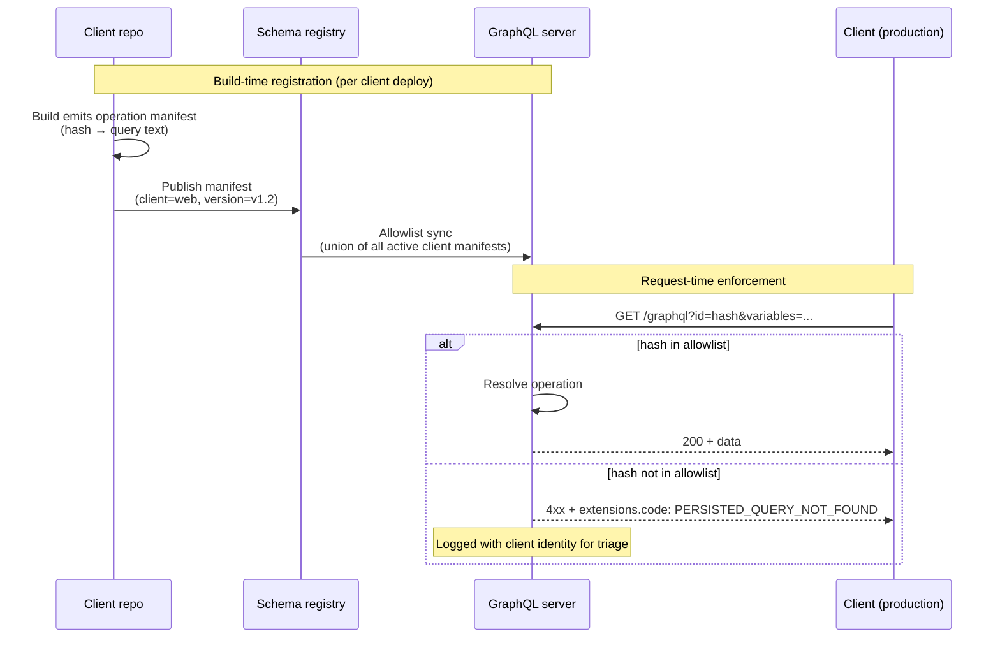
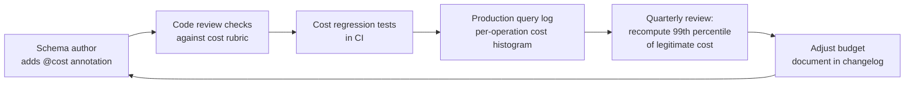
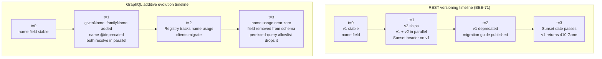

# [BEE-599] GraphQL 營運模式

:::info
決定 GraphQL 部署能否在生產環境存活的三個營運模式：把 persisted query 允許清單當成安全邊界、把 query complexity 治理當成組織紀律、用 additive schema 演進取代 REST 風格的版本控制。本系列共四篇文章，這是探討 GraphQL HTTP 生態缺口的最後一篇。
:::

## 背景

本系列至此已涵蓋三組缺口。[BEE-4010](graphql-http-caching.md) 建立了快取機制。[BEE-4011](graphql-vs-rest-request-side-http-trade-offs.md) 與 [BEE-4012](graphql-vs-rest-response-side-http-trade-offs.md) 走訪了六個請求端與回應端維度，REST 從 HTTP 繼承基礎設施而 GraphQL 必須自己重建。每一篇都把營運主題往前指向本文。

三個營運模式收尾本系列：

1. **Persisted query 允許清單**作為安全與 DoS 邊界。[BEE-4010](graphql-http-caching.md) 把 persisted query 當成一個*快取*機制：URL 可定址的 GET 端點讓 CDN 可以儲存。同樣的機制在更嚴格的註冊紀律下變成安全機制：伺服器拒絕任何 hash 不在允許清單中的 query，消除了客戶端送出任意昂貴 query 的攻擊面。[BEE-4011](graphql-vs-rest-request-side-http-trade-offs.md) 標記這個議題為前向引用；本文交付。

2. **Query complexity 治理。** [BEE-4011](graphql-vs-rest-request-side-http-trade-offs.md) 介紹了複雜度防禦的三層（深度限制、複雜度評分、per-resolver 限制）。被延後的是*組織*層：誰挑預算、schema 變動時如何審查、跨團隊 cost 標注如何保持一致、生產環境的預算違規如何分流處理。技術層不是難的部分；治理才是。

3. **Additive schema 演進。** GraphQL 的設計前提是 schema 永遠演進、不需要版本號。這與 [BEE-4002](api-versioning-strategies.md) 涵蓋的 REST 版本控制策略截然不同。對比值得深入處理：讓 additive 演進可行的規則（永不移除、移除前必先 deprecate、可空性不變式）、`@deprecated` 指令、federation 合約作為消費者區隔的 schema 變體、以及不可避免的 breaking change 何時抵達。

本文是這個 repo 中 GraphQL 營運紀律的收尾參考。本文之後的章節超出四篇系列的範圍。

## 原則

在生產環境跑 GraphQL 的團隊**必須（MUST）**在 schema 與 resolver 層之外建立三個營運紀律。Persisted query 允許清單在 build-time-registration 模式下（Apollo 的 `safelist: true`、GraphQL Yoga 與其他伺服器中的對應設定）**應該（SHOULD）**成為任何受團隊掌控的客戶端介面的預設值；round-trip auto-register 流程**禁止（MUST NOT）**被當成安全機制。Query complexity 預算**必須（MUST）**透過測量既有 query catalog 來設定、在 schema 變動時審查、在 gateway 強制執行並有書面例外流程。Schema 演進**應該（SHOULD）**為 additive：欄位**必須（MUST）**先用 [`@deprecated`](https://spec.graphql.org/October2021/#sec--deprecated) 指令標記再移除、**必須（MUST）**在 deprecation 期間繼續解析、**應該（SHOULD）**只在客戶端對替代欄位的採用率可量測之後才移除。

## 把 Persisted Query 允許清單當成安全邊界

**模式陳述。** 維護一份 build-time 允許清單，列出客戶端介面被允許送出的每一個 GraphQL operation。伺服器拒絕任何 SHA-256 hash 不在允許清單中的 operation。機制與 [BEE-4010](graphql-http-caching.md) 的 persisted query 相同；差別在註冊紀律。只接受在 build 或 deploy 時註冊的 operation，runtime 的 auto-register round-trip 關閉。

**為什麼存在。** 兩種威脅同時被消除。

第一個是**任意 query DoS**。沒有允許清單時，[BEE-4011](graphql-vs-rest-request-side-http-trade-offs.md) 的速率限制各層（深度限制、複雜度評分）就是全部的防禦。夠執著的攻擊者會探測 cost 評分規則，找到剛好通過預算但消耗最大來源工作的 query。有允許清單時，伺服器只會解析客戶端團隊註冊過的 query，這些就是應用程式實際需要的 query。

第二個是**基於 schema introspection 的偵察**。GraphQL 的 introspection 讓任何呼叫者列舉整個 schema（`__schema`、`__type`）。結合任意 query 執行，攻擊者就能拿到系統的地圖。允許清單加上在生產環境關閉 introspection 把這個迴路關起來。[BEE-2016](../security-fundamentals/broken-object-level-authorization-bola.md) 涵蓋 BOLA，那是 per-object 層級的同一種分層防禦論點；允許清單在 operation 形狀層運作。

**實作深度。**

- **Build-time 註冊流程。** 客戶端 repo 在 build 時產生 hash → query 對應表。[GraphQL Code Generator 的 client-preset](https://the-guild.dev/graphql/codegen/plugins/presets/preset-client) 透過 `persistedDocuments: true` 設定直接支援，輸出一個 `persisted-documents.json` 把 hash 對應到 query 字串。Apollo Client 的 `@apollo/persisted-query-lists` 與 Relay 的 persisted query 支援都產生等效的 manifest。Manifest 在 deploy 之前上傳到 GraphQL 伺服器的允許清單儲存。
- **伺服器端強制執行（safelisting）。** [Apollo 的 persisted-queries safelisting 文件](https://www.apollographql.com/docs/graphos/platform/security/persisted-queries) 把安全模式稱為 `safelist: true`：router 拒絕任何沒有註冊到 Persisted Query List 的 operation。配套的 `log_unknown: true` 設定把每個被拒絕的 operation 寫入日誌，在 rollout 期間用來確認所有客戶端都送出已註冊的 hash。Rollout 穩定後，`log_unknown` 可以關閉以減少日誌噪音。GraphQL Yoga 的 persisted-operations plugin 提供等效設定。
- **CI/CD 整合。** 客戶端 build 與伺服器允許清單之間的 hash 不匹配必須讓 deploy 失敗，而不是 runtime 失敗。標準模式：客戶端在每個 PR build 上把 manifest 發布到 registry（GraphOS、WunderGraph Cosmo、Hive 或自架方案）；伺服器啟動時拉取近期客戶端 manifest 的聯集。
- **在生產環境關閉 auto-register。** Auto-register 模式（伺服器在第一次 miss 時註冊 query 的 round-trip 流程）是*快取*的便利功能，不是安全控制。它接受客戶端送來的任何 query。生產環境必須啟用 safelisting；auto-register 只適合開發環境。
- **多客戶端 manifest 聯集。** 多客戶端部署（web + mobile + partner）需要把所有客戶端 build 的 manifest 取聯集。伺服器允許清單是 `union(web@v1.2, mobile@v1.1, partner@v0.9)`。客戶端版本下線時，其 manifest 條目可以裁剪。
- **在生產環境關閉 introspection。** [Apollo Server 的 `introspection` 設定選項](https://www.apollographql.com/docs/apollo-server/api/apollo-server) 在 `NODE_ENV=production` 時自動預設為 `false`，這就是正確的行為；本文層級的建議是在生產部署中*驗證* introspection 已關閉，而不是直接假設。graphql-armor 的 introspection-disable plugin 與其他伺服器的對應選項涵蓋非 Apollo 的部署。



**生產經驗。**

- **第一場事故是未註冊的 query。** 某個客戶端團隊在 hot fix 中加了新 query，忘了發布 manifest。生產環境拒絕它。這是系統正常運作，但修復路徑必須快速：一條指令上傳 manifest，而不是完整的 deploy 週期。
- **例外流程很重要。** 內部管理工具、ad-hoc 資料匯出、執行診斷 query 的支援工程師，全都需要繞過允許清單。模式：另外一個經過認證的端點（`/graphql/admin`）讓有 admin 角色的使用者可以送出任意 query，並做 scope-logged。
- **Manifest 規模由客戶端多樣性決定，與使用者數量無關。** 每個客戶端 build 增加 N 個 persisted query（該客戶端的 operation）。允許清單的大小隨 `clients × operations_per_client` 成長，與流量無關。典型 web app 有 50–200 個 operation；mobile 加上類似的另一組；允許清單仍在記憶體可承受範圍內。
- **與可觀測性的接合。** 拒絕回應必須以 operation hash 與客戶端版本記錄日誌；這是除錯「我重構之後 query 不通了」的軌跡。[BEE-4012](graphql-vs-rest-response-side-http-trade-offs.md) 的 `extensions.code` 在拒絕時應該攜帶 `PERSISTED_QUERY_NOT_FOUND`。

## Query Complexity 治理

**模式陳述。** 把 query complexity 視為組織紀律，不是伺服器設定。技術防禦（[BEE-4011](graphql-vs-rest-request-side-http-trade-offs.md) 第二層：schema 指令的 cost 標注、parser-time 評分、per-IP cost 預算強制執行）只在 cost 標注符合真實 resolver 工作量、預算反映已測量的合法流量、且政策在 schema 或客戶端介面變動時被審查時才有效。

**為什麼存在。** 把複雜度當成一次性設定處理時，三種失敗模式會出現：

- **Cost 標注與真實 resolver 工作量脫節。** 某個 schema 欄位首次寫入時標注 `@cost(complexity: 1)`；六個月後它的 resolver fan-out 到一個慢的下游，真實成本變成 100。Cost 評分層抓不到這件事。該層評分依據是標注；resolver 的實際工作量它看不到。
- **預算設定一次後就不再測量。** 合法 query 成本的第 99 百分位數會隨 schema 與客戶端行為演進而漂移。在 deploy-1 設定的預算到了 month-12 會放行該被拒絕的 query，或拒絕該放行的 query。
- **沒有給合法昂貴 query 的例外流程。** 內部儀表板、batch 報表、admin 工具，全都可能合理地超過 per-IP 預算。沒有書面例外流程的話，團隊要嘛選擇性壓制速率限制器（默默削弱所有人的保護），要嘛擋掉合法工作。

**實作深度。**

- **Cost 標注審查清單。** 當 schema PR 增加或修改帶 `@cost` 的欄位時，審查者必須檢查：標注與真實 resolver 複雜度相符嗎？`multipliers` 對於回傳 list 的欄位設定正確嗎？這個成本與相鄰欄位在同一個尺度上嗎？維護一份活的 cost rubric（已知成本範圍：`db.findById = 1`、`db.search = 5`、`external API call = 20`、`ML inference = 100`）。
- **預算調校為季度活動。** 每季（或在 schema/客戶端的大版本發佈後），對最近 N 天的生產 query log 重跑 cost 分析器。重新計算每個 user/IP 的合法 cost-per-window 第 99 百分位數。調整預算。在 changelog 中記錄變更，讓 on-call 工程師知道閾值為何移動。
- **Per-actor 預算分級。** 單一全域預算很少能適合所有客戶端。標準模式是預算分級：匿名 IP 拿到每分鐘 1,000 cost units；認證使用者拿到 10,000；service account 拿到 100,000；admin token 不限。分級在 cost 評估之前由 gateway 選擇。
- **例外流程。** 內部團隊需要高成本 query 時（cron-job 報表、admin 儀表板刷新），請求走書面路徑：開單列出 query、預期頻率、會觸發的 resolver 工作；經核准後，該 query 註冊為帶有預算豁免標籤的 persisted query；gateway 認得這個標籤就跳過 cost 限制。
- **Cost 預算違規以告警呈現，不是默默拒絕。** 因合法使用者打到預算而回傳的 `429` 應該在團隊監控頻道產生 warning 等級的告警；同一個 operation 的 429 持續模式表示預算太緊或該 operation 真的太貴。[BEE-4012](graphql-vs-rest-response-side-http-trade-offs.md) 的可觀測性層（operation name 標注）是讓這種分流可能的關鍵。



**生產經驗。**

- **Cost rubric 是文件，不是指令本身。** Schema 作者從相鄰欄位複製 `@cost(complexity: 5)`，沒想過 5 是不是對的數字。一份書面 cost rubric（「資料庫單筆讀取 = 1；資料庫掃描 = 5；外部 HTTP 呼叫 = 20；ML 推論 = 100」）給審查者一個比較基線。沒有它的話，成本會收斂到最近一個作者的猜測。
- **CI 中的 cost 回歸測試。** 加一個測試：對當前 schema 解析有代表性的生產 query、加總成本、斷言每個 query 都低於閾值。讓某個 query 成本變三倍的 schema 變動會在 CI 浮現，而不是以 429 風暴在生產出現。
- **預算分級邊界就是 auth 邊界。** 該套用哪個預算取決於身份，身份取決於 auth 層（[BEE-4012](graphql-vs-rest-response-side-http-trade-offs.md) 的授權粒度討論）。未認證使用者沒辦法拿到 per-user 預算；只能拿到 per-IP 預算。這把速率限制器與 auth 層耦合；先把限制器做出來、之後才接 auth 整合的團隊，最後會得到兩個對身份說法不一致的系統。
- **GitHub 的公開模型作為實際範例。** [GitHub 的 GraphQL API](https://docs.github.com/en/graphql/overview/rate-limits-and-query-limits-for-the-graphql-api) 公開其成本公式與每小時 5,000 點的預算。能公開出來這件事本身就是這套紀律成熟的標誌：規則穩定到可以記錄文件、預算大到能容納合法範圍、公式簡單到可以推理。

## Additive Schema 演進

**模式陳述。** GraphQL schema 永遠演進。欄位可以自由新增，被取代時 deprecate，等到客戶端對替代欄位的採用率可量測之後才移除。Schema 不帶版本號；客戶端選擇的欄位帶有隱含的版本。這是 [BEE-4002](api-versioning-strategies.md) REST 版本控制策略的 GraphQL 替代方案，對比是重點：REST 版本控制是處理 breaking change 的安全導航；GraphQL 版本控制是先讓 breaking change 不發生。

**為什麼存在。** GraphQL 的三個性質讓 additive 演進成為自然的模型：

1. **客戶端選擇消費什麼。** REST 端點回傳固定形狀；新增欄位改變每個客戶端的 payload。GraphQL 欄位對沒選它的客戶端是隱形的。新增欄位定義上就是非破壞性的。
2. **伺服器強制執行 schema；客戶端用 query 強制執行對 schema 的引用。** 移除沒有客戶端選的欄位是非破壞性的。Schema registry 可以透過檢查每個現役客戶端的 operation manifest 來回答「這個移除安全嗎？」。
3. **Federation 讓每個團隊獨立演進。** 一個 subgraph 可以在不與 gateway 團隊或其他 subgraph 協調的情況下，為 federated 型別新增欄位（[BEE-4008](graphql-federation.md) 涵蓋 federation 機制）。

與 REST 的對比：BEE-71 記錄四種版本控制策略（URL 路徑、自訂 header、query 參數、內容協商）以及 Stripe 的日期版本模型。它們都是*管理* breaking change 的機制，給消費者一個過渡期間的穩定介面。GraphQL 翻轉問題：與其管理 breaking change，不如把它們設計掉。代價是紀律（只能 additive、移除前必先 deprecate）與基礎設施（schema registry、operation manifest）。好處是沒有面向消費者的版本協商、沒有 `Sunset` header、沒有 `/v1/` 與 `/v2/` 並行運作。[GraphQL Foundation 的最佳實踐指引](https://graphql.org/learn/best-practices/) 明確採取這個立場。

這在類別上不同。它不是「REST 版本控制的更好版本」；它是同一個底層問題（API 安全演進）的不同解法類別。

**實作深度。**

Additive 演進規則：

| 變更 | 狀態 | 機制 |
|---|---|---|
| 新增欄位 | 非破壞性 | 直接新增 |
| 新增 enum 值 | 偏破壞性 | 客戶端用 exhaustive switch 會壞；對強型別客戶端視為破壞性 |
| 新增 optional 引數 | 非破壞性 | resolver 中放預設值 |
| 新增 required 引數 | 破壞性 | 永遠是；與 REST required-field 新增的問題相同 |
| 移除欄位 | 破壞性 | 走 deprecation 週期（下方） |
| 重命名欄位 | 破壞性 | 新增新欄位、deprecate 舊的、依週期移除 |
| 變更欄位型別 | 破壞性 | 新增帶新型別的新欄位、deprecate 舊的 |
| 變更可空性 `T!` → `T` | wire 上非破壞性 | 強型別客戶端對 non-null 的假設可能 NPE；對它們視為破壞性 |
| 變更可空性 `T` → `T!` | 破壞性 | 伺服器現在拒絕回傳 null；partial-success 行為變動 |

`T!` ↔ `T` 規則最微妙。Wire format 對加上 nullability（`T!` → `T`）不變；客戶端拿到一個值仍然拿到一個值。但強型別客戶端（TypeScript、Kotlin、Swift）產生的程式碼假設 non-null，當 null 抵達時會在 runtime 壞掉。對任何有 type generation 的消費者，把 nullability 變更視為破壞性。

**`@deprecated` 指令。** [GraphQL 規範](https://spec.graphql.org/October2021/#sec--deprecated) 中定義，`@deprecated` 適用於 field definition 與 enum value，接受一個 `reason: String` 引數（預設 `"No longer supported"`），並透過 `__Field` 與 `__EnumValue` 上的 `isDeprecated: Boolean!` 與 `deprecationReason: String` 在 introspection 中顯示。

```graphql
type User {
  id: ID!
  name: String! @deprecated(reason: "Use `givenName` and `familyName` instead. Removal scheduled for 2026-12-31.")
  givenName: String!
  familyName: String!
}
```

Schema 瀏覽器（Apollo Studio、GraphiQL、Insomnia）以紅色顯示 deprecated 欄位。Codegen 工具在使用時發出 deprecation 警告。

**Deprecation 政策。**

- `reason` 欄位**必須（MUST）**列出替代欄位與計畫中的移除日期。
- Deprecation 期間**必須（MUST）**涵蓋更新最慢的客戶端。對發佈週期月度、採用尾巴 90 天的 mobile app，期間至少 6 個月。
- Schema registry **必須（MUST）**追蹤哪些客戶端仍選 deprecated 欄位。只有在使用率降到閾值以下（通常 1% 的 operation）才進行移除。
- 對 federated graph，deprecation 住在擁有該欄位的 subgraph；router 把它呈現給所有消費者。

**Federation 合約作為消費者區隔。** Federation 合約（[Apollo GraphOS Contracts Overview](https://www.apollographql.com/docs/graphos/platform/schema-management/delivery/contracts/overview)）讓單一 supergraph 為多個消費者投影出不同的 schema 變體。合約透過 `@tag` 指令過濾 supergraph（`@tag(name: "mobile")`、`@tag(name: "partner")`），產生只包含為該消費者標籤的欄位的 schema 變體。

```graphql
type User {
  id: ID! @tag(name: "mobile") @tag(name: "partner")
  name: String! @tag(name: "mobile") @tag(name: "partner")
  internalAuditNotes: String @tag(name: "internal")  # not in mobile or partner schemas
}
```

Mobile 合約只發出含 `id` 與 `name` 的 schema；partner 合約類似；internal 合約包含 `internalAuditNotes`。每個消費者看到適合它的 schema 變體。每個合約變體在 GraphOS Studio 中有自己的 README、schema reference、Explorer。對大型多受眾 API 而言，合約是 URL 路徑版本控制的替代方案。不再有 `/v1/` 與 `/v2/`，而是同一個 supergraph 的不同變體服務於同一個底層 graph 的不同 schema 視圖。

**不可避免 breaking change 的逃生口。** 有時 additive 演進不可能。安全因素強迫移除暴露敏感資料的欄位；法規變動需要型別變更。逃生口與 REST 用的相同，差別在套用粒度從 per-API 變成 per-operation：

- 在 registry 上把 operation 標為 deprecated。
- 透過 deprecation 通道（changelog、儀表板、email）通知客戶端。
- Deprecation 期間之後，persisted query 允許清單把該 operation 移除，伺服器以 `OPERATION_DEPRECATED` 拒絕。

這之所以行得通，是因為 persisted query 允許清單給伺服器精確的「哪些 operation 還在飛」的知識。REST 的 URL pattern 版本控制較粗；持有 persisted query 知識的 GraphQL deprecation 可以做到 per-operation。



**生產經驗。**

- **沒有 registry 的 `@deprecated` 是表演。** Deprecate 一個欄位只給 schema 瀏覽器一個警告。如果沒有系統追蹤誰還在用該欄位，移除就變成猜謎。建立（或購買）一個 schema registry，記錄每個 operation hash、它選的欄位、註冊它的客戶端。Apollo Studio、GraphOS、[WunderGraph Cosmo](https://cosmo-docs.wundergraph.com/cli/subgraph/check) 與自架方案如 Hive 全都做這件事。Registry 不是可選的基礎設施；它是 REST `Sunset` header 的反面。Sunset header 告訴客戶端「這個版本要走了」；registry 回答你「誰還在用這個欄位？」。
- **CI 中的向後相容性測試。** 提出 schema 變更時，registry 對著提議的 schema 跑每個 persisted operation（或最近 N 天觀察到的每個 operation）。任何沒能 validate 的 operation 都是破壞性變更。每個 federation registry 都有這個工具：Apollo 的 [`rover subgraph check`](https://www.apollographql.com/docs/rover/commands/subgraphs) 檢查 composition + 近期客戶端 operation 影響、整合為 CI gate（`--background` flag 用於非同步檢查、GitHub PR 狀態整合）；WunderGraph Cosmo 的 `wgc subgraph check` 涵蓋同樣的範圍。把它當成 CI gate 用，不是事後諸葛。
- **Federation 合約取代 per-version 維護。** 在 REST 中跑多個消費者版本（`/v1/`、`/v2/`、`/v3/`）的團隊通常為每個版本維護平行的 codebase。Federation 合約讓一個 schema 投影所有變體。v1 mobile schema 是與 v2 web schema 同一個 supergraph 的標籤子集。代價是 tagging 上的前期紀律；好處是沒有平行 codebase。
- **Deprecation 的移除是難的部分，不是 deprecation 本身。** 加 `@deprecated` 容易，做得到。移除 deprecated 欄位才是紀律。它需要持續的使用率測量、追蹤低優先客戶端、願意打破長尾的落後者。沒有完成移除的組織承諾，schema 會累積死欄位，deprecation 指令會變成願望清單而不是合約。[Marc-André Giroux 的「How Should We Version GraphQL APIs?」](https://productionreadygraphql.com/blog/2019-11-06-how-should-we-version-graphql-apis/) 是對 deprecation-as-contract 紀律的詳盡實踐處理。
- **欄位重命名是最誘人的非 additive 變更。** 一個事後發現混亂的欄位名稱是持續的重命名誘惑。Additive 路徑（`add givenName`、`deprecate name`、等待、`remove name`）緩慢且讓人覺得官僚。為「就這一次」繞過這條路的團隊會養成下次也繞過的習慣。紀律是永不繞過；重命名永遠走 deprecation 週期。
- **與 BEE-71 的交叉連結。** 讀本節的 REST 團隊應該理解 GraphQL 的演進模型把版本控制議題從 URL 層級重新定位到欄位層級的 deprecation 追蹤。問題仍然是「我們什麼時候可以移除這個？」與「誰還在用它？」；機制不同。

## 常見錯誤

**1. 把 persisted query auto-register round-trip 當成安全機制。**

Auto-register 流程接受客戶端在第一個請求送來的任何 query，並把它持久化以供未來使用。這是快取的便利功能；它不限制伺服器解析哪些 query。生產環境必須啟用 safelisting（Apollo 的 `safelist: true`、GraphQL Yoga 的對應設定等），讓未註冊的 hash 被拒絕。這件事做錯的第一個訊號：安全稽核問「你怎麼防止任意 query？」答案是「我們有 persisted queries」而沒提到 safelisting。

**2. 關閉 introspection 卻沒啟用允許清單。**

常見的部分修復：生產拒絕 `__schema` introspection 但仍接受客戶端送來的任何 query。攻擊者沒辦法直接列舉 schema，但可以靠送出猜測的 query 來探測；auto-register 流程接受它們。兩個控制都必要；單獨任何一個都漏。[BEE-499（BOLA）](../Security Fundamentals/499.md) 是這個分層防禦論點的 per-object 對應。

**3. 把 query complexity 預算設定一次後就不再測量。**

在 deploy-1 設定的預算到了 month-12 會放行該被拒絕的 query。安排每季從生產 log 重新計算合法 cost-per-window 第 99 百分位數；在 changelog 記錄變更。預算不是常數；它是有半衰期的校正值。

**4. 加上 `@deprecated` 卻從不移除欄位。**

Deprecation 是容易的那一半。移除欄位才是紀律。它需要 registry 追蹤的使用率測量、追蹤低優先客戶端、願意打破長尾落後者。沒有完成移除的組織承諾，schema 會累積死欄位，deprecation 指令會變成願望清單而不是合約。

**5. 把欄位重命名當成「就這一次的小變更」、繞過 deprecation 週期。**

Additive 路徑（新增、deprecate 舊的、等待、移除舊的）讓人覺得官僚；繞過一次會養成下次也繞過的習慣。重命名永遠走 deprecation 週期。紀律的代價每次重命名付一次；繞過的代價會以默默的客戶端壞掉持續累積。

## 相關 BEP

**Persisted query 允許清單叢集：**

- [BEE-4010](graphql-http-caching.md) GraphQL 的 HTTP 層快取 — 把 persisted query 介紹為快取機制；本文用同一個基本元件作為安全機制
- [BEE-4011](graphql-vs-rest-request-side-http-trade-offs.md) GraphQL vs REST：請求端的 HTTP 取捨 — 第一/二/三層速率限制；對受控客戶端 API 而言，允許清單可以取代第一與第二層
- [BEE-4012](graphql-vs-rest-response-side-http-trade-offs.md) GraphQL vs REST：回應端的 HTTP 取捨 — `extensions.code` 慣例；`PERSISTED_QUERY_NOT_FOUND` 遵循該模式
- [BEE-2016](../security-fundamentals/broken-object-level-authorization-bola.md) Broken Object Level Authorization (BOLA) — 相鄰的分層防禦論點
- [BEE-2008](../security-fundamentals/owasp-api-security-top-10.md) OWASP API Security Top 10 — API 層威脅的脈絡

**Query complexity 治理叢集：**

- [BEE-4011](graphql-vs-rest-request-side-http-trade-offs.md) GraphQL vs REST：請求端的 HTTP 取捨 — 第二層 schema 指令 cost 標注與 parser-time 評分；本文以組織層擴充
- [BEE-12007](../resilience/rate-limiting-and-throttling.md) 速率限制與節流 — 預算強制執行底層的 token bucket 與 sliding window 演算法
- [BEE-19030](../distributed-systems/distributed-rate-limiting-algorithms.md) 分散式速率限制演算法 — 分散式預算強制執行議題

**Schema 演進叢集：**

- [BEE-4002](api-versioning-strategies.md) API 版本控制策略 — 本節明確對比的 REST 基線
- [BEE-4008](graphql-federation.md) GraphQL Federation — federation 合約作為消費者區隔的 schema 變體
- [BEE-7003](../data-modeling/schema-evolution-and-backward-compatibility.md) Schema 演進與向後相容性 — 適用於 GraphQL 的一般 schema 演進原則
- [BEE-4006](api-error-handling-and-problem-details.md) API 錯誤處理與 Problem Details — 錯誤合約演進紀律的引用

**系列收尾：**

- [BEE-4010](graphql-http-caching.md)、[BEE-4011](graphql-vs-rest-request-side-http-trade-offs.md)、[BEE-4012](graphql-vs-rest-response-side-http-trade-offs.md) — 本文收尾的本系列三篇姊妹文章

## 參考資料

- [GraphQL Specification (October 2021) — `@deprecated` directive](https://spec.graphql.org/October2021/#sec--deprecated) — 適用於 field definition 與 enum value；接受 `reason: String` 引數（預設 `"No longer supported"`）；透過 `isDeprecated` 與 `deprecationReason` 在 introspection 中顯示。
- [GraphQL over HTTP — Working Draft](https://github.com/graphql/graphql-over-http) — GraphQL Foundation Stage-2 草案；拒絕回應的狀態碼對應。
- [GraphQL — Best Practices (Versioning)](https://graphql.org/learn/best-practices/) — GraphQL Foundation 對 schema 版本控制的明確立場：透過 deprecation 持續演進，而非帶版本號的 API 介面。
- [Apollo Server — Automatic Persisted Queries](https://www.apollographql.com/docs/apollo-server/performance/apq) — APQ 協議細節：SHA-256 hash、GET URL 形狀、`PERSISTED_QUERY_NOT_FOUND` 註冊 round-trip。
- [Apollo GraphOS — Safelisting with Persisted Queries](https://www.apollographql.com/docs/graphos/platform/security/persisted-queries) — 生產 safelisting 模式（`safelist: true`）拒絕不在 Persisted Query List 中的 operation；`log_unknown: true` 用於 rollout 期間監控。
- [Apollo Server — `introspection` configuration](https://www.apollographql.com/docs/apollo-server/api/apollo-server) — 在 `NODE_ENV=production` 時預設為 `false`；建議驗證而非假設。
- [Apollo GraphOS — Contracts Overview](https://www.apollographql.com/docs/graphos/platform/schema-management/delivery/contracts/overview) — federation 合約透過 `@tag` 指令把 supergraph 過濾為消費者特定變體；每個變體有自己的 README、schema reference、Explorer。
- [Apollo Rover — `subgraph check`](https://www.apollographql.com/docs/rover/commands/subgraphs) — 破壞性變更檢測的 CI 命令；檢查 composition + 近期客戶端 operation 影響；整合 GitHub PR 狀態檢查。
- [WunderGraph Cosmo — `wgc subgraph check`](https://cosmo-docs.wundergraph.com/cli/subgraph/check) — federated subgraph 破壞性變更檢測的非 Apollo schema-registry 替代方案。
- [GraphQL Code Generator — Client Preset](https://the-guild.dev/graphql/codegen/plugins/presets/preset-client) — `persistedDocuments: true` 設定選項在 build 時產生 hash 對 query 字串的 `persisted-documents.json`。
- [graphql-armor (Escape Technologies)](https://github.com/Escape-Technologies/graphql-armor) — MIT 授權的多伺服器 middleware，包含 introspection 關閉、深度限制、複雜度評分、速率限制；涵蓋 Apollo Server、GraphQL Yoga、Envelop。
- [Apollo Server — Error Handling](https://www.apollographql.com/docs/apollo-server/data/errors) — 預設 `extensions.code` 集合，包含 `PERSISTED_QUERY_NOT_FOUND`。
- [GitHub Docs — Rate limits and query limits for the GraphQL API](https://docs.github.com/en/graphql/overview/rate-limits-and-query-limits-for-the-graphql-api) — 生產級參考：每使用者每小時 5,000 點、每分鐘 2,000 點次級限制、公開的成本計算公式。
- [Marc-André Giroux — How Should We Version GraphQL APIs?](https://productionreadygraphql.com/blog/2019-11-06-how-should-we-version-graphql-apis/) — GraphQL 版本控制、deprecation 政策、完成移除紀律的實踐者處理。
