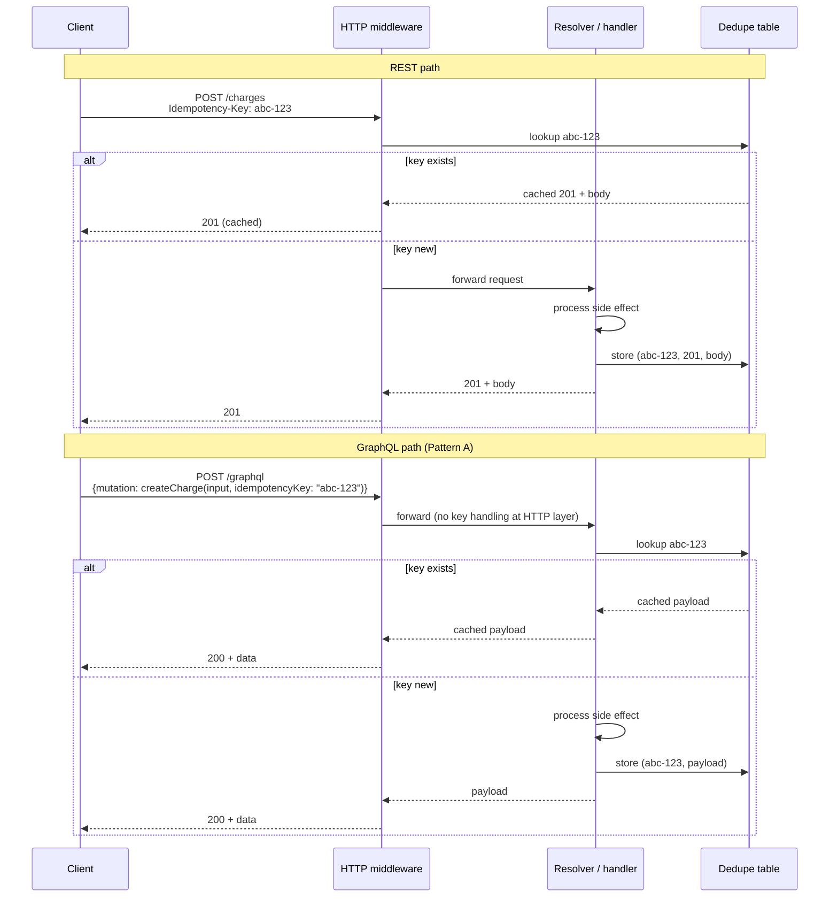
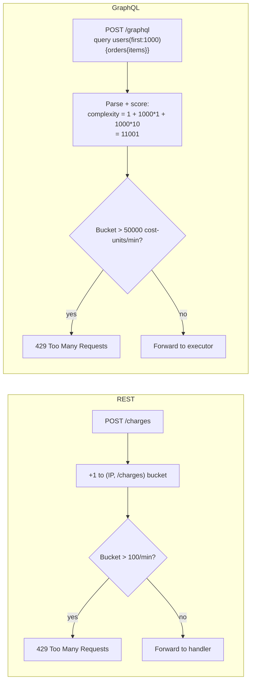

# [BEE-4011] GraphQL vs REST：請求端的 HTTP 取捨

:::info
REST 從 HTTP 本身繼承快取、冪等性、速率限制、版本控制載體四件事。GraphQL 預設一件也沒有，必須在 schema 層或 middleware 層自己重建。本文涵蓋四個請求端的缺口與預設緩解方案。
:::

## 背景

[BEE-4010](graphql-http-caching.md) 建立了基本框架：GraphQL 並非以 HTTP 為前提設計。它的標準傳輸方式是 `POST /graphql`，把操作放在請求主體，並且不論讀或寫哪個邏輯資源，都從同一個端點服務。這個設計換來 schema 驅動的彈性，卻犧牲了 REST 從 HTTP 本身免費取得的四樣東西。

1. **每個讀取都有可快取的 URL。** REST 的 GET URL 就是快取鍵，HTTP 中介伺服器無需任何應用程式碼就能快取回應。
2. **方法層級的冪等性語意。** [RFC 9110 §9.2.2](https://httpwg.org/specs/rfc9110.html#idempotent.methods) 定義 GET、HEAD、OPTIONS、PUT、DELETE 為冪等方法。客戶端與代理只看動詞就能判斷重試是否安全，無需檢視請求主體。
3. **每個路由的速率限制。** Gateway 以 IP × URL pattern 為單位限流，URL 是天然的速率限制鍵，且每個請求的成本在同一路由內大致一致。
4. **可透過 URL 定址的版本載體。** REST 的 URL 路徑、自訂 header、`Accept` media-type 參數全都是 HTTP 中介伺服器能觸及的位置。Gateway 可以把 `/v1/*` 路由到一組部署、`/v2/*` 到另一組；CDN 可以用 `Accept: application/vnd.api.v2+json` 作為快取鍵；速率限制器可以對不同版本套用不同的預算。四種策略的完整處理請見 [BEE-4002](api-versioning-strategies.md)。

`POST /graphql` 對任何 HTTP 中介伺服器在這四個維度上都是不透明的。動詞無法告訴你是否有副作用（這是 query 還是 mutation？）；URL 對每個操作都相同，所以每路由速率限制完全失效；可快取性的故事則需要 BEE-4010 涵蓋的 persisted query 工作；而版本訊號即便存在，也會埋在 JSON 請求主體裡，Gateway 無從據以路由。

本文走訪每個請求端缺口，說明各團隊實際的緩解作法，並對每個缺口給出預設建議。它不是廠商比較，也不是「REST 比較好」的論述。它列舉的是 GraphQL 必須重建的東西，以及重建工作的工程樣貌。

## 原則

採用 GraphQL 的團隊**必須（MUST）**把冪等性、速率限制、可快取性與 schema 演進當成 schema 層級或 middleware 層級的議題；HTTP 沒辦法替你完成這些工作。Mutation **應該（SHOULD）**以 schema 參數或 middleware 讀取的 header 攜帶冪等識別碼。速率限制**應該（SHOULD）**以與操作成本相符的單位表達（query complexity 點數，不是請求次數）。需要 CDN 快取的讀取**應該（SHOULD）**遵循 [BEE-4010](graphql-http-caching.md) 中的 persisted query 模式。Schema 演進**應該（SHOULD）**採用加性變更並以 `@deprecated` 處理退役；當消費方規模超出協調式 deprecation 能承載的範圍時，日曆式 schema 切版（[BEE-4002](api-versioning-strategies.md)）是釋壓閥。把這些當成傳輸層議題而非應用層議題的部署，會通過程式碼審查、在負載下崩潰。

## 四個缺口的鳥瞰

本文後續章節展開下表的每一列。每節的內部結構相同：REST 基線、GraphQL 缺口、緩解模式、建議。

| 議題 | REST 從 HTTP 繼承 | GraphQL 必須自己建構 |
|---|---|---|
| **可快取的 URL** | GET URL 就是快取鍵；ETag/304 在邊緣免費取得 | Persisted query GET + `@cacheControl` + ETag（BEE-4010） |
| **冪等性** | RFC 9110 動詞 + `Idempotency-Key` header | 冪等鍵作為 schema 參數，或由 middleware 讀取 header |
| **速率限制** | Gateway 上的 IP × URL pattern | Query 深度限制 + 複雜度評分 + 個別 resolver 限制 |
| **版本控制載體** | URL 路徑 / header / `Accept`（BEE-4002） | 加性 schema 演進 + `@deprecated` + 選擇性的日曆式 schema 切版 |

## 讀取的可快取性

本節刻意保持簡短。GraphQL HTTP 層快取的完整處理在 [BEE-4010](graphql-http-caching.md)；本節的目的是把這個缺口種進讀者腦中，讓接下來兩節覺得結構相似。

**REST 基線。** GET URL 是天然的快取鍵，HTTP 中介伺服器免費快取，ETag 重新驗證開箱即用。

```http
GET /products/42 HTTP/1.1

HTTP/1.1 200 OK
Cache-Control: public, max-age=300
ETag: "v9-abc"

{"id": 42, "name": "Widget", "price": 4999}
```

CDN 以 URL 為鍵儲存回應，提供 300 秒，過期後在下次請求以 `If-None-Match` 重新驗證。應用程式碼每個回應發出一個 header，整個 HTTP 快取階層的好處就到手了。

**GraphQL 缺口。** 預設的 `POST /graphql` 讓每一個 CDN 失效。三個障礙同時生效：根據 [RFC 9111 §2](https://www.rfc-editor.org/rfc/rfc9111.html#name-overview-of-cache-operation)，POST 預設不可快取；快取鍵藏在 JSON 請求主體裡，CDN 讀不到；回應形狀因 query 而異。BEE-4010 對每個障礙有更深入的探討。

**緩解模式。** 透過 persisted query 恢復 URL 可定址性：客戶端對正規化的 query 文字計算 SHA-256，送出 `GET /graphql?extensions=...&variables=...`。請求一旦變成 GET，schema 層級的快取提示（Apollo Server、GraphQL Yoga 等服務器都有的 `@cacheControl` 指令）就會驅動 `Cache-Control` header，ETag 也能進行條件式重新驗證。完整機制（包含 query 形狀帶來的快取碎片化代價）在 BEE-4010。

另一條路是接受讀取會打到來源、跳過 CDN 整合。對流量低的 API 這是合理選擇，工程成本不會在節省的往返中回本。

**建議。** 任何規模化提供的讀取都預設用 persisted query GET（規模化的定義：讀取流量高到 CDN 即使只有 30–40% 命中率也能明顯減少來源負載）。低流量讀取可以接受 POST，把工程精力放在別處。沒有測量每個 query 的 CDN 命中率之前，不要宣稱「我們有快取」。配置很容易出錯，失敗模式在沒有 instrumentation 的情況下完全看不到。

## 冪等性與重試語意

本節最深。[BEE-4003](api-idempotency.md) 涵蓋 REST 的標準模式，但沒有處理 GraphQL。

**REST 基線。** [RFC 9110 §9.2.2](https://httpwg.org/specs/rfc9110.html#idempotent.methods) 定義 GET、HEAD、OPTIONS、PUT、DELETE 在方法定義上即為冪等。POST 與 PATCH 不是。對非冪等操作，[Stripe 推廣的 `Idempotency-Key` header](https://docs.stripe.com/api/idempotent_requests) 讓客戶端為每個操作附上 UUID v4；伺服器以該鍵儲存結果 24–72 小時，重試時回傳已儲存的回應。儲存層的細節在 BEE-4003：以 `(user_id, key)` 為主鍵的表，搭配原子插入處理併發重複。

IETF httpapi 工作小組正在標準化此 header field 為 [`draft-ietf-httpapi-idempotency-key-header`](https://datatracker.ietf.org/doc/draft-ietf-httpapi-idempotency-key-header/)，最近版本是 2025 年 10 月的 -07。目前該草案已過期，未進入 RFC 階段，所以這個欄位仍是事實上的慣例而非正式標準，雖然工程模式本身已相當成熟。

關鍵特性：REST 中，這個 header 在許多框架裡對應用程式碼是隱形的。Middleware 讀取 `Idempotency-Key`、查詢去重表，要嘛以快取回應短路、要嘛轉給 handler。應用程式作者不需要為每個端點設計冪等性。

**GraphQL 缺口。** 四個事實塑造了這個缺口：

1. GraphQL 規範說 query SHOULD 沒有副作用。這是慣例，不是強制；schema 作者可以寫有副作用的 query resolver，規範不會阻止。
2. Mutation 可能有副作用。規範對冪等性、重試語意、去重保持沉默。
3. 同一個請求中的多個 mutation 依規範**循序**執行，但這只在單一請求**內**提供部分原子性，跨請求或重試之間沒有任何保證。
4. HTTP `Idempotency-Key` header 在大多數伺服器函式庫中對 GraphQL resolver 是隱形的，除非團隊明確接上 middleware 讀取。

結果：每個採用 GraphQL 的團隊都必須自己工程化冪等性。沒有規範層級或框架層級的預設，且 IETF 草案的 header field 在沒有伺服器端明確接線的情況下幫不上忙。

**模式 A：冪等鍵作為 mutation 參數。** 主流作法。Mutation 的簽名直接宣告該鍵：

```graphql
mutation CreateOrder($input: OrderInput!, $idempotencyKey: ID!) {
  createOrder(input: $input, idempotencyKey: $idempotencyKey) {
    id
    status
  }
}
```

Resolver 以 `idempotencyKey` 查詢儲存中的去重表。命中時，回傳已儲存的 payload，不重新執行副作用。未命中時，執行 mutation、儲存結果、回傳。儲存層與 BEE-4003 為 REST 指定的相同。

優點：合約在 schema 顯式宣告，introspection 可見，每個消費者都看到要求，且模式適用任何傳輸方式包含 WebSocket subscription。缺點：每個 mutation 從第一天就得帶這個參數。改造既有的 GraphQL API 侵入性很強，因為每個客戶端與每個 mutation 簽名都要改。

**模式 B：HTTP `Idempotency-Key` header 由 middleware 讀取。** 鏡像 REST 模式的次要作法。客戶端在 GraphQL 請求的 HTTP header 中送出鍵：

```http
POST /graphql HTTP/1.1
Idempotency-Key: 550e8400-e29b-41d4-a716-446655440000
Content-Type: application/json

{"query":"mutation { createOrder(input: {...}) { id } }"}
```

伺服器 middleware 在呼叫 executor 之前讀取 header；未命中時執行操作並寫入 BEE-4003 的去重表，命中時回傳已儲存的 HTTP 回應、不呼叫 resolver。

優點：心智模型與 REST 一致，schema 不需修改，同時跑 REST 與 GraphQL 的團隊可以用一套 middleware 涵蓋兩個介面。缺點：合約對 schema 隱形（讀 SDL 的開發者沒有任何訊號顯示冪等性已接好），模式只在 HTTP-fronted 的場景生效（不適用於 WebSocket subscription 或 Server-Sent Events），且去重粒度是「每個請求」而非「每個 mutation」。一個 GraphQL 請求攜帶多個循序 mutation 時，所有 mutation 共用一把鑰匙，這會默默打破內部 mutation 的重試合約。



**建議。** 任何會產生非冪等副作用的 mutation 都預設用模式 A（schema 參數）。schema 顯式合約在程式碼審查與新人上手時可以收回成本。模式 B 留給改造情境，例如既有大型 GraphQL 介面要從「沒有冪等性」遷移到「有冪等性」而又不能破壞客戶端。無論哪種，重用 BEE-4003 的去重表，不要為 GraphQL 冪等性發明新的儲存層。多 mutation 請求需要每個 mutation 一把鑰匙（模式 A 自然處理），而非整個請求一把鑰匙（模式 B 的失敗模式）。

## 速率限制

這個維度是 GraphQL 缺口最常引發生產事故的地方。

**REST 基線。** Gateway 以 IP × URL pattern 為單位限流，超出預算時回傳 `429 Too Many Requests` 加 `Retry-After` header。每個請求的成本在同一路由內大致一致（`GET /products/:id` 每次做的工作量差不多），所以「每分鐘每 IP 100 個請求」對應到可預測的來源負載信封。單位（每段時間的請求數）與每單位的成本（一個路由的工作量）對齊。

**GraphQL 缺口。** 每個請求都是 `POST /graphql`，所以每路由限流崩潰為「每分鐘每 IP 多少請求」、再無更細的粒度。每 IP 100 個請求/分鐘的限制保護不了來源，因為一個昂貴的 query 能做數千個請求的工作。最壞情況的 query：

```graphql
query {
  users(first: 1000) {
    orders(first: 100) {
      items(first: 50) {
        product {
          reviews(first: 100) {
            author {
              followers(first: 100) { name }
            }
          }
        }
      }
    }
  }
}
```

一個 HTTP 請求，潛在數十億次 resolver 呼叫。請求計數型的速率限制器說「沒事，你才用了 100 中的 1」，資料庫直接倒下。

**第一層：Query 深度限制。** 在解析時拒絕深度超過 N 的 query。便宜、粗暴、能擋住明顯的濫用，上面的範例深度是 7。預設值 10–15 涵蓋大多數合法的 schema。多數伺服器函式庫都有 plugin：Apollo Server、透過 Envelop 的 GraphQL Yoga，以及包裝多個伺服器的獨立函式庫 [graphql-armor](https://github.com/Escape-Technologies/graphql-armor)。

**第二層：Query 複雜度評分。** 承擔負荷的一層。每個欄位標注成本，parser 加總整個 query 的成本，超出預算就拒絕。這個指令模式由 IBM 的 GraphQL Cost Directive specification 推廣，並由 Apollo 的 [Demand Control](https://www.apollographql.com/docs/graphos/routing/security/demand-control) 功能採用，長這樣：

```graphql
type Query {
  users(first: Int!): [User!]! @cost(complexity: 1, multipliers: ["first"])
  product(id: ID!): Product @cost(complexity: 5)
}

type User {
  orders(first: Int!): [Order!]! @cost(complexity: 1, multipliers: ["first"])
}
```

`users(first: 1000) { orders(first: 100) { items } }` 這個 query 評分會落在數百萬，會被拒絕。把這想成 GraphQL 版的「每分鐘每 IP 多少請求」：單位是**每分鐘每 IP 多少成本單位**，不是請求數。

這個模式在大規模生產環境已驗證。[GitHub 公開 GraphQL API](https://docs.github.com/en/graphql/overview/rate-limits-and-query-limits-for-the-graphql-api) 限制每個使用者每小時 5,000 點，並設次級限制每分鐘 2,000 點。其成本公式加總每個 unique connection 所需的請求數（假設 `first` 與 `last` 引數都打到上限），除以 100，四捨五入到最接近的整數，每個 query 至少 1 點。其文件中真實 query 的得分是 51 點。



關鍵實作要點：預算要靠**測量既有 query catalog 的成本分佈**來定，不是用猜的。對生產環境的 query log 跑成本分析器，把每段時間的預算設在合法 query 成本第 99 百分位數加上安全餘裕，並隨 catalog 演進調整。

函式庫選項已成熟。Apollo 的 Demand Control 涵蓋 Apollo Server 與 Apollo Router。graphql-armor 提供跨 Apollo Server、GraphQL Yoga 與 Envelop-based 伺服器的 query-cost、depth、rate-limit plugin。Envelop 生態系提供 `useResourceLimitations` 做成本分析，獨立於任何特定的伺服器函式庫之外。

**第三層：Per-resolver 速率限制。** 特定昂貴欄位（搜尋、ML 推論、任何呼叫外部 API 的）獨立於整體 query 成本之外有自己的限制。後端用與 REST 速率限制相同的 Redis token bucket，鍵以 `(user, field)` 取代 `(user, route)`。這層是針對成本模型可能低估的已知昂貴操作的精準刀。

**建議。** 三層疊加。深度限制便宜地擋下意外循環（預設 10–15）。複雜度評分是承重層，預算靠測量決定。Per-resolver 限制處理成本模型涵蓋不到的欄位。每 IP 請求速率限制仍是有用的外層信封，但取代不了上述任何一層。Persisted query 允許清單（留待未來討論營運模式的文章）能限制最壞情況，但只在客戶端介面完全在你掌控時可行。對接受任意客戶端 query 的公開 API，第一到三層是必要的；對客戶端集合已知的內部 API，persisted query 允許清單可以取代第一與第二層，只留第三層處理已知昂貴欄位。

## 版本控制與 schema 演進

這是第四個缺口：HTTP 中介伺服器能據以路由、快取、限流的版本訊號。版本控制策略的完整處理在 [BEE-4002](api-versioning-strategies.md)；本節的目的是把缺口種進讀者腦中，並指向緩解方案。

**REST 基線。** 四種策略中的任何一種（URL 路徑、自訂 header、查詢參數、`Accept` media type）都讓版本對 HTTP 中介伺服器可見。Gateway 可以把 `/v1/*` 與 `/v2/*` 路由到不同部署；CDN 可以按版本快取而不衝突；速率限制器可以對不同版本套用不同預算。Deprecation 也在 HTTP 上行走，透過 [RFC 8594](https://www.rfc-editor.org/rfc/rfc8594) 定義的 `Sunset` 與 `Deprecation` 回應 header。每一個版本載體都是 URL 或 header 欄位，對每個會講 HTTP 的工具可見。

**GraphQL 缺口。** `POST /graphql` 把所有版本的所有操作壓成同一個 URL。GraphQL Foundation 的官方立場是直接回避 URL 版本控制：*"GraphQL takes a strong opinion on avoiding versioning by providing the tools for the continuous evolution of a GraphQL schema."* ([GraphQL — Schema Design](https://graphql.org/learn/schema-design/))。這把演進從傳輸層搬到 schema 層，在消費方規模超出加性演進能承載的範圍以前，這套機制都夠用。

**緩解模式一：加性變更加 `@deprecated`。** GraphQL 規格為欄位與列舉值退役定義了內建指示詞：

```graphql
directive @deprecated(reason: String = "No longer supported")
  on FIELD_DEFINITION | ENUM_VALUE
```

Introspection 在 `__Field` 與 `__EnumValue` 上暴露 `isDeprecated` 與 `deprecationReason`，讓 GraphiQL、程式碼產生器與 linter 把訊號傳達給消費方。依規格 §3.6.2，deprecated 欄位仍可合法被選取，這正是讓消費方按自身節奏遷移的契約。2021 年 10 月正式版不支援 `ARGUMENT_DEFINITION` 與 `INPUT_FIELD_DEFINITION`，相關支援存在於 working draft 與 Apollo Server / graphql-js，在已發布的 schema 裡使用前請確認。

**緩解模式二：日曆式 schema 切版。** 當加性演進不夠用時，切出一個有日期命名的 schema 版本。

- Shopify Admin 把版本表達為 URL 路徑段：`/admin/api/2026-04/graphql.json`。每個 stable 版本至少支援 12 個月，相鄰版本間至少有 9 個月重疊。版本退役後，請求 fall forward 到最舊的仍受支援 stable 版本。([Shopify — API versioning](https://shopify.dev/docs/api/usage/versioning))。
- GitHub GraphQL 維護單一 schema，但把破壞性變更限制在日曆窗口（1 月 1 日、4 月 1 日、7 月 1 日、10 月 1 日），且至少提前三個月公告。([GitHub — Breaking changes](https://docs.github.com/en/graphql/overview/breaking-changes))。

**建議。** 預設採用加性演進加 `@deprecated`。只有在消費方規模大到協調式 deprecation 無法觸及所有整合時，才切出日曆式 schema 版本。絕對不要在原地移除欄位而不走 deprecation 週期。規格堅持 deprecated 欄位仍可被選取的條款，正是讓持續演進能夠安全進行的契約。完整的決策樹與跨協定比較在 BEE-4002。


## 常見錯誤

**1. 把每 IP 請求速率限制當成 GraphQL 的足夠保護。**

100 個請求/分鐘/IP 的限制讓一個壞行為者可以每分鐘送出 100 個最大複雜度的 query，每個都能做 1000 個 REST 請求的工作。吞吐量儀表板看起來沒事，CPU 與資料庫連線池告警。修正方法是複雜度評分預算（上面的第二層）加上對成本模型低估的欄位的 per-resolver 限制。

**2. 把 GraphQL 冪等性實作在與 REST 不同的儲存層。**

同時跑兩種協議的團隊常為 GraphQL mutation 建第二個去重表，把同一個邏輯實體（例如「建立扣款」）的操作分散到兩條儲存路徑。用一張表（BEE-4003），以客戶端送過來的識別碼為鍵，與傳輸方式無關。儲存層與協議無關；唯一的差別是鍵怎麼到達。

**3. 從 HTTP header 讀取 `Idempotency-Key` 卻沒考慮多 mutation 請求。**

模式 B 把一個 HTTP 請求視為一個冪等單位。一個 GraphQL 請求可以攜帶多個循序 mutation。只重放保護外層請求，會讓內層 mutation 在重試時可以重新執行，這對任何預期 per-mutation 冪等性的消費者都會默默打破合約。要嘛在 middleware 邊界拒絕多 mutation 請求，要嘛對這些操作回退到模式 A。

**4. 沒測量既有 query catalog 就設定 query 複雜度預算。**

憑空挑一個預算數字，不是拒絕掉合法的儀表板，就是允許濫用 query，端看你錯往哪邊。先對既有客戶端 query 跑成本分析器，把預算設在合法每段時間成本第 99 百分位數加上安全餘裕，再隨 schema 與客戶端介面演進重新測量。

**5. 把「我們在 HTTP 上提供 GraphQL」等同於「我們享受 HTTP 基礎設施」。**

Cloudflare、CloudFront 或 Akamai 擺在 GraphQL 端點前面，團隊勾選「我們有 CDN 和 WAF」。這兩者對本文討論的缺口都沒幫助。CDN 不快取 POST。WAF 可以做每 IP 速率限制，但無法評分 query 成本。HTTP 基礎設施是必要的，不是足夠的。Schema 層與 middleware 層的工作要明確規劃。

## 相關 BEP

**快取叢集：**

- [BEE-4010](graphql-http-caching.md) GraphQL 的 HTTP 層快取 — 快取缺口的完整處理；本文引用之
- [BEE-9006](../caching/http-caching-and-conditional-requests.md) HTTP 快取與條件式請求 — REST 基線
- [BEE-4005](graphql-vs-rest-vs-grpc.md) GraphQL vs REST vs gRPC — 高層級的決策樹

**冪等性叢集：**

- [BEE-4003](api-idempotency.md) API 中的冪等性 — REST 標準處理；本文重用其去重表 schema 與併發重複處理
- [BEE-19054](../distributed-systems/idempotency-key-implementation-patterns.md) 冪等鍵實作模式 — 實務實作模式
- [BEE-12002](../resilience/retry-strategies-and-exponential-backoff.md) 重試策略與指數退避 — 客戶端互補

**速率限制叢集：**

- [BEE-12007](../resilience/rate-limiting-and-throttling.md) 速率限制與節流 — 演算法參考（token bucket、sliding window）
- [BEE-19030](../distributed-systems/distributed-rate-limiting-algorithms.md) 分散式速率限制演算法 — 分散式實作議題
- [BEE-18003](../multi-tenancy/tenant-aware-rate-limiting-and-quotas.md) 租戶感知的速率限制與配額 — 多租戶類比

## 參考資料

- [GraphQL Specification (October 2021)](https://spec.graphql.org/October2021/) — 操作型別（Query、Mutation、Subscription）與執行語意；規範對冪等性、速率限制、HTTP 傳輸保持沉默。
- [GraphQL over HTTP — Working Draft](https://github.com/graphql/graphql-over-http) — GraphQL Foundation Stage-2 草案；涵蓋 GET 方法支援與參數編碼，對冪等性與速率限制保持沉默。
- [RFC 9110 §9.2.2 — Idempotent Methods](https://httpwg.org/specs/rfc9110.html#idempotent.methods) — 從方法定義上定義 GET、HEAD、OPTIONS、PUT、DELETE 為冪等。
- [RFC 9111 §2 — Overview of Cache Operation](https://www.rfc-editor.org/rfc/rfc9111.html#name-overview-of-cache-operation) — 規定 GET 以外的可快取方法必須同時具備方法層級的允許與已定義的快取鍵機制。
- [Stripe — Idempotent Requests](https://docs.stripe.com/api/idempotent_requests) — `Idempotency-Key` header 與 24 小時 TTL 的實務先驅參考。
- [IETF httpapi WG — `draft-ietf-httpapi-idempotency-key-header-07`](https://datatracker.ietf.org/doc/draft-ietf-httpapi-idempotency-key-header/) — 該 header field 進行中的 IETF 標準化；2025 年 10 月的 -07 修訂目前已過期，顯示此欄位仍為事實上的慣例。
- [Apollo GraphOS — Demand Control](https://www.apollographql.com/docs/graphos/routing/security/demand-control) — Apollo 的 query 成本分析功能，基於 IBM GraphQL Cost Directive specification。
- [graphql-armor (Escape Technologies)](https://github.com/Escape-Technologies/graphql-armor) — MIT 授權、積極維護的廠商中立 middleware，提供深度限制、複雜度評分與速率限制，跨 Apollo Server、GraphQL Yoga 與 Envelop-based 伺服器。
- [Envelop — useResourceLimitations plugin](https://the-guild.dev/graphql/envelop/plugins/use-resource-limitations) — 透過 The Guild 的 plugin 系統（GraphQL Yoga 使用）提供非 Apollo 的成本分析與速率限制。
- [GitHub Docs — Rate limits and query limits for the GraphQL API](https://docs.github.com/en/graphql/overview/rate-limits-and-query-limits-for-the-graphql-api) — 生產級參考：每使用者每小時 5,000 點、每分鐘 2,000 點次級限制、公開的成本計算公式。
- [GraphQL — Schema Design](https://graphql.org/learn/schema-design/) — GraphQL Foundation 關於無版本的持續 schema 演進立場。
- [`@deprecated` directive — GraphQL Specification October 2021 §3.13.3](https://spec.graphql.org/October2021/#sec--deprecated) — 正式版內建指示詞定義；此版本的適用位置限於 `FIELD_DEFINITION | ENUM_VALUE`。
- [Shopify — API versioning](https://shopify.dev/docs/api/usage/versioning) — 日曆式 GraphQL schema 切版；季度發布、12 個月支援窗口、9 個月重疊。
- [GitHub — Breaking changes](https://docs.github.com/en/graphql/overview/breaking-changes) — 單一 schema 演進，破壞性變更以季度日曆窗口為界，至少提前三個月公告。
