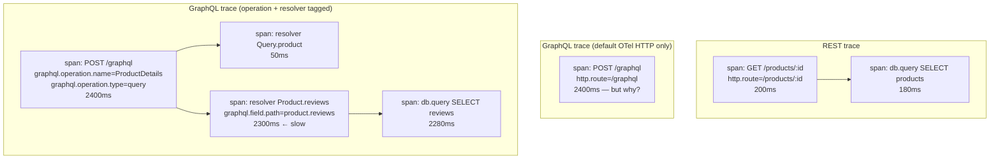
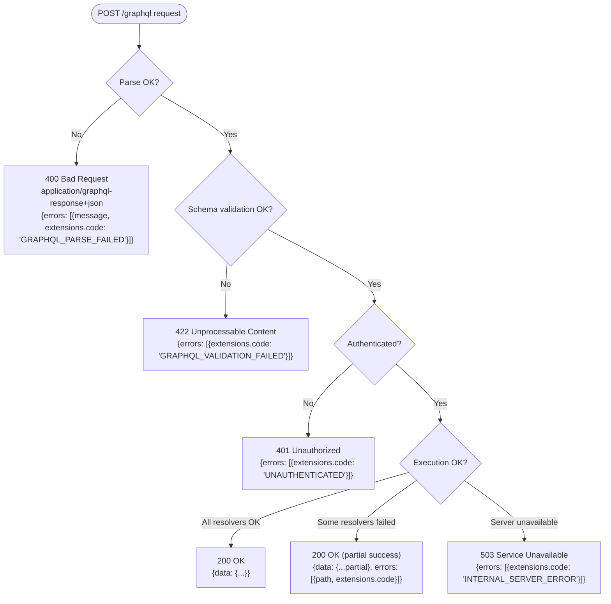

# [BEE-4012] GraphQL vs REST：回應端的 HTTP 取捨

:::info
REST 從 HTTP 本身繼承狀態碼錯誤、每個路由的可觀測性、URL 為基礎的授權。GraphQL 把這三件事全壓縮到單一端點，必須在 schema 層或 middleware 層自己重建。本文涵蓋三個回應端的缺口與預設緩解方案。
:::

## 背景

[BEE-4011](graphql-vs-rest-request-side-http-trade-offs.md) 涵蓋了請求端的缺口：REST 從 HTTP 繼承基礎設施，GraphQL 必須自己重建。本文涵蓋回應端的對應部分。同樣的論點適用：單一的 `POST /graphql` 端點壓縮掉了 HTTP 為 REST 免費提供的三件事。

1. **狀態碼驅動的錯誤語意。** REST 透過 HTTP 狀態碼傳達失敗類別。整個 stack 中每個感知 HTTP 的工具（負載平衡器、監控儀表板、CDN 日誌、客戶端重試函式庫）都依賴這個訊號。GraphQL 預設的回應是 `200 OK`，不論操作成功與否，錯誤改放進回應主體裡的 JSON `errors[]` 陣列。
2. **每個路由的可觀測性。** REST 的 URL pattern 是 metric、trace、log 的天然標籤（`http.route="/api/products/:id"`）。GraphQL 流量出現在單一 URL `POST /graphql`，所以天然標籤崩潰，要看到每個操作的細節得靠 schema 感知的 instrumentation，分別發出 operation name、欄位層級的 span、resolver 層級的延遲。
3. **URL 為基礎的授權。** REST gateway 以 URL pattern 為單位執行 ACL 與 RBAC 政策，通常不必呼叫應用程式碼。GraphQL 只有一個 URL，所以授權搬進 schema：每個欄位都可以有自己的能見度與存取規則，每個 resolver 每個請求都評估一次。

本文走訪每個缺口，說明各團隊實際的緩解作法，對每個缺口給出預設建議。本文列舉的是 GraphQL 必須重建的東西以及重建工作的工程樣貌。

## 原則

採用 GraphQL 的團隊**必須（MUST）**把錯誤訊號、可觀測性、授權當成 schema 層級或 middleware 層級的議題。HTTP 中介伺服器沒辦法替你完成這些工作。錯誤回應**應該（SHOULD）**依照 [GraphQL over HTTP](https://github.com/graphql/graphql-over-http) 草案把應用層級的失敗類別對應到 HTTP 狀態碼，並**應該（SHOULD）**在 `errors[].extensions.code` 欄位攜帶機器可讀的錯誤碼，類比 REST 的 [Problem Details](https://www.rfc-editor.org/rfc/rfc9457.html)（[BEE-4006](api-error-handling-and-problem-details.md)）。可觀測性**必須（MUST）**為每個 span 與 metric 標注 GraphQL operation name；URL `/graphql` 不帶任何資訊。授權**應該（SHOULD）**在 resolver 層用宣告式指令或集中式 policy 引擎執行，不要只在 URL 層執行。

## 三個缺口的鳥瞰

本文後續章節展開下表的每一列。每節的內部結構相同：REST 基線、GraphQL 缺口、緩解模式、建議。

| 議題 | REST 從 HTTP 繼承 | GraphQL 必須自己建構 |
|---|---|---|
| **錯誤語意** | HTTP 狀態碼 + RFC 9457 Problem Details（BEE-4006） | GraphQL-over-HTTP 狀態碼對應 + `errors[].extensions.code` + partial-success 合約 |
| **可觀測性** | 以 URL pattern 為標籤的 metric、trace、log | Operation name 標注 + per-resolver span + schema 感知的 metric |
| **授權** | Gateway 上的 URL/方法 ACL（RBAC/ABAC） | Schema 指令 + 集中式 policy 引擎 + per-resolver 強制執行 |

## 可觀測性

**REST 基線。** URL pattern 是天然的標籤。`http.route="/products/:id"` 是 W3C HTTP 語意慣例定義、每個 OpenTelemetry HTTP instrumentation 函式庫發出的標準 span 屬性。一個標籤同時涵蓋 metric、trace、log。每路由的延遲儀表板是預設值，不是專案。請見 [BEE-14003](../observability/distributed-tracing.md) 了解這一切建立其上的 W3C trace context 與 span 模型。

**GraphQL 缺口。** 全部流量在一個 URL。預設的 OTel HTTP instrumentation 為每個請求產生一個標籤為 `POST /graphql` 的 span。延遲儀表板顯示「GraphQL 今天慢」，再無更細的粒度。分散式 trace 失去了能定位慢 query 的每操作視角。

衍生出的三個問題：

1. **操作不可區分。** 沒有 operation name 標注時，`mutation CreateOrder` 與 `query DashboardData` 在 metric 中看起來一模一樣。
2. **Resolver 層級不可見。** 每路由的延遲不會揭露 90% 的時間都花在某個巢狀 resolver fan-out 到慢的下游服務。
3. **Persisted query 不透明。** Persisted query GET（[BEE-4010](graphql-http-caching.md)）讓 URL 更沒用。`/graphql?id=hash` 是某個 query 的標籤，但前提是可觀測性 stack 把 hash 對應回 operation name。

**第一層：Operation name 標注。** [OpenTelemetry GraphQL 語意慣例](https://opentelemetry.io/docs/specs/semconv/graphql/graphql-spans/) 定義了三個 Recommended span 屬性（目前處於 Development 狀態）：`graphql.document`、`graphql.operation.name`、`graphql.operation.type`（已知值：`query`、`mutation`、`subscription`）。伺服器 middleware 在請求 span 邊界讀取 operation name 並加上這些屬性。Apollo Server 的 tracing plugin 與 Envelop 生態系的 [`@envelop/opentelemetry`](https://the-guild.dev/graphql/envelop/plugins/use-open-telemetry) plugin 都實作這個模式。

**第二層：Per-resolver span。** OTel 語意慣例目前只標準化操作層級的屬性；per-resolver 的 tracing 留給實作。Apollo Server 的 trace 為每個解析過的欄位產生一個 span，附上 type、field、arguments 等屬性；Envelop OpenTelemetry plugin 可以設定為發出類似的 resolver span。代價不小，因為包覆每次 resolver 呼叫都有可量測的額外開銷，所以生產環境部署通常在操作層級採樣：N% 的請求拿到完整的 per-resolver span，其餘只拿到操作層級的 span。



中間那欄顯示預設 OTel HTTP instrumentation 抓到的東西：一個 span、沒有有用的標籤、沒有因果。下面那欄顯示同一個請求加上 operation name 標注與 per-resolver 包覆之後的樣子。

**第三層：Schema 感知的 metric。** Counter 與 histogram 以 `graphql.operation.name` 為鍵，而不是 HTTP route。再加一個獨立的「慢 resolver」告警：以欄位路徑屬性為鍵的 per-resolver 延遲 histogram（直到 OTel 語意慣例擴展到 per-resolver 屬性之前，這部分屬於各家自訂）。

**建議。** 第一層（operation name 標注）沒得商量。沒有它，GraphQL 可觀測性大致無用，因為每個 span 都帶同一個標籤。第二層（per-resolver span）以採樣方式部署。1–10% 的操作拿到完整的 resolver tracing，其餘只拿到操作層級的 span。第三層（schema 感知 metric）把每路由的 histogram 換成每操作的 histogram；對 REST 有用的儀表板版面大致可以平移過來，只要把標籤維度從 `http.route` 換成 `graphql.operation.name`。Persisted query 部署需要一張由建置流水線維護的 hash-to-operation-name 對應表；沒有它，可觀測性儀表板顯示一堆不透明的 hash，operation name 標注也派不上用場。

## 授權粒度

**REST 基線。** 在 URL/方法層執行授權。Gateway 層級的 RBAC（[BEE-1005](../auth/rbac-vs-abac.md)）把 `(角色, URL pattern, 方法)` 對應到 allow/deny，通常不必呼叫應用程式碼。ABAC 政策（Open Policy Agent、AWS Verified Permissions）在 gateway 評估 `(subject, resource, action)`。資源所有權檢查在 handler 中執行。兩層協作：gateway 以角色把關，應用程式以所有權把關。請見 [BEE-1001](../auth/authentication-vs-authorization.md) 了解認證 vs 授權的基線。

**GraphQL 缺口。** 全部流量在一個 URL，意味著 gateway 層級的 URL/方法 ACL 完全失效。Gateway 唯一還有意義的把關是「使用者對 GraphQL 端點是否已認證？」。所有更細的東西都得搬進 schema 強制執行。

衍生出的三個問題：

1. **欄位層級的能見度。** `User` 型別同時有 `email`（敏感）與 `name`（公開），URL ACL 控制不了，因為兩者都從同一個 `POST /graphql` 進來。
2. **Per-argument 存取規則。** `query { users(filter: {role: "admin"}) }` 對某些使用者允許、對其他使用者不允許，取決於 filter 引數。URL pattern 表達不了這件事。
3. **Per-resolver 授權檢查的 N+1。** 一個 query 選了 100 個實體、每個有 10 個受保護欄位，沒有批次的 policy 引擎或操作層級的執行，會做 1,000 次授權檢查。

**模式 A：Schema 指令。** 在欄位上宣告式地放 `@auth(requires: ROLE_ADMIN)` 指令。Apollo Server、[graphql-shield](https://github.com/dimatill/graphql-shield)（一個歷史悠久的 GraphQL middleware-based 權限函式庫）、graphql-armor 都實作這個模式。指令由 middleware 在 resolver 執行前強制執行。

```graphql
type Query {
  users: [User!]! @auth(requires: ROLE_ADMIN)
  publicProducts: [Product!]!
}

type User {
  id: ID!
  name: String!                                       # public
  email: String! @auth(requires: ROLE_SELF_OR_ADMIN)  # sensitive
}
```

Schema 顯式、introspection 可見。限制：指令引數是靜態的。動態政策（例如「只有資源擁有者可以讀這個欄位」）仍需要在 resolver 中做命令式檢查。

**模式 B：集中式 policy 引擎。** Resolver 包覆器或 middleware 把授權決策委派給 policy 引擎。[Open Policy Agent 的 GraphQL 整合](https://www.openpolicyagent.org/docs/graphql-api-authorization)走的是與 per-resolver 包覆不同的路：GraphQL 伺服器把整個 query（schema + query 文字 + 使用者身份 + variables）每個請求送一次到 OPA 的 `/v1/data/graphqlapi/authz` 端點。OPA 用 Rego 的 `graphql.parse()` 把 query 解析成 AST，走訪它，對整個操作回傳一個 allow/deny 決策。AWS Verified Permissions 與 Cerbos 提供類似的集中式模型。

優點：跨 REST 與 GraphQL 介面一致、稽核友善、支援複雜的 ABAC。缺點：需要更多基礎設施；per-operation OPA 呼叫仍會增加延遲，靠以 query hash 與使用者身份為鍵的政策結果快取緩解。Per-operation OPA 模式從設計上避開了 per-resolver N+1 議題；per-resolver policy 包覆器（模式 A 的指令在底層就是這樣）需要批次評估才能避開 N+1。

**模式 C：Per-resolver 命令式檢查。** 每個 resolver 自己嵌入 auth 邏輯。最容易上手，最難稽核。對小型 API 可以接受，超過約 50 個 mutation 就難以維護。

**建議。** 對靜態角色檢查預設用模式 A（schema 指令）。Schema 指令把存取政策呈現在 introspection 與程式碼審查中，且以指令為基礎的執行只在 query 分析時跑一次，而不是每次 resolver 呼叫。在其上層疊模式 B（集中式 policy 引擎）處理任何依賴資源屬性的動態政策；OPA 的 per-operation 模式對集中式政策最合適，因為設計上就避開了 per-resolver N+1 問題。模式 C（per-resolver 命令式）留給真正一次性的情境。一個實作細節重要：任何 per-resolver policy 引擎都必須支援批次評估（一次呼叫帶 N 個 field-resource pair，而不是 N 次呼叫），不批次的話，N+1 授權問題會是文章的第一場生產事故。

## 錯誤語意

**REST 基線。** HTTP 狀態碼是失敗訊號的標準通道：4xx 給客戶端錯誤、5xx 給伺服器錯誤，搭配 [RFC 9457 Problem Details](https://www.rfc-editor.org/rfc/rfc9457.html)（[BEE-4006](api-error-handling-and-problem-details.md)）以 `application/problem+json` media type 提供機器可讀的錯誤主體。狀態碼驅動每一個感知 HTTP 的工具：負載平衡器健康檢查、重試函式庫、監控儀表板、CDN 日誌。主體提供欄位層級的細節與 correlation ID。兩個通道（狀態碼給類別、主體給細節）就是 HTTP 基礎設施依賴的契約。

**GraphQL 缺口。** 預設行為不論失敗模式為何都是 `200 OK`，錯誤放進 `data.errors[]`。這就是 BEE-4006 點名為最具破壞性的錯誤處理錯誤的同一個「200 加 success flag 在主體裡」反模式，因為它同時破壞每一個感知 HTTP 的工具。

三個子問題互相疊加：

1. **HTTP 基礎設施看不到失敗。** 負載平衡器看到全 200 流量；監控看到全 200 流量；客戶端重試函式庫不會觸發。CDN 開心地快取錯誤回應（如果它可快取），把它當成功路徑提供出去。
2. **錯誤在 schema 層級沒有標準化。** GraphQL 規範定義 `message` 與 `path`；其餘都是伺服器自訂的 `extensions`。常見慣例存在（Apollo Server 的 `extensions.code` 欄位，包含 `BAD_USER_INPUT`、`INTERNAL_SERVER_ERROR` 等程式碼），但不在規範中。
3. **Partial-success 是 GraphQL 獨有的。** 一個選了 10 個欄位的 query 可以 7 個成功、3 個失敗。回應同時帶 `data`（7 個有值、3 個 null）與 `errors[]`（3 筆，path 指向失敗的位置）。REST 沒有對應物，除了很少使用的 HTTP 207 Multi-Status。

**緩解 A：GraphQL-over-HTTP 狀態碼對應。** [GraphQL over HTTP 工作草案](https://github.com/graphql/graphql-over-http)為 `application/graphql-response+json` media type 定義了每種失敗類別的狀態碼。客戶端透過送出 `Accept: application/graphql-response+json` 加入新行為、拿到分化的狀態碼；送出 `Accept: application/json` 的客戶端拿到 legacy 全 200 行為以保持向後相容。是用客戶端的 Accept header 選擇，而非自動的協定偵測。

草案規定（從 Status Codes 一節改寫）：

| 失敗類別 | HTTP 狀態碼 |
|---|---|
| 操作執行成功（含 partial success） | 200 |
| Document parse 失敗 | 400 |
| Document validation 失敗 | 422（Unprocessable Content） |
| 需要認證 | 401 / 403 / 類似 |
| Accept 中的 media type 不支援 | 415 |
| 伺服器無法處理（過載、維護） | 503 |

Apollo Server 4+、GraphQL Yoga、Mercurius 都實作這個內容協商行為。



**緩解 B：`extensions.code` 慣例。** 與 HTTP 狀態無關，`errors[]` 中的每個錯誤都應該在 `extensions.code` 攜帶穩定的機器可讀程式碼。這對應到 [RFC 9457 的 `type` URI 與 `errors[].code`](api-error-handling-and-problem-details.md) 的 GraphQL 版本。[Apollo Server 的預設](https://www.apollographql.com/docs/apollo-server/data/errors)包含 `GRAPHQL_PARSE_FAILED`、`GRAPHQL_VALIDATION_FAILED`、`BAD_USER_INPUT`、`PERSISTED_QUERY_NOT_FOUND`、`OPERATION_RESOLUTION_FAILURE`、`BAD_REQUEST`、`INTERNAL_SERVER_ERROR`。應用層級的程式碼如 `UNAUTHENTICATED`、`FORBIDDEN`、`INSUFFICIENT_FUNDS`、`ORDER_ALREADY_SHIPPED` 是應用程式自定義的慣例；Apollo 的預設不包含它們。把程式碼當 API 路徑對待：穩定、文件化、發布後不變更。

**緩解 C：Partial-success 處理。** GraphQL 獨有的失敗模式，REST 沒有乾淨的對應。最佳實踐：

- 盡可能回傳能解析的 `data`；失敗的欄位填 null。
- `data` 中的每個 null 必須對應 `errors[]` 中一筆，`path` 陣列指向 null 的位置。
- 即使 `data` 非 null 看起來完整，客戶端也必須檢查 `errors[]`。
- Critical 欄位應該在 schema 中標為 non-nullable（`String!` 而非 `String`）。Non-nullable 欄位的失敗會向上傳遞到最近的 nullable 祖先，把整個子樹 null 掉，傳達「回應的這個部分不可用」。
- 在 federated GraphQL 設置中（多個 subgraph 由一個 router 接合），來自某個 subgraph 的錯誤會傳遞到 federated 回應的 `errors[]`，path 指向該 subgraph 的欄位；回應其餘部分繼續。確切的傳遞行為視 router 而定。

**建議。** 對新的 API 與大版本升級時採用 GraphQL-over-HTTP 狀態碼對應；操作層面的好處是恢復 HTTP 感知工具（負載平衡器、監控、重試、CDN 日誌）的能力，這些是 legacy 全 200 行為打掉的。每個錯誤一律發出 `extensions.code`。讓它成為伺服器 middleware 的預設值，沒有 resolver 能繞過去。Schema 設計刻意使用 non-null：critical、必有的欄位設成 non-null；partial-success 友善的欄位設成 nullable。對 partial-success 回應，明確記錄合約：客戶端必須檢查 `errors[]`，不論 `data` 形狀為何。請見 BEE-4006 了解 REST 對錯誤設計的處理。原則可以平移；只是 wire format 不同。

## 常見錯誤

**1. `POST /graphql` 請求根本失敗時還回傳 `200 OK`。**

Parse 錯誤、schema validation 錯誤、認證失敗，在 legacy 慣例中全都回 200 帶 `errors[]` 主體。每一個感知 HTTP 的工具都看到成功：負載平衡器健康檢查通過，監控儀表板顯示綠燈，客戶端重試函式庫不會觸發，CDN 甚至可能快取錯誤。採用 GraphQL-over-HTTP 狀態碼對應（parse → 400、validation → 422、auth → 401/403、伺服器無法處理 → 503，200 只給已執行的操作含 partial success），並對加入新行為的客戶端提供 `application/graphql-response+json`。

**2. 把 `extensions.code` 當作可選，或臨時發明每個錯誤的程式碼。**

未標準化的錯誤碼介面對客戶端的重試邏輯不可解析。在伺服器層級採用一個封閉的詞彙（Apollo 預設加上你的應用層級擴充如 `UNAUTHENTICATED`、`FORBIDDEN`、`INSUFFICIENT_FUNDS`），像 API 路徑一樣記錄文件，發布後永不變更。把任何錯誤上沒有 `extensions.code` 視為程式碼審查未通過。

**3. 把預設的 OTel HTTP instrumentation 當成可觀測性的全部。**

只有 HTTP 層級 instrumentation 時，每個 span 都標 `POST /graphql`。延遲儀表板顯示「GraphQL」的第 99 百分位數，再無更細的維度。GraphQL operation name 必須在伺服器邊界加為 span 屬性（`graphql.operation.name`）；沒有它，可觀測性名義上存在、實際上不可用。

**4. 欄位層級的授權只在 resolver 中實作、沒有批次評估。**

一個 query 選了 100 個實體、每個有 10 個受保護欄位，會按順序做 1,000 次授權檢查。延遲與回應大小成正比上升。要嘛用以指令為基礎的方案（模式 A），在解析時 resolver 執行前跑；要嘛改用 per-operation 的 policy 引擎（OPA 的 GraphQL 整合一次評估整個 query）；要嘛把 per-resolver 的 policy 引擎接好批次評估。Per-field 同步 policy 呼叫就是 GraphQL 授權的 N+1 問題。

**5. 忘了 partial-success 回應仍然要客戶端檢查 `errors[]`。**

非 null 的 `data` 加上非空的 `errors[]` 是 GraphQL 標準的「成功但部分降級」訊號。只檢查 `data != null` 的客戶端會默默地對使用者呈現不正確或不完整的資訊。合約必須在 API 層級記錄：客戶端一律檢查 `errors[]`，不論 `data` 形狀為何；`data` 中的 null 對應到 `errors[]` 中以 `path` 為鍵的條目。

## 相關 BEP

**錯誤語意叢集：**

- [BEE-4006](api-error-handling-and-problem-details.md) API 錯誤處理與 Problem Details — REST 標準處理；本文直接引用其反模式列舉
- [BEE-4003](api-idempotency.md) API 中的冪等性 — RFC 9110 動詞語意是 REST 狀態碼的基礎
- [BEE-4011](graphql-vs-rest-request-side-http-trade-offs.md) GraphQL vs REST：請求端的 HTTP 取捨 — 姊妹文章（速率限制小節討論 429 + Retry-After）

**可觀測性叢集：**

- [BEE-14003](../observability/distributed-tracing.md) 分散式追蹤 — W3C trace context、span 模型、採樣
- [BEE-14002](../observability/structured-logging.md) 結構化日誌 — correlation ID、JSON log 格式
- [BEE-14001](../observability/three-pillars-logs-metrics-traces.md) 三大支柱：Logs、Metrics、Traces — 框架基礎

**授權叢集：**

- [BEE-1001](../auth/authentication-vs-authorization.md) 認證 vs 授權 — 定義基線
- [BEE-1005](../auth/rbac-vs-abac.md) RBAC vs ABAC 存取控制模型 — REST 授權模式
- [BEE-1003](../auth/oauth-openid-connect.md) OAuth 2.0 與 OpenID Connect — token-based auth 脈絡
- [BEE-2016](../security-fundamentals/broken-object-level-authorization-bola.md) Broken Object Level Authorization (BOLA) — 相鄰的安全議題

## 參考資料

- [GraphQL Specification (October 2021)](https://spec.graphql.org/October2021/) — 操作型別（Query、Mutation、Subscription）；規範定義帶 `message`、`path`、`extensions` 的 `errors[]`；規範對 HTTP 傳輸保持沉默。
- [GraphQL over HTTP — Working Draft](https://github.com/graphql/graphql-over-http) — 為 `application/graphql-response+json` 定義每種失敗類別的狀態碼對應（parse → 400、validation → 422、伺服器無法處理 → 503 等）；legacy `application/json` 維持全 200 行為。
- [RFC 9457 — Problem Details for HTTP APIs](https://www.rfc-editor.org/rfc/rfc9457.html) — REST 透過 `application/problem+json` 提供機器可讀錯誤主體的基線。
- [RFC 9110 — HTTP Semantics](https://httpwg.org/specs/rfc9110.html) — 狀態碼類別與方法層級語意。
- [Apollo Server — Error Handling](https://www.apollographql.com/docs/apollo-server/data/errors) — 預設 `extensions.code` 集合：GRAPHQL_PARSE_FAILED、GRAPHQL_VALIDATION_FAILED、BAD_USER_INPUT、PERSISTED_QUERY_NOT_FOUND、OPERATION_RESOLUTION_FAILURE、BAD_REQUEST、INTERNAL_SERVER_ERROR。應用程式錯誤透過 `GraphQLError` 實例擴充預設集合。
- [OpenTelemetry Semantic Conventions for GraphQL — Server Spans](https://opentelemetry.io/docs/specs/semconv/graphql/graphql-spans/) — 定義三個 Recommended span 屬性（目前處於 Development 狀態）：`graphql.document`、`graphql.operation.name`、`graphql.operation.type`（值：query / mutation / subscription）。
- [Envelop — useOpenTelemetry plugin](https://the-guild.dev/graphql/envelop/plugins/use-open-telemetry) — 給 GraphQL Yoga 與其他 Envelop-based 伺服器的非 Apollo OpenTelemetry instrumentation；npm 套件 `@envelop/opentelemetry`。
- [graphql-shield](https://github.com/dimatill/graphql-shield) — MIT 授權的 GraphQL 權限 middleware，以 GraphQL Middleware 為基礎，相容於所有 GraphQL 伺服器；rule API 包含 `rule()`、`and()`、`or()`、`allow`、`deny` 組合器。
- [graphql-armor (Escape Technologies)](https://github.com/Escape-Technologies/graphql-armor) — MIT 授權、積極維護的廠商中立 middleware，提供 query 成本分析、深度限制、速率限制；涵蓋 Apollo Server、GraphQL Yoga、Envelop。
- [Open Policy Agent — GraphQL API Authorization](https://www.openpolicyagent.org/docs/graphql-api-authorization) — 把 OPA 當成 per-operation GraphQL policy 引擎使用的第一方文件；政策透過 Rego 的 `graphql.parse()` 解析 query AST，每個請求回傳一個 allow/deny 決策。
- [Marc-André Giroux — GraphQL Observability](https://xuorig.medium.com/graphql-observability-faa08d1b5099) — 從業者文章，討論在三個層級（請求、執行、依賴）做 GraphQL instrumentation，包含 CPU 與 I/O 瓶頸的討論、selected-field-count 與 depth histogram。
