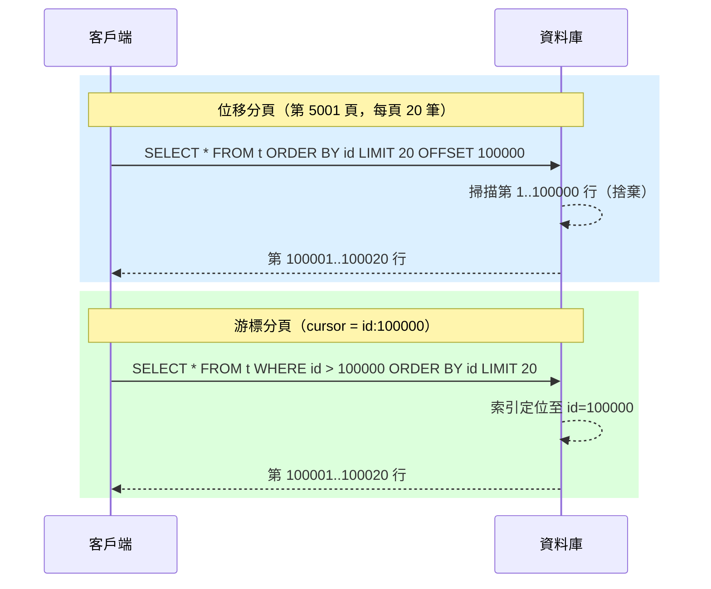

# [BEE-4004] 分頁模式

:::info
選擇正確的分頁策略可防止無界結果集、保護資料庫效能，並為客戶端提供一致且可預期的導覽體驗。
:::

## 背景

每個列表端點終究都會遇到瓶頸。今天只有十筆記錄的資料表，明年可能會有一千萬筆。若沒有分頁，一個 `GET /orders` 請求可能試圖將整個資料表載入記憶體、耗盡網路頻寬，並同時造成逾時。這不僅是效能問題：無界結果集也是安全疑慮（資料外洩）、可靠性疑慮（連鎖 OOM 故障）以及使用者體驗疑慮（客戶端不知道如何顯示或處理任意大小的回應）。

三個主要 API 平台已發布明確且穩定的分頁規範：

- **Slack** 從簡單的頁碼改為基於游標的分頁，以便在不遺漏或重複訊息的情況下處理即時頻道與使用者列表。參見 [Slack API Pagination](https://docs.slack.dev/apis/web-api/pagination/) 以及工程背景 [Evolving API Pagination at Slack](https://slack.engineering/evolving-api-pagination-at-slack/)。
- **Stripe** 使用帶有 `starting_after` / `ending_before` 物件 ID 的游標分頁，明確選擇此方式而非位移分頁，因為「新建立的物件不會讓你失去當前位置」。參見 [Stripe Pagination](https://docs.stripe.com/api/pagination)。
- **Google**（AIP-158）要求所有列表 RPC 接受 `page_token` 並回傳 `next_page_token`。Token 必須是不透明、URL 安全的字串，不得讓使用者直接解析。參見 [Google AIP-158: Pagination](https://google.aip.dev/158)。

## 原則

**對每個列表端點實施分頁。對於可變、高流量的集合，優先採用基於游標的分頁。對於隨機存取（跳到第 N 頁）是真實使用者需求的小型穩定資料集，才保留位移分頁。始終強制執行伺服器端最大頁面大小限制。**

---

## 為什麼分頁很重要

無界列表端點是等待發生的故障。失敗模式已有完整記錄：

- 一個緩慢的查詢可能佔用資料庫連線直到逾時。
- JSON 序列化器分配的記憶體與結果集成正比；大型回應會觸發垃圾回收暫停。
- 下游快取和代理可能在轉發之前緩衝整個回應體。
- 在迴圈中迭代結果的客戶端，如果集合持續增長，就沒有自然的停止點。

分頁強制建立一個契約：每個回應都有有界的大小，頁面之間的導覽是明確的。這是任何預期生產流量的 API 的基礎。

---

## 位移式分頁（Offset-Based Pagination）

最簡單的模型。客戶端傳送頁碼（或原始位移值）和頁面大小；伺服器在 SQL 中套用 `LIMIT` / `OFFSET`。

### 請求

```http
GET /api/v1/orders?page=3&size=20
```

### 回應

```json
{
  "data": [...],
  "pagination": {
    "page": 3,
    "size": 20,
    "total": 487,
    "total_pages": 25
  },
  "_links": {
    "self":  "/api/v1/orders?page=3&size=20",
    "first": "/api/v1/orders?page=1&size=20",
    "prev":  "/api/v1/orders?page=2&size=20",
    "next":  "/api/v1/orders?page=4&size=20",
    "last":  "/api/v1/orders?page=25&size=20"
  }
}
```

### SQL

```sql
SELECT * FROM orders
ORDER BY created_at DESC
LIMIT 20 OFFSET 40;   -- 第 3 頁，每頁 20 筆
```

### 深度位移的問題

資料庫必須掃描並捨棄前 N 行，才能回傳結果。在 `OFFSET 100000` 時，PostgreSQL 需要讀取 100,001 行才能回傳 20 筆。效能隨深度線性下降。

```sql
-- 這是 O(OFFSET + LIMIT) 的工作量，而非 O(LIMIT)
SELECT * FROM orders ORDER BY created_at DESC LIMIT 20 OFFSET 100000;
```

第二個問題：如果在客戶端分頁過程中插入了新記錄，每個後續頁面都會偏移一行。項目會被跳過或重複出現。這就是「幻讀」問題。

---

## 游標式分頁（Cursor-Based Pagination / Keyset Pagination）

不是告訴伺服器「跳過 N 行」，而是告訴伺服器「給我這個特定項目之後的記錄」。伺服器將游標轉換回索引欄位上的 `WHERE` 子句。

### 請求

```http
GET /api/v1/orders?cursor=eyJpZCI6MTAwfQ&limit=20
```

### 回應

```json
{
  "data": [...],
  "pagination": {
    "limit": 20,
    "next_cursor": "eyJpZCI6MTIwfQ",
    "prev_cursor": "eyJpZCI6MTAxfQ",
    "has_more": true
  },
  "_links": {
    "self": "/api/v1/orders?cursor=eyJpZCI6MTAwfQ&limit=20",
    "next": "/api/v1/orders?cursor=eyJpZCI6MTIwfQ&limit=20"
  }
}
```

游標 `eyJpZCI6MTAwfQ` 是 base64 編碼的 JSON 物件 `{"id":100}`，對客戶端而言是不透明的。

### SQL

```sql
-- 等效於：WHERE id > 100 ORDER BY id ASC LIMIT 20
SELECT * FROM orders
WHERE id > 100          -- 從游標解碼
ORDER BY id ASC
LIMIT 20;
```

資料庫使用 `id` 上的索引直接定位到第 100 行並向前讀取。無論客戶端在集合中多深，效能都是 O(LIMIT)。

### 游標設計

游標必須：

- **不透明** -- 客戶端將其視為黑盒。永遠不要直接將原始資料庫 ID 或時間戳作為字串游標暴露；對其進行編碼，使內部結構不可見，且可在不破壞客戶端的情況下更改。
- **URL 安全** -- base64url 編碼（RFC 4648 §5）效果良好。
- **無狀態** -- 游標必須編碼伺服器繼續所需的一切；它不得是伺服器端的 session 鍵。
- **適時設定有效期** -- 編碼了時間點快照的游標應攜帶過期時間，以便過期導覽明確失敗，而不是靜默回傳錯誤結果。

---

## 位移 vs. 游標：比較

| 維度 | 位移分頁 | 游標分頁 |
|---|---|---|
| 實作複雜度 | 低 | 中 |
| 深頁效能 | 下降（O(OFFSET)） | 穩定（O(LIMIT)） |
| 寫入一致性 | 幻讀 / 跳頁 | 穩定，無跳頁 |
| 隨機存取（跳到第 N 頁） | 支援 | 不支援 |
| 總數統計 | 容易（COUNT 查詢） | 昂貴或近似值 |
| 書籤 / 分享頁面 URL | 支援（頁碼穩定） | 游標可能過期 |
| 適合即時資料 | 否 | 是 |
| 適合匯出 / 全量掃描 | 需謹慎 | 是（跟隨游標到末尾） |

**經驗法則：** 除非需要隨機頁面存取（例如在靜態資料集上顯示頁碼按鈕的 UI），否則使用游標分頁。對於任何即時變動的資料——訊息、事件、交易——游標分頁是正確的選擇。

---

## 視覺化：兩種策略如何導覽



兩個查詢回傳相同的 20 行。位移查詢先捨棄 100,000 行；游標查詢使用索引直接定位到正確位置。

---

## Page Token 模式（Google 風格）

Google 的 AIP-158 將游標分頁泛化為「page token」模式，用於所有 Google 公開 API。語意相同，但命名已標準化：

- 請求參數：`page_token`（字串，不透明）
- 請求參數：`page_size`（整數）
- 回應欄位：`next_page_token`（字串，空字串表示集合結束）

```http
GET /v1/projects/123/logs?page_size=50&page_token=ChBzdGFydF90b2tlbl92YWx1ZQ
```

```json
{
  "logs": [...],
  "next_page_token": "ChBuZXh0X3BhZ2VfdG9rZW4"
}
```

當 `next_page_token` 不存在或為空時，客戶端已到達末尾。客戶端將收到的 token 原封不動地作為下一個請求的 `page_token` 傳入。Token 格式是伺服器可以隨時更改的實作細節。

---

## 回應信封與 Link 標頭

### 回應信封

在每個列表回應的頂層一致性地嵌入分頁元資料：

```json
{
  "data": [ ... ],
  "pagination": {
    "limit": 20,
    "next_cursor": "eyJpZCI6MTIwfQ",
    "has_more": true
  }
}
```

預設情況下避免在每個回應中放入 `total`（見下方「常見錯誤」）。僅在客戶端明確請求時才提供（例如 `?include_total=true`）。

### Link 標頭（RFC 8288）

HTTP 的 `Link` 標頭（[RFC 8288](https://www.rfc-editor.org/rfc/rfc8288)）允許分頁連結在回應體外傳輸，對於希望不解析 JSON 就能跟隨連結的客戶端很有用：

```http
Link: </api/v1/orders?cursor=eyJpZCI6MTIwfQ&limit=20>; rel="next",
      </api/v1/orders?cursor=eyJpZCI6MTAxfQ&limit=20>; rel="prev"
```

GitHub 的 REST API 使用 `Link` 標頭作為規範的分頁機制。同時包含 `Link` 標頭和回應體元資料是可接受的，並能提高互通性。

---

## 總數統計的考量

客戶端通常會問「共有多少筆結果？」總數對進度指示器和「顯示 X / Y 筆結果」的 UI 文字很有用。但它們代價高昂：

```sql
-- 全表掃描；無法使用 LIMIT 短路
SELECT COUNT(*) FROM orders WHERE user_id = 42;
```

在具有複雜 `WHERE` 子句的大型資料表上，這可能需要數秒。策略：

1. **預設省略。** 除非客戶端透過查詢參數明確請求，否則不回傳 `total`（`?include_total=true`）。
2. **近似計數。** PostgreSQL 的 `pg_class.reltuples` 提供不需全表掃描的估計值。對於顯示「約 120 萬筆記錄」是可接受的。
3. **快取計數。** 對於高流量端點，以短 TTL 快取計數，並在寫入時使其失效。
4. **改用 `has_more`。** 對於游標式 API，`has_more: true/false` 通常已足夠。客戶端只需要知道是否有下一頁，而不需要知道剩餘幾頁。

---

## 強制執行最大頁面大小

永遠不要在沒有伺服器端上限的情況下信任客戶端的 `size` 或 `limit` 參數：

```python
MAX_PAGE_SIZE = 100

def get_page_size(requested: int | None) -> int:
    if requested is None:
        return DEFAULT_PAGE_SIZE   # 例如 20
    return min(requested, MAX_PAGE_SIZE)
```

如果客戶端請求超過文件記載最大值的大小，應回傳錯誤（HTTP 400），而不是靜默地截斷。靜默截斷會讓期望恰好 N 筆記錄的客戶端感到困惑。帶有清楚錯誤訊息的 400 回應（`"max page size is 100"`）是誠實且可除錯的。

---

## 常見錯誤

### 1. 列表端點沒有分頁

從列表端點回傳所有記錄是潛在的延遲炸彈，也是潛在的資料外洩向量。每個列表端點都必須分頁。如果預設頁面大小夠大，使大多數客戶端從未注意到，這沒問題——但上限必須存在。

### 2. 生產環境中的深度位移分頁

在一千萬行的資料表上執行 `OFFSET 100000` 會導致緩慢查詢和鎖定競爭。如果 UI 需要頁碼，請考慮在快取層中具象化游標到頁碼的對應，而不是將頁碼轉換為原始 SQL 位移值。

### 3. 將內部 ID 暴露為游標

使用 `?after_id=12345` 會洩露資料庫的自動遞增序列，讓客戶端能推斷記錄數量，並將 API 契約與儲存結構耦合。使用 base64url 編碼或加密游標。即使游標目前只是一個包裝的整數，也要將其視為不透明 token。

### 4. 未強制執行最大頁面大小

傳送 `?size=1000000` 的客戶端要麼有錯誤，要麼試圖批量提取資料。若沒有伺服器端上限，此請求將成功，消耗資料庫、記憶體和頻寬。設定硬性限制並在 API 參考文件中記載。

### 5. 每次請求都計算總數

在每個分頁請求上執行 `SELECT COUNT(*)` 會使列表端點的資料庫負載加倍。這幾乎從不合理。將總數計算作為選用參數公開、在精確度不重要的地方使用近似計數，或完全移除總數改用 `has_more`。

---

## 相關 BEE

- [BEE-4001: REST API 設計](./70.md) — 本文建立在其上的 REST 基礎規範。
- [BEE-6006: 查詢優化](125.md) — 使游標分頁與鍵集查詢高效的索引策略。
