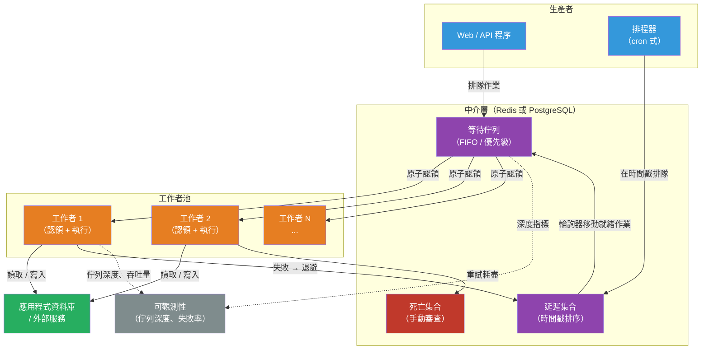

# [BEE-5009] 背景作業與任務佇列架構

:::info
任務佇列（Task Queue）透過同步接受作業描述、將其持久化到中介層（broker），並由一或多個工作者程序非同步執行，來解耦 HTTP 請求週期與實際工作執行，使得計算密集、耗時或受外部速率限制的操作得以水平擴展，而不必阻塞客戶端。
:::

## 背景脈絡

HTTP 請求-響應模型要求在幾秒內回應，否則客戶端超時並重試。許多操作——批量發送電子郵件、產生報告、處理上傳媒體、批量扣款、執行 ML 推論、與第三方 API 同步——所需時間遠超此限制，或需要延遲執行。最簡單的解法是在請求中同步執行：請求阻塞直到工作完成，負載均衡器超時觸發，客戶端重試，操作重複執行兩次。系統化的解法是分離接受工作（請求）與執行工作（作業），兩者透過持久佇列連接。

背景作業系統最初在 Ruby 的 Delayed::Job（Tobias Lütke，Shopify，2008 年）中形式化，它將作業存儲在應用程式的關聯式資料庫中。Sidekiq（Mike Perham，2012 年）推廣了 Redis 支援的作業佇列，證明一個帶有並發執行緒的 Ruby 程序比 Delayed::Job 的每作業一個程序模型高效一個數量級。這個模式跨越生態系傳播：Celery（Python，2009 年）、Bull/BullMQ（Node.js，2013/2019 年）、Faktory（語言無關，Perham，2017 年）。資料庫原生佇列的另一個傳承——Que（PostgreSQL 建議鎖）、Oban（Elixir/Ecto）、pg-boss（Node.js/PostgreSQL）、Solid Queue（Rails）——表明 PostgreSQL 9.5（2016 年）引入的 `SELECT FOR UPDATE SKIP LOCKED` 使得應用程式資料庫對大多數作業佇列工作負載來說已經足夠，無需額外引入 Redis。

2019 年，Temporal（由前 Uber 工程師分叉自 Uber 的 Cadence 專案）引入了**持久執行（durable execution）**：一種將整個工作流程狀態機持久化到 Temporal 服務的模型，工作者崩潰可透過確定性地重放追加式事件歷史透明恢復，而無需重新排隊。

## 設計思維

### 作業狀態機

每個作業都會經歷一系列狀態。標準狀態機如下：

```
已排隊 → 執行中 → 已完成
            ↓
         失敗（可重試）→ [退避延遲] → 已排隊
            ↓
         已死亡（重試耗盡）
```

各平台新增狀態以提供更豐富的語意：
- **delayed（延遲中）**：排程在未來執行，或在重試之間的指數退避中
- **waiting-children（等待子作業）**：父作業阻塞直到所有子作業完成（BullMQ Flows）
- **paused（已暫停）**：佇列被管理員暫停

關鍵狀態轉換：
- **已排隊 → 執行中**：工作者原子性地認領作業——透過 Redis 列表的 `BRPOP`/`BZPOPMIN`，或 PostgreSQL 表的 `SELECT FOR UPDATE SKIP LOCKED`。原子性是關鍵：兩個工作者不能認領同一個作業。
- **執行中 → 已完成/失敗**：工作者向中介層回報結果。若在回報前崩潰，中介層必須決定如何處理。
- **失敗 → 延遲中**：重試機制遞增嘗試計數器，並在退避後排程作業重新執行（Sidekiq：`(retry_count ** 4) + 15 + rand(10) * (retry_count + 1)` 秒；25 次重試跨越約 20 天）。
- **失敗 → 已死亡**：一旦耗盡 `max_retries`，作業移至死亡集合——BullMQ 的 `failed` 有序集合、Sidekiq 的 `dead` 有序集合（上限 10,000 個作業，6 個月 TTL）、Faktory 的 dead queue。死亡作業需要手動干預。

### 可靠性：至少一次 vs 恰好一次

根本約束：作業只能在工作者確認完成*之後*才能安全地從佇列中移除。若工作者在開始工作和確認成功之間崩潰，中介層無法區分崩潰和無限期工作——它必須重新投遞。這產生了**至少一次（at-least-once）**語意：每個作業至少執行一次，但可能執行多次。

**恰好一次（exactly-once）處理**只有在作業的副作用目標與作業追蹤儲存共享相同事務邊界時才能實現——即當作業佇列與應用程式資料位於同一 PostgreSQL 資料庫中時。「標記作業完成」和「應用副作用」的步驟在一個事務中原子提交。使用 Redis 支援的佇列和獨立的應用程式資料庫時，兩階段提交問題使得基礎設施層面的恰好一次不可能實現；必須轉而依賴冪等的作業邏輯。

**確認時機**決定了失敗模式：
- 取得時確認（Celery 預設 `task_acks_late=False`）：工作者取得作業後立即從佇列移除。完成前崩潰會永久丟失作業——最多一次。
- 完成時確認（`task_acks_late=True`；Sidekiq 預設）：作業在工作者 ACK 前保留在中介層。崩潰意味著重新投遞——至少一次。

### 作業遺失問題

當 Redis 支援的工作者程序在作業執行中途被 `kill -9` 殺死時，作業的命運取決於佇列系統的設計：

**Sidekiq 開源版（BasicFetch）**：作業透過 `BRPOP` 出隊，在執行開始前就從 Redis 中移除。強制終止會永久丟失作業。

**Sidekiq Pro（SuperFetch）**：使用 `LMOVE` 將作業從公共佇列原子性地移至*每個程序私有的 Redis 佇列*，然後才開始工作。作業在 Redis 中保留直到工作者 ACK。啟動時，每個 Sidekiq Pro 程序掃描心跳超過 60 秒未出現的程序所留下的孤立私有佇列，並重新排隊其作業。

**BullMQ**：工作者持有每個活躍作業的鎖定令牌——一個 TTL 為 `lockDuration`（預設 30,000 ms）的 Redis 鍵。工作者每隔 `lockDuration / 2`（約 15 秒）更新鎖定。獨立的停滯作業檢查器掃描鎖定已到期的作業；它們被移回 `waiting`（或若超過 `maxStalledCount`（預設 1）則移至 `failed`）。這提供了自動恢復，但若 CPU 密集型作業使事件循環飢餓到足以在仍在執行時讓鎖定到期，可能產生雙重執行。

**PostgreSQL 支援的佇列**：工作者在事務中認領作業，事務將行狀態翻轉為 `active`。若工作者死亡，PostgreSQL 連線斷開，行級鎖釋放，恢復查詢可以找到 `active` 狀態且 `locked_at` 時間戳已過期的作業並將其恢復為 `pending`。事務性認領使恢復比 Redis 方案更簡單可靠。

## 最佳實踐

**MUST（必須）將作業處理器設計為冪等的。** 至少一次投遞保證作業可能執行超過一次。發送付款扣款或發送電子郵件的作業必須無論執行多少次都產生相同的可觀察結果。冪等鍵、資料庫 upsert 和先檢查再行動的模式是標準技術（見 [BEE-19054](../distributed-systems/idempotency-key-implementation-patterns.md)）。

**MUST NOT（不得）在單一作業中執行無界工作。** 迭代大型表中所有記錄並逐一處理的作業將：(a) 超過作業超時；(b) 持有大量記憶體中的資料集；(c) 失敗後從零重新開始，重新處理已完成的記錄。應改為扇出：一個觸發作業為每個項目（或每頁）排隊一個子作業。每個子作業都很小，可獨立重試，可獨立追蹤。

**SHOULD（應該）在作業儲存和應用程式資料庫並存時使用 PostgreSQL 支援的佇列。** 對於每日 100 萬個以下作業的工作負載：作業可以在單一事務中與應用程式狀態更新原子性地排隊；Outbox 模式變得可以輕鬆實現；運維複雜度降低（無需 Redis 依賴）。函式庫：pg-boss（Node.js）、Oban（Elixir）、Solid Queue（Rails）、Que（Ruby）。

**SHOULD（應該）為每個作業設定明確的超時時間。** 沒有超時的作業可以無限期執行，永久佔用工作者槽位和鎖定。設定硬性執行超時（N 秒後終止工作者）和（對於長時間運行的作業）心跳超時，允許中介層檢測停滯但仍存活的程序。

**SHOULD（應該）為重試使用帶抖動的指數退避。** 第三方 API 宕機後，所有 N 個工作者在同一時間間隔後重試，第一波重試浪潮會衝擊正在恢復的 API。添加隨機抖動來分散重試：Sidekiq 的公式添加 `rand(10) * (retry_count + 1)` 秒；BullMQ 在其退避配置中支援 `jitter`。

**MUST（必須）監控佇列深度和工作者吞吐量作為運維指標。** 佇列深度是工作者池對當前負載不足的主要信號。佇列在工作者滿負荷時無限增長意味著：增加工作者或減少每個作業的工作量。告警：佇列深度超過閾值、作業失敗率激增、死亡作業數量增加。

**SHOULD（應該）將作業路由到有類型的工作者池。** CPU 密集型作業（圖像處理、PDF 生成）不應與快速 I/O 作業（webhook 投遞）競爭相同的工作者槽位。使用獨立命名的佇列（`cpu-heavy`、`webhook`）和獨立擴展的工作者池。優先佇列（Sidekiq 加權佇列；BullMQ 優先級欄位）確保關鍵工作在單一池中優先於批次工作。

**MAY（可以）對具有人類時間尺度超時、複雜分支或多個依賴活動的工作流程使用持久執行引擎（Temporal、Conductor）。** 標準作業佇列針對在秒到分鐘內完成的任務進行了優化。跨越小時、天，或需要手動批准步驟、Saga 式補償或複雜條件邏輯的工作流程，受益於整個執行歷史都是持久的工作流程引擎。

### 長時間運行作業的心跳

執行 20 分鐘的作業在 20 分鐘內持有其鎖定。若中介層的鎖定 TTL 更短（BullMQ 預設：30 秒），鎖定在執行過程中到期，另一個工作者認領同一作業——產生平行執行和可能的資料損壞。

對於長時間運行的作業，工作者必須定期更新其認領：
- **BullMQ**：鎖定更新是自動的（每隔 `lockDuration / 2`），但只在事件循環未被阻塞時才進行。CPU 密集型處理器必須在子程序（`sandbox` 模式）中運行，使父程序能夠更新鎖定。
- **Temporal**：明確呼叫 `activity.RecordHeartbeat(ctx, progressDetails)`。SDK 將呼叫限流至 `min(heartbeatTimeout * 0.8, 30 秒)`。`heartbeatTimeout` 應設為最大可接受靜默間隔（例如 60 秒）。心跳遺漏時，Temporal 重新排程活動；新嘗試接收上次成功心跳的 `progressDetails`，可從斷點恢復而非從頭重新開始。
- **Faktory**：工作者每 15 秒發送 `BEAT`（最少 5 秒，最多 60 秒）。作業預留超時（`reserve_for`，預設 1,800 秒）與工作者心跳分開——預留必須足夠長以覆蓋作業的執行時間。

### 毒藥丸（Poison Pills）

毒藥丸是一個殺死工作者*程序*而非引發可捕獲異常的作業——通常透過 OOM、原生擴展中的段錯誤或失控的記憶體分配。崩潰-恢復循環隨後執行：

1. 作業被認領 → 工作者程序死亡 → 作業被恢復 → 重新排隊 → 另一個工作者取得 → 同樣崩潰 → 重複。

標準重試邏輯無法防禦這一點，因為異常從未被捕獲。

**偵測**：追蹤從工作者崩潰中恢復的作業（Sidekiq Pro SuperFetch 的孤立私有佇列恢復；BullMQ 的停滯作業偵測）。若同一作業 ID 已被恢復 N 次（Sidekiq Pro：72 小時內 3 次），將其直接移至死亡集合並發出告警。

**緩解**：在隔離的子程序中執行每個作業。若子程序被殺死，父程序存活並可乾淨地回報失敗。BullMQ 的沙箱處理器和 Celery 的 prefork 池都在程序層級進行了隔離。

## 視覺圖示



## 範例

**PostgreSQL 支援的作業佇列——SKIP LOCKED 認領模式：**

```sql
-- Schema：一張表，僅對待處理作業建立部分索引
CREATE TABLE jobs (
  id          UUID PRIMARY KEY DEFAULT gen_random_uuid(),
  queue       TEXT NOT NULL DEFAULT 'default',
  payload     JSONB NOT NULL,
  status      TEXT NOT NULL DEFAULT 'pending',  -- pending, active, completed, failed, dead
  priority    INTEGER NOT NULL DEFAULT 0,        -- 數字越高越重要
  run_at      TIMESTAMPTZ NOT NULL DEFAULT NOW(),
  created_at  TIMESTAMPTZ NOT NULL DEFAULT NOW(),
  locked_at   TIMESTAMPTZ,
  locked_by   TEXT,
  retry_count INTEGER NOT NULL DEFAULT 0,
  max_retries INTEGER NOT NULL DEFAULT 25,
  error       TEXT
);

-- 部分索引：僅索引待處理行——隨著已完成行增長保持索引小巧
CREATE INDEX ON jobs (queue, priority DESC, run_at ASC)
  WHERE status = 'pending';

-- 工作者：原子性認領一個作業，跳過已被其他工作者持有的行
BEGIN;
  WITH claimed AS (
    SELECT id FROM jobs
    WHERE status = 'pending'
      AND queue   = 'default'
      AND run_at <= NOW()
    ORDER BY priority DESC, run_at ASC
    LIMIT 1
    FOR UPDATE SKIP LOCKED   -- 跳過並發工作者鎖定的行
  )
  UPDATE jobs
     SET status    = 'active',
         locked_at = NOW(),
         locked_by = 'worker-abc-1'
  FROM claimed
  WHERE jobs.id = claimed.id
  RETURNING id, payload;
COMMIT;
```

```python
# 工作者循環——執行，然後標記完成或遞增重試
def process_next_job(conn, worker_id: str):
    row = claim_job(conn, queue="default", worker_id=worker_id)
    if not row:
        return False  # 佇列為空

    job_id, payload = row["id"], row["payload"]
    try:
        execute_job(payload)               # 冪等的業務邏輯
        conn.execute(
            "UPDATE jobs SET status='completed' WHERE id=%s", (job_id,)
        )
    except Exception as exc:
        conn.execute("""
            UPDATE jobs
               SET status      = CASE WHEN retry_count + 1 >= max_retries
                                      THEN 'dead' ELSE 'pending' END,
                   retry_count = retry_count + 1,
                   locked_at   = NULL,
                   locked_by   = NULL,
                   run_at      = NOW() + INTERVAL '1 second'
                                    * (POWER(retry_count + 1, 4) + 15),
                   error       = %s
             WHERE id = %s
        """, (str(exc), job_id))
    return True
```

**Redis 支援的佇列——BullMQ 工作者帶鎖定更新和沙箱：**

```typescript
// BullMQ：帶並發和沙箱的工作者（適用於 CPU 密集型作業）
import { Worker, Job } from "bullmq";
import { connection } from "./redis";

// 對於 CPU 密集型處理器：使用沙箱子程序
// 使父事件循環可以不間斷地更新作業鎖定
const worker = new Worker(
  "image-processing",
  "./processors/resize.js",   // 基於模組的處理器路徑（在子程序中執行）
  {
    connection,
    concurrency: 4,            // 最多 4 個並發沙箱子程序
    lockDuration: 60_000,      // 作業鎖定 TTL：60 秒（必須超過最壞情況的作業持續時間）
    stalledInterval: 30_000,   // 停滯檢查器每 30 秒運行一次
    maxStalledCount: 2,        // 2 次停滯後，作業移至 failed（毒藥丸保護）
  }
);

worker.on("failed", (job: Job | undefined, err: Error) => {
  console.error({ jid: job?.id, attemptsMade: job?.attemptsMade, err: err.message });
  // 若作業超過停滯閾值計數則告警——可能是毒藥丸
});
```

**Temporal 活動帶心跳，用於長時間文件處理：**

```go
// activity.go——帶心跳檢查點的長時間運行活動
func ProcessLargeFileActivity(ctx context.Context, input FileInput) (FileOutput, error) {
    // 從上次心跳擷取進度（首次嘗試時為 nil）
    progress := 0
    if detail := activity.GetHeartbeatDetails(ctx); detail != nil {
        _ = detail.Get(&progress)
    }

    for i := progress; i < input.TotalChunks; i++ {
        if err := processChunk(ctx, input, i); err != nil {
            return FileOutput{}, err
        }

        // 每個區塊發送心跳：記錄進度，使下次嘗試從 i+1 恢復
        // 調用者設定 heartbeatTimeout 為 60 秒；此呼叫必須至少以該頻率進行
        activity.RecordHeartbeat(ctx, i+1)

        // 檢查上下文是否已取消（例如，工作流程被外部取消）
        if ctx.Err() != nil {
            return FileOutput{}, ctx.Err()
        }
    }
    return FileOutput{OutputKey: deriveOutputKey(input)}, nil
}
```

```go
// workflow.go——帶心跳超時的活動選項
activityOptions := workflow.ActivityOptions{
    StartToCloseTimeout: 2 * time.Hour,    // 單次嘗試的預算
    HeartbeatTimeout:    60 * time.Second, // 重新排程前的最大靜默時間
    RetryPolicy: &temporal.RetryPolicy{
        InitialInterval:    time.Second,
        BackoffCoefficient: 2.0,
        MaximumInterval:    5 * time.Minute,
        MaximumAttempts:    10,
    },
}
```

## 實作注意事項

**佇列後端選擇——PostgreSQL vs Redis：**

| 考量 | PostgreSQL | Redis |
|---|---|---|
| 原子排隊 + 應用程式 DB 更新 | 是——單一事務 | 否——兩次獨立寫入 |
| 運維依賴 | 已存在 | 額外服務 |
| 吞吐量上限 | 典型工作負載約每天 1 萬–10 萬個；調優後更高 | 每天數百萬個 |
| 排隊延遲 | 1–5 毫秒 | < 1 毫秒 |
| 持久性 | WAL 支援，崩潰安全 | AOF/RDB（可配置） |
| 死亡作業可見性 | SQL 查詢 | Redis CLI / Sidekiq Web UI |
| 最佳適用 | 負載可預測的 SaaS 應用 | 高吞吐量、延遲敏感的管道 |

**Celery Beat 可靠性缺口**：Celery Beat 是一個單程序排程器，沒有內建的領導者選舉。執行多個 Beat 實例會導致重複的任務排隊。在生產環境中，確保只有一個 Beat 程序在運行（supervisor、Kubernetes 單副本 Deployment，或使用帶分散式鎖的 `django-celery-beat`）。Beat 程序失敗會靜默跳過作業排隊——添加心跳監控以偵測 Beat 宕機。

**工作者擴展信號**：佇列深度是水平擴展的主要信號。KEDA（Kubernetes 事件驅動自動擴展）為 Redis 列表和有序集合、PostgreSQL 查詢、RabbitMQ 佇列等提供原生擴展器——使基於佇列深度的工作者 Deployment HPA 式自動擴展成為可能，而無需編寫自訂指標適配器。

**Python GIL 與 Celery**：Celery 的 `prefork` 池生成 N 個獨立的 Python 程序，繞過 GIL 實現真正的 CPU 並行。`gevent` 和 `eventlet` 池使用猴子補丁的協作並發，對 I/O 密集型任務而言記憶體開銷低於多程序。根據任務是否為 CPU 密集型（`prefork`）或 I/O 密集型（`gevent`/`eventlet`）進行選擇。

## 相關 BEE

- [BEE-13006](../performance-scalability/asynchronous-processing-and-work-queues.md) -- 非同步處理與工作佇列：解耦非同步工作的範式與動機；本文涵蓋實作架構
- [BEE-8005](../transactions/idempotency-and-exactly-once-semantics.md) -- 冪等性與恰好一次語意：作業處理器必須是冪等的；本文深入介紹技術
- [BEE-19054](../distributed-systems/idempotency-key-implementation-patterns.md) -- 冪等鍵實作模式：冪等作業處理器的具體實作
- [BEE-19053](../distributed-systems/outbox-pattern-and-transactional-messaging.md) -- Outbox 模式與事務性訊息：PostgreSQL 支援的佇列在單一事務中原生啟用 Outbox 模式
- [BEE-19038](../distributed-systems/distributed-job-scheduling.md) -- 分散式作業排程：涵蓋位於單機作業佇列之上的叢集級排程器（Airflow、Quartz、Kubernetes CronJobs）
- [BEE-10005](../messaging/dead-letter-queues-and-poison-messages.md) -- 死信佇列與毒藥訊息：任務佇列中的死亡作業集合是訊息中介層 DLQ 的等效物

## 參考資料

- [Sidekiq Wiki — GitHub（Mike Perham）](https://github.com/sidekiq/sidekiq/wiki)
- [Sidekiq 可靠性 / SuperFetch — GitHub Wiki](https://github.com/sidekiq/sidekiq/wiki/Reliability)
- [BullMQ 文件 — docs.bullmq.io](https://docs.bullmq.io/)
- [BullMQ 停滯作業 — docs.bullmq.io](https://docs.bullmq.io/guide/workers/stalled-jobs)
- [BullMQ Flows — docs.bullmq.io](https://docs.bullmq.io/guide/flows)
- [Temporal 活動失敗偵測 — docs.temporal.io](https://docs.temporal.io/encyclopedia/detecting-activity-failures)
- [Temporal 事件歷史 — docs.temporal.io](https://docs.temporal.io/encyclopedia/event-history)
- [Celery 週期性任務（Beat）— docs.celeryq.dev](https://docs.celeryq.dev/en/stable/userguide/periodic-tasks.html)
- [Faktory 作業載荷格式 — GitHub Wiki](https://github.com/contribsys/faktory/wiki/The-Job-Payload)
- [pg-boss — GitHub（timgit）](https://github.com/timgit/pg-boss)
- [PostgreSQL SELECT FOR UPDATE SKIP LOCKED — PostgreSQL 文件](https://www.postgresql.org/docs/current/sql-select.html#SQL-FOR-UPDATE-SHARE)
- [PostgreSQL 作為佇列的基準測試 — Chanks（GitHub Gist）](https://gist.github.com/chanks/7585810)
