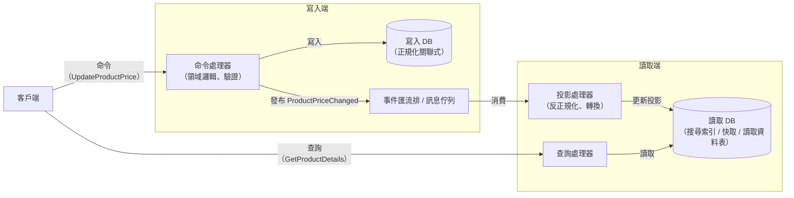

# [BEE-5003] CQRS

:::info
對讀取與寫入模型進行分離，適用於讀寫在擴展需求、複雜度或效能要求上存在根本差異的系統。
:::

## 背景

大多數應用程式一開始使用單一模型同時處理讀取與寫入。一個 `Product` 實體從資料庫取出、由業務邏輯修改，再寫回資料庫。相同的表示形式也用於查詢並回傳給 API 消費者。對於簡單的 CRUD 場景，這樣的做法完全可行。

然而，隨著系統成長，讀取路徑與寫入路徑往往會出現明顯分歧：

- 讀取遠比寫入頻繁（商品目錄：每秒數千次讀取，每分鐘只有數十次寫入）。
- 讀取需要針對特定視圖的反正規化、預先 join 好的資料；寫入則需要正規化、具備強一致性保證的資料。
- 讀取可以容忍一定程度的資料陳舊；寫入要求嚴格的一致性。
- 讀取查詢日益複雜 -- 跨表 join、全文搜尋、聚合計算；而寫入操作仍然專注於單一聚合根。

若強行透過同一個模型處理讀寫，寫入模型會被查詢便利性所污染，讀取模型則被迫承擔寫入端的不變式。兩者都無法做好。

命令查詢職責分離（CQRS）透過使用獨立模型來解決這個問題：一個用於寫入（命令），另一個用於讀取（查詢）。這個模式由 Greg Young 於 2010 年前後命名並發展，源自 Bertrand Meyer 在方法層級提出的命令查詢分離（CQS）原則。Martin Fowler 在其 bliki 上撰寫的 CQRS 文章是最精簡的權威參考。

### 命令查詢分離（CQS）-- 理論基礎

CQS 是方法層級的原則：一個方法應該只執行動作（命令，改變狀態），或只回傳資料（查詢，不改變狀態）-- 兩者不可兼做。

```
// 違反 CQS：同時改變狀態並回傳新值
int incrementAndReturn(int x) { return ++x; }

// 符合 CQS：分離操作
void increment(int x) { ... }     // 命令
int getValue() { return x; }      // 查詢
```

CQRS 將此原則提升至架構層級：獨立的模型、獨立的技術堆疊，有時甚至是獨立的服務。

## 原則

### 兩個模型

**寫入模型**（命令端）負責：
- 領域邏輯與不變式
- 驗證與授權
- 聚合根的狀態變更
- 事件發布

**讀取模型**（查詢端）負責：
- 反正規化的預計算投影（projection）
- 針對查詢最佳化的儲存（可與寫入端使用不同技術）
- 不含任何業務邏輯 -- 只負責組裝視圖

命令流向寫入模型；查詢流向讀取模型。兩者在執行時不互相混用。

### 不含事件溯源的 CQRS（簡單形式）

CQRS 不依賴事件溯源。最簡單的形式如下：

1. 命令由寫入模型處理，更新關聯式寫入資料庫。
2. 發布一個事件或訊息（例如 `ProductPriceChanged`）。
3. 投影處理器消費事件，更新讀取資料庫（可以是同一資料庫的不同資料表，或是 Redis、Elasticsearch 等獨立儲存）。
4. 查詢從讀取資料庫讀取。

這種形式引入了相當的複雜度；只有在問題確實值得時才採用。

### 結合事件溯源的 CQRS（完整形式）

當與事件溯源結合使用（見 [BEE-10004](../messaging/event-sourcing.md)）時，寫入模型不再直接儲存當前狀態。取而代之：

1. 命令產生領域事件（`PriceChanged { productId, oldPrice, newPrice, timestamp }`）。
2. 事件以不可變的方式附加到事件日誌（事件儲存）中。
3. 聚合根狀態透過重播事件來重建。
4. 投影消費事件流，建構讀取模型。

事件溯源提供完整的稽核日誌，並可重播歷史事件來重建投影或建立新投影。它同時也帶來顯著的複雜度。只有在確實需要稽核日誌或時態查詢能力時才使用完整形式，而不是僅僅因為使用 CQRS。

### 讀寫模型之間的最終一致性

讀取模型是在寫入模型提交之後非同步更新的。在此之間存在一個時間窗口（通常是毫秒到秒級），讀取模型尚未反映最新的寫入結果。這稱為**最終一致性**，是這個模式固有的設計取捨。

這不是缺陷，而是設計上的取捨。團隊必須理解並溝通這一點。使用者介面可能需要透過客戶端樂觀更新來掩蓋這個延遲，或顯示資料陳舊的提示。

### 物化視圖與投影

**投影**是針對特定查詢而建構的讀取模型。與其建立一個囊括所有欄位的大型反正規化資料表，不如為每個消費者建立專屬投影：

- `product_search_view` -- 針對全文搜尋最佳化，包含類別路徑與標籤陣列
- `product_pricing_view` -- 只有 `id`、`price`、`currency`、`effective_from` -- 供結帳時確認價格用
- `product_admin_view` -- 完整細節，供後台編輯使用

每個投影都可透過重播事件流（或重新消費變更事件）來重建。同一個寫入端聚合根可以對應多個投影共存。

## 架構示意圖

含事件驅動投影更新的 CQRS 架構：



## 範例

**商品目錄：價格變更透過 CQRS 傳遞**

假設商品管理員將某商品的價格從 $29.99 調漲至 $34.99。

**寫入端（命令流程）：**

```
POST /commands/update-product-price
{
  "productId": "prod-8821",
  "newPrice": 34.99,
  "currency": "USD",
  "effectiveFrom": "2026-04-07T00:00:00Z"
}
```

命令處理器的步驟：
1. 從寫入 DB 載入 `Product` 聚合根。
2. 驗證：價格必須為正數，使用者必須具備定價權限。
3. 套用變更：`product.updatePrice(34.99, USD, effectiveFrom)`。
4. 將更新後的資料列寫回關聯式寫入 DB。
5. 發布 `ProductPriceChanged { productId, oldPrice: 29.99, newPrice: 34.99, currency, effectiveFrom }` 到事件匯流排。

**讀取端（投影更新）：**

投影處理器收到 `ProductPriceChanged` 後，更新兩個讀取模型：

```sql
-- 更新定價投影（供結帳服務使用）
UPDATE product_pricing_view
SET price = 34.99, effective_from = '2026-04-07T00:00:00Z'
WHERE product_id = 'prod-8821';

-- 更新搜尋索引文件（供目錄 API 使用）
-- Elasticsearch upsert，更新 price 欄位
```

**查詢（讀取流程）：**

```
GET /products/prod-8821
```

查詢處理器直接從讀取端的 `product_search_view` 讀取，回傳包含類別路徑、圖片、標籤及更新後價格的反正規化文件 -- 不需要任何 join。

**一致性時間窗口：** 若客戶在命令完成後 50--200 毫秒內發出查詢，可能還會看到舊價格。對商品目錄而言，這是可接受的。對銀行帳戶餘額而言，則無法接受。在採用 CQRS 之前，請先確認你的一致性需求。

## 適用時機

在以下至少一個條件成立時，考慮採用 CQRS：

| 條件 | CQRS 的優勢 |
|---|---|
| 讀寫比例高度不對稱（例如 1000:1 的讀取比例） | 獨立擴展讀取模型；避免查詢效能需求拖累寫入模型 |
| 讀取查詢複雜（多表 join、全文搜尋、聚合） | 維護專屬讀取模型；避免在領域模型中處理複雜查詢 |
| 寫入端領域複雜且具有豐富不變式 | 讓寫入模型專注於正確性；不以讀取便利性污染它 |
| 同一份資料需要多種表示形式 | 從一個事件流建構多個投影 |
| 需要所有狀態變更的稽核追蹤 | 結合事件溯源（[BEE-10004](../messaging/event-sourcing.md)） |

## 常見錯誤

1. **將 CQRS 用於簡單的 CRUD。** 一個只有幾個欄位的使用者設定頁面不需要 CQRS。兩個模型、一個事件匯流排和非同步投影的開銷毫無正當性。請有選擇地將 CQRS 套用於真正存在讀寫不對稱或領域複雜性的子系統。

2. **預期讀寫模型之間具有即時一致性。** 讀取模型是非同步更新的。若使用者提交表單後立即重新整理頁面，可能會看到舊的狀態。未事先規劃這一點的團隊將遭遇令人困惑的 bug。請在 UI 與 API 契約的設計上，將最終一致性納入考量。

3. **採用 CQRS 卻未充分理解最終一致性的影響。** 團隊為了效能收益採用 CQRS，卻未考量哪些操作真正需要強一致性。並非所有查詢都能容忍陳舊資料（付款確認後的狀態、庫存預留確認）。請事先找出這些情境，並將其路由到寫入端，或設計補償機制。

4. **在不需要事件溯源的情況下將 CQRS 與事件溯源強行耦合。** CQRS 與事件溯源是各自獨立的模式，搭配使用效果很好，但兩者都不依賴對方。對一個只需要更快讀取路徑的系統，硬要引入事件溯源（聚合根重播、快照策略、投影重建），會增加數個月的複雜度，卻毫無收益。

5. **建立一個巨大的讀取模型，而非針對用途建立專屬投影。** 建立一個包含所有欄位的 `everything_view`，會在讀取端重新製造原本單一模型的問題。請為特定消費者建立投影：結帳服務投影、搜尋 API 投影、後台管理儀表板投影。每個投影都應小而專注，且可獨立演進。

## 相關 BEE

- [BEE-5002](domain-driven-design-essentials.md) -- DDD 精要：聚合根產生的領域事件是 CQRS 投影的天然輸入來源
- [BEE-5004](hexagonal-architecture.md) -- 六角形架構：命令處理器與查詢處理器是應用服務；六角形架構定義了它們所在的層次
- [BEE-8004](../transactions/saga-pattern.md) -- Saga 模式：Saga 協調多步驟命令；CQRS 在每個步驟內部套用
- [BEE-10004](../messaging/event-sourcing.md) -- 事件溯源：完整形式的 CQRS 使用事件儲存作為寫入端的權威資料來源

## 參考資料

- Fowler, M. 2011. "CQRS." https://martinfowler.com/bliki/CQRS.html
- Fowler, M. 2005. "CommandQuerySeparation." https://martinfowler.com/bliki/CommandQuerySeparation.html
- Young, G. 2010. "CQRS and Event Sourcing." http://codebetter.com/gregyoung/2010/02/13/cqrs-and-event-sourcing/
- Microsoft. 2023. "CQRS Pattern." https://learn.microsoft.com/en-us/azure/architecture/patterns/cqrs
- Microsoft. 2023. "Applying CQRS and CQS approaches in a DDD microservice." https://learn.microsoft.com/en-us/dotnet/architecture/microservices/microservice-ddd-cqrs-patterns/eshoponcontainers-cqrs-ddd-microservice
