# [BEE-5007] 無伺服器架構模式

:::info
無伺服器架構（Serverless Architecture）將伺服器配置、擴展與基礎設施管理的責任轉移給雲端供應商。開發者只需部署在離散事件觸發下執行的程式碼，平台負責處理其餘一切，包括在閒置時縮減至零。
:::

## 背景脈絡

傳統伺服器部署要求工程師預先配置容量、設定自動擴展、管理作業系統修補，並為尖峰負載做規劃。即使是容器化服務，在請求之間仍需維持一個持續運行的程序。這種基礎運維成本在數百個微服務之間不斷累積。

無伺服器有兩種截然不同的模型。**函數即服務（FaaS）**——AWS Lambda（2014）、Google Cloud Functions（2016）、Azure Functions（2016）——在事件觸發的短暫執行環境中運行單一函數。**後端即服務（BaaS）**——Firebase、DynamoDB、Auth0——以完全託管的 API 取代整個伺服器元件，由客戶端直接調用。

FaaS 在事件驅動後端中快速普及：S3 上傳觸發圖像縮放器、SQS 訊息觸發訂單處理器、API Gateway 的 HTTP 請求觸發 REST 處理器。按用量計費的模式（按每 100 毫秒執行計費，而非按閒置伺服器計費）讓零散工作負載在經濟上極具吸引力。AWS Lambda 的免費方案每月涵蓋 100 萬次請求與 40 萬 GB 秒。

無伺服器模型存在一個根本性的限制：**冷啟動問題（cold start problem）**。當函數近期未被調用，或並發量超過暖機實例池時，平台必須配置新的執行環境：下載程式碼套件、啟動微型虛擬機器（AWS 使用 Firecracker）、初始化語言執行時，並執行初始化程式碼。這將增加從不足 1 毫秒（Go、Rust）到 4–7 秒（未優化的 JVM）不等的延遲。Martin Fowler 於 2018 年的分析指出，冷啟動延遲與供應商鎖定是限制無伺服器普及的兩大主要因素。

## 設計思維

### FaaS 執行模型

每次函數調用都在獨立、無狀態、短暫的執行環境中運行。該環境可能在同一實例上被後續調用重用（「暖啟動」），或在閒置一段時間後被銷毀。函數在調用之間不得將狀態存儲於本地記憶體——所有持久狀態須存至外部儲存：DynamoDB、S3、Redis 或關聯式資料庫。

各供應商的處理器（handler）簽章已標準化，但遵循相同模式：

```python
# AWS Lambda 處理器——每次調用執行一次
def lambda_handler(event: dict, context) -> dict:
    # event：依觸發器而異（API Gateway、SQS、S3、DynamoDB Streams 等）
    # context：調用元數據（function_name、aws_request_id、get_remaining_time_in_millis）
    return {"statusCode": 200, "body": "ok"}
```

處理器外部的初始化程式碼（資料庫連線、SDK 客戶端、緩存配置）在每個執行環境冷啟動時執行一次，並在暖調用間重複使用——這是一個關鍵的優化模式。

```python
import boto3

# 模組層級：每次冷啟動執行一次，暖調用時重複使用
dynamodb = boto3.resource("dynamodb")
table = dynamodb.Table("orders")

def lambda_handler(event, context):
    # dynamodb 和 table 已初始化——無每次調用的額外開銷
    response = table.get_item(Key={"order_id": event["pathParameters"]["id"]})
    return {"statusCode": 200, "body": json.dumps(response.get("Item"))}
```

### 關鍵模式

**HTTP API（API Gateway + Lambda）**：API Gateway 將 HTTP 請求路由至 Lambda。API Gateway 29 秒的預設超時限制了同步響應的 Lambda 執行時間約為 28 秒。適用於 CRUD 操作、輕量計算與事件扇出端點。

**扇出 / 扇入（SNS + SQS + Lambda）**：單一 SNS 主題發布至多個 SQS 佇列，每個佇列觸發專門的 Lambda 函數進行平行處理。扇入 Lambda 從中間儲存（S3、DynamoDB）匯總結果。此模式以平行、可獨立擴展的工作者取代了單體批次作業。

**工作流程協調（Step Functions）**：AWS Step Functions 以狀態機定義的分支、重試與錯誤處理來協調 Lambda 調用序列。適用於長時間運行的業務流程（訂單履行、資料管線），否則每函數 15 分鐘的限制將成為瓶頸。

**事件路由（EventBridge）**：EventBridge 根據內容規則，將來自 AWS 服務、第三方 SaaS 和自定義來源的事件路由至目標（Lambda、SQS、Step Functions）。無需 SNS/SQS 配置即可解耦事件生產者與消費者。

### 冷啟動緩解策略

| 策略 | 機制 | 取捨 |
|---|---|---|
| **語言選擇** | Go/Rust：<1 毫秒；Node.js/Python：200 毫秒；Java：冷啟動 4–7 秒 | 執行時生態系統限制 |
| **SnapStart（Lambda Java/Python/.NET）** | 快照初始化後狀態；調用時還原。Java 21：4–7 秒 → 90–140 毫秒 | 需要無狀態初始化；需重新播種偽隨機數生成器 |
| **預配置並發（Provisioned Concurrency）** | 預先初始化 N 個環境；消除預配置容量的冷啟動 | 每個預暖實例小時的費用 |
| **最小實例（GCP）** | 保持 N 個 Cloud Run 實例存活；閒置實例以降低費率計費 | 最低閒置費用 |
| **縮減套件大小** | 較小套件下載更快；進行 tree-shaking、使用 Lambda 層 | 建置複雜度增加 |

## 視覺圖示

```mermaid
flowchart TD
    subgraph "同步模式"
        CLIENT["客戶端"]:::user
        APIGW["API Gateway\n（HTTP 觸發器）"]:::gateway
        FN1["Lambda\n（處理器）"]:::fn
        DB["DynamoDB /\nRDS Proxy"]:::store
        CLIENT -->|"HTTP 請求"| APIGW
        APIGW -->|"事件"| FN1
        FN1 -->|"讀取 / 寫入"| DB
        FN1 -->|"HTTP 響應"| APIGW
    end

    subgraph "非同步扇出模式"
        SRC["事件來源\n（S3 / API / 排程器）"]:::user
        SNS["SNS 主題"]:::gateway
        SQS1["SQS 佇列 A"]:::queue
        SQS2["SQS 佇列 B"]:::queue
        FN2["Lambda 工作者 A"]:::fn
        FN3["Lambda 工作者 B"]:::fn
        AGG["匯總 Lambda\n（扇入）"]:::fn
        S3["S3 / DynamoDB\n（中間結果）"]:::store
        SRC -->|"發布"| SNS
        SNS -->|"扇出"| SQS1
        SNS -->|"扇出"| SQS2
        SQS1 -->|"觸發"| FN2
        SQS2 -->|"觸發"| FN3
        FN2 -->|"寫入結果"| S3
        FN3 -->|"寫入結果"| S3
        S3 -->|"觸發"| AGG
    end

    style CLIENT fill:#3498db,color:#fff
    style APIGW fill:#8e44ad,color:#fff
    style FN1 fill:#e67e22,color:#fff
    style DB fill:#27ae60,color:#fff
    style SRC fill:#3498db,color:#fff
    style SNS fill:#8e44ad,color:#fff
    style SQS1 fill:#8e44ad,color:#fff
    style SQS2 fill:#8e44ad,color:#fff
    style FN2 fill:#e67e22,color:#fff
    style FN3 fill:#e67e22,color:#fff
    style AGG fill:#e67e22,color:#fff
    style S3 fill:#27ae60,color:#fff
```



## 範例

**帶有冪等性與死信處理的 SQS 觸發 Lambda：**

```python
import json
import os
import boto3
from aws_lambda_powertools import Logger, Tracer
from aws_lambda_powertools.utilities.idempotency import (
    DynamoDBPersistenceLayer, idempotent_function, IdempotencyConfig
)

logger = Logger()
tracer = Tracer()

# 模組層級：每次冷啟動初始化一次，暖調用時重複使用
dynamodb = boto3.resource("dynamodb")
persistence_layer = DynamoDBPersistenceLayer(table_name=os.environ["IDEMPOTENCY_TABLE"])
idempotency_config = IdempotencyConfig(event_key_jmespath="messageId")

@tracer.capture_lambda_handler
@logger.inject_lambda_context
def lambda_handler(event: dict, context) -> dict:
    processed = []
    failed = []

    for record in event["Records"]:
        message_id = record["messageId"]
        try:
            body = json.loads(record["body"])
            process_order(body, message_id)
            processed.append(message_id)
        except Exception as exc:
            logger.error("處理記錄失敗", message_id=message_id, error=str(exc))
            # 在 batchItemFailures 中回傳此記錄，將其送回 SQS
            # 而不使整個批次失敗——未處理的訊息進入死信佇列（DLQ）
            failed.append({"itemIdentifier": message_id})

    return {"batchItemFailures": failed}

@idempotent_function(
    data_keyword_argument="order",
    config=idempotency_config,
    persistence_store=persistence_layer,
)
def process_order(order: dict, message_id: str) -> None:
    # 冪等層防止 Lambda 重試時重複處理
    logger.info("處理訂單", order_id=order["id"])
    # ... 業務邏輯 ...
```

**預配置並發設定（AWS SAM 範本）：**

```yaml
# template.yaml — 對延遲敏感的 API Lambda 的 SAM 範本
Resources:
  OrderHandler:
    Type: AWS::Serverless::Function
    Properties:
      Handler: handler.lambda_handler
      Runtime: python3.12
      MemorySize: 512           # 512 MB 記憶體 → 按比例分配 CPU
      Timeout: 29               # API Gateway 硬性限制為 29 秒
      AutoPublishAlias: live    # 為預配置並發建立版本化別名
      ProvisionedConcurrencyConfig:
        ProvisionedConcurrentExecutions: 10   # 保持 10 個環境預先初始化
      Environment:
        Variables:
          IDEMPOTENCY_TABLE: !Ref IdempotencyTable
      Events:
        Api:
          Type: Api
          Properties:
            Path: /orders/{id}
            Method: GET
```

**Step Functions 訂單履行狀態機（節選）：**

```json
{
  "Comment": "訂單履行工作流程——協調驗證、扣款、出貨",
  "StartAt": "ValidateOrder",
  "States": {
    "ValidateOrder": {
      "Type": "Task",
      "Resource": "arn:aws:lambda:us-east-1:123456789012:function:validate-order",
      "Retry": [{"ErrorEquals": ["Lambda.ServiceException"], "MaxAttempts": 3, "BackoffRate": 2}],
      "Catch": [{"ErrorEquals": ["ValidationError"], "Next": "OrderRejected"}],
      "Next": "ChargePayment"
    },
    "ChargePayment": {
      "Type": "Task",
      "Resource": "arn:aws:lambda:us-east-1:123456789012:function:charge-payment",
      "Catch": [{"ErrorEquals": ["PaymentDeclined"], "Next": "CancelOrder"}],
      "Next": "ShipOrder"
    },
    "ShipOrder": {
      "Type": "Task",
      "Resource": "arn:aws:lambda:us-east-1:123456789012:function:ship-order",
      "End": true
    },
    "OrderRejected": {"Type": "Fail", "Error": "ValidationError"},
    "CancelOrder": {"Type": "Task", "Resource": "arn:aws:lambda:us-east-1:123456789012:function:cancel-order", "End": true}
  }
}
```

## 實作注意事項

**無伺服器的適用與不適用場景**：無伺服器在事件驅動處理（檔案上傳、佇列消費者、Webhook）、流量不可預測的零散工作負載，以及託管服務之間的膠水程式碼方面表現出色。以下情況則不適合：冷啟動無法接受且預配置並發成本超過持續運行容器的延遲敏感路徑；超過 Lambda 15 分鐘限制的長時間運行作業；需要持久 TCP 連線的工作負載（WebSocket 伺服器、串流）；以及高持續吞吐量服務（按調用計費超過固定價格容器）。

**無狀態紀律**：在暖調用間將狀態存儲於本地變數的函數看似正常運作，但在跨多個實例擴展時會靜默損壞狀態。所有共享狀態必須（MUST）存至外部儲存。這是從有狀態伺服器遷移的團隊中最常見的無伺服器錯誤。

**可觀測性需要儀器化**：跨非同步鏈的分散式追蹤（API Gateway → Lambda → SQS → Lambda → DynamoDB）不會自動發生。AWS X-Ray、OpenTelemetry 或供應商特定的 APM 工具需要明確的儀器化配置。AWS Lambda Powertools（Python、Java、TypeScript）以最少的樣板程式碼提供結構化日誌、X-Ray 追蹤與指標。

**本地測試策略**：AWS SAM CLI（`sam local invoke`、`sam local start-api`）在本地模擬 Lambda 執行時，但不模擬 API Gateway 授權器、IAM 政策或服務整合。LocalStack 為整合測試提供更完整的 AWS 服務本地模擬。模擬事件和 context 物件的單元測試可在不需要任何 AWS 基礎設施的情況下測試業務邏輯。

**成本模型意識**：對於平均利用率低於約 20% 的工作負載，無伺服器計費具有優勢。超過此閾值後，持續運行的容器（ECS Fargate、App Runner）通常成本更低。在持續高吞吐量下，高記憶體函數（1 GB+）的成本可能超過專用實例。在將無伺服器用於高流量服務前，應（SHOULD）進行成本預測。

## 相關 BEE

- [BEE-13006](../performance-scalability/asynchronous-processing-and-work-queues.md) -- 非同步處理與工作佇列：SQS 觸發 Lambda 模式是工作者佇列模型的無伺服器實作
- [BEE-8004](../transactions/saga-pattern.md) -- Saga 模式：Step Functions 狀態機為長時間運行的分散式事務實作 Saga 模式
- [BEE-8005](../transactions/idempotency-and-exactly-once-semantics.md) -- 冪等性與恰好一次語意：Lambda 失敗時的重試使冪等處理器成為必要
- [BEE-12001](../resilience/circuit-breaker-pattern.md) -- 斷路器模式：從 Lambda 調用的下游依賴項仍需要斷路器；無伺服器邊界並不消除級聯故障風險
- [BEE-19056](../distributed-systems/opentelemetry-instrumentation.md) -- OpenTelemetry 儀器化：跨 Lambda 調用鏈的分散式追蹤需要明確的追蹤上下文傳播

## 參考資料

- [Serverless Architectures — Martin Fowler（2018）](https://martinfowler.com/articles/serverless.html)
- [AWS Lambda Developer Guide — AWS Documentation](https://docs.aws.amazon.com/lambda/latest/dg/welcome.html)
- [AWS Lambda SnapStart — AWS Documentation](https://docs.aws.amazon.com/lambda/latest/dg/snapstart.html)
- [AWS Lambda Provisioned Concurrency — AWS Documentation](https://docs.aws.amazon.com/lambda/latest/dg/provisioned-concurrency.html)
- [Cloud Functions 2nd Generation Overview — Google Cloud](https://cloud.google.com/functions/docs/2nd-gen/overview)
- [Azure Functions Premium Plan — Microsoft Learn](https://learn.microsoft.com/en-us/azure/azure-functions/functions-premium-plan)
- [CNCF Serverless Working Group — GitHub](https://github.com/cncf/wg-serverless)
- [Lambda Cold Start Benchmarks — maxday.github.io/lambda-perf](https://maxday.github.io/lambda-perf/)
