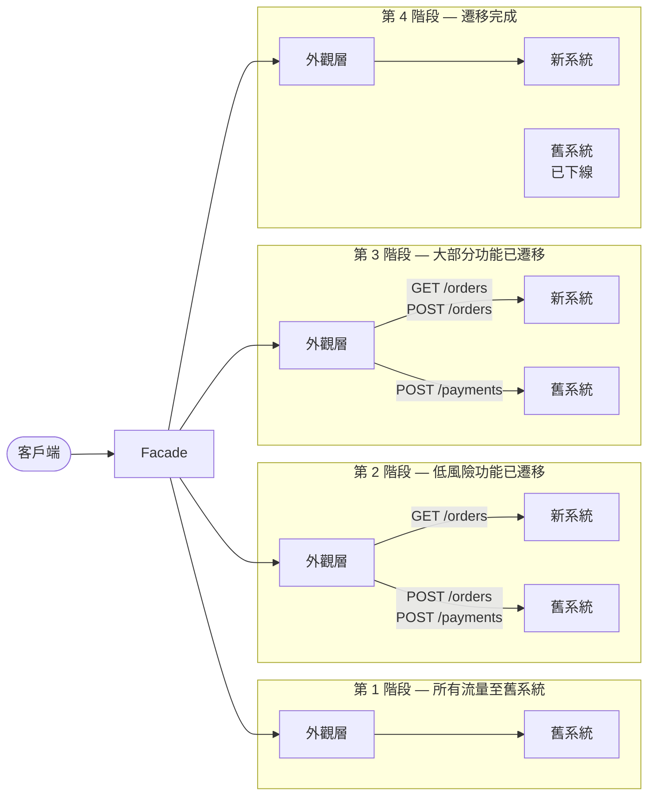

# [BEE-5005] 絞殺者無花果模式

:::info
以新系統包覆舊系統，逐路由、逐功能地遷移，直到舊系統可以安全下線為止。
:::

## 背景

大型後端系統往往累積了多年的業務邏輯、口耳相傳的知識與未成文的行為。到某個時間點，維護該系統的成本會超過重建它的成本。直覺反應是進行「大爆炸式重寫（big-bang rewrite）」：凍結舊系統，從頭建立新系統，然後在固定日期切換。

大爆炸式重寫幾乎都會失敗或超出預算。新系統會重新發現所有舊系統不知不覺處理好的邊際情況，切換日期不斷延後，業務方失去信心，最終團隊兩套系統都要維護，卻沒有任何計畫。

Martin Fowler 於 2004 年創造了「**絞殺者無花果應用（Strangler Fig Application）**」一詞，靈感來自澳洲熱帶雨林中絞殺者無花果植物的行為：無花果種子在宿主樹冠上萌芽，根系向下延伸至土壤，數年間將宿主完全包覆，最終宿主枯死腐爛，無花果獨自聳立。宿主從未經歷單一的災難性事件——無花果只是不斷生長，直到宿主不再被需要。

同樣的策略適用於軟體系統。新系統與舊系統並存，隨時間接管更多流量，直到舊系統無事可做，可以安全關閉。

## 原則

**透過外觀層路由流量。逐功能遷移。完成後下線舊系統。**

三個機制共同運作：

1. **外觀層（Facade / Proxy）** -- 一個路由層位於兩個系統前方。客戶端呼叫外觀層；外觀層決定將每個請求轉發給舊系統還是新系統。客戶端不知道遷移正在進行。

2. **漸進式遷移** -- 功能一次移動一個有界的切片：一個端點、一個領域能力、一個服務。每次遷移相互獨立，可透過更新外觀層的路由規則來回滾。

3. **下線是最後一步** -- 遷移完成的標準是舊系統關閉。讓兩個系統無限期並行運作不是成功狀態——這會使營運負擔與維護成本加倍。

### 遷移階段

| 階段 | 流量分配 | 狀態 |
|------|---------|------|
| 1 | 100% 舊系統 | 外觀層已部署，尚未變更路由 |
| 2 | 混合 -- 新系統處理低風險功能 | 漸進式遷移進行中 |
| 3 | 混合 -- 新系統處理大部分功能 | 遷移後期，舊系統處理殘餘部分 |
| 4 | 100% 新系統 | 舊系統已下線 |

各階段之間沒有單一的切換日期。每個功能依自己的時程移動，整個系統在數週或數月內從第 1 階段漂移至第 4 階段。

## 圖示



## 範例：訂單處理系統遷移

一個電子商務平台運行一套單體式訂單處理系統，負責訂單列表查詢、訂單建立與付款處理。團隊希望在不進行大爆炸式切換的情況下遷移至新系統。

### 遷移順序：以風險為導向

從最低風險的能力開始，以最高風險的能力結束。

| 步驟 | 能力 | 風險 | 理由 |
|------|-----|------|------|
| 1 | 唯讀訂單列表查詢 | 低 | 只讀；回滾極為簡單 |
| 2 | 訂單建立 | 中 | 寫入操作；需要資料同步 |
| 3 | 付款處理 | 高 | 涉及金流；需最高謹慎度 |

### 第 1 階段：外觀層已部署，所有流量至舊系統

```yaml
# 代理路由規則 -- 第 1 階段
routes:
  - path: /orders
    methods: [GET, POST]
    backend: legacy
  - path: /payments
    methods: [POST]
    backend: legacy
```

外觀層已就位，但尚未進行路由變更。這為所有後續階段轉換奠定基礎。

### 第 2 階段：唯讀訂單列表查詢已遷移

新系統實作 `GET /orders`，從舊系統資料庫的複製副本讀取資料（讀取副本或 CDC 同步表）。外觀層將讀取路由至新系統，寫入路由至舊系統。

```yaml
# 代理路由規則 -- 第 2 階段
routes:
  - path: /orders
    methods: [GET]
    backend: new          # 已遷移：唯讀訂單列表查詢
  - path: /orders
    methods: [POST]
    backend: legacy
  - path: /payments
    methods: [POST]
    backend: legacy
```

回滾方式：將 `GET /orders` 改回 `legacy`。資料不受任何風險。

### 第 3 階段：訂單建立已遷移

新系統處理訂單建立。兩個系統現在都會寫入訂單，因此資料必須保持同步。

**轉換期間的雙寫策略：**

```typescript
// 第 3 階段訂單建立期間的代理層
async function handleCreateOrder(req: Request): Promise<Response> {
  // 寫入新系統（往後的權威來源）
  const newResponse = await newSystem.post('/orders', req.body);

  // 鏡像寫入舊系統（維持尚未遷移功能的舊系統一致性）
  await legacySystem.post('/orders', req.body).catch(err => {
    log.warn('Legacy mirror write failed', { orderId: newResponse.id, err });
    // 非致命錯誤：新系統為權威來源
  });

  return newResponse;
}
```

```yaml
# 代理路由規則 -- 第 3 階段
routes:
  - path: /orders
    methods: [GET, POST]
    backend: new          # 已遷移：列表查詢 + 建立
  - path: /payments
    methods: [POST]
    backend: legacy       # 尚未遷移
```

### 第 4 階段：付款處理已遷移，舊系統下線

```yaml
# 代理路由規則 -- 第 4 階段
routes:
  - path: /orders
    methods: [GET, POST]
    backend: new
  - path: /payments
    methods: [POST]
    backend: new          # 已遷移：付款處理
```

舊系統流量降至零。監控一個發布週期後執行下線。

### 資料遷移策略

| 技術 | 適用時機 |
|------|---------|
| 讀取副本 | 新系統在擁有寫入權前先讀取舊系統資料 |
| 雙寫 | 轉換期間兩個系統都接受寫入；其中一個為權威來源 |
| 變更資料捕獲（CDC） | 舊系統資料庫透過 Debezium 等工具將行級變更串流至新系統 |
| 批量填充遷移 | 切換前以批次作業將歷史資料複製至新系統的 schema |

深入了解資料庫遷移策略請參閱 [BEE-6007]。

## 衡量進度

遷移進度必須以量化方式追蹤，而非憑直覺判斷。

**流量佔比指標** -- 每個端點群組中由新系統處理的請求百分比。目標從 0% 向 100% 推進。

**功能同等性清單** -- 針對舊系統中的每項能力，追蹤：(a) 新系統具備同等行為、(b) 已有自動化測試覆蓋、(c) 已透過影子流量或金絲雀部署在正式環境測試。

**影子模式驗證** -- 在切換高風險功能之前，將請求同時路由至兩個系統，回傳舊系統的回應，並記錄兩個回應之間的任何差異。在切換之前解決所有差異。

```
影子模式（付款處理）：
  請求 → 外觀層 → 舊系統 → 回傳回應給客戶端
                 → 新系統 → 僅記錄回應差異（不影響客戶端）
  
  監控：差異率應在切換前降至 0%
```

**下線判定標準** -- 遷移完成的條件：
- 所有路由 100% 由新系統服務
- 舊系統在定義的觀察期間（例如兩週）內未接收任何正式流量
- 所有資料已遷移並驗證完畢
- 舊系統已從基礎設施中移除

## 常見錯誤

### 1. 大爆炸式重寫，而非漸進式遷移

停止舊系統的所有功能開發、花費 12 個月以上在隔離環境中建立新系統、並安排單次切換日期，這不是絞殺者無花果模式——這是換了新名字的大爆炸式重寫，結果相同：新系統遺漏邊際情況、日期不斷延後、業務方失去信心。絞殺者無花果模式只有在新系統從第一天就處理真實正式流量的情況下才有效。

### 2. 沒有回滾計畫

每次路由規則變更必須能在五分鐘內回滾。如果團隊在新系統出現問題時無法立即將 `POST /orders` 切回舊系統，就不是在安全地應用此模式。路由規則應存放在設定檔中，而非需要部署才能變更的程式碼裡。

### 3. 無限期並行運作兩個系統

在遷移「差不多完成」後讓兩個系統繼續運作，是常見的失敗模式。兩個系統意味著雙倍的營運負擔、雙倍的部署流水線、雙倍的待命範圍。絞殺者無花果模式以舊系統下線作為結束。如果沒有明確的下線里程碑，遷移就尚未完成。

### 4. 未衡量功能同等性

團隊常假設新系統與舊系統一致，但第一次嘗試幾乎從未如此。沒有明確的同等性測試——涵蓋每個已遷移功能的完整行為、包含錯誤回應、邊際情況與效能——差異就會在最糟糕的時機於正式環境浮現。影子模式和合約測試（比較新系統輸出與舊系統）是標準工具。

### 5. 忽視資料同步

當寫入操作分散在兩個系統時，舊系統的資料不變性必須在兩個系統中都維持。遺漏一次雙寫、一個 CDC 延遲或一個 schema 差異，會導致靜默的資料分歧，往後才會浮現。在遷移任何涉及狀態的能力之前，先映射所有寫入路徑和讀取路徑。

## 與其他模式的關係

- **[BEE-5001](monolith-vs-microservices-vs-modular-monolith.md)（單體 vs 微服務 vs 模組化單體）** -- 絞殺者無花果是分解單體時的推薦遷移策略。[BEE-5001](monolith-vs-microservices-vs-modular-monolith.md) 定義架構目標；[BEE-5005](strangler-fig-pattern.md) 描述如何在不中斷流量的情況下抵達目標。
- **[BEE-5002](domain-driven-design-essentials.md)（領域驅動設計）** -- DDD 的限界上下文直接對應絞殺者無花果的遷移單元。一次遷移一個限界上下文；上下文邊界提供外觀層分割流量的自然接縫。
- **[BEE-6007](../data-storage/database-migrations.md)（資料庫遷移）** -- 資料遷移與服務遷移並行進行。[BEE-6007](../data-storage/database-migrations.md) 深入涵蓋相關技術（雙寫、CDC、批量填充）。

## 參考資料

- [Martin Fowler -- StranglerFigApplication (2004)](https://martinfowler.com/bliki/StranglerFigApplication.html)
- [Microsoft Azure Architecture Center -- Strangler Fig Pattern](https://learn.microsoft.com/en-us/azure/architecture/patterns/strangler-fig)
- [AWS Prescriptive Guidance -- Strangler Fig Pattern](https://docs.aws.amazon.com/prescriptive-guidance/latest/cloud-design-patterns/strangler-fig.html)
- [Thoughtworks -- Embracing the Strangler Fig Pattern for Legacy Modernization](https://www.thoughtworks.com/en-us/insights/articles/embracing-strangler-fig-pattern-legacy-modernization-part-one)
- [Confluent -- Strangler Fig (event streaming approach)](https://developer.confluent.io/patterns/compositional-patterns/strangler-fig/)
- [BEE-5001](monolith-vs-microservices-vs-modular-monolith.md)：單體 vs 微服務 vs 模組化單體
- [BEE-5002](domain-driven-design-essentials.md)：領域驅動設計精要
- [BEE-6007](../data-storage/database-migrations.md)：資料庫遷移
