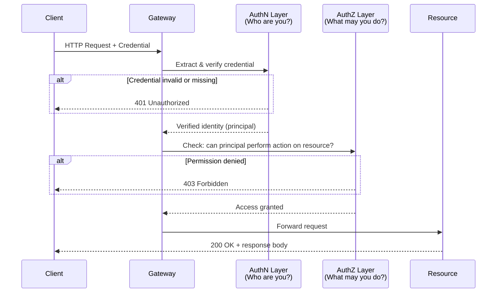

# [BEE-1001] 認證 vs 授權

:::info
認證（Authentication）確認你是誰；授權（Authorization）決定你被允許做什麼。將兩者混為一談是存取控制失效最常見的根源。
:::

## 背景

存取控制失效始終是最嚴重的 Web 應用程式漏洞類型。OWASP 2021 Top 10 將「Broken Access Control」列為第一名，其中有相當大比例的問題源自一個概念錯誤：把已驗證的身份當成已授予的權限。

這兩個概念在基礎標準中有明確的定義：

- **認證（Authentication, AuthN）** — 「確認用於聲明數位身份的一個或多個驗證器有效性的流程。」（NIST SP 800-63-3，第 2 節）
- **授權（Authorization, AuthZ）** — 「驗證特定實體所請求的行動或服務是否被核准的流程。」（NIST，引自 OWASP Authorization Cheat Sheet）

NIST 明確指出兩者是獨立的事項：「認證不決定聲明者的授權或存取權限；這是一個獨立的決策。」（NIST SP 800-63-3，第 4.3.3 節）

RFC 7235 定義了 HTTP 認證框架，並在協定層面強化了這個邊界。401 回應表示客戶端尚未完成認證；403 回應表示伺服器收到有效憑證但仍不足以取得存取權——認證成功，授權失敗。

## 原則

系統 MUST 將認證與授權視為管線中的兩個獨立階段，並依序執行。

1. **AuthN MUST 先於 AuthZ。** 對未驗證身份進行權限檢查是毫無意義的。在確認身份之前，系統無從得知應該檢查誰的權限。

2. **有效的憑證 MUST NOT 被視為授權的核准。** 證明身份（token 有效、密碼匹配）只回答「這是誰？」，並不回答「這個身份可以做什麼？」

3. **授權邏輯 MUST 在伺服器端執行。** 客戶端的檢查僅為 UI 提示。每個觸及受保護資源的請求 MUST 重新依照授權策略進行評估，不論先前是否已做過檢查。

4. **系統 SHOULD 採用預設拒絕（deny by default）原則。** 存取權限 MUST 明確授予。沒有拒絕規則 MUST NOT 被解讀為允許。

5. **授權策略 SHOULD 從應用程式碼中外部化**，移至專用的策略層（例如 RBAC 角色、ABAC 規則、OPA 策略）。散落在各 handler 中的 `if user.role == "admin"` 硬編碼邏輯脆弱且難以審查。

## 圖解

下圖展示單一 HTTP 請求通過身份管線時的兩個獨立關卡。



401 與 403 狀態碼直接對應兩個關卡：身份驗證失敗與權限不足。

## 範例

以下偽代碼展示通用請求處理器中的四步驟管線，刻意不綁定任何特定框架。

```
function handle(request):
    # 步驟 1 — 從請求中提取憑證
    credential = extract_credential(request)
    # 例如：從 Authorization header 解析 Bearer token，
    #        讀取 session cookie，讀取 mTLS 客戶端憑證

    # 步驟 2 — 驗證身份：認證
    principal = verify_credential(credential)
    if principal is null:
        return response(401, "Authentication required")
    # principal 現在是已驗證的身份物件：
    # { id: "user-42", roles: ["editor"], tenant: "acme" }

    # 步驟 3 — 檢查權限：授權
    action   = derive_action(request)        # 例如 "documents:write"
    resource = derive_resource(request)      # 例如 "doc-99"
    allowed  = policy.check(principal, action, resource)
    if not allowed:
        return response(403, "Forbidden")

    # 步驟 4 — 執行請求
    return execute(request, principal)
```

注意 `verify_credential` 和 `policy.check` 是對兩個獨立系統的分別呼叫。Token（憑證）攜帶身份聲明；策略引擎決定權限。一個通過密碼學驗證的有效 token 仍然需要通過 `policy.check`——有效性不等於許可。

### 常見的憑證與策略機制

| 關注點 | 常見機制 |
|---|---|
| AuthN（身份） | 密碼 + 雜湊、JWT/JWS、mTLS 客戶端憑證、passkey/FIDO2、SAML assertion |
| AuthZ（權限） | RBAC（角色）、ABAC（屬性 + 規則）、ReBAC（關係圖）、OPA/Cedar 策略 |

## 常見錯誤

**1. 在驗證身份之前就進行權限檢查。**

若 handler 在確認 `request.user_id` 的真實性之前就呼叫 `policy.check(request.user_id, ...)`，則等同於信任攻擊者提供的輸入。未通過認證的請求 MUST 在步驟 2 被拒絕，而不應進入步驟 3。

**2. 將有效的 token 視為授權決策。**

JWT 通過簽章驗證只證明該 token 由你的系統簽發。它並不證明持有者被允許執行所請求的操作。Token 中內嵌的角色是身份聲明——這些聲明仍然 MUST 依照當前策略進行評估。策略會變更；token 可能已過時。

**3. 在應用程式 handler 中硬編碼授權邏輯。**

```
# 反模式
if request.user.role == "admin":
    allow()
```

散落各處的 `if role == X` 檢查無法一致地審查，在新的程式碼路徑中容易被遺漏，且必須部署才能更新。請將策略評估外部化到專用介面中。

**4. 僅使用 OAuth 2.0 進行認證。**

OAuth 2.0 是授權委派框架。Access token 只證明資源擁有者委派了某些 scope——並不向你的應用程式認證使用者身份。當你需要驗證使用者身份時，請在 OAuth 2.0 之上使用 OpenID Connect（OIDC）。（參見 [BEE-1003](oauth-openid-connect.md)。）

**5. 跳過內部或「可信任」路徑上的授權。**

內部 API、背景任務處理器、以及僅供管理員使用的路由是常見的盲點。每條存取受保護資料的請求路徑 MUST 執行授權檢查，無論請求來自何處。

## 相關 BEE

- [BEE-1002: Token-Based Authentication](11.md) — token 如何建立身份
- [BEE-1003: OAuth 2.0 and OpenID Connect](12.md) — 委派 vs. 認證
- [BEE-1004: Session Management](13.md) — 維持已認證的狀態
- [BEE-1005: RBAC vs ABAC](14.md) — 深入探討權限模型
- [BEE-1006: API Key Management](15.md) — API 憑證模式

## 參考資料

- OWASP, "Authentication Cheat Sheet" (2024). https://cheatsheetseries.owasp.org/cheatsheets/Authentication_Cheat_Sheet.html
- OWASP, "Authorization Cheat Sheet" (2024). https://cheatsheetseries.owasp.org/cheatsheets/Authorization_Cheat_Sheet.html
- NIST, "Digital Identity Guidelines" SP 800-63-3 (2017, updated 2020). https://pages.nist.gov/800-63-3/sp800-63-3.html
- Fielding, R. et al., "Hypertext Transfer Protocol (HTTP/1.1): Authentication" RFC 7235 (2014). https://datatracker.ietf.org/doc/html/rfc7235
- OWASP, "Top 10 — A01:2021 Broken Access Control" (2021). https://owasp.org/Top10/A01_2021-Broken_Access_Control/
