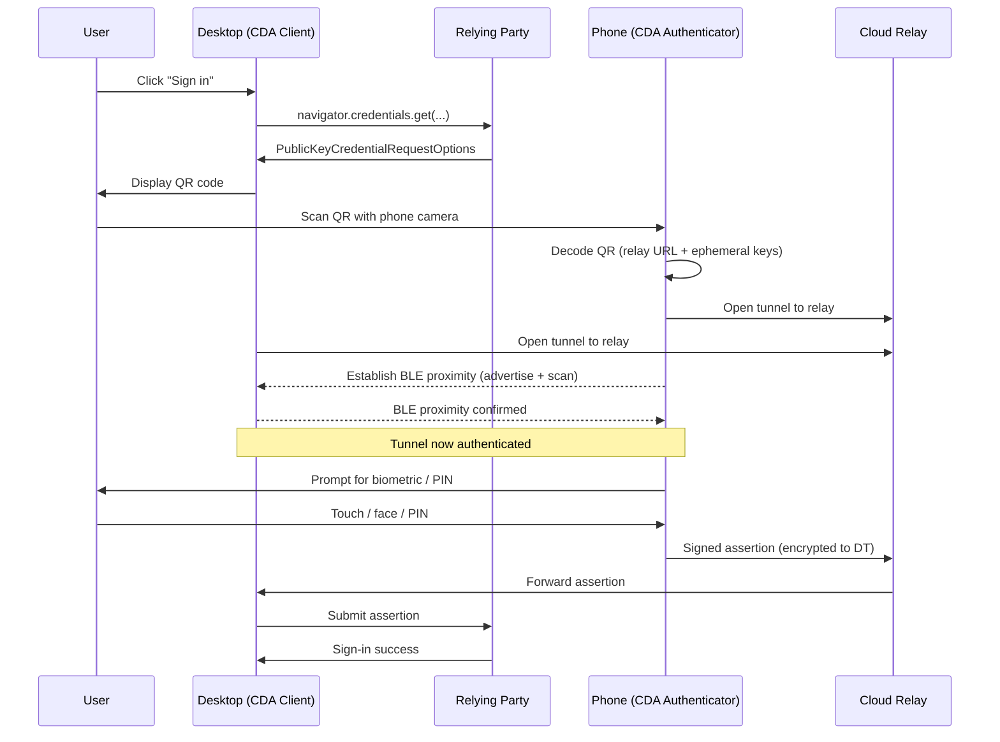

# [BEE-1009] 跨裝置認證（Hybrid Transport）

:::info
混合傳輸（hybrid transport）讓一個裝置上的 passkey 認證另一個裝置上的登入。桌機顯示 QR code、手機掃描，藍牙近距離驗證錨定整個儀式，遠端攻擊者無法攔截。
:::

## 背景

使用者想在從未用過的桌機上登入某中繼方。手機上有 passkey、桌機上沒有。Passkey 之前的解法都有已知弱點：

- **TOTP / 認證 app**：可被釣魚。使用者可能被誘導把驗證碼輸入到釣魚網站。
- **SMS 一次性密碼**：可被釣魚，又有 SIM-swap 攻擊風險。
- **行動 app 的推播通知**：只有當行動 app 自行驗證請求來源時才能擋下釣魚——多數沒有。

FIDO Alliance 的答案是**跨裝置認證 (Cross-Device Authentication, CDA)**，定義為「一個裝置上的 passkey... 可被用於在另一個裝置上登入」這個性質（[passkeys.dev terms](https://passkeys.dev/docs/reference/terms/)）。機制是**混合傳輸**：藍牙低功耗（BLE）的近距離檢查搭配雲端中繼，規範於 CTAP 2.2 §11.5。

## 原則

混合傳輸 **MUST** 使用 BLE 進行近距離驗證，不可只依賴純雲端中繼。桌機 **MUST** 顯示一個 QR code，編碼中繼端點與連線材料；手機 **MUST** 透過 BLE 驗證近距離後才授權儀式進行。中繼方 **MUST NOT** 需要知道有沒有使用 hybrid——在 WebAuthn API 層它是透明的。中繼方 **SHOULD** 預設提供 hybrid，並為沒有手機的使用者提供非 passkey 的後備（例如電子郵件 magic link）。

## QR 接力

端到端流程：

CDA Client 是「中繼方目前被存取的那個裝置」——本場景中的桌機。CDA Authenticator 是「產生 FIDO assertion 的那個裝置」——手機（passkeys.dev）。

## 為什麼需要 BLE，為什麼不用純雲端

BLE 近距離檢查是抗釣魚的錨點。沒有它，一個遠端攻擊者誘騙使用者掃描 QR 後，可以從網際網路任何地方完成儀式。有它，手機只有在能透過 BLE 確認自己物理上接近某個與 QR 連線材料相符的裝置時才會簽章。

CTAP 2.2 §11.5 的說法是：物理近距離建立了「可信任的互動」，避免攻擊者「在手機要求藍牙近距離才能對合法平台認證的前提下，誘騙使用者的手機認證到惡意網站」。

雲端中繼承載加密的協定訊息。中繼路徑上的任何一方只看到密文；只有桌機與手機能解密。中繼是「在裝置間缺乏直接 BLE 連線時的中介服務」，但近距離檢查本身仍要靠 BLE。

## 限制

混合傳輸要求兩台裝置都有可用的藍牙。也需要近期的作業系統支援：

- 認證器端：Android 9（API level 28）以上（[Google Identity 環境支援](https://developers.google.com/identity/passkeys/supported-environments)）。
- CDA Client 端：Chrome 在所有平台上皆支援。
- iOS 16+ 支援 Chrome iOS 作為 passkey 環境；Safari 上由 iCloud Keychain 處理對應流程。

失敗模式：

- **藍牙停用或無法使用**：儀式在近距離檢查前就失敗；使用者必須啟用藍牙或改用後備路徑。
- **無法連到中繼**：封鎖中繼端點的企業網路會讓那些網路上的使用者完全用不了 hybrid。
- **較舊的作業系統**：完全沒有跨裝置選項；使用者退回打密碼或用電子郵件 magic link。

端到端儀式通常花幾秒，主要時間花在使用者掃描與授權。

## 與舊式跨裝置模式的比較

| 模式 | 抗釣魚 | 需安裝 app | 需網路 | 需近距離 |
|------|-------:|-----------:|-------:|---------:|
| 混合傳輸（手機上的 passkey） | 有 | 否（內建於 OS） | 是（中繼） | 是（BLE） |
| 推播通知（自家 app） | 視 app 而定 | 是 | 是 | 否 |
| TOTP 驗證碼（認證 app） | 否 | 是 | 否 | 否 |
| SMS OTP | 否 | 否 | 是（蜂巢式） | 否 |
| 電子郵件 magic link | 否 | 否 | 是 | 否 |

「需近距離」這一欄是分水嶺。沒有近距離，被誘騙的使用者讓遠端攻擊者從任何地方完成儀式。有近距離，攻擊者得跟使用者在同一個房間。

## 何時提供 Hybrid

混合傳輸不需要中繼方端任何設定。中繼方就照 BEE-1007 與 BEE-1008 中所述呼叫 `navigator.credentials.get`；當沒有本地 passkey 時，瀏覽器會把 hybrid 當作可用的驗證器選項之一呈現出來。

中繼方應該：

- 永遠提供條件式 UI 流程（[BEE-1008](passkeys-discoverable-credentials.md)）——這是有本地同步 passkey 的使用者的發現路徑。
- 允許明確的「使用其他裝置上的 passkey」路徑，讓沒有本地 passkey 的使用者手動啟動 hybrid。
- 在 hybrid 不可用的環境中（藍牙停用、中繼被封）提供電子郵件 magic-link 後備。
- Hybrid 登入成功後，提示使用者在桌機上註冊一個 passkey，讓未來在這台桌機上的登入都走本地。

## 常見錯誤

- **自製 QR 為基礎的「掃碼登入」而非使用混合傳輸。** 自製的 QR 流程缺乏 BLE 近距離檢查，可被釣魚。透過 WebAuthn 使用平台的混合傳輸；不要自己做。
- **以為 hybrid 取代了在桌機上註冊 passkey 的需要。** Hybrid 是首次在新桌機上登入的引導。引導之後，提示使用者註冊一個桌機上的本地 passkey，後續登入就能跳過 QR 步驟。
- **把 hybrid 缺席當成致命錯誤。** 藍牙被停用的環境是存在的。提供後備路徑；不要把使用者鎖在門外。
- **本地 passkey 已存在時還呈現 hybrid 選項。** 條件式 UI 已經處理本地 passkey 的情形。同時顯示兩者會讓不理解差異的使用者困惑。

## 相關 BEE

- [BEE-1007](webauthn-fundamentals.md) WebAuthn 基礎 -- 混合傳輸所附著的 API。
- [BEE-1008](passkeys-discoverable-credentials.md) Passkey：可發現憑證與 UX 模式 -- Hybrid 是該文中提及的後備流程之一。
- [BEE-1011](migrating-from-passwords-to-passkeys.md) 從密碼遷移到 Passkey -- Hybrid 是沒有本地 passkey 的使用者的復原故事之一部分。

## 參考資料

- FIDO Alliance. 2023. "Client to Authenticator Protocol (CTAP) 2.2", §11.5 Hybrid Transports. https://fidoalliance.org/specs/fido-v2.2-rd-20230321/fido-client-to-authenticator-protocol-v2.2-rd-20230321.html
- FIDO Alliance / passkeys.dev. "Cross-Device Authentication (CDA)" terminology. https://passkeys.dev/docs/reference/terms/
- Google Identity. "Passkey supported environments". https://developers.google.com/identity/passkeys/supported-environments
