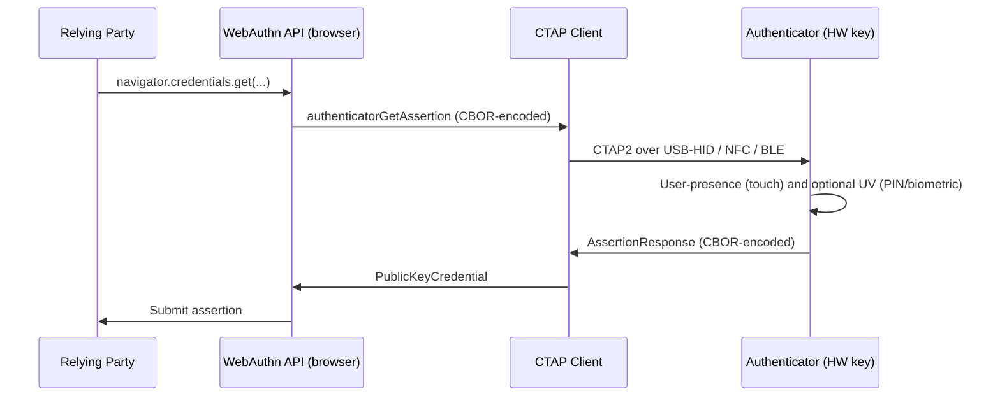

# [BEE-1010] FIDO2 硬體安全金鑰

:::info
硬體安全金鑰 (hardware security key)（YubiKey、SoloKey、Feitian、Token2）是漫遊型 WebAuthn 驗證器，將憑證存放在專用的防竄改晶片上。同步型平台 passkey 處理消費者場景；硬體金鑰則適用於需要 attestation、FIPS 驗證、或不可同步儲存的場景。
:::

## 背景

同步型平台 passkey（[BEE-1008](passkeys-discoverable-credentials.md)）涵蓋消費者認證場景良好。能同步、能復原、住在使用者已有裝置上的生物辨識後面。它們無法涵蓋的場景：

- **受規範的環境**，要求 FIPS 驗證過的硬體（聯邦承包商、金融服務、特定 HIPAA 配置下的醫療）。
- **特權帳號**，中繼方想強制 attestation——只有由核可硬體型號產生的憑證才算數。
- **不信任同步提供者的環境**——使用者、組織、或兩者都偏好憑證永不離開產生它的晶片。
- **共用工作站場景**，使用者沒有個人裝置但有個人硬體金鑰。

對這些場景的答案是**漫遊驗證器** (roaming authenticator)：一個專用硬體裝置，透過 USB、NFC、或 BLE 講 FIDO2 [Client to Authenticator Protocol (CTAP) 2.1](https://fidoalliance.org/specs/fido-v2.1-ps-20210615/fido-client-to-authenticator-protocol-v2.1-ps-20210615.html)。本文涵蓋硬體金鑰在 BEE-1007 與 BEE-1008 建立的 passkey 預設世界中所處的位置。

## 原則

中繼方 **MAY** 透過 `attestation: "direct"` 加上 AAGUID 允許清單要求硬體驗證器。企業 **SHOULD** 對特權帳號強制 attestation。為合規流程使用的硬體金鑰 **MUST** 透過受管理的註冊流程發放，而不是使用者自助發起，這樣 attestation 保證才能在註冊儀式中存活。中繼方 **MUST NOT** 把使用者出席（UP）與使用者驗證（UV）混為一談——協定把它們作為兩個獨立旗標傳遞是有原因的。

## CTAP2 協定層

WebAuthn 是中繼方呼叫的 JavaScript API。CTAP2 是客戶端對驗證器使用的線路協定。CTAP 2.1 定義三種傳輸：

> "Both CTAP1 and CTAP2 share the same underlying transports: USB Human Interface Device (USB HID), Near Field Communication (NFC), and Bluetooth Smart / Bluetooth Low Energy Technology (BLE)."

層次模型：

CTAP2 訊息使用標準 CBOR 編碼（依 CTAP 2.1）。瀏覽器與 OS 層的 WebAuthn 提供者在 JSON 形態的 WebAuthn API 與 CBOR 形態的 CTAP 訊息之間翻譯。中繼方程式碼從不直接接觸 CTAP。

## 硬體金鑰上的可發現 vs 非可發現憑證

可發現憑證（[BEE-1008](passkeys-discoverable-credentials.md)）要求驗證器在私鑰旁儲存 user handle 與顯示名稱。硬體金鑰的內建儲存有限，因此每把金鑰能容納的可發現憑證數量是有上限的。CTAP 2.1 承認此限制：

> "If authenticator does not have enough internal storage to persist the new credential, return CTAP2_ERR_KEY_STORE_FULL."

硬體金鑰滿了時，註冊就會以該錯誤失敗。中繼方應呈現有用的訊息（「您的安全金鑰已無空間；請移除一個未使用的憑證或改用儲存更大的金鑰」）。

非可發現憑證則不限數量。Credential ID 本身編碼了加密的私鑰（用裝置上的金鑰加密金鑰封裝），所以裝置的持久儲存只放封裝金鑰本身。各個憑證隨 credential ID 攜帶。非可發現憑證要求中繼方在認證時提供 `allowCredentials`（credential ID 是查詢材料）。

對追求無帳號名稱登入的消費者流程，搭配同步 passkey 替代方案的硬體金鑰是合理選擇。對逐用戶重置儲存的合規流程，非可發現憑證完全避開儲存限制。

## 何時要求硬體金鑰

| 場景 | 要求硬體？ | 理由 |
|------|-----------:|------|
| 消費者認證 | 否 | 同步 passkey 已提供抗釣魚，無需硬體採購負擔。 |
| 特權管理員帳號（雲端 root、production 資料庫、KMS 管理員） | 是 | Attestation 強制讓憑證綁定核可硬體。 |
| 程式碼簽章 / CA 根金鑰 | 是 | 私鑰必須永不可被取出；防竄改硬體是這個保證。 |
| 受規範環境（FIPS、AAL3） | 是 | NIST SP 800-63B §4.3.2：「AAL3 使用的多因子驗證器 SHALL 是經 FIPS 140 Level 2 以上整體驗證、且物理安全達 FIPS 140 Level 3 以上的硬體密碼模組。」 |
| 高價值消費者帳號（金融、醫療） | 視情況 | 部分使用者把硬體當成選擇；中繼方可作為 opt-in 的較強層級提供。 |

## 企業管理金鑰

對合規流程，中繼方（或其 IT 部門）直接管理金鑰。模式：

1. **採購**：IT 從核可廠商採購硬體金鑰。核可型號的 AAGUID 進入允許清單。
2. **註冊儀式**：IT 進行受管理的註冊作業（親自或透過經驗證的視訊），於其中以帶外方式驗證使用者身分，並把金鑰註冊到使用者帳號。註冊使用 `attestation: "direct"`；中繼方依 FIDO Metadata Service 驗證 attestation 陳述，確認 AAGUID 在允許清單中。
3. **AAL3 證據**：attestation 陳述加上裝置的 FIPS 驗證等級，給中繼方提供文件化的證據——憑證符合 AAL3 要求（依 NIST SP 800-63B §5.1.9.1，裝置「以防竄改硬體封裝一個或多個驗證器專屬的密鑰」）。
4. **替換**：金鑰遺失時，使用者透過相同的受管理註冊程序使用替代金鑰；遺失金鑰的憑證從中繼方資料庫撤銷。

這個機制有效，是因為 attestation 是端到端的：只有由允許清單上的裝置產生的憑證能通過註冊，只有持有該裝置的使用者能後續認證。

## 使用者出席 vs 使用者驗證

CTAP 2.1 在 `authenticatorData` 中區分兩個旗標：

- **使用者出席 (User Presence, UP)** — 使用者「以某種方式與驗證器互動」（CTAP 2.1）。對硬體金鑰而言這是觸碰接觸感應墊。UP 證明有人在；它不證明是誰。
- **使用者驗證 (User Verification, UV)** — 使用者對裝置自身做了認證，「以指紋為基礎的內建使用者驗證方法」或 PIN 輸入。UV 證明特定的人。

兩者獨立傳遞。中繼方從 `authenticatorData.flags` 讀取 UP 與 UV 位元並套用自己的政策：

| 操作 | 需要 UP | 需要 UV |
|------|---------|---------|
| 低價值登入 | 是 | 偏好 |
| Step-up 認證（設定變更、密碼重設） | 是 | 必要 |
| 高價值交易（大額轉帳） | 是 | 必要 |
| Headless 伺服器對伺服器認證 | 不適用 | 不適用（硬體金鑰是使用者驅動的） |

中繼方 **MUST NOT** 把 UP 當成 UV。一次按壓不識別使用者——它確認出席。UV 把使用者的身分因子（PIN 或生物辨識）加入協定層的訊號。

## 常見錯誤

- **在消費者流程上要求 attestation。** 消費者驗證器通常回 `attestation: "none"`；要求 `"direct"` 會擋下使用同步 passkey 的合法使用者。
- **允許使用者自助註冊硬體金鑰用於合規流程。** Attestation 的整個重點就是中繼方知道憑證來自何處。使用者自助註冊破壞稽核軌跡。
- **把 UP 當成 UV。** UP 訊號是「有人觸碰了它」；UV 訊號是「PIN 或生物辨識通過」。它們是不同的事實。混淆兩者的中繼方無法正確強制 step-up 認證。
- **沒有處理儲存上限。** 在已滿的硬體金鑰上註冊可發現憑證會回傳 `CTAP2_ERR_KEY_STORE_FULL`。中繼方應呈現補救訊息，不要只給一般的「註冊失敗」。
- **跳過 U2F 棄用。** 建立在 FIDO U2F（前身協定）上的舊部署需要遷移到 CTAP2；不要假設舊式只支援 U2F 的金鑰能涵蓋相同的合規要求。

## 相關 BEE

- [BEE-1007](webauthn-fundamentals.md) WebAuthn 基礎 -- Attestation conveyance preference 背景。
- [BEE-1008](passkeys-discoverable-credentials.md) Passkey：可發現憑證與 UX 模式 -- 與同步型平台 passkey 的對比。
- [BEE-2003](../security-fundamentals/secrets-management.md) Secrets Management -- 硬體金鑰是程式碼簽章與 KMS 管理員場景中的企業密鑰管理原語。
- [BEE-1011](migrating-from-passwords-to-passkeys.md) 從密碼遷移到 Passkey -- 硬體金鑰是高價值帳號復原故事中的選項。

## 參考資料

- FIDO Alliance. 2021. "Client to Authenticator Protocol (CTAP) 2.1". https://fidoalliance.org/specs/fido-v2.1-ps-20210615/fido-client-to-authenticator-protocol-v2.1-ps-20210615.html
- Yubico. "WebAuthn developer guide". https://developers.yubico.com/WebAuthn/
- NIST. 2017 (revised). "SP 800-63B Digital Identity Guidelines: Authentication and Lifecycle Management". https://pages.nist.gov/800-63-3/sp800-63b.html
- NIST SP 800-63B §4.3 Authenticator Assurance Level 3. https://pages.nist.gov/800-63-3/sp800-63b.html#aal3
- NIST SP 800-63B §5.2.4 Attestation. https://pages.nist.gov/800-63-3/sp800-63b.html#attestation
