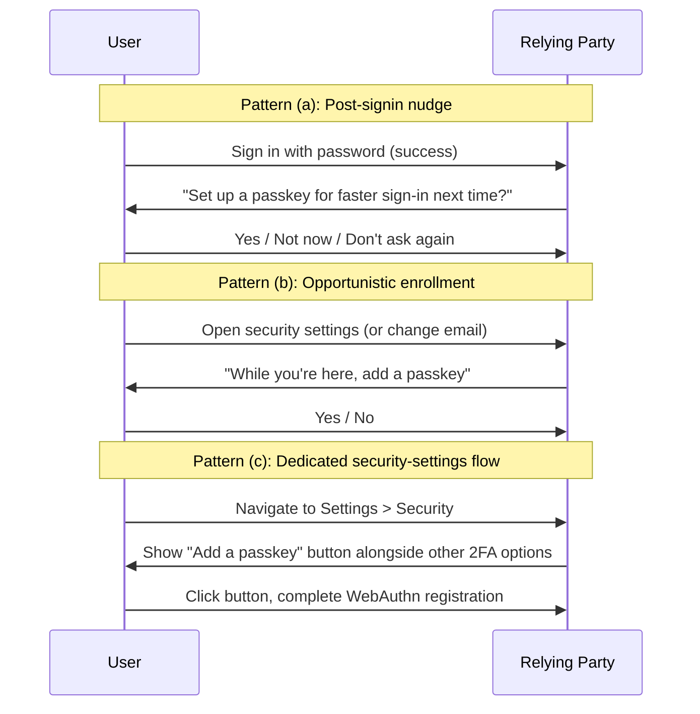

# [BEE-1011] 從密碼遷移到 Passkey

:::info
擁有數百萬密碼帳號的中繼方不會一鍵切換到 passkey。推行是分階段的：passkey 以附加憑證上線、復原流程因威脅模型轉移而被審視，密碼退場是有些站台永遠不會走到的可選最後階段。
:::

## 背景

[BEE-1007](webauthn-fundamentals.md) 涵蓋憑證模型。[BEE-1008](passkeys-discoverable-credentials.md) 涵蓋 passkey UX。[BEE-1009](cross-device-authentication.md) 涵蓋 passkey 在錯誤裝置上時怎麼辦。本文把它們綁回到操作問題：擁有數百萬密碼帳號的既有站台，要怎麼採用 passkey 而不打壞任何人的登入？

Google Identity 的 passkey 指南把高層建議講明白：「我們建議暫時保留現有的認證方法」，因為「使用者可能身處不相容的環境、生態系仍在演進、使用者需要時間適應」（[Google Identity passkey developer guides](https://developers.google.com/identity/passkeys/developer-guides)）。GitHub 的 public-beta 推行採取相同做法：passkey 以 Feature Preview opt-in 的方式上線，密碼仍對所有人可用（[GitHub blog, 2023-07](https://github.blog/2023-07-12-introducing-passwordless-authentication-on-github-com/)）。

本文走過推行手冊以及隨之而來的威脅模型審視。

## 原則

中繼方 **MUST** 在推行的至少第一階段中把 passkey 當作附加憑證，而非取代品。中繼方 **SHOULD** 在登入成功後（post-signin nudge）才提示註冊，而非首次註冊時。中繼方 **MUST** 對每個復原通道針對新威脅模型重新審視——一旦密碼不再是最弱環節，SMS 重設就是了。中繼方 **MAY** 在帳號 opt-in 並長期成功使用 passkey 之後讓密碼退場，但 **MUST NOT** 強迫退場。

## 共存：附加憑證

第一階段：使用者有密碼；我們加上 passkey；兩者都能用。中繼方的資料庫需要一個容納這個的憑證模型：

```sql
CREATE TABLE credentials (
  id           UUID PRIMARY KEY,
  user_id      UUID NOT NULL REFERENCES users(id),
  type         TEXT NOT NULL CHECK (type IN ('password', 'webauthn')),
  -- type='password' fields:
  password_hash TEXT,
  -- type='webauthn' fields:
  credential_id BYTEA,
  public_key    BYTEA,
  sign_count    BIGINT,
  aaguid        UUID,
  transports    TEXT[],
  created_at    TIMESTAMPTZ NOT NULL,
  last_used_at  TIMESTAMPTZ
);
```

一個使用者可以有一列 `type = 'password'` 和零到多列 `type = 'webauthn'`。登入表單兩者都支援：帳號欄位帶 `autocomplete="username webauthn"` 啟用條件式 UI（[BEE-1008](passkeys-discoverable-credentials.md)），密碼欄位則對沒有註冊 passkey 的使用者顯示。

GitHub 的共存做法指出「GitHub.com 上的 passkey 要求使用者驗證，意味著它們以一個算兩個因子」。先前要求密碼 + 2FA 的中繼方，當 passkey 帶 UV 時可以把要求縮減為 passkey-only——裝置的生物辨識或 PIN 在協定層提供第二因子。

## 註冊流程設計

三種模式，依干擾度遞增：



模式 **(a)** 抓到最大流量但拿干擾度換轉換率。模式 **(b)** 抓到使用者已證明身分的 flow-state 時刻。模式 **(c)** 是 GitHub 的起點：透過 Settings > Feature Preview opt-in，流量較低但雜訊也較低。一個站台可以三者並用；它們互不排斥。

在提示上加入「下次再說 / 不要再問」。每次登入都被提示的使用者最終會把提示當成 banner-blindness；能安靜把提示關掉的使用者，準備好的時候會說好。

## 帳號復原

Passkey 住在中繼方無法控制的裝置上。失去手機的使用者可能失去 passkey（同步可緩解，但同步是使用者的選擇，不是中繼方的）。復原通道需要對新威脅模型重新審視：

| 復原通道 | Passkey 之前的弱點 | Passkey 之後的弱點 |
|----------|---------------------|---------------------|
| 電子郵件 magic-link | 可被釣魚（使用者在釣魚頁上點郵件中的連結） | 不變——但現在成為攻不破 passkey 的攻擊者的**正門** |
| SMS 重設 | SIM-swap 攻擊繞過一切 | 同樣；現在是**更高價值目標**，因為密碼不再是最弱路徑 |
| 註冊時印出的備援碼 | 使用者可能弄丟 | 使用者必須真的妥善保存；缺口會在復原時顯現 |
| 信任聯絡人 / 社交復原 | 複雜；少有部署 | 同樣複雜，但值得重新評估 |
| 透過第二把已註冊 passkey 重新註冊 | 不適用 | **最佳選項**——要求使用者已註冊 ≥2 台裝置 |

規則：每個繞過 passkey 的復原通道都是新的攻擊面。中繼方 **SHOULD** 在完全淘汰較弱復原通道之前，先要求註冊一把第二 passkey（在另一台裝置或硬體金鑰上）。

GitHub 的教訓引述：「同步 passkey 防止裝置遺失導致的帳號鎖定；跨裝置認證透過物理近距離要求維持抗釣魚」——同步是復原的第一道；跨裝置認證（[BEE-1009](cross-device-authentication.md)）是第二道。

## 威脅模型轉移

Passkey 之前，密碼是最弱環節。Passkey 之後，攻擊者轉向繞過 passkey 的任何復原流程。逐通道審視：

- **SMS 重設**：SIM-swap 攻擊向來打敗 SMS 為基礎的 2FA。一旦 SMS 重設能繞過 passkey，攻擊者的回報增加。考慮把 SMS 重設放在多步驟驗證後，或對啟用 passkey 的帳號移除 SMS 重設。
- **支援人員手動重設**：打給客服向來是社會工程的逃生口。收緊驗證程序；要求使用者證明持有攻擊者不易取得的東西。
- **電子郵件 magic-link**：仍可被釣魚。考慮要求 magic link 必須在已註冊 passkey 的裝置上開啟（在 magic-link 著陸頁上以 WebAuthn assertion 驗證）。
- **帳號匯出與憑證匯出流程**：確保它們本身就要求 passkey assertion。

轉移是結構性的：別再問「這個憑證夠強嗎？」，開始問「這條復原路徑夠強嗎？」。

## 遙測：知道它有效

要儀器化的訊號：

- **Passkey 註冊率**：每次登入、每活躍使用者、每分群。只能當基線——高註冊率搭配低使用率，代表使用者並沒有真的用 passkey 登入。
- **條件式 UI 填寫率**：在帳號欄位顯示條件式 UI 的工作階段中，多少比例的使用者選了 passkey 而非打密碼。低填寫率暗示使用者不理解自動填寫 UX。
- **依憑證類型的登入成功率**：passkey 與密碼的登入成功率比較。差距代表 passkey 流程有 UX bug。
- **復原通道使用率**：passkey 推行後 SMS 重設量上升是警訊；要不是使用者比預期更快失去 passkey，就是攻擊者在轉移。
- **依憑證類型的登入時間**：passkey 應該比密碼快；如果不是，有問題。

GitHub 的部落格沒有公布量化的採用數字，但上述指標框架是推行團隊需要的營運基線。

## 推行排序

分階段推行：

1. **內部 dogfood。** 僅員工。條件式 UI 啟用。完整儀器化。在公開眼睛看到之前解掉明顯 bug。
2. **Opt-in beta。** 功能旗標。願意打開設定的公開使用者。GitHub 由此起步，事後訊號是回饋量——public beta 浮出 internal dogfood 看不到的邊緣案例。
3. **新使用者預設。** 所有新註冊帳號都會收到 passkey 註冊提示。轉換遙測會告訴你提示 UX 是否有效。
4. **既有使用者 opt-in。** 對既有使用者基數做 post-signin nudge。最大流量在這裡進來；預期最高的支援負載。
5. **漸進地廢除密碼表單。** 對已註冊 passkey 的帳號，預設隱藏密碼欄位。在安全設定中提供「刪除密碼」。
6. **（可選，長期）密碼退場。** 對已成功使用 passkey 達 ≥N 個月的帳號刪除密碼憑證。多數消費者中繼方永遠不會走到這一階段；可選性才是重點。

## 常見錯誤

- **一夜之間以 passkey 取代密碼。** 在沒有警告下打斷使用者的流程。分階段推行；至少在 1-4 階段保留密碼。
- **沒有審視復原流程。** 威脅模型已轉移；SMS 重設是新的正門。在出推行對外公告前更新審視。
- **只把 passkey 註冊率當成功指標。** 高註冊率、低實際 passkey 登入率，代表使用者不理解流程。追蹤使用率而非僅僅註冊率。
- **忘記帳號匯出。** 部分使用者會切換同步提供者（iCloud Keychain → 1Password 或反之）。準備好憑證輪替流程：使用者以舊 passkey 認證，再到新提供者註冊新的 passkey。
- **強制密碼退場。** 即使愛用 passkey 的使用者也可能想保留密碼作為復原選項。強制退場讓沒準備好的人擱淺。

## 相關 BEE

- [BEE-1007](webauthn-fundamentals.md) WebAuthn 基礎 -- 憑證模型背景。
- [BEE-1008](passkeys-discoverable-credentials.md) Passkey：可發現憑證與 UX 模式 -- 註冊流程設計使用本文的 passkey 概念。
- [BEE-1009](cross-device-authentication.md) 跨裝置認證 -- 本地缺 passkey 時透過跨裝置的復原。
- [BEE-1010](fido2-hardware-security-keys.md) FIDO2 硬體安全金鑰 -- 高價值帳號「第二把裝置」復原故事的選項。
- [BEE-1004](session-management.md) Session Management -- passkey 登入後發放的工作階段仍適用。

## 參考資料

- Google Identity. "Passkey developer guides". https://developers.google.com/identity/passkeys/developer-guides
- GitHub Blog. 2023-07-12. "Introducing passwordless authentication on GitHub.com". https://github.blog/2023-07-12-introducing-passwordless-authentication-on-github-com/
- FIDO Alliance / Passkey Central. "How passkeys work". https://www.passkeycentral.org/introduction-to-passkeys/how-passkeys-work
- W3C. 2024. "Web Authentication: An API for accessing Public Key Credentials -- Level 3". https://www.w3.org/TR/webauthn-3/
