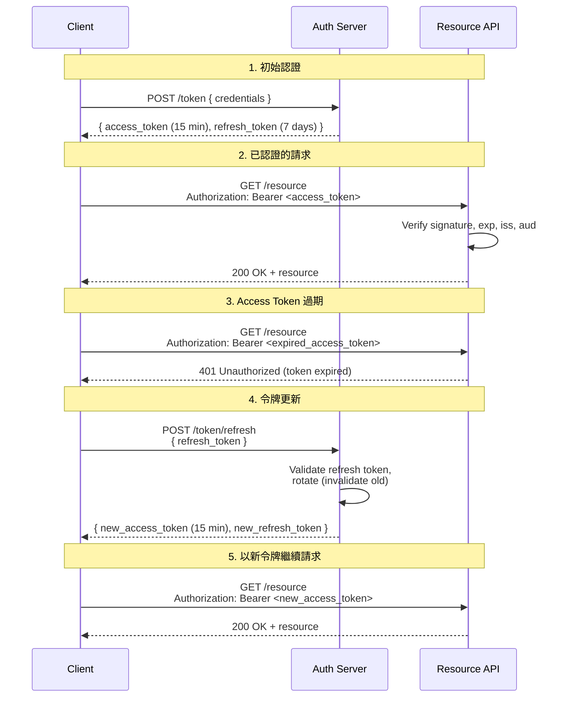

# [BEE-1002] 基於令牌的認證

:::info
基於令牌的認證（Token-Based Authentication）以可自我驗證或可由伺服器核實的憑證取代伺服器端 session 狀態，讓每次請求都攜帶憑證，實現無狀態、可水平擴展的服務架構。
:::

## 背景

傳統 session 式認證將認證狀態儲存於伺服器端：cookie 中的 session ID 對應到伺服器上記錄使用者身分的條目。單一伺服器部署時運作良好，但在規模化時產生摩擦——叢集中的每個節點都需要存取同一個 session 儲存，增加延遲並引入額外的運維依賴。

基於令牌的認證將狀態移入令牌本身（或透過令牌 ID 進行少量查詢）。伺服器在登入時簽發一個已簽名的令牌；用戶端在後續每次請求中出示該令牌。伺服器驗證令牌的完整性，而非查詢共享儲存。不需要 session 親和性，也不需要共享快取。

RFC 6750（「The OAuth 2.0 Authorization Framework: Bearer Token Usage」）定義了令牌傳輸的 HTTP 規範。RFC 7519 定義了 JWT（JSON Web Token），即結構化、自我包含令牌的主流格式。OWASP JWT Security Cheat Sheet 彙整了安全令牌處理的實務指引。

目前有兩種常見令牌格式：

| 屬性 | JWT（自我包含） | 不透明令牌（Opaque Token） |
|---|---|---|
| 內容 | 已簽名的 JSON claims，持有金鑰的任何一方均可讀取 | 隨機字串；含義僅存在於伺服器儲存中 |
| 驗證方式 | 在本地驗證簽名與 claims，無需伺服器往返 | 必須呼叫 token introspection 或查詢端點 |
| 撤銷難度 | 較難：有效期內有效，除非使用拒絕清單（denylist） | 容易：從儲存中刪除即可 |
| Payload 暴露 | Claims 以 base64 編碼，並非加密 | 用戶端無法看到任何內容 |
| 典型用途 | 服務間短期 access token | 需要即時撤銷的較長期令牌 |

兩種格式都沒有普遍優劣之分，選擇取決於撤銷需求、信任邊界與運維限制。

## 原則

**P1 — 令牌 MUST 經過簽名。** 未簽名的 JWT（演算法 `none`）MUST 被拒絕。伺服器 MUST 在信任任何 claim 之前，以已知金鑰驗證令牌簽名。（RFC 7519 §6；OWASP JWT Cheat Sheet）

**P2 — Access token MUST 短期有效。** Access token SHOULD 的有效期為 15 分鐘或更短。短有效期可在不需要撤銷基礎設施的情況下，限制令牌洩漏的損害範圍。（OWASP JWT Cheat Sheet §Token Lifetime）

**P3 — MUST 使用 refresh token 延長 session，而非延長 access token 有效期。** 當 access token 到期時，用戶端使用一個獨立的、有效期較長的 refresh token 來取得新的 access token。Refresh token SHOULD 為一次性使用（輪換機制），且 MUST 在伺服器端安全儲存，以便能夠撤銷。（RFC 6749 §1.5）

**P4 — 用戶端的令牌儲存方式 MUST 根據威脅模型選擇。** 儲存於 `localStorage` 或 `sessionStorage` 的令牌可被頁面上任意 JavaScript 讀取，容易受到 XSS 攻擊。儲存在設有 `httpOnly`、`Secure`、`SameSite=Strict` 屬性的 cookie 中的令牌，則無法被 JavaScript 讀取。對於瀏覽器用戶端，RECOMMENDED 使用 `httpOnly` cookie 儲存 refresh token。（OWASP JWT Cheat Sheet §Token Storage）

**P5 — 伺服器 MUST 在每次請求時驗證所有相關 claims。** 驗證 MUST 包含：簽名核實、過期時間（`exp`）、生效時間（`nbf`，若存在）、簽發者（`iss`）及受眾（`aud`）。部分驗證等同於未驗證。（RFC 7519 §7.2）

**P6 — JWT payload MUST NOT 包含敏感資料。** Payload 以 base64url 編碼，並非加密，任何取得令牌的人均可解碼並讀取所有 claims。除非令牌同時使用加密（JWE），否則 MUST NOT 將敏感資料（PII、密鑰、細粒度權限）放入 JWT。

**P7 — 令牌 SHOULD 透過 `Authorization: Bearer` header 傳輸。** 避免將令牌嵌入 URL query 參數；URL 會被 proxy、瀏覽器及伺服器 access log 記錄，從而暴露令牌。（RFC 6750 §2）

## 圖解

以下流程圖展示完整的令牌生命週期：初始認證、令牌使用、過期及更新。



## 範例

### JWT 結構

JWT 由三個以 base64url 編碼的部分組成，以點（`.`）分隔：

```
eyJhbGciOiJSUzI1NiIsInR5cCI6IkpXVCJ9   <- header
.
eyJpc3MiOiJodHRwczovL2F1dGguZXhhbXBsZS5jb20iLCAic3ViIjoiN...  <- payload
.
SflKxwRJSMeKKF2QT4fwpMeJf36POk6yJV_adQssw5c   <- signature
```

**Header**（解碼後）：

```json
{
  "alg": "RS256",
  "typ": "JWT"
}
```

- `alg`：簽名演算法。正式環境 SHOULD 使用 `RS256`（非對稱）或 `ES256`。絕對不接受 `none`。
- `typ`：令牌類型。標準令牌固定為 `JWT`。

**Payload**（解碼後）：

```json
{
  "iss": "https://auth.example.com",
  "sub": "user-7f3a9b",
  "aud": "https://api.example.com",
  "exp": 1712530800,
  "iat": 1712530200,
  "nbf": 1712530200,
  "jti": "a1b2c3d4-e5f6-7890-abcd-ef1234567890",
  "role": "editor"
}
```

| Claim | 意義 | 是否需要驗證 |
|---|---|---|
| `iss`（issuer） | 令牌簽發者 | MUST 與預期簽發者一致 |
| `sub`（subject） | 令牌所代表的主體（使用者 ID） | 作為主體身分使用 |
| `aud`（audience） | 令牌的預定接收方 | MUST 與本服務識別碼一致 |
| `exp`（expiration） | 令牌失效的 Unix 時間戳記 | 若 `now > exp` 則 MUST 拒絕 |
| `iat`（issued at） | 令牌簽發時的 Unix 時間戳記 | 用於稽核；注意時鐘偏差 |
| `nbf`（not before） | 令牌生效前的 Unix 時間戳記 | 若 `now < nbf` 則 MUST 拒絕 |
| `jti`（JWT ID） | 令牌的唯一識別碼 | 用於一次性使用或拒絕清單檢查 |
| `role` | 應用程式自訂 claim | 非 RFC 標準；依需求處理 |

**Signature**：伺服器以私鑰對 `base64url(header) + "." + base64url(payload)` 進行簽名。接收方以對應的公鑰驗證。任何對 header 或 payload 的篡改都會導致簽名無效。

### Refresh token 輪換

用戶端交換 refresh token 時，伺服器 SHOULD 立即使舊 refresh token 失效並簽發新的。若攻擊者竊取 refresh token 並搶先使用，合法用戶端下次更新時將會失敗（令牌已被使用），從而提醒系統可能發生了安全事件。

## 常見錯誤

**1. 將敏感資料儲存於 JWT payload。**

Payload 以 base64url 編碼，可被任何人輕易解碼，並非加密。任何取得或攔截令牌的人都能讀取所有 claims。除非使用 JWE（RFC 7516）額外加密，否則不應將密碼、PII、密鑰或細粒度權限資料放入 JWT payload。

**2. 未在每次請求時驗證令牌簽名。**

跳過簽名驗證（或接受 `alg: none`）意味著攻擊者可偽造含有任意 claims 的令牌。簽名驗證並非可選步驟，而是安全邊界所在。必須在讀取任何 claim 之前先驗證簽名。

**3. 使用長期有效的 access token，而非短期 access token + refresh token 的組合。**

洩漏的 24 小時 access token 在無撤銷機制（拒絕清單）的情況下，可被濫用 24 小時。15 分鐘的 access token 將損害視窗縮短至 15 分鐘。應使用短期 access token 配合獨立的更新流程。

**4. 將令牌儲存於 localStorage。**

`localStorage` 可被頁面上的所有 JavaScript 存取。一個 XSS 漏洞即可讓攻擊者取得所有已儲存的令牌。對於瀏覽器用戶端，refresh token 應使用 `httpOnly` cookie 儲存。Access token 可在頁面生命週期內保存於記憶體（JavaScript 變數），無需持久化至任何儲存 API。

**5. 未驗證 `aud`（受眾）claim。**

為 `api-a.example.com` 簽發的 access token 若被出示給 `api-b.example.com`，應被拒絕。若未驗證受眾 claim，為某個服務簽發的令牌將被其他服務所接受，破壞令牌設計中的隔離性。

## 相關 BEE

- [BEE-1001: Authentication vs Authorization](10.md) — 身分識別與權限的概念邊界
- [BEE-1002: OAuth 2.0 and OpenID Connect](11.md) — 令牌簽發與委派流程
- [BEE-1004: Session Management](13.md) — 伺服器端 session 作為令牌的替代方案
- [BEE-2001: OWASP Top 10 Mapping](30.md) — 安全漏洞背景
- [BEE-2002: Cryptographic Primitives](31.md) — 簽名演算法與金鑰管理基礎

## 參考資料

- Jones, M. et al., "JSON Web Token (JWT)" RFC 7519 (2015). https://datatracker.ietf.org/doc/html/rfc7519
- Jones, M. and Hardt, D., "The OAuth 2.0 Authorization Framework: Bearer Token Usage" RFC 6750 (2012). https://datatracker.ietf.org/doc/html/rfc6750
- Jones, M. et al., "JSON Web Algorithms (JWA)" RFC 7518 (2015). https://datatracker.ietf.org/doc/html/rfc7518
- Jones, M., "JSON Web Encryption (JWE)" RFC 7516 (2015). https://datatracker.ietf.org/doc/html/rfc7516
- OWASP, "JSON Web Token Security Cheat Sheet" (2024). https://cheatsheetseries.owasp.org/cheatsheets/JSON_Web_Token_for_Java_Cheat_Sheet.html
- OWASP, "Authentication Cheat Sheet" (2024). https://cheatsheetseries.owasp.org/cheatsheets/Authentication_Cheat_Sheet.html
- Auth0, "The Refresh Token Rotation" (developer documentation). https://auth0.com/docs/secure/tokens/refresh-tokens/refresh-token-rotation
- Hardt, D. (ed.), "The OAuth 2.0 Authorization Framework" RFC 6749, §1.5 (2012). https://datatracker.ietf.org/doc/html/rfc6749#section-1.5
