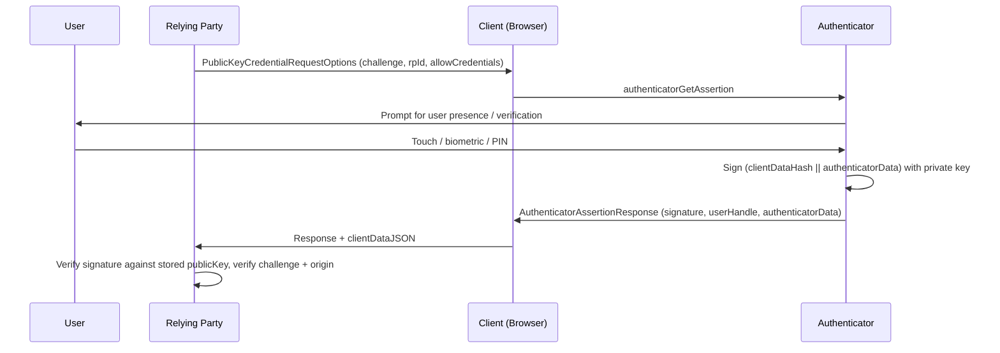

# [BEE-1007] WebAuthn 基礎

:::info
WebAuthn 是 W3C 的公開金鑰認證 API。它以與來源綁定的公私鑰對取代共享密鑰式的密碼，將釣魚從使用者教育問題轉成密碼學上的不可能。
:::

## 背景

[BEE-1002](token-based-authentication.md) 與 [BEE-1003](oauth-openid-connect.md) 涵蓋了過去二十年主導後端認證的憑證模型：透過表單發放密碼，再交換成 bearer token 或 OIDC ID token。這個模型有一個業界從未補上的結構缺陷。密碼是共享密鑰。使用者能輸入到合法網站的東西，也能被輸入到釣魚網站。憑證填充攻擊、外洩重用、SIM-swap 過的 2FA 都利用同一個性質：密鑰沒有與發放它的來源綁定。

[Web Authentication Level 3](https://www.w3.org/TR/webauthn-3/) 以公私鑰對取代共享密鑰：驗證器（使用者控制的裝置）持有私鑰，中繼方（伺服器）只持有公鑰。私鑰永遠不離開驗證器。驗證器產生的簽章與請求簽章的來源綁定。釣魚網站無法取出金鑰，驗證器也會拒絕為錯誤來源簽章。FIDO Alliance 描述這個性質為：「使用者沒有辦法不慎在攻擊者的網站上輸入它」（"there is no way for the user to inadvertently type it on an attacker's site"），因為憑證「只會出示給註冊它的那個網站」（[Passkey Central](https://www.passkeycentral.org/introduction-to-passkeys/how-passkeys-work)）。

本文涵蓋基礎。本系列其餘文章（[BEE-1008](passkeys-discoverable-credentials.md)、[BEE-1009](cross-device-authentication.md)、[BEE-1010](fido2-hardware-security-keys.md)、[BEE-1011](migrating-from-passwords-to-passkeys.md)）建立在此處定義的模型之上。

## 原則

中繼方 **MUST** 驗證每個 WebAuthn 回應中的挑戰值（challenge）以及 `clientDataJSON` 中的 origin。中繼方 **MUST** 原樣保存憑證 ID（credential ID）以及可供驗證簽章的公鑰格式。中繼方 **SHOULD** 對高價值操作要求使用者驗證（user verification），**MAY** 對受規範或企業情境要求 attestation。中繼方 **MUST NOT** 將 WebAuthn 回應本身視為使用者身分證明——它證明的是使用者持有先前綁定到該帳號的憑證，而非當下是哪個人。

## 三方模型

WebAuthn 的儀式涉及三方（W3C WebAuthn L3 §4 Terminology）：

- **中繼方 (relying party, RP)。** 需要認證的 Web 應用。以 `rpId` 識別，通常是可註冊的網域（`example.com`）。中繼方持有公鑰。
- **客戶端 (client)。** 使用者代理（瀏覽器、作業系統層的 WebAuthn 提供者），在使用者與驗證器之間中介。客戶端負責建立 `clientDataJSON`，內含 origin、challenge 和儀式類型。
- **驗證器 (authenticator)。** 持有私鑰的密碼學實體。可以是裝置內建的**平台驗證器** (platform authenticator)（Touch ID、Windows Hello），或透過 USB、BLE、NFC 連線的**漫遊驗證器** (roaming authenticator)（YubiKey、SoloKey）——見 W3C §1.2.1 與 §1。

幾個會在系列文中反覆出現的詞彙：

| 詞彙 | 定義 |
|------|------|
| `rpId` | 中繼方識別碼，通常是可註冊網域。憑證的作用範圍以此為界。 |
| 憑證 ID (credential ID) | 一段「機率上唯一的位元組序列」（W3C §4），最長 1023 bytes。對中繼方而言不透明——原樣儲存與回傳。 |
| user handle | 中繼方在註冊時提供的不透明使用者識別。在認證回應中回傳，讓中繼方無需使用者輸入帳號名稱即可查到帳號。 |
| AAGUID | Authenticator Attestation GUID。識別驗證器型號（W3C §6.5.1），同型號的驗證器產出的所有憑證都共用相同的 AAGUID。用於企業端的允許清單。 |

## 註冊儀式

註冊建立新憑證並將公鑰回傳給中繼方。從 W3C §1.3.1 看，流程如下：

```mermaid
sequenceDiagram
    participant U as User
    participant RP as Relying Party
    participant C as Client (Browser)
    participant A as Authenticator

    RP->>C: PublicKeyCredentialCreationOptions (challenge, rpId, user, pubKeyCredParams)
    C->>A: authenticatorMakeCredential
    A->>U: Prompt for user presence / verification
    U->>A: Touch / biometric / PIN
    A->>A: Generate keypair, store private key
    A->>C: AuthenticatorAttestationResponse (credentialId, publicKey, attestationObject)
    C->>RP: Response + clientDataJSON
    RP->>RP: Verify challenge, origin, attestation; store (credentialId, publicKey)
```

中繼方端建構這個呼叫的選項物件大致如下：

```json
{
  "challenge": "<random bytes, base64url>",
  "rp": { "id": "example.com", "name": "Example" },
  "user": {
    "id": "<opaque user handle, base64url>",
    "name": "alice@example.com",
    "displayName": "Alice"
  },
  "pubKeyCredParams": [{ "type": "public-key", "alg": -7 }],
  "authenticatorSelection": { "userVerification": "preferred" },
  "attestation": "none"
}
```

`alg: -7` 是 ES256（在 P-256 上運作的 ECDSA，搭配 SHA-256）。中繼方 **MUST** 驗證回應中的 `clientDataJSON.challenge` 與自己發出的相符、`clientDataJSON.origin` 與預期的 origin 相符，以及（當有要求 attestation 時）attestation 陳述能對信任根驗證通過。

## 認證儀式

認證證明使用者掌握先前註冊的私鑰。從 W3C §1.3.3：



中繼方的請求形狀：

```json
{
  "challenge": "<random bytes, base64url>",
  "rpId": "example.com",
  "allowCredentials": [
    { "type": "public-key", "id": "<credentialId, base64url>" }
  ],
  "userVerification": "preferred"
}
```

簽章的計算對象是 `authenticatorData` 與 `SHA-256(clientDataJSON)` 的串接。中繼方重新計算該雜湊、以儲存的公鑰驗證簽章，並確認 `clientDataJSON` 中的 challenge 與 origin。`authenticatorData` 中的簽章計數器（當不為零時）提供複製偵測：相對於儲存值倒退的計數值代表憑證可能被複製。

## 為什麼抗釣魚是免費附贈

抗釣魚是結構性的，不是流程性的。兩個機制強制執行：

- **`clientDataJSON` 中的 origin。** 客戶端（瀏覽器，不是頁面）將驗證過的 origin 寫入 `clientDataJSON`，再傳給驗證器。`example-attacker.com` 上的釣魚頁面無法謊報來源——瀏覽器供應的就是真相。
- **驗證器端的 `rpId` 綁定。** 驗證器在註冊時把 `rpId` 與憑證一起儲存。認證時，客戶端送出當前頁面的 `rpId`，驗證器若不相符就拒絕簽章。

即使使用者被誘導訪問 `example-attacker.com`，且該頁面試圖代理 WebAuthn 儀式，驗證器看到的 `rpId` 仍然錯誤，簽章不會發生。對比之下，TOTP 或 SMS 驗證碼可以被社會工程誘騙到使用者把碼打到釣魚頁。

## Attestation

註冊回應可以包含一個 **attestation 陳述**，證明該憑證是由哪個型號的驗證器產生（W3C §6.5）。Attestation 回答的問題例如：「這真的是 YubiKey 5 NFC 嗎？」或「這個憑證真的在 Apple 裝置上產生嗎？」——當中繼方需要強制執行硬體允許清單時派得上用場。

中繼方透過 `PublicKeyCredentialCreationOptions` 中的 `attestation` 欄位表達偏好（W3C §5.4.7）。可選值：

| 值 | 含義 |
|----|------|
| `"none"` | 不要 attestation。多數面向消費者的中繼方使用此值——attestation 有隱私意涵，且一般登入並不需要。 |
| `"indirect"` | 客戶端可以用自己的根將 attestation 資料匿名化。 |
| `"direct"` | 未經修改的 attestation 陳述送達中繼方。當中繼方打算驗證驗證器型號時使用。 |
| `"enterprise"` | 企業專屬的 attestation 鏈。當中繼方與使用者所屬組織有預先安排的信任關係時使用。 |

Attestation 陳述格式包含 `packed`（W3C §8.2）、`fido-u2f`（§8.6，傳承自 U2F 的舊式格式）以及 `none`（§8.7，沒有要求 attestation 時的占位）。被 attest 的憑證資料中嵌入的 AAGUID 識別驗證器型號，支援允許清單的強制執行。

對消費者應用，請求 `"none"`。對 IT 發放硬體金鑰給員工、需要驗證型號真實性的企業部署，請求 `"direct"` 並依據 FIDO Metadata Service 驗證 attestation 陳述。

## 常見錯誤

- **將憑證 ID 雜湊後儲存。** 憑證 ID 是不透明值，不是密鑰。中繼方必須原樣儲存與回傳——雜湊會破壞驅動認證儀式的查詢。
- **重用 challenge。** 每個儀式 **MUST** 使用全新、單次性的 challenge。重用會破壞協定的抗重放性質。
- **把使用者驗證 (UV) 當成身分證明。** `authenticatorData` 中的 UV 旗標證明本地的某個人做了某件事（PIN、生物辨識）。它不證明是哪個人。中繼方知道憑證被使用了；那個人的身分由註冊時與該憑證綁定的帳號決定。
- **把 attestation 當成認證。** Attestation 說明驗證器是什麼。它不說明使用者是誰。混淆兩者會導致允許清單在裝置韌體更新 AAGUID 時把使用者鎖在門外。
- **跳過 origin 驗證。** 如果中繼方不驗證 `clientDataJSON.origin`，惡意的擴充功能或設定錯誤的 proxy 可以在錯誤站台上重放憑證。

## 相關 BEE

- [BEE-1001](authentication-vs-authorization.md) 認證與授權 -- WebAuthn 是認證；授權發生在之後。
- [BEE-1002](token-based-authentication.md) Token-Based Authentication -- WebAuthn 儀式成功後發放的 session token 仍依循該文涵蓋的生命週期。
- [BEE-1008](passkeys-discoverable-credentials.md) Passkey：可發現憑證與 UX 模式 -- Passkey 是 WebAuthn 可發現憑證的特定部署方式。
- [BEE-1011](migrating-from-passwords-to-passkeys.md) 從密碼遷移到 Passkey -- 以本憑證模型為基礎的推行手冊。
- [BEE-2005](../security-fundamentals/cryptographic-basics-for-engineers.md) 工程師的密碼學基礎 -- 公開金鑰密碼學背景。

## 參考資料

- W3C. 2024. "Web Authentication: An API for accessing Public Key Credentials -- Level 3". https://www.w3.org/TR/webauthn-3/
- W3C WebAuthn L3 §1 Introduction（三方、儀式概覽）. https://www.w3.org/TR/webauthn-3/#sctn-intro
- W3C WebAuthn L3 §4 Terminology（中繼方、驗證器、憑證 ID、user handle）. https://www.w3.org/TR/webauthn-3/#sctn-terminology
- W3C WebAuthn L3 §5.4.7 AttestationConveyancePreference. https://www.w3.org/TR/webauthn-3/#enum-attestation-convey
- W3C WebAuthn L3 §6.5 Attestation. https://www.w3.org/TR/webauthn-3/#sctn-attestation
- W3C WebAuthn L3 §8 Defined Attestation Statement Formats. https://www.w3.org/TR/webauthn-3/#sctn-defined-attestation-formats
- FIDO Alliance / Passkey Central. "How passkeys work". https://www.passkeycentral.org/introduction-to-passkeys/how-passkeys-work
