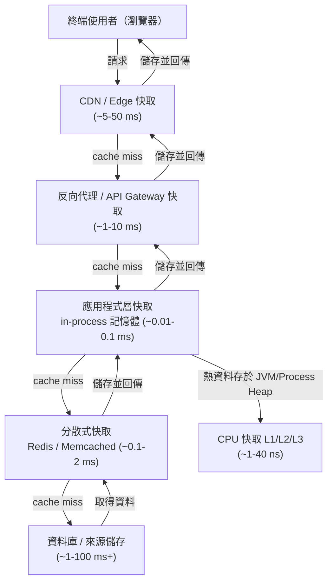

# [BEE-9001] 快取基礎與快取層次

:::info
CPU 快取、應用程式快取、CDN 快取——理解完整的快取層次堆疊，以及串聯各層的設計模式。
:::

## 為何快取很重要

每次應用程式擷取資料，都要付出代價：網路來回延遲、磁碟 I/O、查詢執行的 CPU 消耗，以及處理這一切的基礎設施費用。快取透過將資料副本保存在更靠近需求端的位置，降低這些代價。

三大核心動機：

- **延遲降低** — Redis 查詢約需 0.1 ms；在負載下的資料庫查詢可達 10-100 ms；CDN 邊緣節點可在個位數毫秒內回應，而從來源伺服器回應則需 100-300 ms。每一層省下的時間，都是使用者真實感受到的速度。
- **負載降低** — 熱門商品頁每分鐘被查詢一萬次，若無快取就直接衝擊資料庫一萬次。命中率 99% 的快取可將此降至 100 次資料庫呼叫。
- **成本節省** — 更少的資料庫查詢、更少的運算週期、更低廉的頻寬費用。在規模化情境下，調整良好的快取可大幅降低基礎設施支出。

## 快取層次

現代系統有多個快取層次。資料從更慢、更大、更便宜的儲存介質，向更快、更小、更昂貴的介質移動，愈靠近 CPU 或終端使用者的位置，速度愈快。



| 層次 | 技術 | 典型延遲 | 典型容量 |
|---|---|---|---|
| CPU L1 快取 | 硬體 | ~1 ns | 32-512 KB |
| CPU L2 快取 | 硬體 | ~4 ns | 256 KB - 4 MB |
| CPU L3 快取 | 硬體 | ~10-40 ns | 4-64 MB |
| In-process 記憶體 | JVM heap、Node.js V8 heap | ~0.01-0.1 ms | MB 級（受程序限制） |
| 分散式快取 | Redis、Memcached | ~0.1-2 ms | GB 級 |
| 反向代理 / CDN PoP | Nginx、Varnish、Cloudflare | ~1-50 ms | GB-TB 級 |
| 來源 / 資料庫 | PostgreSQL、MySQL、S3 | ~1-100+ ms | TB+ |

快取愈靠近讀取端，速度愈快，但容量也愈小。層次結構迫使你對「哪些資料該放在哪裡」做出選擇。

## 快取模式

### Cache-Aside（延遲載入）

由應用程式自行管理快取互動。快取依需求填充，只在資料被實際請求時才寫入。

**讀取路徑：**

```
function get(key):
    value = cache.get(key)
    if value is null:                      // cache miss
        value = database.query(key)
        cache.set(key, value, ttl=300)     // 寫入快取並設定 TTL
    return value
```

**寫入路徑：**

```
function set(key, newValue):
    database.update(key, newValue)         // 先寫入真實資料來源
    cache.delete(key)                      // 使舊的快取條目失效
    // 下次讀取時會從 DB 重新填充快取
```

特性：
- 只快取實際被讀取的資料，不浪費記憶體在冷資料上。
- Miss 後的第一次請求較慢（冷啟動），可透過快取預熱緩解。
- 應用程式程式碼需同時處理命中與未命中路徑。
- 若寫入 DB 後未使快取失效，TTL 到期前將持續回傳舊資料。

**適用場景：** 讀取頻繁的工作負載、讀取遠多於寫入的資料、可接受短暫舊資料的場景。

### Read-Through（讀取直通）

快取層介於應用程式與資料庫之間。發生 miss 時，由快取本身向資料庫取資料、儲存後再回傳。應用程式只與快取對話。

```
function get(key):
    // 應用程式只呼叫快取。
    // 快取內部處理 miss：向 DB 取資料、儲存、回傳。
    return cache.get(key)   // 快取透明地管理 DB 存取
```

特性：
- 應用程式程式碼更簡潔，無需明確處理 miss 邏輯。
- 第一次 miss 仍然較慢；重擔由快取層承擔。
- 常由快取函式庫或框架提供（例如 Spring Cache、NCache）。

**適用場景：** 希望將快取邏輯隔離在業務程式碼之外；快取層原生支援 read-through。

### Write-Through（寫入直通）

每次寫入都同步寫入快取和資料庫，完成後才向呼叫端確認。

```
function set(key, newValue):
    cache.set(key, newValue)           // 寫入快取
    database.update(key, newValue)     // 寫入 DB（同一交易或兩階段提交）
    return success
```

特性：
- 快取與資料庫保持一致，寫後讀不會看到舊資料。
- 寫入延遲增加——每次變更都要支付兩次寫入的代價。
- 可能將從未被讀取的資料填入快取（寫入但無後續讀取）。
- 搭配 TTL 可防止冷寫入鍵產生舊資料。

**適用場景：** 寫後讀一致性至關重要；寫入量在可接受範圍內；寫入的資料很可能很快被讀取。

### Write-Behind（寫回）

寫入立即進入快取並確認，快取在背景非同步將變更刷入資料庫。

```
function set(key, newValue):
    cache.set(key, newValue)               // 寫入快取，立即確認
    queue.enqueue(WriteJob(key, newValue)) // 非同步刷入 DB
    return success  // 呼叫端在 DB 更新前即收到 ACK

// 背景工作程序：
function flushWorker():
    while true:
        job = queue.dequeue()
        database.update(job.key, job.value)
```

特性：
- 呼叫端寫入延遲極低。
- 若快取在刷入前崩潰，有資料遺失風險。
- 複雜度較高：需要可靠的刷入管線與失敗復原機制。
- 寫入可批次或合併，降低資料庫總寫入負載。

**適用場景：** 寫入吞吐量是主要瓶頸；可接受最終持久化；具備保證刷入可靠性的基礎設施（持久化佇列、WAL 支援的快取）。

### 模式比較

| 模式 | 讀取一致性 | 寫入延遲 | 寫入複雜度 | 風險 |
|---|---|---|---|---|
| Cache-Aside | 最終一致（TTL） | 低 | 中等 | 寫入後舊資料 |
| Read-Through | 最終一致（TTL） | 低 | 低 | 冷啟動 |
| Write-Through | 強一致 | 高 | 中等 | 快取膨脹 |
| Write-Behind | 最終一致 | 極低 | 高 | 崩潰時資料遺失 |

## 快取預熱

部署後、快取被清除後或冷啟動後，所有快取條目均為空。每次請求都是 miss，來源端承受全部負載。這就是**冷快取**問題。

快取預熱（Cache Warming）是在正式流量到來前，預先填充快取的過程：

- **主動預熱**：部署前執行腳本，抓取並快取高流量鍵（例如前 1000 個商品頁、首頁資料）。
- **請求重播**：將近期的正式流量重播至新快取，模擬真實使用模式。
- **漸進式切換**：先將少量流量導入新快取，待其預熱後再逐步轉移其餘流量。

若無快取預熱，來源可能在部署後立即遭遇**雷群效應（thundering herd）**——大量同時發生的 miss 讓資料庫瞬間過載。

## 快取命中率

快取命中率是任何快取最核心的健康指標：

```
命中率 = 快取命中次數 / （快取命中次數 + 快取未命中次數）* 100%
```

命中率 95% 表示每 100 次請求中有 95 次由快取服務，其餘 5 次需前往來源端。

參考基準：
- **> 95%** — 讀取密集的靜態內容屬於健康狀態。
- **80-95%** — 寫入率中等的混合工作負載可接受。
- **< 80%** — 需要調查：TTL 可能過短、鍵空間可能過大，或資料存取模式不適合快取。

每次變更快取設定，都應量測前後的命中率。「看起來像最佳化」的操作（例如增加快取容量）有時反而因熱資料被分散至更多節點而降低命中率。

## 何時不該使用快取

快取是一種取捨。以下情況代價往往大於收益：

1. **頻繁變更的資料** — 若資料更新速度快於 TTL，你將持續回傳舊資料。每秒更新的股票報價搭配 60 秒 TTL，會主動誤導使用者。
2. **讀寫比例過低** — 若每筆資料只被寫入一次、讀取一次，快取只會增加開銷而無任何收益。一次性使用的 Session Token 是典型例子。
3. **高度個人化的資料** — 每位使用者專屬的資料（例如套用折扣後的購物車）無法從共用快取獲益，快取鍵設計複雜且浪費記憶體。
4. **安全敏感資料** — 快取資料可被任何具備快取存取權的程序讀取。除非快取有適當的存取控制與加密，否則避免快取授權 Token、原始憑證或個人識別資訊（PII）。
5. **將快取當作唯一資料儲存** — 快取不是資料庫。若快取被清除（計畫性驅逐、OOM、崩潰），所有資料必須能從真實資料來源重建。絕不快取沒有持久化備援的資料。

## 常見錯誤

1. **快取前未量測命中率。** 若不對快取進行監控，你無法知道它是否有效。在部署任何快取層之前，先加入命中/未命中計數器。
2. **沒有 TTL（資料永遠不過期）。** 沒有 TTL，快取條目將存活至被驅逐為止。若來源資料已變更，快取將無限期回傳舊資料。請依資料的變更頻率設定合適的 TTL。
3. **快取所有東西。** 記憶體是有限的。快取很少被存取的資料，會浪費可用於熱資料的容量，降低整體命中率。在決定快取什麼之前，先分析你的存取模式。
4. **忽略快取與真實資料來源的一致性。** 若更新資料庫後未使快取失效或更新，讀取將持續回傳舊資料。請在寫入路徑中明確管理快取狀態（參見上方的寫入模式與 [BEE-9002](cache-invalidation-strategies.md)）。
5. **將快取視為唯一資料儲存。** 快取預設是暫時性的。Redis 可以重啟，Memcached 沒有持久化，CDN 快取在部署時被清除。每個快取值都必須能從持久化來源重建。

## 相關 BEE

- [BEE-9002](cache-invalidation-strategies.md) — 快取失效策略：如何保持快取與真實資料來源的一致性。
- [BEE-9003](cache-eviction-policies.md) — 快取驅逐策略：LRU、LFU、TTL，以及驅逐策略對命中率的影響。
- [BEE-9004](distributed-caching.md) — 分散式快取：多節點快取中的一致性雜湊、分片與複製。
- [BEE-9006](http-caching-and-conditional-requests.md) — HTTP 快取：Cache-Control 標頭、ETags、條件式請求與 CDN 語意。

## 參考資料

- [Caching Strategies and How to Choose the Right One -- CodeAhoy](https://codeahoy.com/2017/08/11/caching-strategies-and-how-to-choose-the-right-one/)
- [Caching Patterns -- Database Caching Strategies Using Redis (AWS)](https://docs.aws.amazon.com/whitepapers/latest/database-caching-strategies-using-redis/caching-patterns.html)
- [ElastiCache Best Practices and Caching Strategies (AWS)](https://docs.aws.amazon.com/AmazonElastiCache/latest/dg/BestPractices.html)
- [Cache-Aside Pattern -- Azure Architecture Center (Microsoft)](https://learn.microsoft.com/en-us/azure/architecture/patterns/cache-aside)
- [What is a Cache Hit Ratio? -- Cloudflare](https://www.cloudflare.com/learning/cdn/what-is-a-cache-hit-ratio/)
- [What Is Cache Warming? -- IOriver](https://www.ioriver.io/terms/cache-warming)
