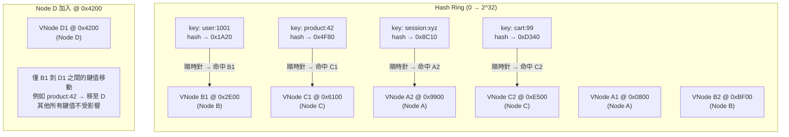
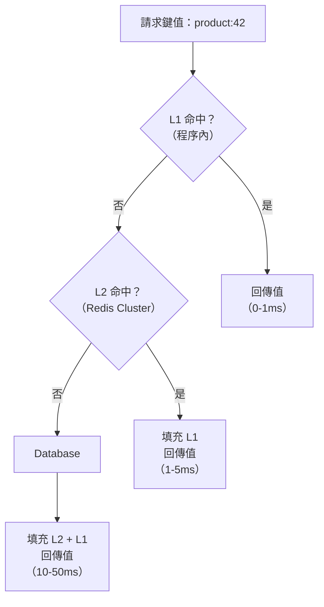

# [BEE-203] 分散式快取

:::info
一致性雜湊、虛擬節點、快取叢集拓撲、複製、熱點鍵值緩解，以及兩層快取架構 -- 如何在不破壞正確性的前提下，將快取擴展至單一節點以外。
:::

## 為什麼單一快取節點不夠

單一 Redis 或 Memcached 實例受限於一台機器的記憶體。對大多數生產工作負載來說，數十 GB 很快就會填滿：使用者 Session、商品目錄、搜尋結果頁面、功能旗標以及計算彙總資料全都爭用同一塊位址空間。一旦資料集超過節點容量，原本應保持熱態的條目就會開始被驅逐，快取命中率隨之下降。

記憶體並非唯一的限制：

- **可用性**：單一快取節點就是單點故障。當它崩潰時，所有讀取請求會同時打到資料庫 -- 即雷群效應（見 [BEE-9005](cache-stampede-and-thundering-herd.md)）。
- **吞吐量**：單一 Redis 實例在低延遲下大約可處理每秒 10 萬筆操作。對高流量服務來說，這個上限很快就會觸及。
- **網路頻寬**：每秒服務 50 GB 讀取的快取節點，在 CPU 飽和之前就會先耗盡網路介面頻寬。

將快取分散到多個節點可同時解決上述三個問題。挑戰在於決定哪些鍵值存放在哪個節點，以及在叢集演進時保持這個映射關係的一致性。

## 一致性雜湊

### 模除雜湊的問題

最直觀的做法是對每個鍵值進行雜湊，再用模除運算分配至節點：

```
node_index = hash(key) % number_of_nodes
```

這個做法在叢集不變時可以運作。但一旦新增或移除節點，`number_of_nodes` 改變，幾乎所有鍵值的模除結果都會跟著改變。在三節點叢集擴充為四節點後，約有 75% 的鍵值會映射到不同節點，這意味著大規模快取失效：整個工作集必須從資料庫重新載入，可能在短時間內壓垮來源端。

### 雜湊環

一致性雜湊消除了大規模重新分配的問題。核心概念如下：

1. 將雜湊空間（例如 0 到 2^32 - 1）映射到一個環狀結構（Hash Ring）。
2. 透過對節點識別碼進行雜湊，將每個快取節點放置在環上的一個或多個位置。
3. 對每個鍵值計算 `hash(key)`，找到環上對應位置，順時針走到第一個節點，該節點就負責這個鍵值。

新增節點時，它只接管環上介於新位置與逆時針方向前一個節點之間的鍵值，所有其他鍵值不受影響。移除節點時，只有其鍵值需要移至順時針方向的下一個節點。在 N 個節點的叢集中，新增或移除一個節點只重新分配約 1/N 的鍵值，而非全部。

### 虛擬節點

沒有虛擬節點時，每個實體節點只佔環上一個位置。各節點的鍵值分布高度取決於雜湊函數對這些位置的安排。實際上三個節點可能分別獲得 40%、35%、25% 的鍵值 -- 不均衡且在負載下會惡化。

虛擬節點（VNode）透過為每個實體節點分配多個環位置來解決這個問題。擁有 150 個虛擬節點的節點分散在環上的 150 個位置。鍵值分布更均勻，因為它們由最近的虛擬節點認領，而這些虛擬節點均勻分布在環上。

當實體節點加入或離開時，其虛擬節點槽位會個別重新分配。有了每個實體節點 150 個虛擬節點，負載會被所有剩餘節點均勻吸收，而非集中傾倒在某一個鄰居節點。



### 新增節點：最小化鍵值重新分配

考慮一個三節點叢集（A、B、C），採用一致性雜湊且每節點 150 個虛擬節點，環上共 450 個虛擬節點槽位。現在新增第四個節點 D，也有 150 個虛擬節點。

```
新增前：450 個虛擬槽位，3 個節點
  Node A：~150 槽位（33%）
  Node B：~150 槽位（33%）
  Node C：~150 槽位（33%）

新增後：600 個虛擬槽位，4 個節點
  Node A：~150 槽位（25%）  -- 讓出約 8% 給 D
  Node B：~150 槽位（25%）  -- 讓出約 8% 給 D
  Node C：~150 槽位（25%）  -- 讓出約 8% 給 D
  Node D：~150 槽位（25%）  -- 新加入，各從 A、B、C 接收約 8%
```

只有約 25% 的鍵值會移動 -- 具體來說是那些現在屬於 D 的虛擬節點環段的鍵值。其餘 75% 的鍵值留在原節點，快取命中率完整保留。資料庫只會看到小幅且漸進的未命中增加（D 的環段暖機），而非完整的快取清空。

## 快取叢集拓撲

### 客戶端分片（Client-Side Sharding）

快取客戶端（你的應用程式碼或客戶端函式庫）負責將每個鍵值雜湊到正確節點並直接與之通訊。支援一致性雜湊的函式庫（如 Memcached 的 `libmemcached` 或相應的 Redis 客戶端）實作了這個功能。

```
Application
    ↓
[Cache Client Library]
    ↓ hash("user:1001") → Node B
    ↓ hash("product:42") → Node C
    ↓ hash("session:xyz") → Node A
[Node A]   [Node B]   [Node C]
```

**優點：** 低延遲（直達正確節點，單跳），無代理瓶頸。
**缺點：** 每個客戶端都必須維護節點列表和一致性雜湊環。新增節點需要向所有應用實例推送更新後的設定。分片邏輯嵌入在每個客戶端中。

### 代理分片（Proxy-Based Sharding）

代理層（如 Memcached 的 Twemproxy/Nutcracker、Redis 的 Codis）介於應用程式與快取節點之間。應用程式連接到代理，就好像它是單一快取伺服器一樣。代理負責處理鍵值路由、一致性雜湊與連線池化。

```
Application
    ↓
[Proxy: Twemproxy / mcrouter]
    ↓ 路由表 + 一致性雜湊
[Node A]   [Node B]   [Node C]
```

**優點：** 應用程式與節點拓撲解耦。新增/移除節點只需修改代理設定。一致性雜湊集中維護。
**缺點：** 代理增加一個額外的延遲跳躍（約 0.5-1ms）並成為潛在瓶頸。代理本身必須做高可用（執行多個代理實例）。

Meta 的 `mcrouter`（在 Facebook 規模下使用）是一個久經考驗的 Memcached 代理，在單一代理層中實作了一致性雜湊、連線池化、複製路由、容錯移轉及失效扇出。

### 原生叢集模式（Redis Cluster）

Redis Cluster 內建於 Redis，使用 16,384 個雜湊槽位進行分片。每個鍵值透過 `CRC16(key) % 16384` 分配到一個槽位。槽位分布在各個主節點上，每個主節點可以有一個或多個副本。

```
Client（支援叢集的客戶端）
    ↓
[Redis Cluster：16384 個雜湊槽位]
  Master A（槽位 0–5460）      + Replica A'
  Master B（槽位 5461–10922）  + Replica B'
  Master C（槽位 10923–16383） + Replica C'
```

支援叢集的客戶端知道槽位到節點的映射，並將命令直接路由到正確的主節點。如果客戶端將命令發送到錯誤節點，該節點會回覆 `MOVED` 重定向。

**優點：** 不需要外部代理，內建複製和自動容錯移轉。
**缺點：** 多鍵操作（MGET、管線化）只有在所有鍵值映射到同一個槽位時才能運作。跨槽位操作需要使用 `{hash tags}` 強制鍵值共存，這需要應用層的感知。

## 快取叢集中的複製

快取複製有兩個目的：容錯與讀取擴展。

**容錯：** 每個主節點有一個或多個副本。主節點故障時，副本被晉升。Redis Cluster 使用類 Raft 的選舉機制；Twemproxy/mcrouter 可設定為容錯移轉到備用池。

**讀取擴展：** 讀取密集型工作負載可以將讀取路由到副本，降低主節點負載。這會引入複製延遲：從副本讀取可能返回比主節點晚幾毫秒的資料。

對快取使用案例而言，短暫的複製延遲通常可以接受 -- 資料本來就是對真實來源的近似。重要的是複製不會引入無界的過時性；Redis 的複製是非同步的但速度很快，正常情況下典型延遲在個位數毫秒以內。

大型部署中常見的模式是**每區域一個叢集**：每個資料中心運行一套完整的快取叢集，區域間的複製由應用層或資料庫層處理，而非快取層（見 [BEE-8006](../transactions/eventual-consistency-patterns.md) 的最終一致性）。這避免了每個請求都要進行跨區域快取寫入。

## 分散式快取的旁路快取模式

旁路快取模式（由應用程式碼讀取）在分散式快取下運作方式完全相同。唯一的差別是快取客戶端透明地將每個鍵值路由到正確節點：

```
function get(key):
    // 客戶端透過一致性雜湊路由到正確節點
    value = distributedCache.get(key)
    if value is null:
        value = database.query(key)
        distributedCache.set(key, value, ttl=300)
    return value

function update(key, newValue):
    database.update(key, newValue)
    distributedCache.delete(key)   // 自動路由到正確節點
```

應用程式不需要知道哪個節點持有某個鍵值。客戶端函式庫或代理負責路由。這是採用虛擬節點一致性雜湊的關鍵優勢之一：快取拓撲成為運維關注點，而非應用程式關注點。

## 熱點鍵值問題

一致性雜湊將鍵值分散到各節點，但它無法分散單一鍵值上的負載。如果某個鍵值收到不成比例的流量 -- 名人的個人資料頁、病毒式傳播的商品列表、全域設定條目 -- 所有對該鍵值的請求都會打到同一個快取節點。無論叢集中有多少其他節點，該節點都會成為瓶頸。

**症狀：**
- 某個節點 CPU/記憶體達到 100%，而其他節點大多閒置。
- 特定鍵值模式的延遲尖峰。
- 負載下快取未命中集中在某個節點。

**緩解策略：**

1. **鍵值複製 / 讀取副本：** 將熱點鍵值複製到多個節點，隨機分散讀取請求到所有副本。應用程式讀取 `hot_key:replica_{random(0, N)}`，背景程序保持所有副本同步。

2. **本地快取層：** 在應用伺服器的程序記憶體中快取熱點鍵值（短 TTL，如 1-5 秒）。大多數請求由本地記憶體服務，完全不接觸分散式快取。只有未命中才會到分散式節點。

3. **鍵值分解：** 如果熱點鍵值代表一個大型聚合（例如排序的排行榜），將其拆分為可分散到不同節點的子鍵值，在讀取時合併。

4. **抖動 TTL：** 如果許多鍵值具有相同的 TTL 並同時過期，它們可能同時全部變成熱點（按時間的快取雷群效應）。在 TTL 中加入隨機抖動可將過期時間分散。

## 兩層快取：本地 + 分散式

兩層快取結合了程序內本地快取（L1）與共享的分散式快取（L2），是應對熱點鍵值問題和高頻讀取最有效的緩解方式。

```
Request
    ↓
[L1：程序內快取（例如 Caffeine、LRU map）]
    ↓ 未命中
[L2：分散式快取（例如 Redis Cluster）]
    ↓ 未命中
[Database]
```

**讀取路徑：**
1. 檢查 L1。命中則立即回傳（毫秒以下，無網路請求）。
2. L1 未命中，檢查 L2。命中則填充 L1 並回傳。
3. L2 未命中，查詢資料庫，填充 L2，填充 L1，回傳。

**L1 特性：**
- 存活於應用程序的 heap 中。零網路延遲。
- 容量小（每個程序數百至數千條條目）。
- 短 TTL（1-10 秒），以限制過時性，因為 L1 不會被其他應用實例的失效操作更新。
- 消除最熱鍵值的網路呼叫。

**L2 特性：**
- 在所有應用實例間共享。失效操作對所有實例可見。
- 容量較大（叢集橫跨多個 GB）。
- 較長的 TTL（分鐘至小時）。
- 處理長尾鍵值 -- 那些夠溫但不夠熱以至於不需要 L1 的鍵值。

**一致性注意事項：** L1 快取是每個應用程序的本地快取。如果 L2 中的鍵值被失效（因為底層資料改變），所有應用實例的 L1 快取仍持有舊值，直到本地 TTL 過期。這是有意識的取捨：5 秒的 L1 TTL 意味著最多 5 秒的跨實例不一致。對需要毫秒級一致性的資料，保持非常短的 L1 TTL，或完全不在 L1 中快取該鍵值。



## 常見錯誤

1. **不使用一致性雜湊（改用模除）。** 使用模除雜湊新增或移除快取節點會使大多數快取失效。務必使用帶有虛擬節點的一致性雜湊。Ketama 等函式庫（被 Memcached 客戶端使用）正確地實作了這一點。

2. **熱點鍵值集中在單一節點，沒有緩解措施。** 某位名人的個人資料頁導致某個快取節點飽和，而其他節點閒置。分別監控每個節點的指標（CPU、連線數、每秒操作數）-- 聚合的叢集指標會隱藏這個故障模式。對已知熱點鍵值實作本地快取。

3. **沒有容錯移轉策略。** 節點宕機後沒有容錯移轉，會導致該節點所有鍵值同時未命中，對資料庫造成快取未命中風暴。使用複製（Redis Cluster 副本、Sentinel 或 Enterprise HA），並透過熔斷器或請求合併設計應用程式以容忍短暫的未命中尖峰（見 [BEE-9005](cache-stampede-and-thundering-herd.md)）。

4. **將分散式快取當作真實來源。** 快取資料是短暫的。節點重啟、記憶體壓力下的驅逐或設定變更隨時可能刪除任何鍵值。資料庫始終是真實來源。永遠不要只寫入快取而不寫入持久化儲存。

5. **不監控每個節點的指標。** 叢集整體可能看起來健康，但某個分片已飽和。追蹤每個節點的記憶體使用率、命中率、CPU 利用率和連線數。在節點層級（而非叢集整體層級）設定告警門檻。負載不均衡通常意味著熱點鍵值問題或設定錯誤的一致性雜湊環。

## 相關 BEE

- [BEE-6004](../data-storage/partitioning-and-sharding.md) -- 資料庫分片：一致性雜湊同樣適用於跨節點的資料庫分區。
- [BEE-9001](caching-fundamentals-and-cache-hierarchy.md) -- 快取基礎：旁路快取、穿透寫入、延遲寫入模式，以及本文所建立其上的基礎知識。
- [BEE-9005](cache-stampede-and-thundering-herd.md) -- 快取雷群效應：分散式快取節點故障導致鍵值同時未命中時的處理方式。
- [BEE-8006](../transactions/eventual-consistency-patterns.md) -- 最終一致性：跨區域快取一致性以及分散式系統中的一致性取捨。

## 參考資料

- [Scaling Memcache at Facebook -- NSDI 2013 (USENIX)](https://www.usenix.org/conference/nsdi13/technical-sessions/presentation/nishtala)
- [Scaling Memcache at Facebook -- Full Paper PDF](https://www.usenix.org/system/files/conference/nsdi13/nsdi13-final170_update.pdf)
- [Redis Cluster Specification -- redis.io](https://redis.io/docs/latest/operate/oss_and_stack/reference/cluster-spec/)
- [Scale with Redis Cluster -- redis.io Docs](https://redis.io/docs/latest/operate/oss_and_stack/management/scaling/)
- [Consistent Hashing Explained -- AlgoMaster](https://blog.algomaster.io/p/consistent-hashing-explained)
- [Consistent Hashing -- Wikipedia](https://en.wikipedia.org/wiki/Consistent_hashing)
- [Designing a Distributed Cache: Redis and Memcached at Scale -- DEV Community](https://dev.to/sgchris/designing-a-distributed-cache-redis-and-memcached-at-scale-1if3)
