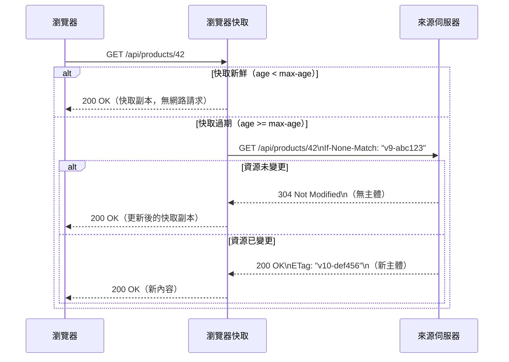

# [BEE-9006] HTTP 快取與條件式請求

:::info
Cache-Control 指令決定回應可被儲存多久、由誰儲存。條件式請求讓客戶端以低成本重新驗證過期項目，通常只需收到 304 Not Modified 而不傳輸任何主體。在 HTTP 層面，同時做好這兩件事是效能改善投資報酬率最高的手段。
:::

## 背景

每個 HTTP 回應都要透過網路傳輸。同一份資源可能每分鐘被同一個使用者、同一個 CDN 邊緣節點或同一個反向代理請求數千次。HTTP 快取規範（RFC 9111，取代 RFC 7234）就是為了消除這些多餘的傳輸而存在。

兩個機制共同運作：

- **Cache-Control** -- 伺服器宣告快取策略：回應可維持新鮮多久、誰可以快取、以及重新驗證時使用的驗證器。
- **條件式請求** -- 快取回應過期後，客戶端詢問伺服器「這份資料有沒有變更？」而不是重新抓取完整主體。若未變更，伺服器回覆 304 Not Modified，不傳送任何主體位元組。

理解這兩個機制的差異，以及它們與各快取層的互動方式，可以避免常見的錯誤：要嘛永遠提供舊內容，要嘛完全失去快取效益。

### 快取層級

```
瀏覽器快取（私有）
     |
     v
CDN / 反向代理（共享）
     |
     v
來源伺服器
```

- **私有快取** -- 瀏覽器本地；儲存個人化回應。只有擁有者能看到。
- **共享快取** -- CDN 或反向代理；為所有使用者儲存回應。不得儲存私有內容。
- **受管理快取** -- 明確部署（CDN 控制台、Service Worker）；可以超越標準 HTTP 語意進行操作。

## 原則

**根據每個回應的可變性與敏感性，使用 Cache-Control 配置相應的快取策略；使用 ETag 和 Last-Modified 讓回應到期時能免費進行重新驗證。** 絕不強迫客戶端重新下載未變更的內容。

## Cache-Control 指令

### 新鮮度指令

| 指令 | 適用對象 | 含義 |
|---|---|---|
| `max-age=N` | 回應 | 在回應產生後 N 秒內保持新鮮。 |
| `s-maxage=N` | 回應 | 類似 `max-age`，但僅適用於共享快取；對 CDN 覆蓋 `max-age`。 |
| `stale-while-revalidate=N` | 回應 | 在背景重新驗證的同時，最多可再提供過期內容 N 秒。 |
| `stale-if-error=N` | 回應 | 來源回傳 5xx 或無法連線時，最多可提供過期內容 N 秒。 |

### 儲存指令

| 指令 | 含義 |
|---|---|
| `no-store` | 不在任何地方儲存回應——無論私有或共享快取均不儲存。用於敏感資料。 |
| `no-cache` | 儲存回應，但每次重用前必須先向來源重新驗證（即使仍在有效期限內）。這**不等於**「不快取」。 |
| `private` | 只能儲存在私有（瀏覽器）快取中，CDN 和代理不得儲存。 |
| `public` | 任何快取都可以儲存，包括共享快取，即使回應含有 `Authorization` 標頭。 |
| `immutable` | 在 `max-age` 有效期內，資源永遠不會改變。瀏覽器重新整理時跳過重新驗證。 |
| `must-revalidate` | 不得提供過期回應——若無法重新驗證，快取必須回傳 504。 |

### 常見錯誤：`no-cache` 與 `no-store` 的混淆

```http
# 錯誤：你想防止快取登入 token
Cache-Control: no-cache
# 這樣仍然會儲存回應，只是要求重新驗證。Token 仍在快取中。

# 正確：對真正不得儲存的敏感資料
Cache-Control: no-store
```

`no-cache` 的意思是「重用前先驗證」。`no-store` 的意思是「不保留任何副本」。

## 具體範例

### 1. 含內容雜湊 URL 的靜態資源（最佳快取效益）

```http
# 請求
GET /static/bundle.a3f8b2c1.js HTTP/1.1
Host: example.com

# 回應
HTTP/1.1 200 OK
Cache-Control: public, max-age=31536000, immutable
Content-Type: application/javascript
ETag: "a3f8b2c1"
Last-Modified: Mon, 31 Mar 2026 10:00:00 GMT
Content-Length: 84231
```

當檔案變更時，URL 也會隨著內容雜湊改變，因此瀏覽器和 CDN 可以快取一整年。`immutable` 告訴瀏覽器在重新整理時跳過重新驗證——這個 URL 的檔案在字面上不可能改變。

### 2. API 回應（私有、短暫存活、必須重新驗證）

```http
# 請求
GET /api/user/profile HTTP/1.1
Host: example.com
Authorization: Bearer eyJ...

# 回應
HTTP/1.1 200 OK
Cache-Control: private, max-age=60, must-revalidate
ETag: "user-42-v7"
Content-Type: application/json
Content-Length: 312

{"id": 42, "name": "Alice", ...}
```

`private` 防止 CDN 儲存。`max-age=60` 允許瀏覽器在 60 秒內直接從快取提供回應而不請求伺服器。`must-revalidate` 確保無法聯繫來源時，瀏覽器絕不提供過期副本。

### 3. 敏感資料（完全不快取）

```http
# 請求
POST /auth/token HTTP/1.1
Host: example.com

# 回應
HTTP/1.1 200 OK
Cache-Control: no-store
Content-Type: application/json

{"access_token": "secret", "expires_in": 3600}
```

存取令牌不得儲存在任何快取中。`no-store` 是此處唯一正確的指令。

## 條件式請求

快取回應到期後，若內容未改變，重新抓取完整主體是浪費的。條件式請求標頭讓客戶端詢問伺服器內容是否仍相同。

### ETag 與 If-None-Match（建議使用）

ETag 是一個不透明字串，用於識別資源的特定版本——通常是回應主體的雜湊或資料庫資料列版本。

**第一次請求（快取未命中）：**

```http
GET /api/products/42 HTTP/1.1
Host: example.com

HTTP/1.1 200 OK
Cache-Control: private, max-age=60
ETag: "v9-abc123"
Content-Type: application/json
Content-Length: 450

{"id": 42, "name": "Widget", ...}
```

**重新驗證請求（60 秒後，max-age 到期）：**

```http
GET /api/products/42 HTTP/1.1
Host: example.com
If-None-Match: "v9-abc123"

# 資源未變更：
HTTP/1.1 304 Not Modified
Cache-Control: private, max-age=60
ETag: "v9-abc123"
# 無主體——酬載傳輸 0 位元組

# 資源已變更：
HTTP/1.1 200 OK
Cache-Control: private, max-age=60
ETag: "v10-def456"
Content-Type: application/json
Content-Length: 460

{"id": 42, "name": "Widget Pro", ...}
```

304 回應不含主體——只有標頭。瀏覽器使用其快取副本並刷新到期時間。節省的頻寬與回應主體大小成正比。

### Last-Modified 與 If-Modified-Since（舊版備援）

```http
# 第一次回應
HTTP/1.1 200 OK
Last-Modified: Mon, 07 Apr 2026 08:00:00 GMT
Cache-Control: max-age=3600

# 重新驗證
GET /page.html HTTP/1.1
If-Modified-Since: Mon, 07 Apr 2026 08:00:00 GMT

HTTP/1.1 304 Not Modified
```

`Last-Modified` 精確度較低（一秒粒度），且對動態生成的回應可能不準確——即使內容未變，時間戳也可能改變。建議優先使用 ETag。當兩者都有時，伺服器應以 `If-None-Match` 為準，將 `If-Modified-Since` 作為次要驗證。

### 條件式請求流程



## Vary 標頭

`Vary` 標頭告訴快取，回應取決於特定的請求標頭。CDN 會為同一 URL 的每個不同標頭值組合儲存獨立副本。

```http
HTTP/1.1 200 OK
Cache-Control: public, max-age=3600
Vary: Accept-Language

# 法語使用者看到的法語版本與英語版本分開快取
```

若缺少 `Vary: Accept-Language`，CDN 可能快取法語回應並提供給所有使用者，不論其語言偏好為何。

```http
# 多維度變異
Vary: Accept-Language, Accept-Encoding
```

**警告：** `Vary: User-Agent` 會產生快取變體爆炸（每個瀏覽器版本各一份），絕對不應使用。若內容確實因 User-Agent 而異，請使用獨立 URL 或其他方式。

### Vary 與 CDN 行為

| 請求 | Accept-Language | 快取鍵 | 獨立儲存 |
|---|---|---|---|
| GET /home | en-US | /home + en-US | 是 |
| GET /home | zh-TW | /home + zh-TW | 是 |
| GET /home | en-US | /home + en-US | 命中第一份快取 |

## CDN 快取 vs 瀏覽器快取

| 屬性 | 瀏覽器快取 | CDN / 共享快取 |
|---|---|---|
| 範圍 | 單一使用者 | 所有使用者 |
| 控制指令 | `private` / `public` | `s-maxage`、`public` |
| 可儲存含 `Authorization` 的回應 | 是 | 僅在有 `public` 指令時 |
| 失效方式 | 使用者手動清除 | CDN 清除 API 或 `surrogate-key` |
| 遵守 `Vary` | 是 | 是（實作上可能有限制） |

針對因使用者而異的 API 回應：使用 `private, max-age=N`。針對共享資源（公開頁面、靜態資源）：使用 `public, s-maxage=N` 或單純 `max-age=N`。

`s-maxage` 指令被瀏覽器忽略，但會覆蓋 CDN 的 `max-age`：

```http
# 瀏覽器快取 60 秒，CDN 快取 1 小時
Cache-Control: max-age=60, s-maxage=3600
```

## 快取清除（Cache Busting）

當一個可變 URL 設有較長的 `max-age`，你無法推送更新——快取會一直提供舊內容直到到期。**Cache busting** 透過改變 URL 讓舊內容無法存取。

### 檔案名稱中嵌入內容雜湊（建議做法）

```html
<!-- 建置工具在檔案名稱中輸出雜湊 -->
<script src="/static/bundle.a3f8b2c1.js"></script>
<link rel="stylesheet" href="/static/styles.f7d3a1e9.css">
```

```http
HTTP/1.1 200 OK
Cache-Control: public, max-age=31536000, immutable
```

當內容變更時，雜湊改變，檔名改變，瀏覽器從新 URL 抓取新檔案。舊 URL 只是不再被引用。

### 查詢字串版本控制（脆弱——CDN 資源應避免）

```html
<!-- 查詢字串變更可能破壞部分 CDN 快取 -->
<script src="/static/bundle.js?v=42"></script>
```

查詢字串參數是大多數 CDN 快取鍵的一部分，所以這個技術在技術上可行——但檔案名稱雜湊更可靠，避免了代理的模糊性，也是所有主流建置工具（Vite、webpack、esbuild）的預設輸出方式。

### 不要對可變 URL 設定過長的 `max-age`

```http
# 錯誤：HTML 檔案在每次部署時都會變更
GET /index.html HTTP/1.1

HTTP/1.1 200 OK
Cache-Control: public, max-age=86400   # 使用者可能看到一天的舊 HTML

# 正確
HTTP/1.1 200 OK
Cache-Control: no-cache                # 每次都重新驗證；若未變更則回傳 304
ETag: "deploy-20260407"
```

對 HTML 進入點使用 `no-cache`（而非 `no-store`），這樣每次導覽都會重新驗證，但仍能受益於 304 回應。

## API 回應快取注意事項

REST API 可以使用 HTTP 快取，但需謹慎：

1. **為 GET 回應加上 ETag。** 從回應主體雜湊或資源的 `updated_at` 時間戳生成 ETag。這能讓重複讀取免費受益於 304 重新驗證。

2. **對讀取頻繁、變更緩慢的資料設定適當的 `max-age`。** 每小時才變更一次的產品目錄可以安全使用 `max-age=300`（5 分鐘）。

3. **使用者特定資料使用 `private`。** 任何包含使用者特定內容的回應都不得儲存在共享快取中。

4. **避免快取 POST/PUT/PATCH 回應。** 這些是非冪等操作。瀏覽器不會快取它們，CDN 也不應快取。

5. **寫入時使 CDN 快取失效。** 當資源變更時，對其 URL 發出 CDN 清除請求，確保共享快取不會提供過期資料。

```http
# 讀取端點：可快取且支援重新驗證
GET /api/catalog/products/42 HTTP/1.1

HTTP/1.1 200 OK
Cache-Control: public, max-age=300, stale-while-revalidate=60
ETag: "product-42-v9"
```

## 常見錯誤

### 1. 想用 `no-store` 卻用了 `no-cache`

`no-cache` 會儲存回應並要求重新驗證。它不防止快取。對敏感資料（令牌、個人識別資訊），務必使用 `no-store`。

### 2. 內容協商回應缺少 `Vary` 標頭

若伺服器根據 `Accept-Language` 回傳不同內容，但省略了 `Vary: Accept-Language`，CDN 會快取其中一個版本並提供給所有使用者，不論其語言偏好。回應變異的每個維度都必須出現在 `Vary` 中。

### 3. API 回應不使用 ETag

沒有 ETag，過期的快取回應會強制完整重新下載。為 `GET /api/resource/:id` 加上 ETag 對伺服器幾乎沒有成本，卻可以消除整個未變更資源的回應主體——對大型酬載尤其有價值。

### 4. 用查詢字串而非內容雜湊進行 cache busting

查詢字串 cache busting 在大多數瀏覽器中有效，但在某些 CDN 設定、HTTP/1.0 代理和特定 Vary 標頭互動中可能靜默失敗。檔案名稱中的內容雜湊是無歧義的，也是所有現代建置工具的預設方式。

### 5. 對可變 URL 設定過長的 `max-age`

若 `/index.html` 或 `/api/config` 帶有 `max-age=86400`，變更內容的部署對快取的客戶端最多一天都看不到。靜態資源使用內容雜湊，可變文件使用帶 ETag 的 `no-cache`。

## 相關 BEE

- [BEE-3003: HTTP 基礎](../networking-fundamentals/http-versions.md) -- 請求/回應模型、狀態碼與標頭
- [BEE-9001: 快取基礎與快取層級](../caching/caching-fundamentals-and-cache-hierarchy.md) -- TTL、逐出與一致性概念，是本文的基礎
- [BEE-13005: CDN 架構](../performance-scalability/content-delivery-and-edge-computing.md) -- CDN 節點如何消費並傳播 `Cache-Control` 指令

## 參考資料

- [RFC 9111: HTTP Caching](https://www.rfc-editor.org/rfc/rfc9111.html) -- 權威規範（取代 RFC 7234）
- [HTTP caching -- MDN Web Docs](https://developer.mozilla.org/en-US/docs/Web/HTTP/Guides/Caching) -- 含範例的完整指南
- [HTTP conditional requests -- MDN Web Docs](https://developer.mozilla.org/en-US/docs/Web/HTTP/Guides/Conditional_requests) -- ETag、Last-Modified 與 304 流程
- [Cache-Control header -- MDN Web Docs](https://developer.mozilla.org/en-US/docs/Web/HTTP/Reference/Headers/Cache-Control) -- 指令參考
