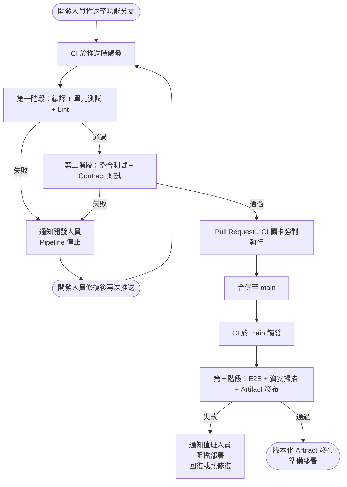

# [BEE-360] 持續整合原則

:::info
頻繁整合程式碼、以自動化建置與測試驗證每次變更，並將損壞的建置視為團隊最優先處理的問題。
:::

## 背景

在長期功能分支上工作的軟體團隊，會不斷累積與主線的差異。分支存活越久，就越偏離主線。當分支最終合併時，團隊面臨的是「整合地獄」——合併衝突、測試失敗和難以診斷的回歸問題，因為變更的影響範圍太大。

持續整合（CI）的做法就是從根本上消除這個問題：開發人員每天至少一次將程式碼變更整合到共用主線，並以自動化建置和測試套件驗證每次整合。

Martin Fowler 的經典定義：

> 「持續整合是一種軟體開發實踐，團隊中的每位成員至少每天將自己的變更與其他成員的變更合併到程式庫中，每次整合都透過自動化建置（含測試）進行驗證，以盡快發現整合錯誤。」
>
> — [Continuous Integration, martinfowler.com](https://martinfowler.com/articles/continuousIntegration.html)

## 原則

### 1. 頻繁整合——至少每天一次

每位開發人員至少每天合併一次到主線。整合頻率是強制保持小型、可審查變更的機制。小型變更更容易理解、更容易審查，出問題時也更容易回復。

一個修改 50 行的 Pull Request 幾分鐘就能審完。一個修改 5,000 行的 Pull Request 會在佇列中等好幾天，累積更多漂移，最終只能祈禱合併後沒問題。

### 2. 優先採用主幹開發（Trunk-Based Development）

[主幹開發](https://trunkbaseddevelopment.com/)是最適合 CI 的分支模型。開發人員在短期功能分支（理想上不超過 2 天）工作，頻繁合併回主幹（main）。長期功能分支是 CI 的反模式——它延遲了整合，抵消了這個實踐的目的。

短期分支的規則：

- 功能分支應由一位開發人員（或一對）擁有。
- 合併回主線前不應存活超過 2 天。
- 必須通過 CI 才能合併至 main。
- 合併後立即刪除。

如果一個功能太大，無法在 2 天內整合，請使用功能旗標（feature flags）在功能尚未完成時以隱藏狀態部署程式碼。

### 3. 每次 Commit 都觸發建置

CI 系統必須在每次推送時自動執行——包括推送至功能分支。只在 main 上執行 CI 違背了這個做法的目的：當程式碼到達 main 時，開發人員早已轉移到其他工作，此時切換回來修復失敗的代價很高。

Pipeline 在每次推送時執行。開發人員在建立 Pull Request 之前就能得到回饋。

### 4. 建置必須快速——10 分鐘以內

一個需要 30 分鐘的建置不是 CI 建置。開發人員不會等，他們會繼續往前推，忽略失敗。回饋如果太晚才到，就毫無價值。

目標：主要 pipeline（編譯 + 單元測試 + Lint）必須在 10 分鐘內完成。整合測試和較重的檢查可以在快速階段通過後，在下游階段執行。

保持建置快速的策略：

- 積極快取依賴項（node_modules、Maven 本地儲存庫、pip 快取）。
- 在多個執行器上並行執行測試。
- 依執行時間拆分測試——將最快的測試保留在第一階段。
- 將慢速測試（端對端、效能）延遲到夜間或合併後的 pipeline。

### 5. 綠色建置紀律——停線（Stop the Line）

損壞的建置不是背景問題。它阻擋了每一位想合併的開發人員。讓建置損壞的團隊必須在做任何其他事情之前先修復它。

規則：

- main 分支上損壞的建置必須在 15 分鐘內修復或回復。
- 建置損壞期間不得有新工作合併至 main。
- 不穩定的測試（flaky tests）不是「只是不穩定」——它們侵蝕了對 pipeline 的信任，必須立即修復或隔離。

這個紀律借鑒自精實製造的「停線」原則：任何工站出現品質問題，整條生產線停止，直到問題解決。

### 6. 建置階段——快速優先，慢速延後

構建 pipeline 時，讓最快、最有價值的檢查先執行。在耗費資源做昂貴的驗證之前，先以最廉價的信號快速失敗。

```
第一階段（< 5 分鐘）：  編譯 / 型別檢查 → 單元測試 → Lint / 靜態分析
第二階段（< 15 分鐘）： 整合測試 → Contract 測試
第三階段（合併後執行）：端對端測試 → 資安掃描 → 發布 Artifact
```

若第一階段失敗，第二和第三階段不執行。這節省了運算資源，並更快返回回饋。

### 7. Artifact 版本管理——每次建置產生可追溯的 Artifact

每次在 main 上成功的 pipeline 執行，都必須產生一個有版本的、不可變的 artifact。Artifact 版本必須可追溯到產生它的確切 commit。

常見命名方案：

```
{服務}-{semver}-{git-sha}-{build-number}
範例：payments-api-1.4.2-a3f9c21-build.847
```

沒有 artifact 版本管理，就無法重現部署、可靠地回滾，或審核生產環境中執行的是哪版程式碼。

### 8. 合併前要求 CI 通過

分支保護規則必須強制要求 CI pipeline 通過，Pull Request 才能合併。這是不可妥協的關卡。

不允許繞過 CI 的強制合併。唯一的例外是使用已知良好的 artifact 進行緊急回滾——絕對不是為了合併未經測試的程式碼而繞過 CI。

## CI Pipeline：參考架構



## 實際案例

### 正確做法：短期分支，快速回饋

1. 開發人員週一早上建立功能分支。
2. 整天撰寫程式碼，推送 3 個 commit。
3. CI 在每次推送時執行，8 分鐘完成。
4. 全部通過。開發人員週一下午開啟 Pull Request。
5. 程式碼審查 1 小時完成。CI 在 PR head 上重新執行——仍然通過。
6. PR 合併至 main。CI 在 main 上執行，artifact 在 12 分鐘內發布。
7. 從第一個 commit 到可部署 artifact 的總時間：不到一個工作天。

### 反模式：2 週功能分支

1. 開發人員週一建立分支，兩週後才合併。
2. 這期間 main 已接收了 40 個其他 commit。
3. 開發人員合併——23 個合併衝突，倉促解決。
4. CI 失敗：12 個單元測試損壞，3 個整合測試損壞。
5. 開發人員花了 2 天除錯。部分失敗與他們的功能完全無關——是兩週前其他合併引入的，現在才看到。
6. 團隊對建置的信心下降。循環重複。

根本原因不是開發人員——而是延遲的整合。2 週分支本身才是反模式。

## 常見錯誤

| 錯誤 | 為何有害 | 修正方法 |
|---|---|---|
| CI 建置超過 15 分鐘 | 開發人員不等待；失敗被忽略 | 並行化、快取、將慢速測試移至第二階段 |
| 忽略損壞的建置（「只是不穩定」） | 侵蝕信任；真正的失敗被忽略 | 24 小時內修復或隔離不穩定測試 |
| CI 只在 main 執行，不在功能分支執行 | 回饋在合併後才到；修復代價高 | 在每個分支的每次推送時觸發 CI |
| 沒有 Artifact 版本管理 | 無法重現或回滾部署 | 為每個 main 分支 artifact 標記 commit SHA |
| 長期功能分支（超過 1 週） | 累積漂移 → 整合地獄 | 強制短期分支 + 功能旗標 |
| 合併時跳過 CI 關卡 | 一次壞的合併破壞所有人 | 分支保護：要求 CI 通過，不允許繞過 |

## 相關 BEE

- [BEE-15001](../testing/testing-pyramid.md) — 測試策略及測試如何整合到 CI pipeline
- [BEE-16002](deployment-strategies.md) — 使用 CI 產出 artifact 的部署策略
- [BEE-16006](pipeline-design.md) — CI/CD pipeline 設計與基礎設施

## 參考資料

- [Continuous Integration — Martin Fowler](https://martinfowler.com/articles/continuousIntegration.html)
- [Trunk Based Development — trunkbaseddevelopment.com](https://trunkbaseddevelopment.com/)
- [Short-Lived Feature Branches — trunkbaseddevelopment.com](https://trunkbaseddevelopment.com/short-lived-feature-branches/)
- [Trunk-based Development — Atlassian](https://www.atlassian.com/continuous-delivery/continuous-integration/trunk-based-development)
- [CI/CD Pipeline Best Practices — GitScrum Docs](https://docs.gitscrum.com/en/best-practices/ci-cd-pipeline-best-practices/)
