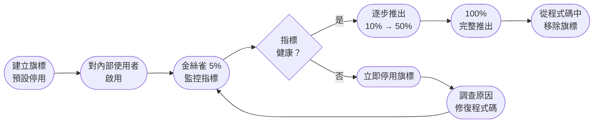

# [BEE-16004] 功能旗標

:::info
功能旗標將程式碼部署與功能發布解耦，讓你能夠將程式碼部署至生產環境而不立即對使用者公開，並在不重新部署的情況下即時回滾。
:::

## 背景

傳統模型將功能的發布直接綁定在部署上：部署完成，使用者就能看到新功能。這種方式迫使團隊將功能捆綁一起發布、因測試未完成而延遲上線，並在出現問題時必須透過完整重新部署才能復原。

功能旗標（又稱功能開關，Feature Toggle）打破了這種耦合關係。程式碼以條件閘門的方式部署至生產環境，閘門的開啟與部署動作各自獨立。這意味著你可以在週五部署，在週二發布。你可以僅對 1% 的使用者開啟功能、觀察指標，並在需要時透過切換旗標來回滾，而非推送熱修補。

**參考資料：**
- Pete Hodgson / Martin Fowler，[Feature Toggles (aka Feature Flags)](https://martinfowler.com/articles/feature-toggles.html)
- Martin Fowler，[Feature Flag](https://martinfowler.com/bliki/FeatureFlag.html)
- LaunchDarkly，[What Are Feature Flags?](https://launchdarkly.com/blog/what-are-feature-flags/)
- Octopus Deploy，[4 Types of Feature Flags](https://octopus.com/devops/feature-flags/)

## 原則

**將部署與發布分離。使用功能旗標控制使用者看到什麼，而非控制程式碼何時上線。** 保持旗標短暫存在：帶著明確目的建立，目的達成後立即移除。

## 功能旗標的四種類型

並非所有旗標都相同。混淆類型會導致旗標永遠不被移除，或旗標被用於錯誤的用途。

### 1. 發布開關（Release Toggle）

發布開關用來對使用者隱藏尚未完成或尚未穩定的功能。這是最常見的類型，也是最容易累積成技術債的類型。

- **生命週期：** 短暫 — 幾天到幾週。完整推出後立即移除。
- **控制者：** 工程與發布管理團隊。
- **範例：** 重寫的結帳流程已部署但對使用者隱藏。旗標先對內部員工開啟，再開放給 5% 的使用者，最後逐步擴展至 100%。

### 2. 實驗開關（Experiment Toggle / A/B 旗標）

實驗開關將使用者分群，並將各群導向不同的程式碼路徑。目標是量測效果，而非降低風險。

- **生命週期：** 中期 — 實驗持續期間，結束後移除。
- **控制者：** 產品與資料團隊。
- **範例：** 50% 的使用者看到「立即購買」按鈕，50% 看到「加入購物車」。比較轉換率後，勝出的版本成為永久行為，旗標隨即移除。

### 3. 運維開關（Ops Toggle / 緊急停止開關）

運維開關控制系統的運作行為。其存在目的是讓工程師在事故發生時能夠即時降級或停用子系統，無需重新部署。

- **生命週期：** 長期 — 這是永久或半永久的運維控制項。
- **控制者：** SRE / 值班工程師。
- **範例：** 推薦引擎使首頁增加了額外延遲。在流量突增期間，運維開關停用推薦引擎，改以靜態清單回應。

緊急停止開關是最關鍵的旗標類型。每個可能影響可用性的功能都應該配備一個。

### 4. 權限開關（Permission Toggle）

權限開關根據使用者身份、方案層級或角色來控制功能的存取。與 A/B 旗標不同，這裡的使用者群組是明確且刻意劃分的。

- **生命週期：** 長期 — 通常只要存取模型存在就長期保留。
- **控制者：** 產品與商業營運團隊。
- **範例：** 分析儀表板僅對企業方案使用者可見。開關在執行期間檢查使用者的方案層級。

---

## 功能旗標的生命週期

每個旗標都應有明確的生命週期。沒有終止條件的旗標會成為永久性的雜亂程式碼。



### 各階段說明

| 階段 | 動作 | 推進條件 |
|---|---|---|
| 建立 | 旗標存在，預設停用 | 程式碼已部署並在 staging 驗證 |
| 內部 | 對員工 / 內部帳號啟用 | 不影響生產環境使用者 |
| 金絲雀 | 生產環境流量的 5% | 錯誤率、P99 延遲在基準值內 |
| 逐步推出 | 10% → 25% → 50% | 每個階段都確認指標 |
| 完整推出 | 100% | 功能視為穩定 |
| 移除 | 從設定和程式碼中刪除旗標 | 死碼路徑清除完畢 |

**移除階段是強制性的。** 一個達到 100% 但從未被移除的旗標，將成為多餘的負擔：它新增一個永遠會走到的分支、使新進工程師感到困惑，並在多個過時旗標交互作用時造成組合爆炸。

---

## 實際案例：發布新結帳流程

**情境：** 重寫的結帳流程已準備好上線。團隊希望進行安全的漸進式發布，並保有即時回滾能力。

**設定：**

```
flag: checkout_v2_enabled
default: false
```

**步驟一 — 部署**

新的結帳程式碼在旗標後方部署。所有生產流量仍走舊流程（`checkout_v2_enabled = false`）。

**步驟二 — 內部預覽**

對所有員工啟用。進行手動 QA，確認分析事件正確觸發。

**步驟三 — 金絲雀 5%**

將 `checkout_v2_enabled = true` 套用於 5% 的使用者（隨機區段）。監控 30 分鐘：
- 購物車轉換率 vs. 基準值
- 結帳錯誤率
- 訂單提交端點的 P99 延遲

**步驟四 — 指標惡化**

在 5% 階段，訂單提交的 P99 延遲上升 40%。立即將 `checkout_v2_enabled = false`——所有流量回到舊結帳流程，無需重新部署。團隊調查延遲回歸問題，修復後重新進入金絲雀階段。

**步驟五 — 逐步推出**

修復後：金絲雀 5% 通過 → 擴展至 10% → 25% → 50% → 100%。每個階段持續 30 分鐘並設置自動指標閘門。

**步驟六 — 移除旗標**

在 100% 穩定運行 48 小時且無事故後：刪除旗標設定、移除程式碼中的 `if (checkout_v2_enabled)` 條件判斷、刪除舊結帳程式碼路徑。新結帳流程成為唯一的流程。

---

## 漸進式推出百分比

大多數服務的標準漸進推出時程：

```
內部使用者 → 1% → 5% → 10% → 25% → 50% → 100%
```

每個階段都有等待期（同步服務通常為 15–60 分鐘，非同步或低流量服務則更長）以及自動化的推進條件：

- 錯誤率：新路徑 <= 基準值
- P99 延遲：新路徑 <= 基準值 × 1.1
- 業務指標（轉換率、吞吐量）：無回歸

不要透過手動查看儀表板來決定是否推進各階段。在推出前定義好推進條件，然後將檢查自動化。

---

## 緊急停止開關

緊急停止開關是一種運維開關，專門設計用於即時停用可能威脅可用性的功能。

**何時應建立緊急停止開關：**

- 任何呼叫外部相依服務的功能（付款供應商、ML 推論端點、第三方 API）
- 任何會增加非微不足道的 CPU 或記憶體負擔的功能
- 任何會對高基數資料庫查詢進行扇出的功能
- 任何首次向大量使用者推出的功能

**緊急停止開關的運作方式：**

緊急停止開關在請求時間點進行評估，而非在部署時間點。開關切換後，下一個請求立即感知到變化。無需部署、無需重啟、無需等待傳播延遲。

```
請求進入
  → 旗標評估（記憶體內或低延遲遠端儲存）
  → 若 kill_switch_enabled：執行功能
  → 否則：降級回退行為
  → 回應
```

緊急停止開關與優雅降級互補（參見 [BEE-12005](#)）——旗標停用功能，回退行為確保服務持續回應。

---

## 旗標評估：伺服器端 vs. 用戶端

| | 伺服器端 | 用戶端 |
|---|---|---|
| 評估位置 | 後端服務，在請求時間點 | 瀏覽器或行動裝置，在啟動時 |
| 延遲 | 可忽略 — 行程內或本機快取 | 若啟動時需抓取，增加一次網路呼叫 |
| 安全性 | 旗標邏輯不暴露給用戶端 | 使用者可能檢視並操控旗標 |
| 目標精準度 | 可使用完整請求上下文（使用者 ID、帳號、IP） | 僅限用戶端已知資訊 |
| 適用場景 | 發布開關、緊急停止開關、運維開關 | 純 UI 的實驗開關、用戶端功能推出 |

對於後端服務，始終在伺服器端評估旗標。用戶端評估適用於伺服器不需要知道哪個版本被展示的純 UI 實驗。

---

## 常見錯誤

**1. 從不移除舊旗標。**

最常見的失敗模式。一個服務在兩年內累積了 50 個旗標，沒有人知道哪些可以安全移除。程式碼庫中有數十個死去的分支，而且全都評估為 true。將旗標移除加入每個發布開關的完成定義中：在旗標和死碼路徑被刪除之前，工作還沒結束。

**2. 將旗標用於永久性設定。**

功能旗標不是設定值。如果某種行為會因環境不同而永遠不同（開發 vs. 生產），請使用環境設定。如果某種行為由帳單方案控制且永遠不會被移除，它可能是一個權限開關——但應明確記錄並如同長期存在的服務一樣對待。不要在功能旗標條件中累積業務邏輯。

**3. 只測試旗標開啟的路徑。**

當生產環境中 `flag = true` 已啟用時，`flag = false` 同樣是生產程式碼——它服務尚未被開放的使用者，也是回滾路徑。兩個分支都必須有測試覆蓋。在回滾過程中才發現旗標關閉路徑失敗，是最糟糕的發現時機。

**4. 沒有旗標命名規範。**

沒有命名規範，旗標在規模化後將變得無法管理。一致的規範能讓人一眼看出意圖和生命週期：

```
[服務]_[功能]_[類型]

checkout_v2_release         # 發布開關 — 推出後移除
homepage_rec_killswitch     # 運維開關 — 永久緊急停止開關
pricing_experiment_cta_ab   # 實驗開關 — 分析結束後移除
```

**5. 旗標相依性。**

旗標 A 需要旗標 B 啟用。旗標 B 需要旗標 C。這創造了組合複雜性：`2^3 = 8` 種狀態，其中大多數從未被測試過。如果一個功能需要另一個功能，請一起將兩者推上生產環境，或在設計上消除相依性。永遠不要建立在執行期間對另一個旗標狀態有硬性相依的旗標。

---

## 相關 BEE

- [BEE-12005：優雅降級](#) — 緊急停止開關實現即時降級；優雅降級定義功能被停用時的回退行為
- [BEE-15006：在生產環境中測試](#) — 功能旗標是安全生產測試的機制之一；漸進式推出依賴生產環境的可觀測性
- [BEE-16002：金絲雀部署](#) — 金絲雀部署按實例百分比路由流量；功能旗標在單一部署中按使用者區段或百分比路由
