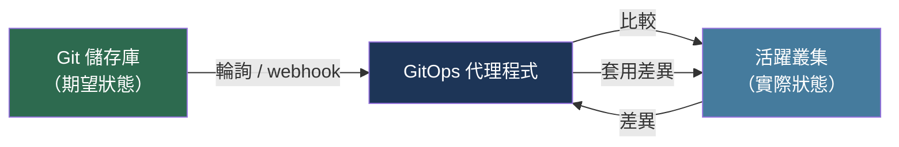

# [BEE-16008] GitOps 與宣告式交付

:::info
GitOps 將 Git 作為基礎設施與應用程式狀態的唯一真相來源。運行在叢集內部的代理程式持續將實際狀態調和至 Git 中宣告的期望狀態——憑證不離開叢集，每次變更皆可稽核，回滾只需 git revert。
:::

## 背景

Alexis Richardson 於 2017 年 8 月在 Weaveworks 部落格發表了「GitOps」一詞，並在 KubeCon North America 2017 發表了《GitOps — Operations by Pull Request》。核心觀察：Kubernetes 已讓基礎設施變得宣告式且以 API 驅動，但交付管線仍是指令式的——CI Job 使用儲存在 CI Secrets 中的憑證直接對叢集執行 `kubectl apply`。這帶來兩個問題：管線持有每個環境的高權限憑證，成為高價值攻擊目標；每當有人執行 `kubectl edit` 或 Pod 崩潰並以不同設定重建時，叢集的活躍狀態可能與任何宣告來源產生漂移（drift）。

Richardson 提出了反向做法：將期望狀態保存在 Git 中，並由叢集內部的代理程式拉取並套用。叢集永遠不會將 API 伺服器憑證暴露到外部。每次生產環境的變更都經過 Pull Request，提供完整的稽核歷程、程式碼審查，以及透過 `git revert` 即時回滾的能力。代理程式持續比較活躍狀態與 Git，並自動修正——這意味著直接對叢集進行的任何手動變更都會被代理程式還原。

CNCF GitOps 工作組將此形式化為 OpenGitOps 規範 v1.0.0（2021 年），定義了四項原則：**宣告式**（系統狀態以宣告而非腳本表達）、**版本化且不可變**（狀態儲存於具有完整歷程的 Git 中）、**自動拉取**（代理程式輪詢或接收來自儲存庫的推送通知）、**持續調和**（代理程式在執行期間偵測並修正漂移）。

## 核心概念

### 推送模型與拉取模型

推送式管線（Jenkins、GitHub Actions 搭配 `kubectl apply`）從叢集外部驅動變更。它需要管線持有叢集憑證，且無法偵測部署之間發生的漂移。

拉取式 GitOps 代理程式運行在叢集內部。它持有 Git 儲存庫的唯讀令牌，並使用自己的服務帳戶呼叫 Kubernetes API。外部系統無需對叢集擁有寫入權限。

```
┌─────────────────────────────────────────────────────┐
│  推送模型                                            │
│  CI 管線 ──(kubectl apply)──► Kubernetes API        │
│  CI 持有叢集憑證                                     │
└─────────────────────────────────────────────────────┘

┌─────────────────────────────────────────────────────┐
│  拉取模型（GitOps）                                  │
│  Git ◄──(輪詢/webhook)── GitOps 代理程式             │
│                          │                          │
│                          ▼                          │
│                    Kubernetes API                   │
│  代理程式持有 Git 令牌；叢集 API 為內部               │
└─────────────────────────────────────────────────────┘
```

### 調和迴圈



代理程式計算期望（Git）與實際（叢集）之間的差異。若差異為空，則不採取任何動作。若資源遺失，則建立。若資源不同，則套用修補。若資源存在於叢集但不在 Git 中（且已啟用修剪），則刪除。

## Argo CD

Argo CD 是部署最廣泛的 GitOps 控制器。它於 2022 年 12 月從 CNCF 畢業，被 BlackRock、Adobe 和 Intuit 等逾 350 個組織採用。

其七個元件：API 伺服器（提供 gRPC/REST 給 UI 和 CLI）、儲存庫伺服器（複製儲存庫並渲染 manifests）、應用程式控制器（調和迴圈，呼叫 Kubernetes API）、Redis（快取已渲染的 manifests 和叢集狀態）、Dex（OIDC/SSO 提供者）、ApplicationSet 控制器（從生成器產生 Applications）、通知控制器（在同步事件時發送警示）。

`Application` CRD 是部署的基本單元：

```yaml
apiVersion: argoproj.io/v1alpha1
kind: Application
metadata:
  name: guestbook
  namespace: argocd
spec:
  project: default
  source:
    repoURL: https://github.com/argoproj/argocd-example-apps
    targetRevision: HEAD
    path: guestbook
  destination:
    server: https://kubernetes.default.svc
    namespace: guestbook
  syncPolicy:
    automated:
      prune: true        # 刪除從 Git 移除的資源
      selfHeal: true     # 還原對叢集的手動變更
    syncOptions:
      - CreateNamespace=true
```

Argo CD 為每個資源報告健康狀態：`Healthy`、`Progressing`、`Degraded`、`Suspended`、`Missing` 或 `Unknown`。應用程式同步狀態為 `Synced`（叢集符合 Git）或 `OutOfSync`（偵測到漂移）。

`ApplicationSet` 使用生成器從單一模板產生多個 `Application` 資源：List、Cluster、Git 目錄、Git 檔案、SCM Provider、Pull Request 和 Matrix。這實現了機群管理——一個 ApplicationSet 可同時將應用程式部署到 50 個叢集。

## Flux CD

Flux CD 採用可組合的控制器架構。每個關注點都是具有自己 CRD 的獨立 Kubernetes 控制器。Flux 於 2022 年 11 月從 CNCF 畢業。

五個核心控制器：source-controller（監視 Git 儲存庫、Helm 儲存庫、OCI 映像倉庫；產生 Artifact 資源）、kustomize-controller（從 source artifact 套用 Kustomization 資源）、helm-controller（管理 HelmRelease 資源）、notification-controller（webhook 接收器和警示發送器）、image-automation-controller（選用；更新 Git 中的映像標籤）。

Flux 儲存庫的最小設定：

```yaml
# GitRepository：source-controller 監視此儲存庫
apiVersion: source.toolkit.fluxcd.io/v1
kind: GitRepository
metadata:
  name: my-app
  namespace: flux-system
spec:
  interval: 1m
  url: https://github.com/example/my-app
  ref:
    branch: main

---
# Kustomization：kustomize-controller 套用此路徑
apiVersion: kustomize.toolkit.fluxcd.io/v1
kind: Kustomization
metadata:
  name: my-app
  namespace: flux-system
spec:
  interval: 10m
  path: ./deploy/overlays/production
  prune: true
  sourceRef:
    kind: GitRepository
    name: my-app
  healthChecks:
    - apiVersion: apps/v1
      kind: Deployment
      name: my-app
      namespace: default
```

Flux 透過 `--no-cross-namespace-refs` 強制執行多租戶：`team-a` 命名空間中的 Kustomization 無法參照 `team-b` 命名空間中的 GitRepository。每個團隊的控制器模擬範疇限於其命名空間的服務帳戶，防止跨租戶邊界的權限提升。

## 映像自動化

映像自動化讓容器映像更新的迴圈得以閉合，無需人工提交標籤更新。

**Flux 映像自動化**使用三個 CRD：`ImageRepository`（輪詢映像倉庫以取得新標籤）、`ImagePolicy`（選取符合策略的最新標籤——semver、字母順序或正規表示式）、`ImageUpdateAutomation`（使用標記注釋將選取的標籤寫回 Git）：

```yaml
# 在 Deployment manifest 中
image: ghcr.io/example/my-app:v1.2.3 # {"$imagepolicy": "flux-system:my-app"}
```

當推送符合 ImagePolicy 的新標籤時，Flux 將更新的標籤提交到 Git，觸發實際部署的調和迴圈。

**Argo CD Image Updater** 支援兩種寫入方式：`argocd`（直接更新 Argo CD 中 Application 的 Helm 參數，不提交 Git）和 `git`（將更新的 values 檔案提交到分支）。

## 環境推廣

推薦的模式是**目錄對應環境，搭配 Kustomize 覆蓋層**：

```
deploy/
  base/           # 共用 manifests（Deployment、Service）
  overlays/
    staging/      # 修補：1 個副本、staging 映像標籤、staging ingress
    production/   # 修補：3 個副本、production 映像標籤、production ingress
```

推廣是更新 production 覆蓋層映像標籤（或 Helm values 檔案）的 PR。PR 審查成為推廣閘門；合併觸發調和。

**App-of-apps**（Argo CD）或根 Kustomization（Flux）可從單一入口點管理多個服務，在大量應用程式加入叢集時特別有用。

分支對應環境（獨立的 `staging` 和 `production` 分支）雖然可行，但會產生合併衝突並使映像自動化複雜化；強烈建議使用目錄對應環境。

## 漸進式交付

GitOps 控制器與漸進式交付工具整合，自動化金絲雀推廣與回滾。

**Argo Rollouts** 以 `Rollout` CRD 擴展 `Deployment` 模型。金絲雀 `Rollout` 分步移轉流量（例如 10% → 30% → 50% → 100%），並以 `AnalysisTemplate` 對每個步驟設定閘門，查詢 Prometheus、Datadog 或自訂指標提供者。若分析失敗，回滾自動啟動，流量切回穩定版本。

**Flagger**（Flux 生態系）包裝現有的 `Deployment` 物件並管理主要/金絲雀副本對。它與 Istio、Linkerd、NGINX 和 AWS App Mesh 整合以分割流量，並在提升每個權重增量前查詢 Prometheus 的成功率和延遲。

## 最佳實踐

**MUST（必須）將所有 Kubernetes manifests 儲存在 Git 中。**在 GitOps 管理的叢集中手動套用資源或使用 `kubectl edit` 會產生漂移，並將被調和迴圈還原。使用 `kubectl get` 檢查；使用 Git 變更。

**SHOULD（應該）在生產環境啟用 `prune: true`。**若不修剪，從 Git 移除的資源會靜靜留在叢集中。修剪確保叢集是 Git 的忠實複本，而非孤立資源的累積。

**MUST NOT（不得）將 Secret 明文儲存在 Git 中。**使用 Sealed Secrets（Bitnami）、SOPS（Mozilla）或 External Secrets Operator，僅在 Git 中儲存加密內容或對 Secret 的參照。External Secrets Operator 將 Vault、AWS Secrets Manager 或 GCP Secret Manager 中的 Secret 同步到 Kubernetes `Secret` 物件，讓明文完全不進入 Git。

**SHOULD（應該）將應用程式和基礎設施儲存庫分離。**應用程式團隊提交到應用程式儲存庫；平台團隊擁有叢集設定儲存庫。跨儲存庫的 `ApplicationSet` 生成器或 Flux `GitRepository` 參照可組合它們。

**SHOULD（應該）為每個租戶使用專用的同步服務帳戶。**僅授予該租戶命名空間所需的 RBAC 權限。應用程式同步永遠不要使用 `cluster-admin`。

## 限制

如上所述，GitOps 主要適用於 Kubernetes。對於非 Kubernetes 目標（VM、Serverless、資料庫），搭配 Atlantis 的 Terraform 或 Pulumi 提供類似的拉取式調和，但屬於不同的生態系。

有狀態的工作負載（資料庫、訊息代理器）需要額外的 Operator（例如 CloudNativePG、Strimzi）來擁有其資源的生命週期；GitOps 控制器應擁有 Operator CRD，而非原始的 StatefulSet。

具有數百個 Kustomize 覆蓋層的大型 Monorepo 可能導致調和延遲。Flux 的 `interval` 和 `timeout` 欄位以及 Argo CD 的 `--app-resync` 旗標可調整此問題，但非常大型的機群可能需要跨多個控制器實例進行分片。

## 相關 BEE

- [BEE-16001](continuous-integration-principles.md) -- 持續整合原則：CI 產生 GitOps 交付的成品（容器映像）
- [BEE-16002](deployment-strategies.md) -- 部署策略：GitOps 是機制；藍綠、金絲雀和滾動是它執行的策略
- [BEE-16003](infrastructure-as-code.md) -- 基礎設施即程式碼：GitOps 將相同的 Git 作為真相來源的原則應用於即時調和而非一次性套用
- [BEE-16004](feature-flags.md) -- 功能旗標：使用 Argo Rollouts/Flagger 的漸進式交付補充功能旗標以進行生產流量切換
- [BEE-16007](grey-and-dark-releases-and-a-b-testing.md) -- 灰度與暗發布：Argo Rollouts 實現了其中描述的金絲雀和藍綠模式

## 參考資料

- [Alexis Richardson. GitOps — Operations by Pull Request — Weaveworks Blog, August 2017](https://www.weave.works/blog/gitops-operations-by-pull-request)
- [OpenGitOps Principles v1.0.0 — CNCF GitOps Working Group, 2021](https://opengitops.dev/)
- [Argo CD Documentation — argoproj.github.io](https://argo-cd.readthedocs.io/en/stable/)
- [Argo CD: CNCF Graduation Proposal — CNCF TOC GitHub, December 2022](https://github.com/cncf/toc/blob/main/proposals/graduation/argo.md)
- [Flux CD Documentation — fluxcd.io](https://fluxcd.io/flux/)
- [Flux CD: CNCF Graduation — CNCF TOC GitHub, November 2022](https://github.com/cncf/toc/pull/952)
- [Weaveworks. The GitOps Handbook — Weaveworks, 2021](https://www.weave.works/technologies/gitops/)
- [Argo Rollouts Documentation — argoproj.github.io](https://argoproj.github.io/argo-rollouts/)
- [Flagger Documentation — fluxcd.io/flagger](https://docs.flagger.app/)
- [Bitnami Sealed Secrets — github.com/bitnami-labs/sealed-secrets](https://github.com/bitnami-labs/sealed-secrets)
- [External Secrets Operator — external-secrets.io](https://external-secrets.io/)
- [Mozilla SOPS — github.com/getsops/sops](https://github.com/getsops/sops)
