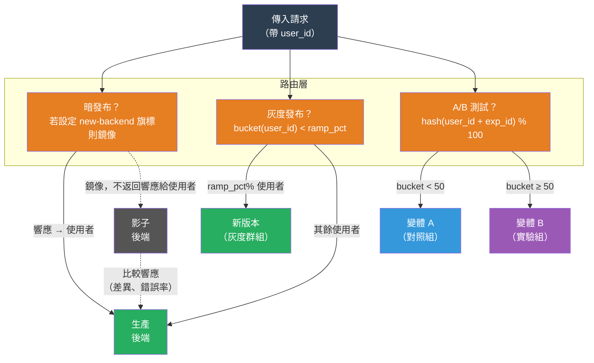

# [BEE-366] 灰度/暗發布與 A/B 測試

:::info
暗發布、灰度發布與 A/B 測試是三種生產環境測試模式，共享同一個基礎——將一部分真實流量路由到不同的程式碼路徑——但目標各異：在不影響使用者的情況下驗證新系統的負載表現、以自動回滾閘道漸進式推出變更，以及測量某個變更是否改善了使用者行為。
:::

## 背景

這三種模式背後有一個共同洞見：測試環境無法複製生產環境。真實流量擁有任何合成負載產生器都無法忠實模擬的使用者類型分佈、工作階段狀態、第三方延遲和邊緣案例輸入。了解新系統在真實條件下如何運作的唯一方式，就是將真實的生產流量路由到它——問題在於使用者在你學習過程中承擔多少風險。

Facebook 將**暗發布**（dark launch，也稱為影子測試或流量鏡像）作為在啟用前驗證大規模新後端的技術而推廣。這個模式——部署新程式碼、將生產流量鏡像到它、在不將影子響應返回給使用者的情況下比較輸出——讓工程師能在生產負載下對新系統進行壓力測試，而使用者繼續接收舊的、已知良好的響應。新程式碼是"暗"的，因為使用者看不到也無法與其輸出互動。

將真實使用者逐步路由到新版本——**灰度發布**（grey release）或金絲雀部署——將部署風險轉化為可測量的訊號。Jez Humble 和 David Farley 在《Continuous Delivery》（Addison-Wesley，2010）中正式確立了這個原則：漸進式發布、在可觀察訊號（錯誤率、延遲、業務 KPI）上自動化回滾閘道，任何糟糕發布的影響範圍都限制在當前使用新版本的那部分使用者群體上。

**A/B 測試**（線上受控實驗）在流量分流之上增加了測量目標。Diane Tang、Aniket Agarwal、Deirdre O'Brien 和 Micha Meyer 在 Google 的論文〈Overlapping Experiment Infrastructure: More, Better, Faster Experimentation〉（KDD，2010）中描述了大規模執行實驗的基礎設施挑戰。論文的核心洞見是：同時執行多個實驗需要兩個屬性：實驗正交性（不同實驗不干擾彼此的測量）和使用者一致性分配（給定使用者必須始終看到同一變體，否則實驗指標會被污染）。第二個屬性——使用者一致性——是 A/B 測試與簡單流量百分比分流的區別所在，也是最常見的實作錯誤。

## 設計思考

這三種模式都將一部分生產流量路由到不同的程式碼路徑。不同之處在於路由單元、使用者是否看到結果，以及測量的內容：

| 模式 | 路由單元 | 使用者看到結果？ | 主要目標 |
|---|---|---|---|
| 暗發布 | 請求（鏡像） | 否 | 負載與正確性驗證 |
| 灰度發布 | 請求或使用者群組 | 是 | 穩定性閘控的漸進推出 |
| A/B 測試 | 使用者（一致） | 是 | 行為測量 |

**信心階梯。** 這三種模式自然地排列成一個降低風險的流水線：先暗發布（驗證新程式碼能無錯誤地處理生產負載），然後灰度發布（暴露小型使用者群組，監測回退，逐步擴大），最後 A/B 測試（一旦穩定，測量新體驗是否產生更好的結果）。每個階段都使用前一階段的訊號作為前提：不要灰度發布影子響應比對失敗的系統；不要 A/B 測試觸發回滾閘道的版本。

**為什麼負載均衡器的百分比分流會破壞 A/B 測量。** 將 50% 請求路由到服務 A、50% 路由到服務 B 的負載均衡器以請求為單位路由，而非以使用者為單位。同一使用者在一次工作階段中進行多次請求，有些請求會打到服務 A，有些會打到服務 B。他們的行為訊號——是否轉換、停留多久、是否點擊——反映了兩個變體的混合。將這個被污染的訊號在數百萬使用者中聚合，不能產生關於 A 和 B 差異的有效測量。使用者一致性分桶（`bucket = hash(user_id + experiment_id) % 100`）解決了這個問題：同一使用者始終打到同一變體，因為雜湊值是確定性的，不需要外部狀態儲存。

## 視覺化



## 最佳實務

### 暗發布

**不得（MUST NOT）讓影子路徑觸發不可逆的副作用。** 如果新後端發送電子郵件、對支付方式扣款、減少庫存或入隊訊息，即使沒有響應返回給使用者，這些副作用也會影響真實使用者。影子路徑**必須（MUST）** 是唯讀的，或者在影子模式下對有副作用的呼叫進行打樁。常見方法：傳遞 `X-Shadow-Request: true` 標頭，讓下游服務在不執行寫入的情況下返回模擬 200 響應。

**在結構上比較影子響應，而非逐字節比較。** JSON 欄位順序、時間戳和浮點精度在不同實作之間合理地存在差異。比較語義上等效的欄位，並監控錯誤率和延遲分佈。影子錯誤率明顯高於零，或 p99 延遲顯著高於生產環境，是在繼續之前需要調查的訊號。

**限制影子流量以保護新後端。** 新系統尚未針對 100% 的生產流量進行容量規劃。在首次驗證新後端時，**應該（SHOULD）** 將影子鏡像限速至實際流量的 10–20%，在確認系統能夠處理負載後再提高。

### 灰度發布

**在第一個擴容步驟之前定義回滾閘道，而非之後。** 沒有預定義閘道的灰度發布將默認在壓力下依靠人為判斷——"錯誤率看起來有點高，但讓我們再等等看"。在開始前定義閾值：如果新版本的錯誤率超過基線 N% 持續 M 分鐘，或 p99 延遲增加超過 X 毫秒，則自動回滾。Argo Rollouts 和 Flagger 都將指標驅動的自動回滾作為一等原語提供支援。

**分步驟擴容，每步設定烘焙期。** 從 1–5% 的流量開始。在錯誤率和延遲穩定達到定義的烘焙期後（最少 30 分鐘，如果發布影響定時任務則需一個部署週期），才晉升到下一步。典型的擴容計劃：1% → 5% → 20% → 50% → 100%。

**對有狀態體驗，應該（SHOULD）按使用者群組路由而非按請求路由。** 在一次頁面載入中看到版本 A、在下一次看到版本 B 的使用者可能遭遇損壞的狀態（無法識別其工作階段的購物車、重置進度的 UI）。請求層級路由對無狀態 API 端點是可接受的；使用者層級路由對工作階段敏感的界面是必需的。

### A/B 測試

**必須（MUST）使用確定性雜湊分桶。** 分配 `bucket = hash(user_id + experiment_id) % 100` 是確定性的（同一使用者、同一實驗 → 每次都是同一個桶），不需要外部狀態，可以擴展到任何流量量，並將實驗相互隔離（不同的 `experiment_id` 值產生獨立的桶分佈）。**不得（MUST NOT）** 使用每次請求隨機分配（會為同一使用者產生混合變體）或僅依賴工作階段 Cookie 的分配（在跨設備和瀏覽器重啟後失效）。

**不得（MUST NOT）因為結果看起來好就提前停止實驗。** 反覆查看結果並在達到顯著性時停止（稱為"偷看"）會誇大誤報率。p 值閾值是為在預定樣本量時進行單次檢查而設計的。要麼：(a) 在開始前確定所需的樣本量（基於最小可偵測效果和所需功效），等到達到後再查看；要麼 (b) 使用在數學上考慮了多次查看的序列測試方法（SPRT、永遠有效的推斷）。

**讓實驗運行至少一個完整的使用週期。** **新奇效應（novelty effect）** 讓使用者與任何新 UI 元素的互動都高於正常水準，僅僅因為它是不熟悉的。在啟動後第一週運行兩天的實驗，會顯示實驗組變體的膨脹互動率。實驗**應該（SHOULD）** 運行至少 7–14 天，以捕捉完整的每週使用週期，並讓新奇效應消退。

**隔離並行實驗。** 在同一使用者群體上同時運行的兩個實驗會互相干擾：結帳流程實驗和商品頁面實驗共享使用者，同時參與兩個實驗的使用者產生的指標反映了兩個處理的組合。使用正交分桶（不同的 `experiment_id` 種子產生獨立的桶分配），並在存在交互效應顧慮時將每個實驗限制在不相交的使用者子集中。

## 範例

**確定性使用者分桶：**

```python
import hashlib

def get_experiment_bucket(user_id: str, experiment_id: str, num_buckets: int = 100) -> int:
    """
    返回給定使用者和實驗的穩定桶 [0, num_buckets)。
    同一使用者對同一實驗始終落在同一個桶，
    但不同實驗產生獨立分佈。
    """
    key = f"{user_id}:{experiment_id}"
    digest = hashlib.sha256(key.encode()).hexdigest()
    return int(digest[:8], 16) % num_buckets

def assign_variant(user_id: str, experiment_id: str, treatment_pct: int = 50) -> str:
    bucket = get_experiment_bucket(user_id, experiment_id)
    return "treatment" if bucket < treatment_pct else "control"

# 同一使用者對同一實驗始終得到相同的變體
assert assign_variant("user-42", "checkout-redesign") == assign_variant("user-42", "checkout-redesign")

# 不同實驗獨立分配
v1 = assign_variant("user-42", "checkout-redesign")
v2 = assign_variant("user-42", "homepage-hero")
# v1 和 v2 可能不同——這是正確的；它們是獨立的實驗
```

**灰度發布流量分流（Argo Rollouts 金絲雀規格）：**

```yaml
apiVersion: argoproj.io/v1alpha1
kind: Rollout
metadata:
  name: payment-service
spec:
  strategy:
    canary:
      steps:
        - setWeight: 1       # 1% 流量到新版本
        - pause: {duration: 30m}   # 烘焙期：30 分鐘
        - setWeight: 5
        - pause: {duration: 30m}
        - setWeight: 20
        - pause: {duration: 1h}    # 20% 時更長的烘焙期
        - setWeight: 50
        - pause: {duration: 1h}
        # 最後烘焙期後自動晉升至 100%
      analysis:
        templates:
          - templateName: error-rate-check
        startingStep: 1    # 從第 1 步開始分析
        args:
          - name: service-name
            value: payment-service
---
apiVersion: argoproj.io/v1alpha1
kind: AnalysisTemplate
metadata:
  name: error-rate-check
spec:
  metrics:
    - name: error-rate
      interval: 5m
      failureLimit: 2      # 2 次連續失敗後中止
      provider:
        prometheus:
          address: http://prometheus:9090
          query: |
            sum(rate(http_requests_total{job="{{args.service-name}}",status=~"5.."}[5m]))
            /
            sum(rate(http_requests_total{job="{{args.service-name}}"}[5m]))
      successCondition: result[0] < 0.005   # 錯誤率 > 0.5% 則中止
```

**暗發布：帶副作用防護的影子流量：**

```python
import threading

def handle_request(request, shadow_enabled: bool = False):
    """
    提供生產響應，同時選擇性地鏡像到影子後端。
    影子呼叫是即發即忘的，永遠不影響使用者響應。
    """
    # 始終向使用者返回生產響應
    production_response = production_backend.call(request)

    if shadow_enabled:
        # 在背景執行緒中發出影子呼叫
        # 永遠不等待它；永遠不返回其結果
        def shadow_call():
            try:
                shadow_response = shadow_backend.call(
                    request,
                    headers={"X-Shadow-Request": "true"}  # 抑制副作用
                )
                # 比較響應以偵測回歸
                compare_responses(production_response, shadow_response)
            except Exception:
                shadow_error_counter.inc()  # 計數，不拋出

        threading.Thread(target=shadow_call, daemon=True).start()

    return production_response
```

## 相關 BEE

- [BEE-16002](deployment-strategies.md) -- Deployment Strategies：涵蓋基礎設施層面的藍綠、滾動和金絲雀部署；本文聚焦於位於部署機制之上的使用者一致性要求和測量層
- [BEE-16004](feature-flags.md) -- Feature Flags：實驗旗標是四種旗標類型之一；本文描述的分桶和路由機制是使實驗旗標能夠產生有效測量的原因
- [BEE-12006](../resilience/chaos-engineering-principles.md) -- Chaos Engineering：混沌工程和暗發布都使用生產流量驗證系統行為；混沌工程引入刻意的故障，暗發布在真實負載下引入新的程式碼路徑
- [BEE-12007](../resilience/rate-limiting-and-throttling.md) -- Rate Limiting and Throttling：影子流量鏡像應該限速，以避免壓垮尚未針對完整生產負載進行容量規劃的新後端

## 參考資料

- [Overlapping Experiment Infrastructure: More, Better, Faster Experimentation -- Tang, Agarwal, O'Brien, Meyer, KDD 2010](https://dl.acm.org/doi/10.1145/1835804.1835810)
- [Continuous Delivery -- Jez Humble and David Farley, Addison-Wesley, 2010](https://continuousdelivery.com/)
- [The Billion Versions of Facebook You've Never Seen -- LaunchDarkly Blog](https://launchdarkly.com/blog/the-billion-versions-of-facebook-youve-never-seen/)
- [What is a Dark Launch? -- Google Cloud CRE Life Lessons](https://cloud.google.com/blog/products/gcp/cre-life-lessons-what-is-a-dark-launch-and-what-does-it-do-for-me)
- [Argo Rollouts Progressive Delivery -- Argo Project](https://argoproj.github.io/rollouts/)
- [A/B Test Bucketing Using Hashing -- Depop Engineering](https://engineering.depop.com/a-b-test-bucketing-using-hashing-475c4ce5d07)
