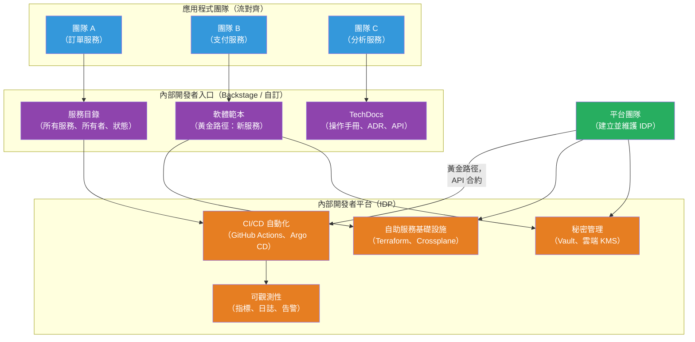

# [BEE-16009] 平台工程與內部開發者平台

:::info
平台工程是建立和維護自助式內部開發者平台（IDP）的學科，旨在減少應用程式團隊的認知負擔——讓開發者無需等待維運人員，即可自行配置基礎設施、建立服務和部署軟體。
:::

## 情境

隨著組織採用微服務和雲端基礎設施，一個新問題出現了：運維範疇急劇擴大。每個團隊現在需要了解 Kubernetes、CI/CD 管道、秘密管理、可觀測性工具、服務發現和其他數十個關注點才能交付功能。DevOps 成功打破了開發/維運壁壘，但創造了新的負擔——開發者成為了兼職基礎設施工程師。

平台工程作為回應而興起。與其讓每個應用程式團隊獨立解決基礎設施問題，專責平台團隊建立和維護共享的自助式能力——封裝組織最佳實踐的有主見的工具、範本和工作流程。應用程式團隊使用平台；他們不建立平台。

Matthew Skelton 和 Manuel Pais 在**《Team Topologies》（2019）**中將組織模型正式化：「平台團隊」類型的存在專門是為了減少「流對齊團隊」（產品團隊）的認知負擔。認知負擔有三種類型：內在的（理解技術本身）、外在的（正確使用工具的負擔）和關聯的（應用領域知識）。好的平台吸收外在認知負擔——管道配置、Kubernetes manifest 樣板、秘密輪換邏輯——讓開發者專注於關聯工作。

Spotify 開創了實際實施，約在 2014 年引入了**黃金路徑**（Spotify Engineering Blog，2020），並在 2020 年 3 月開源了 **Backstage**——一個開發者入口和服務目錄，於 2022 年 3 月成為 CNCF 孵化項目。到 2025 年，Backstage 已有超過 3,000 個採用者。雲原生計算基金會在 2023 年 4 月發布了其**雲原生計算平台白皮書**，提供了廠商中立的定義和能力模型。Gartner 預測，到 2026 年，80% 的大型軟體工程組織將建立平台工程團隊，高於 2022 年的 45%。

## 設計思維

### 平台 vs 入口 vs 工具鏈

三個術語經常被混淆：

**內部開發者平台（IDP）**：整合的後端——API、自動化、基礎設施能力、安全策略——使自助服務成為可能。IDP 不是單一產品；它是現有工具（Terraform、Kubernetes、Vault、CI/CD 系統）的組合，加上一個使它們可自助服務的統一層。

**內部開發者入口**：IDP 的使用者介面——一個 Web UI，開發者在這裡發現服務、從範本建立新元件、檢查部署狀態和找到文件。Backstage 是入口框架；IDP 是它所連接的後端。

**工具鏈**：在整合之前的個別工具（GitHub Actions、Argo CD、Datadog、HashiCorp Vault）。沒有平台層的工具鏈就是平台工程所要取代的東西。

### 黃金路徑 vs 鋪砌道路

**黃金路徑**是針對特定關注點的有主見、有良好支援的路線：「如何建立和部署新的後端服務」。它編碼了組織首選的技術、配置和流程。遵循黃金路徑的開發者預設會得到正確配置的基礎設施、CI/CD、秘密和可觀測性。

關鍵詞是「可選的」。黃金路徑應該足夠有吸引力，使偏離它成為一個有意識的決定，而不是強制約束。如果團隊在有正當理由時可以離開路徑，他們會接受路徑作為有用的幫助，而不是怨恨它是官僚要求。

### 成熟度層次

平台工程分階段成熟。CNCF 平台白皮書描述了一個演進過程：

| 層次 | 特徵 |
|---|---|
| **臨時** | 平台能力是腳本和 wiki 頁面；協調開銷高 |
| **運營** | 平台是有明確所有者的產品；常見任務自助服務 |
| **可擴展** | 平台團隊衡量開發者體驗；存在反饋循環 |
| **優化** | 黃金路徑涵蓋大多數用例；偏離是罕見且有意識的 |

大多數組織在不知情的情況下從第 1 層開始，平台工程運動始於升級到第 2 層：將平台視為有用戶的產品，而不只是內部工具項目。

## 最佳實踐

**MUST（必須）將平台視為產品，而非基礎設施項目。** 平台團隊有用戶（應用程式開發者），這些用戶有需求。使用產品管理實踐：路線圖、用戶訪談、採用指標和明確的平台能力 API 合約。沒有用戶研究而建立的平台會建立沒人使用的功能。

**MUST（必須）在建立入口之前定義黃金路徑。** 入口是已存在能力的 UI。先建立入口創造了進展的假象，而底層工作流程仍然是手動和不一致的。在投資入口工具之前，為最常見的兩三個開發者旅程（建立服務、部署到生產、添加秘密）定義黃金路徑。

**SHOULD（應該）衡量認知負擔的減少，而非平台功能的交付。** 平台的目的是減少應用程式團隊在基礎設施問題上花費的時間和精力。追蹤：從「想法到首次部署」的時間、向平台團隊發送的支援請求數量、使用範本與從零開始建立的服務百分比。這些是結果指標；平台功能數量是產出指標。

**SHOULD（應該）使平台的入職過程自助服務化。** 如果加入平台需要提交工單或等待平台團隊成員，平台就有瓶頸。新服務應該可以通過自助服務表單或 CLI 命令來配置。平台團隊的時間最好用在能力建設上，而不是個別請求上。

**SHOULD（應該）明確地對平台 API 進行版本控制和文件化。** 應用程式團隊依賴平台能力。對 Terraform 模組 API、CI/CD 範本介面或服務建立範本的破壞性更改會影響所有使用它們的人。以與外部 API 相同的向後相容性紀律對待平台 API。

**MAY（可以）從現有工具上的薄平台層開始。** 一個常見的錯誤是從零開始建立新平台。大多數組織已經有 GitHub Actions、Kubernetes 和雲提供商。一個薄的自助服務層——一個從範本生成 GitHub 倉庫、開啟帶有 Kubernetes manifest 的 PR 並建立 Datadog 監控的表單——就是一個平台。從薄的開始；根據開發者反饋添加能力。

**MAY（可以）使用軟體目錄作為初始平台錨點。** 所有服務的目錄（所有者、倉庫、部署狀態、依賴項）實施成本低且立即提供價值，回答「誰擁有這個？」它也為後來的能力提供數據模型：將告警路由到服務所有者、生成操作手冊、以程式方式執行標準。

## 視覺化



## 範例

**Backstage 軟體目錄條目（`catalog-info.yaml`）：**

```yaml
# catalog-info.yaml — 存在於每個服務倉庫的根目錄
# Backstage 自動讀取此文件以填充服務目錄
apiVersion: backstage.io/v1alpha1
kind: Component
metadata:
  name: orders-service
  description: 處理訂單建立、驗證和生命週期
  annotations:
    # 將 Backstage 連結到 GitHub 倉庫以獲取 CI 狀態、PR 數量等
    github.com/project-slug: myorg/orders-service
    # 連結到 ArgoCD 應用以獲取部署狀態
    argocd/app-name: orders-service-prod
    # 連結到 Datadog 儀表板以獲取即時指標
    datadoghq.com/dashboard-url: https://app.datadoghq.com/dashboard/abc
    # PagerDuty 服務用於告警路由
    pagerduty.com/service-id: P12345
  tags:
    - java
    - kafka
    - postgresql
spec:
  type: service
  lifecycle: production
  owner: group:team-commerce          # 誰擁有這個服務
  system: commerce-platform
  dependsOn:
    - component:payments-service
    - component:inventory-service
  providesApis:
    - orders-api
```

**黃金路徑 Backstage 軟體範本（新後端服務）：**

```yaml
# template.yaml — 定義「建立後端服務」黃金路徑
# 開發者填寫表單；Backstage 生成倉庫、CI 配置和 K8s manifest
apiVersion: scaffolder.backstage.io/v1beta3
kind: Template
metadata:
  name: new-backend-service
  title: 新後端服務
  description: 建立已預配置 CI/CD、可觀測性和秘密的生產就緒後端服務
spec:
  owner: group:platform-team
  type: service

  parameters:
    - title: 服務詳情
      required: [name, owner, description]
      properties:
        name:
          title: 服務名稱
          type: string
          pattern: '^[a-z][a-z0-9-]*$'
        owner:
          title: 所有者團隊
          type: string
          ui:field: OwnerPicker
        description:
          title: 描述
          type: string

  steps:
    # 1. 從組織的有主見範本生成服務
    - id: fetch
      name: 取得範本
      action: fetch:template
      input:
        url: ./skeleton   # 黃金路徑範本文件
        values:
          name: ${{ parameters.name }}
          owner: ${{ parameters.owner }}

    # 2. 建立 GitHub 倉庫
    - id: create-repo
      name: 建立倉庫
      action: github:repo:create
      input:
        repoUrl: github.com?repo=${{ parameters.name }}&owner=myorg

    # 3. 開啟帶有 Kubernetes manifest 和 CI 配置的 PR
    - id: push
      name: 推送到倉庫
      action: github:repo:push
      input:
        repoUrl: github.com?repo=${{ parameters.name }}&owner=myorg

    # 4. 自動在目錄中註冊
    - id: register
      name: 在目錄中註冊
      action: catalog:register
      input:
        repoContentsUrl: ${{ steps.create-repo.output.repoContentsUrl }}
        catalogInfoPath: /catalog-info.yaml

  output:
    links:
      - title: 倉庫
        url: ${{ steps.create-repo.output.remoteUrl }}
      - title: 在目錄中開啟
        url: ${{ steps.register.output.entityRef }}
```

**平台 API——自助服務秘密配置（CLI 包裝器）：**

```bash
# platform-cli：Vault 和 Kubernetes 的薄包裝器
# 抽象了複雜性；開發者不需要了解 Vault 路徑

# 開發者為其服務建立秘密（不需要 Vault 知識）
platform secret create \
  --service orders-service \
  --env production \
  --name DATABASE_URL \
  --value "postgres://..."
# Platform CLI 做的事：
# 1. 驗證服務所有權（目錄查找）
# 2. 寫入 Vault 路徑：secret/production/orders-service/DATABASE_URL
# 3. 通過 PR 在服務倉庫中更新 K8s ExternalSecret manifest
# 4. 開發者審查並合併 PR——秘密輪換是可審計的

# 開發者列出其服務的秘密
platform secret list --service orders-service --env production
# NAME           LAST_ROTATED         OWNER
# DATABASE_URL   2026-04-01 10:00 UTC  team-commerce
# STRIPE_KEY     2026-03-15 08:00 UTC  team-commerce
```

## 實作注意事項

**Backstage vs 自訂入口**：Backstage 是最廣泛採用的開發者入口框架，但它需要大量的 React/TypeScript 工程來定制。具有強大前端能力的團隊受益於其外掛生態系統（500+ 個 GitHub、Kubernetes、Datadog、PagerDuty 等的外掛）。沒有前端資源的團隊通常從更簡單的目錄（Port、Cortex、OpsLevel）或帶有手動維護的服務登錄的靜態文件站點開始，然後再升級到 Backstage。

**基礎設施即程式碼整合**：平台的自助服務基礎設施層通常建立在 Terraform 模組或 Crossplane 組合上。開發者通過更高層次的 API（CLI、入口表單或 GitHub Actions 工作流程）調用平台能力，內部調用已批准的、組織標準的 Terraform 模組。這防止團隊使用任意基礎設施配置，同時保留靈活性。

**衡量平台成功**：關鍵指標是開發者體驗，衡量為：新服務首次部署的時間、每個服務建立的手動平台團隊接觸點數量以及開發者滿意度分數（SPACE 框架或 DORA 指標）。採用率（使用平台黃金路徑的服務百分比）是領先指標。

**從小開始**：大多數成功的平台工程計劃從一個高影響力能力開始：使所有權可發現的服務目錄，或將 2 週手動流程縮短到 15 分鐘的「建立新服務」範本。平台根據開發者實際需要逐步增長。

## 相關 BEE

- [BEE-16003](infrastructure-as-code.md) -- 基礎設施即程式碼：平台的自助服務基礎設施層建立在 IaC 上；平台通過更高層次的自助服務介面公開 IaC
- [BEE-16002](deployment-strategies.md) -- 部署策略：黃金路徑編碼了組織首選的部署策略（金絲雀、藍綠）；平台自動化執行
- [BEE-16004](feature-flags.md) -- 功能旗標：功能旗標管理通常是平台能力，為團隊提供自助服務方式來建立和管理旗標
- [BEE-2003](../security-fundamentals/secrets-management.md) -- 秘密管理：秘密管理是核心平台能力；平台提供自助服務秘密建立，抽象了底層的秘密存儲

## 參考資料

- [雲原生計算平台 — CNCF TAG App Delivery 白皮書（2023 年 4 月）](https://tag-app-delivery.cncf.io/whitepapers/platforms/)
- [Team Topologies — Matthew Skelton 和 Manuel Pais（2019）](https://teamtopologies.com/book)
- [我們如何使用黃金路徑解決生態系統碎片化 — Spotify Engineering（2020）](https://engineering.atspotify.com/2020/08/how-we-use-golden-paths-to-solve-fragmentation-in-our-software-ecosystem/)
- [Backstage — CNCF 項目](https://www.cncf.io/projects/backstage/)
- [Backstage 文件 — backstage.io](https://backstage.io/docs/)
