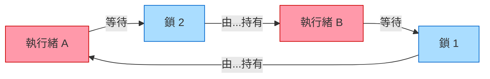

# [BEE-11003] 鎖、互斥量與信號量

:::info
鎖是保護共享狀態最常見的手段，但也是錯誤的溫床：死結、飢餓與效能瓶頸。理解互斥鎖、信號量、讀寫鎖、自旋鎖之間的差異，以及導致死結的四個條件，是並發系統的基礎知識。
:::

## 背景

當多個執行緒或 goroutine 存取共享可變狀態時，正確性要求臨界區對彼此具有原子性。作業系統與語言執行環境提供了多種同步原語來達成此目的。每種原語的語義、所有權規則和效能特性各有不同。用錯工具，或用對了工具卻用法有誤，都會產生難以重現的細微錯誤。

本文定義主要的鎖類型，解釋死結及其四個必要條件，逐步說明預防策略，並涵蓋分散式鎖。

## 定義

### 互斥鎖（Mutex，Mutual Exclusion Lock）

**互斥鎖**是一種二元鎖：它只有兩種狀態——持有（locked）或空閒（unlocked）。任意時刻只有一個執行緒能持有互斥鎖。

互斥鎖的核心特性是**所有權（ownership）**：只有鎖住互斥鎖的執行緒才能解鎖它。這個所有權規則防止某個執行緒意外釋放另一個執行緒持有的鎖，並支援優先權繼承（priority inheritance），可避免優先權反轉（priority inversion）問題。

當臨界區必須由單一執行緒進入時，互斥鎖是正確的選擇。

```
# 通用虛擬碼
mutex = Mutex()

function update_counter():
    mutex.lock()
    try:
        shared_counter += 1
    finally:
        mutex.unlock()
```

`try/finally`（或 Go 的 `defer`、Python 的 `with`、C++ 的 RAII）模式至關重要：它確保即使拋出例外或提前返回，鎖也一定會被釋放。

### 信號量（Semaphore）

**信號量**是 Dijkstra（1965年）提出的計數同步原語。它維護一個整數計數器，並提供兩個操作：

- `wait()`（又稱 `P`、`acquire`、`down`）：遞減計數器。若計數器已為 0，呼叫的執行緒阻塞，直到另一個執行緒遞增計數器。
- `signal()`（又稱 `V`、`release`、`up`）：遞增計數器，並喚醒一個等待的執行緒（若有的話）。

與互斥鎖不同，**信號量沒有所有權**：任何執行緒都可以呼叫 `signal()`，不必是呼叫 `wait()` 的那個。這使得信號量適合用於執行緒間的通知（signaling）和資源池管理，而不僅僅是互斥。

**二元信號量**（計數器從 1 開始）：功能上類似互斥鎖，但沒有所有權規則。當目標是互斥時，通常應使用互斥鎖而非二元信號量。

**計數信號量**（計數器從 N 開始）：控制對 N 個相同資源的並發存取。最多 N 個執行緒可同時繼續執行，第 N+1 個執行緒阻塞直到某個執行緒釋放。

```
# 將資料庫並發連線數限制為 10
db_semaphore = Semaphore(10)

function query_db(sql):
    db_semaphore.wait()       # 取得一個連線槽
    try:
        return execute(sql)
    finally:
        db_semaphore.signal() # 釋放連線槽
```

| 屬性 | 互斥鎖 | 信號量 |
|---|---|---|
| 計數範圍 | 二元（0 或 1） | 0 到 N |
| 所有權 | 有 — 鎖定者才能解鎖 | 無 — 任何執行緒皆可 signal |
| 主要用途 | 互斥 | 資源池、執行緒通知 |
| 優先權繼承 | 大多數實作支援 | 不適用 |

參考：[GeeksforGeeks — Mutex vs Semaphore](https://www.geeksforgeeks.org/operating-systems/mutex-vs-semaphore/)

### 讀寫鎖（Read-Write Lock，RWLock）

**讀寫鎖**區分讀者與寫者：

- **多個讀者**可以同時持有鎖（共享模式）。讀取不阻塞其他讀取。
- **一個寫者**以獨佔模式持有鎖。寫入阻塞所有讀者和其他寫者。

當讀取遠多於寫入，且讀取確實可以並發安全執行（即不修改狀態）時，讀寫鎖是正確的選擇。

```
rwlock = RWLock()

# 多個 goroutine 可以同時呼叫此函式
function read_cache(key):
    rwlock.read_lock()
    try:
        return cache[key]
    finally:
        rwlock.read_unlock()

# 任意時刻只有一個 goroutine 執行此函式，且會阻塞所有讀者
function write_cache(key, value):
    rwlock.write_lock()
    try:
        cache[key] = value
    finally:
        rwlock.write_unlock()
```

**注意事項：** 部分實作存在寫者飢餓（writer starvation）問題——若讀者持續湧入，等待中的寫者可能永遠無法取得鎖。請確認你所用執行環境的 RWLock 公平性保證（Go 的 `sync.RWMutex` 在有寫入等待時，會對新讀者設定優先，讓寫者優先取得鎖）。

### 自旋鎖（Spinlock）

**自旋鎖**是一種等待執行緒在緊密迴圈中反覆輪詢（spin）的鎖，直到鎖變為空閒，而不是阻塞後讓出 CPU 給排程器。

```
# 概念實作
function spin_lock(lock):
    while not compare_and_swap(lock, FREE, HELD):
        pass  # 自旋
```

**適用時機：** 僅適用於非常短的臨界區（約數十奈秒級別），且必須是多核心硬體環境，此時掛起執行緒再喚醒的開銷會超過自旋等待的時間。

**不適用時機：** 任何涉及 I/O、系統呼叫、記憶體配置或其他鎖的臨界區。自旋執行緒浪費 CPU 週期，在競爭下可能造成效能崩潰。應用層程式碼通常應使用互斥鎖。

## 死結（Deadlock）

**死結**是一種狀態：兩個或更多執行緒各自等待另一個執行緒持有的資源，導致沒有任何執行緒能繼續執行。

### 四個 Coffman 條件

死結需要以下四個條件同時成立（E. G. Coffman 等人，1971年）：

1. **互斥（Mutual Exclusion）**：資源無法共享，任意時刻最多只有一個執行緒持有某資源。
2. **持有並等待（Hold and Wait）**：執行緒持有至少一個資源，同時等待獲取其他執行緒持有的資源。
3. **不可剝奪（No Preemption）**：資源不能被強制奪走，只能由持有者自願釋放。
4. **循環等待（Circular Wait）**：資源分配圖中存在環形鏈：執行緒 A 等待執行緒 B，執行緒 B 等待執行緒 A（或更長的環）。

打破這四個條件中的任何一個，即可防止死結。

參考：[CS 341 UIUC — Deadlock](https://cs341.cs.illinois.edu/coursebook/Deadlock)、[AfterAcademy — 四個必要條件](https://afteracademy.com/article/what-is-deadlock-and-what-are-its-four-necessary-conditions)

### 死結圖示



執行緒 A 持有鎖 1，等待鎖 2。執行緒 B 持有鎖 2，等待鎖 1。兩者均無法前進。循環等待是可見的症狀；四個條件全部成立。

## 死結預防策略

### 1. 一致的鎖定順序

最可靠的預防策略：所有執行緒必須以相同的全域順序獲取多個鎖。這消除了循環等待條件。

**死結場景：**

```
# 執行緒 A                    # 執行緒 B
lock(resource_1)              lock(resource_2)
lock(resource_2)  # 等待      lock(resource_1)  # 等待 → 死結
```

**修法 — 強制全域順序：**

```
# 執行緒 A 和執行緒 B 都始終按照 resource_1 → resource_2 的順序加鎖
function transfer(from_account, to_account, amount):
    first, second = sorted([from_account, to_account], key=lambda a: a.id)
    lock(first)
    try:
        lock(second)
        try:
            execute_transfer(from_account, to_account, amount)
        finally:
            unlock(second)
    finally:
        unlock(first)
```

在加鎖前按穩定的鍵（帳戶 ID、指標位址、UUID）排序，確保兩個執行緒無論參數順序為何，都以相同順序獲取鎖。

### 2. 帶超時的 Try-Lock

在獲取多個資源時，使用 `try_lock(timeout)` 代替阻塞式的 `lock()`。若超時，釋放所有已持有的鎖並在隨機退避後重試。這打破了持有並等待條件。

```
function acquire_both(lock_a, lock_b):
    while True:
        lock_a.lock()
        if lock_b.try_lock(timeout=50ms):
            return  # 兩個都已獲取
        lock_a.unlock()  # 釋放並重試
        sleep(random_backoff())
```

當無法強制執行鎖定順序時（例如：使用者提供的資源對），這個方法很有用。代價是程式碼複雜度增加，以及活鎖（livelock）風險——使用帶上限的隨機退避來緩解。

### 3. 鎖的層級／等級制度

為每把鎖分配一個數字等級。執行緒只能獲取比其當前持有的所有鎖等級更低的鎖。這是鎖定順序的正式化版本，常見於作業系統核心和資料庫的實作中。

## 鎖的粒度

**粗粒度鎖（Coarse-grained）**：對整個大型共享資料結構使用單一鎖。易於理解，容易做對。當許多執行緒競爭同一把鎖時，可能成為效能瓶頸。

**細粒度鎖（Fine-grained）**：對資料結構分區，每個分區使用一把鎖。競爭下有更高的吞吐量，但更複雜。風險：部分鎖定需要同時獲取多把鎖，死結風險隨之出現。

**經驗法則：** 先從粗粒度開始。進行效能分析。只有在量測資料顯示鎖競爭確實是瓶頸時，才改用細粒度。過早的細粒度化引入錯誤卻沒有可量測的效益。

## 鎖競爭與效能

高鎖競爭從兩個方面降低效能：
1. **序列化**：執行緒排隊等待鎖。在極端情況下，吞吐量退化至單執行緒的效能。
2. **上下文切換開銷**：執行緒阻塞時，作業系統暫停它並排程另一個。每次切換約耗費 1–5 µs。

降低競爭的策略：
- **縮短臨界區時間**：只在鎖內做最少的工作。將 I/O、運算和記憶體配置移出鎖外。
- **細粒度鎖**：對資料結構分片（例如：雜湊映射每個桶使用一把鎖）。
- **無鎖 / 無等待演算法**：對高競爭的計數器或佇列使用原子操作（CAS）代替鎖。
- **讀寫鎖**：若讀取占主導，讀寫鎖消除了讀者之間的競爭。
- **批次處理**：累積工作後，一次性獲取鎖刷新批次。

## 分散式鎖

在分散式系統中，不同機器上的多個程序必須協調對共享資源的存取（資料庫資料列、S3 物件、任務佇列槽）。作業系統層級的互斥鎖不能跨程序邊界。分散式鎖填補了這個空缺。

### Redis SETNX

最簡單的方案使用 Redis 的原子 SET 指令，搭配 NX（僅在不存在時設定）和 EX（過期時間）：

```
# 獲取鎖
result = redis.SET("lock:resource_id", unique_token, NX=True, EX=30)
if result is None:
    # 鎖已被其他人持有
    return LOCK_FAILED

# 釋放鎖 — 只釋放自己持有的鎖
script = """
if redis.call("GET", KEYS[1]) == ARGV[1] then
    return redis.call("DEL", KEYS[1])
else
    return 0
end
"""
redis.eval(script, keys=["lock:resource_id"], args=[unique_token])
```

重點：
- 每次獲取鎖使用**唯一 token**（UUID 或隨機位元組），避免釋放其他人的鎖。
- 透過 **Lua 腳本**釋放鎖，使 get-and-delete 具有原子性。
- 設定 **TTL**，讓鎖在持有者崩潰時能自動過期。TTL 要比預期的臨界區時間保守地大一些，但不應無限期。

### Redlock 及其局限性

Redlock 是 Redis 作者提出的容錯分散式鎖演算法，使用 N 個獨立的 Redis 實例（通常為 5 個）。只有當超過半數（floor(N/2)+1）的實例在一個 quorum 時間視窗內接受時，才認為鎖已獲取。

Redlock 存在爭議。分散式系統研究者 Martin Kleppmann 指出其根本性問題：

1. **時鐘漂移（Clock drift）**：Redlock 依賴掛鐘時間（wall-clock）的 TTL。若 Redis 節點的時鐘偏移，鎖可能比預期更早過期，導致兩個持有者同時存在。
2. **GC 暫停 / 程序暫停**：程序在獲取鎖後可能被暫停（GC、VM 遷移）。恢復後，TTL 可能已過期，另一個程序已持有鎖。
3. **缺少圍欄令牌（Fencing token）**：Redlock 不提供單調遞增的圍欄令牌，因此下游資源（如資料庫）無法驗證持有者的令牌是否仍為最新。

參考：[Redis 分散式鎖](https://redis.io/docs/latest/develop/clients/patterns/distributed-locks/)、[Leapcell — Redlock 爭議](https://leapcell.io/blog/implementing-distributed-locks-with-redis-delving-into-setnx-redlock-and-their-controversies)

**建議：** 對於正確性至關重要的分散式鎖（例如：金融操作），優先使用具有更強線性一致性保證的系統：etcd（基於 Raft）、ZooKeeper（基於 ZAB），或資料庫列鎖。僅在短暫的雙重鎖定窗口可接受時（例如：快取失效、速率限制），才使用 Redis 型鎖。

## 常見錯誤

**1. 持鎖期間執行 I/O。**
在持有鎖的情況下進行網路呼叫、檔案讀取或資料庫查詢，會讓所有等待該鎖的執行緒在完整的 I/O 延遲期間阻塞。應將 I/O 移到臨界區外：準備好輸入，釋放鎖，執行 I/O，若需要將結果寫回再重新獲取鎖。

**2. 未使用帶超時的 try-lock。**
沒有超時的阻塞式 `lock()` 呼叫是最常見的死結路徑。在任何需要獲取多把鎖的程式碼中，使用 `try_lock(timeout)` 或強制執行嚴格的鎖定順序。優先選擇順序方案——沒有超時開銷，也沒有活鎖風險。

**3. 鎖的粒度過粗。**
保護整個服務狀態的單一鎖在並發負載下成為瓶頸。在假設粒度是問題所在之前，先用鎖競爭指標進行效能分析，然後只對數據顯示有問題的部分進行分片。

**4. 在錯誤路徑中忘記釋放鎖。**
永遠不被釋放的鎖會讓所有後續呼叫者死結。一律使用 `try/finally` 區塊、`defer`、RAII guard 或 `with` 語句。永遠不要依賴在分支後手動放置的 `unlock()` 呼叫。

```
# 錯誤：若拋出例外，unlock 可能永遠不會執行
mutex.lock()
result = risky_operation()  # 可能拋出例外
mutex.unlock()              # 例外時跳過

# 正確：finally 一定執行
mutex.lock()
try:
    result = risky_operation()
finally:
    mutex.unlock()
```

**5. 使用分散式鎖卻不了解 Redlock 的局限性。**
將 Redis 型鎖等同於資料庫層級的可序列化事務，會導致細微的正確性錯誤。若需要保證最多只有一個程序執行臨界區，請使用由 CP（一致性—分區容忍）系統支撐的鎖，而非 AP 快取。在下游資源能夠驗證時，一律包含圍欄令牌。

## 相關 BEE

- [BEE-11001](threads-vs-processes-vs-coroutines.md) -- 並發模型：執行緒、goroutine、async/await
- [BEE-11002](race-conditions-and-data-races.md) -- 競態條件與資料競爭：鎖所要防止的問題
- [BEE-11006](optimistic-vs-pessimistic-concurrency-control.md) -- 樂觀並發控制：低競爭場景下的鎖替代方案

## 參考資料

- [GeeksforGeeks — Mutex vs Semaphore](https://www.geeksforgeeks.org/operating-systems/mutex-vs-semaphore/)
- [CS 341 UIUC Coursebook — Deadlock](https://cs341.cs.illinois.edu/coursebook/Deadlock)
- [AfterAcademy — What is Deadlock and its Four Necessary Conditions](https://afteracademy.com/article/what-is-deadlock-and-what-are-its-four-necessary-conditions)
- [Redis — Distributed Locks with Redis](https://redis.io/docs/latest/develop/clients/patterns/distributed-locks/)
- [Leapcell — Implementing Distributed Locks with Redis: SETNX, Redlock, and Their Controversies](https://leapcell.io/blog/implementing-distributed-locks-with-redis-delving-into-setnx-redlock-and-their-controversies)
- [Martin Kleppmann — How to do distributed locking](https://martin.kleppmann.com/2016/02/08/how-to-do-distributed-locking.html)
