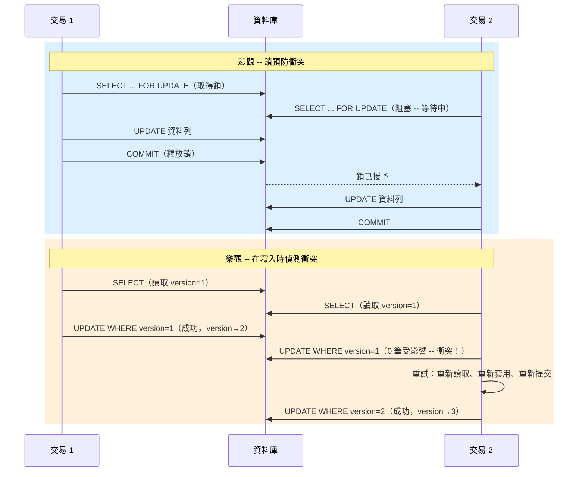

# [BEE-245] 樂觀 vs 悲觀並行控制

:::info
根據你的競爭狀況，在衝突預防（悲觀）與衝突偵測（樂觀）之間做出選擇。
:::

## 背景

當多個交易或請求同時操作相同資料時，你必須決定如何處理衝突。兩種根本策略分別是：悲觀並行控制（在操作前先取得鎖）與樂觀並行控制（事後偵測衝突，再重試或中止）。

選錯策略會帶來實際問題：在低競爭系統中使用悲觀鎖會拖垮吞吐量；在高競爭系統中使用樂觀鎖則會造成無止盡的重試風暴。

**參考資料：**
- [Optimistic concurrency control - Wikipedia](https://en.wikipedia.org/wiki/Optimistic_concurrency_control)
- [Optimistic and pessimistic locking in SQL - learning-notes](https://learning-notes.mistermicheels.com/data/sql/optimistic-pessimistic-locking-sql/)
- [Optimistic Concurrency in an HTTP API with ETags - CodeOpinion](https://codeopinion.com/optimistic-concurrency-in-an-http-api-with-etags-hypermedia/)
- [ETags and Optimistic Concurrency Control - fideloper.com](https://fideloper.com/etags-and-optimistic-concurrency-control)
- [PostgreSQL Explicit Locking](https://www.postgresql.org/docs/current/explicit-locking.html)

## 原則

**讓你的並行策略符合你的競爭特性。** 當衝突頻繁且交易時間短暫時，使用悲觀鎖。當衝突罕見且你能接受偶爾重試時，使用樂觀鎖。

## 兩種策略的運作方式

### 悲觀並行控制

先鎖定，再操作。交易在讀取或修改資料前，先對所需的資料列取得排他鎖。在鎖釋放之前，其他任何寫入者都無法碰觸這些資料列。

標準 SQL 機制是 `SELECT FOR UPDATE`：

```sql
BEGIN;

-- 立即取得排他的資料列鎖
SELECT balance
FROM accounts
WHERE id = 42
FOR UPDATE;

-- 現在可以安全修改 -- 其他交易無法碰觸此資料列
UPDATE accounts
SET balance = balance - 100
WHERE id = 42;

COMMIT;
```

資料列從 `SELECT FOR UPDATE` 開始保持鎖定，直到 `COMMIT` 或 `ROLLBACK`。任何其他嘗試對同一資料列執行 `SELECT ... FOR UPDATE` 或 `UPDATE` 的交易，都會阻塞直到本交易結束。

**常見變體：**
- `FOR UPDATE` -- 排他鎖；阻塞同樣使用 `FOR UPDATE` 的讀取者
- `FOR SHARE` -- 共享鎖；多個讀取者可同時持有，但寫入者阻塞
- `FOR NO KEY UPDATE`（PostgreSQL）-- 排他但允許並發的 FK 插入；除非要修改主鍵，否則優先使用此選項

### 樂觀並行控制

先操作，在提交時才檢查衝突。不取得任何鎖。每一筆資料列帶有一個 `version`（整數計數器）或 `updated_at`（時間戳記）。寫入前，交易會驗證它所讀取的版本是否沒有被更改。

**資料表結構：**
```sql
CREATE TABLE documents (
  id          BIGSERIAL PRIMARY KEY,
  content     TEXT,
  version     INTEGER NOT NULL DEFAULT 1,
  updated_at  TIMESTAMPTZ NOT NULL DEFAULT now()
);
```

**讀取：**
```sql
SELECT id, content, version
FROM documents
WHERE id = 7;
-- 回傳：id=7, content="hello", version=3
```

**帶版本檢查的寫入：**
```sql
UPDATE documents
SET content    = 'hello world',
    version    = version + 1,
    updated_at = now()
WHERE id       = 7
  AND version  = 3;   -- <-- 我們讀取到的版本
```

檢查受影響的資料列數。若為 0，代表在你讀取與寫入之間有人修改了此資料列 -- 發生衝突了。應用程式必須決定：重試、合併或中止。

## 流程比較



## 實例：兩位使用者編輯同一份文件

使用者 A 和使用者 B 都開啟了文件 #7（版本 3）。

### 悲觀做法

```sql
-- 使用者 A 的 session
BEGIN;
SELECT id, content, version FROM documents WHERE id = 7 FOR UPDATE;
-- 使用者 B 嘗試相同的查詢 -- 阻塞，直到使用者 A COMMIT

-- 使用者 A 完成編輯並儲存
UPDATE documents SET content = 'A 的編輯', version = 4 WHERE id = 7;
COMMIT;

-- 使用者 B 解除阻塞，讀取目前狀態（版本 4）
UPDATE documents SET content = 'B 的編輯', version = 5 WHERE id = 7;
COMMIT;
```

使用者 B 等待。不會有資料遺失。但若使用者 A 編輯時間很長，B 就會一直等著。

### 樂觀做法

```sql
-- 使用者 A 讀取版本 3，使用者 B 也讀取版本 3（無鎖，兩者同時進行）

-- 使用者 A 先儲存
UPDATE documents
SET content = 'A 的編輯', version = 4, updated_at = now()
WHERE id = 7 AND version = 3;
-- 受影響資料列：1 -- 成功

-- 使用者 B 嘗試以版本 3 儲存
UPDATE documents
SET content = 'B 的編輯', version = 4, updated_at = now()
WHERE id = 7 AND version = 3;
-- 受影響資料列：0 -- 衝突

-- 應用程式重新讀取目前狀態（版本 4，content = 'A 的編輯'）
-- 呈現差異給使用者 B 或自動合併，然後重試：
UPDATE documents
SET content = 'A+B 合併的編輯', version = 5, updated_at = now()
WHERE id = 7 AND version = 4;
-- 受影響資料列：1 -- 成功
```

兩位使用者都不會被阻塞。當衝突罕見時，效率更高。

## HTTP API 中基於 ETag 的樂觀並行控制

同樣的模式可直接對應到 HTTP，透過 `ETag` 與 `If-Match` 標頭來實現。

**伺服器在 GET 回應中以 ETag 回傳版本：**
```http
GET /documents/7 HTTP/1.1

HTTP/1.1 200 OK
ETag: "3"
Content-Type: application/json

{"id": 7, "content": "hello"}
```

**客戶端在 PUT 時帶回 ETag：**
```http
PUT /documents/7 HTTP/1.1
If-Match: "3"
Content-Type: application/json

{"content": "hello world"}
```

**版本符合時的伺服器回應：**
```http
HTTP/1.1 200 OK
ETag: "4"
```

**版本已被更改時的伺服器回應（其他人先更新了）：**
```http
HTTP/1.1 412 Precondition Failed
```

客戶端必須重新 `GET`、重新套用變更，再重新提交。這與資料庫樂觀重試循環完全相同 -- 只是用 HTTP 語意來表達。

## 比較與交換（CAS）作為底層原語

版本欄位模式和 ETag 模式都是**比較與交換（Compare-and-Swap，CAS）**的應用：

> CAS(位置, 預期值, 新值)：只有當 `位置` 目前的值為 `預期值` 時，才將其更新為 `新值`。

SQL 形式為 `WHERE version = :expected`。在硬體層面，這就是 CPU 原子指令的運作方式。許多分散式系統（Redis `SET NX`、DynamoDB 條件式寫入、S3 `If-Match` 條件式 PUT）也在其 API 層暴露了同樣的原語。

## 使用時機

| 維度 | 悲觀 | 樂觀 |
|---|---|---|
| 競爭程度 | 高 -- 衝突是常態 | 低 -- 衝突罕見 |
| 交易持續時間 | 短 -- 鎖持有時間短暫 | 長時間讀取沒問題 -- 不持有鎖 |
| 重試複雜度 | 不需要 -- 被阻塞的交易自動等待 | 必要 -- 應用程式必須偵測並重試 |
| 吞吐量影響 | 較低 -- 讀寫者排隊等鎖 | 較高 -- 低競爭下無阻塞 |
| 死鎖風險 | 有 -- 必須使用鎖排序或超時 | 無 -- 沒有鎖可以死鎖 |
| 適合的工作負載 | 金融轉帳、庫存扣減、座位預訂 | 文件編輯、使用者設定更新、組態變更 |

**經驗法則：** 若超過約 20% 的交易在樂觀控制下會發生衝突，請改用悲觀鎖。若你的交易執行時間很長（使用者在編輯時持有鎖），請優先使用樂觀鎖。

## 樂觀失敗時的衝突解決

當樂觀更新回傳 0 筆受影響資料列時，應用程式有三個選擇：

1. **重試** -- 重新讀取目前狀態，重新套用相同的變更，重新提交。適用於變更是冪等或可交換的情況（例如遞增計數器）。
2. **合併** -- 重新讀取，計算三方合併（原始 + A 的變更 + B 的變更），提交合併結果。用於協作編輯。
3. **中止並通知** -- 告知使用者其變更發生衝突，請他們重新開始。實作最簡單；當衝突非常罕見時可接受。

務必設定重試上限。在持續高競爭下的無限重試可能會永遠循環。

## 常見錯誤

### 1. 悲觀鎖沒有設定超時

持有鎖的交易若當機（網路問題、應用程式邏輯緩慢），將無限期地阻塞其他所有寫入者。務必設定鎖超時：

```sql
-- PostgreSQL：若鎖無法立即取得則失敗
SELECT ... FOR UPDATE NOWAIT;

-- PostgreSQL：最多等待 5 秒
SET lock_timeout = '5s';
SELECT ... FOR UPDATE;
```

### 2. 樂觀鎖沒有重試邏輯

偵測到衝突後就拋出未處理的錯誤（或對客戶端回傳 412 但沒有任何引導），並不是一種並行控制策略 -- 這只是把問題丟給呼叫方。務必定義衝突發生後的處理方式。

### 3. 在高競爭場景使用樂觀鎖

在熱點資料列場景（例如每秒被數千個請求命中的全域計數器）中，大多數交易都會失敗並重試。每次重試都需要一次往返。最終結果比悲觀鎖的吞吐量更差。選擇策略前，先測量你的衝突率。

### 4. 忘記在每次寫入時遞增版本

若任何程式碼路徑在更新資料列時沒有遞增 `version`，該寫入對樂觀檢查就是隱形的。使用資料庫觸發器或 ORM 生命週期 hook 來強制每次 `UPDATE` 都遞增版本，或依賴 `updated_at` 加上亞秒精度時間戳記（但要注意時鐘偏差）。

```sql
-- 安全：在資料庫層面強制執行
CREATE OR REPLACE FUNCTION increment_version()
RETURNS TRIGGER AS $$
BEGIN
  NEW.version := OLD.version + 1;
  RETURN NEW;
END;
$$ LANGUAGE plpgsql;

CREATE TRIGGER trg_version
BEFORE UPDATE ON documents
FOR EACH ROW EXECUTE FUNCTION increment_version();
```

### 5. SELECT FOR UPDATE 沒有索引（資料表鎖而非資料列鎖）

`SELECT FOR UPDATE` 以它掃描的資料列粒度鎖定。若 `WHERE` 子句無法使用索引，資料庫會掃描整個資料表，可能升級為資料表層級鎖，阻塞所有並發寫入者：

```sql
-- 若 status 沒有索引則很危險
SELECT * FROM orders WHERE status = 'pending' FOR UPDATE;

-- 修正：新增索引
CREATE INDEX idx_orders_status ON orders(status);
```

務必用 `EXPLAIN` 驗證你的鎖定查詢使用索引搜尋，而非循序掃描。

## 相關 BEE

- [BEE-8002](../transactions/isolation-levels-and-their-anomalies.md) -- 交易隔離等級：隔離等級決定交易可以看到哪些資料；悲觀鎖在隔離之上增加了明確的寫入序列化。
- [BEE-11002](race-conditions-and-data-races.md) -- 競爭條件：兩種並行策略都是消除共享資料上競爭條件的工具。
- [BEE-11002](race-conditions-and-data-races.md) -- 鎖與死鎖：使用悲觀控制時適用的死鎖分析、鎖排序與偵測策略。
- [BEE-4002](../api-design/api-versioning-strategies.md) -- API 冪等性：樂觀衝突上的重試邏輯需要冪等操作，以避免重複套用變更。
