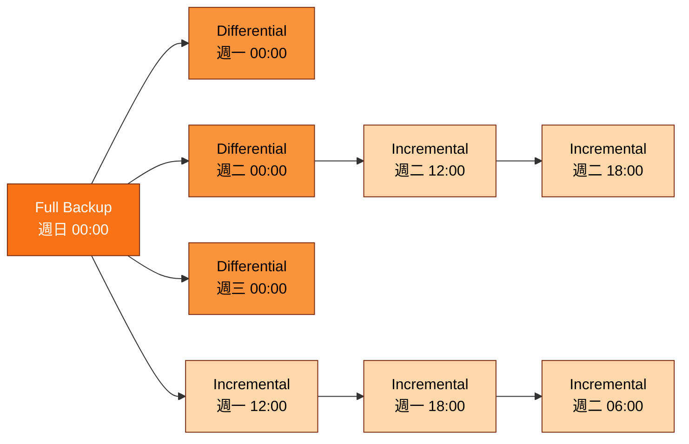

# [BEE-6009] 資料庫備份策略與時間點還原

:::info
資料庫備份策略最終會收斂到兩個面對維運人員的數字：業務能容忍多少資料遺失（RPO），以及還原作業可以等多久（RTO）。AWS Well-Architected Reliability Pillar（2026）即以此為定義基準。PostgreSQL 與 MySQL 在追求嚴苛 RPO 時匯流到相同的架構：定期的 base backup 或 full backup，加上一條可向前重放到指定目標時點的連續日誌串流（PostgreSQL 的 WAL、MySQL 的 binary log）。本文涵蓋 PostgreSQL 三種備份取向、`pg_basebackup` 與 `mysqlbinlog` 如何協作把時間點還原（PITR）落到牆鐘時間目標、full/differential/incremental 鏈條在還原時的代價，以及為何 `pg_verifybackup` 通過僅是必要條件，並未構成一次經過驗證的還原演練。
:::

## Context

PostgreSQL 在 `pg_wal/` 目錄下維護一份 write-ahead log，根據 PostgreSQL 18 Documentation 在 continuous archiving 一節的描述，該日誌「records every change made to the database's data files」。這份日誌是基底，使得 base backup 加上已封存的 WAL 可以向前重放到目標時點，這正是時間點還原（Point-in-Time Recovery, PITR）的本質。

PostgreSQL 18 Documentation 列舉「three fundamentally different approaches to backing up PostgreSQL data: SQL dump; File system level backup; Continuous archiving.」這三種取向各自對應到不同的還原語意。`pg_dump` 產生的邏輯 dump 可跨 PostgreSQL 版本與 CPU 架構移植，包含 32-bit 到 64-bit 的轉換場景，也是唯一能在主版本升級或跨架構搬遷後仍可還原的方式（PostgreSQL 18 Documentation, "25.1. SQL Dump"）。但邏輯 dump 無法向前重放到任意時間點。檔案系統層級的備份綁定特定伺服器版本，且要求一致性。Continuous archiving 才是支援 PITR 的取向。

MySQL 以不同的名稱呈現相同的模式。MySQL 8.4 Reference Manual 將時間點還原描述為「recovery of data changes up to a given point in time. Typically, this type of recovery is performed after restoring a full backup that brings the server to its state as of the time the backup was made... Point-in-time recovery then brings the server up to date incrementally from the time of the full backup to a more recent time.」其中的 full backup 由熱備份工具如 Percona XtraBackup 取得，Percona LLC 將其描述為「the world's only open-source, free MySQL hot backup software that performs non-blocking backups for InnoDB and XtraDB databases.」Binary log 在此扮演 WAL 的角色，作為向前重放的日誌來源。

兩個資料庫引擎都投入這套架構的原因，在於與業務的契約。AWS Well-Architected Reliability Pillar 將 RTO 定義為「the maximum acceptable delay between the interruption of service and restoration of service」，將 RPO 定義為「the maximum acceptable amount of time since the last data recovery point.」其下游每一個選擇——base-backup 週期、封存週期、儲存庫加密、還原演練頻率——都以這兩個數字為校準依據。

## Visual

full / differential / incremental 備份鏈條同時決定還原時間與儲存成本。pgBackRest User Guide 寫道：full backup 複製整個 cluster；differential 複製「only those database cluster files that have changed since the last full backup」；incremental 複製「only those database cluster files that have changed since the last backup」（不論前一份備份是何種類型）。Differential 一律指向最近一次的 full；Incremental 則組成一條回溯到緊鄰前一份備份的鏈條。

要還原至 `I5` 涵蓋的時間點，需要 `F1 + D2 + I4 + I5`。要從 `I3` 還原，則需要 `F1 + I1 + I2 + I3`。鏈條長度就是 incremental 在維運面所付出的可見代價。

## Example

走一遍 PostgreSQL 上具實感的 PITR 場景：14:32 一位資淺維運人員執行 `DELETE FROM orders WHERE created_at < '2026-05-01';` 卻沒有附上 `WHERE id IN (...)` 過濾條件，把六個月的歷史資料全部抹掉。團隊需要把資料還原到 14:31:59。

第 1 步：取得或定位一份 base backup。`pg_basebackup` 是標準的線上備份工具。PostgreSQL 18 Documentation 指出該工具「is used to take a base backup of a running PostgreSQL database cluster. The backup is taken without affecting other clients of the database, and can be used both for point-in-time recovery (see Section 25.3) and as the starting point for a log-shipping or streaming-replication standby server.」預設情況下它會與資料檔同步串流 WAL，因此產生的目錄本身就是一個自足的還原起點。假設最近一次 base backup 在週日 00:00 完成。

第 2 步：選定還原目標。PostgreSQL 18 Documentation 寫道：「If you want to recover to some previous point in time (say, right before the junior DBA dropped your main transaction table), just specify the required stopping point. You can specify the stop point, known as the 'recovery target', either by date/time, named restore point or by completion of a specific transaction ID.」維運人員設定 `recovery_target_time = '2026-05-07 14:31:59 UTC'`。

第 3 步：向前重放。PostgreSQL 從 base backup 起點開始套用 WAL，到目標時點停止。MySQL 上的對應操作是先還原一份 XtraBackup 的 full backup，再以 `mysqlbinlog` 在 binary log 上重放。MySQL 8.4 Reference Manual 直接給出維運面的指令形式：`mysqlbinlog --start-datetime="2005-12-25 11:25:56" binlog.000003`，其中 `--start-datetime` 讀取「the first event having a timestamp equal to or later than the datetime argument」，`--stop-datetime` 提供對稱的上界。「This option is useful for point-in-time recovery.」

第 4 步：還原後的 cluster 啟動，包含 14:31:59 之前 commit 的所有交易，且不包含其後 commit 的任何交易。錯誤的 `DELETE` 已經消失。在切點當下處於交易進行中的 session，也已隨 WAL 串流的 crash recovery 一同被 rollback。

對稱性是直接的。PostgreSQL 的 `pg_basebackup` 加上封存 WAL 對應到 MySQL 的 Percona XtraBackup 加上 binary log 重放。recovery target 的旋鈕名稱有差異。心智模型則完全相同。

## Best Practices

- **MUST** 維持一份連續且無缺口的 WAL 或 binlog 封存，覆蓋範圍至少回溯到打算用來還原的最舊 base backup 起點。PostgreSQL 18 Documentation 寫道：「to recover successfully using continuous archiving (also called 'online backup' by many database vendors), you need a continuous sequence of archived WAL files that extends back at least as far as the start time of your backup.」即使 base backup 完整，缺一個 WAL segment 就足以讓 PITR 失敗。
- **MUST** 正確接好 `archive_command` 的 exit code 並監控 archiver lag。PostgreSQL 18 Documentation 明確指出：「It is important that the archive command return zero exit status if and only if it succeeds. Upon getting a zero result, PostgreSQL will assume that the file has been successfully archived, and will remove or recycle it. However, a nonzero status tells PostgreSQL that the file was not archived; it will try again periodically until it succeeds.」一段在 S3 上傳靜默失敗時仍回傳 0 的腳本，會讓伺服器把根本沒進到封存的 WAL 直接回收。
- **MUST NOT** 在伺服器仍在運行時直接 `tar` `$PGDATA`，除非底層檔案系統提供原子快照能力。PostgreSQL 18 Documentation 警告：「the database server must be shut down in order to get a usable backup. Half-way measures such as disallowing all connections will not work (in part because tar and similar tools do not take an atomic snapshot of the state of the file system, but also because of internal buffering within the server).」改用 `pg_basebackup` 或具備快照能力的檔案系統。
- **SHOULD** 在客戶端加密備份儲存庫，而非僅依賴儲存端加密。pgBackRest Configuration Reference 指出 pgBackRest 支援 `aes-256-cbc`，且「encryption is always performed client-side even if the repository type (e.g. S3) supports encryption.」一個外洩的 S3 bucket 不應等於一份外洩的資料庫；客戶端加密強制此性質。
- **SHOULD** 在跨版本或跨架構搬遷時優先使用 `pg_dump`，在生產環境的 PITR 則使用 continuous archiving。PostgreSQL 18 Documentation 寫道：「pg_dump's output can generally be re-loaded into newer versions of PostgreSQL, whereas file-level backups and continuous archiving are both extremely server-version-specific.」依搬遷類型挑選對的工具。
- **SHOULD** 以 RTO 預算來決定 base-backup 的間隔。PostgreSQL 18 Documentation 表示：「Since you have to keep around all the archived WAL files back to your last base backup, the interval between base backups should usually be chosen based on how much storage you want to expend on archived WAL files.」較長的間隔意味著保留更多 WAL，PITR 的重放時間也更久；週期由可接受的還原時間上限決定。
- **MAY** 在儲存成本主導時，於 full backup 之下疊加 differential 與 incremental 備份。pgBackRest User Guide 定義了這三種模式；如同 Visual 一節所示，incremental 鏈條以更短的每夜傳輸量換取更長的還原鏈條。

## 還原演練 Playbook

備份驗證工具能抓到儲存層級的資料毀損與檔案缺失。它們抓不到邏輯不相容、缺少擴充套件、缺少 tablespace，或維運流程缺口。PostgreSQL 18 Documentation 在 `pg_verifybackup` 一節直接點出：「It is important to note that the validation which is performed by pg_verifybackup does not and cannot include every check which will be performed by a running server when attempting to make use of the backup. Even if you use this tool, you should still perform test restores and verify that the resulting databases work as expected and that they appear to contain the correct data.」

把 `pg_verifybackup` 視為廉價的連續閘門，把對 sandbox cluster 的真實還原視為週期性的驗收測試。一個可運作的節奏：

1. **持續、每份備份：** 對每一份新產出的 base backup 執行 `pg_verifybackup`。任何非零退出值都讓 pipeline 失敗。
2. **每週：** 將最新一份 full backup 加上一份 differential 加上最新的 WAL/binlog segment 還原到 sandbox cluster。執行涵蓋最大資料表與任何擴充套件支援物件（PostGIS、pgvector、分區擴充套件）的 smoke query。為整段還原計時，把該數字記錄下來與 RTO 對照。
3. **每季：** 演練一次完整的 PITR，目標為選定的牆鐘時間。挑選位於 WAL 保留視窗內、但至少 24 小時前的時點，以實際操練 log replay。確認所選的 recovery target 落在預期的還原後資料列數。
4. **schema 遷移時：** 在宣告遷移完成前，於遷移後的 schema 上重新執行每週演練。新增 tablespace、擴充套件或大型索引的遷移會改變還原時間特性。

base-backup 間隔是維運人員手中的 RTO 旋鈕。PostgreSQL 18 Documentation 把取捨講明：較長的間隔保留較多 WAL，使 replay 時間延長；較短的間隔縮短 replay，代價是更頻繁的 base-backup I/O 與儲存。把間隔設定到讓最壞情境的還原——最舊的 base backup 加上最長的 WAL replay——仍能塞進向業務承諾的 RTO 之內。

只演練一次後就不再重複的演練比沒有演練更糟，因為它授予虛假的信心。把演練節奏寫進 on-call 排班，讓每位維運人員在凌晨 03:00 被叫起來真正執行還原之前，至少都已親手完成過一次。

## Related Topics

- [Replication Strategies](/zh-tw/data-storage/replication-strategies)
- [Database Migrations](/zh-tw/data-storage/database-migrations)
- [Storage Engines](/zh-tw/data-storage/storage-engines)
- [Write-Ahead Logging](/zh-tw/distributed-systems/write-ahead-logging)
- [Audit Logging Architecture](/zh-tw/distributed-systems/audit-logging-architecture)

## References

- PostgreSQL Global Development Group, "Chapter 25. Backup and Restore," PostgreSQL 18 Documentation (2026). https://www.postgresql.org/docs/current/backup.html
- PostgreSQL Global Development Group, "25.1. SQL Dump," PostgreSQL 18 Documentation (2026). https://www.postgresql.org/docs/current/backup-dump.html
- PostgreSQL Global Development Group, "25.2. File System Level Backup," PostgreSQL 18 Documentation (2026). https://www.postgresql.org/docs/current/backup-file.html
- PostgreSQL Global Development Group, "25.3. Continuous Archiving and Point-in-Time Recovery (PITR)," PostgreSQL 18 Documentation (2026). https://www.postgresql.org/docs/current/continuous-archiving.html
- PostgreSQL Global Development Group, "pg_basebackup," PostgreSQL 18 Documentation (2026). https://www.postgresql.org/docs/current/app-pgbasebackup.html
- PostgreSQL Global Development Group, "pg_verifybackup," PostgreSQL 18 Documentation (2026). https://www.postgresql.org/docs/current/app-pgverifybackup.html
- Crunchy Data / pgBackRest project, "pgBackRest User Guide" (2026). https://pgbackrest.org/user-guide.html
- Crunchy Data / pgBackRest project, "pgBackRest Configuration Reference" (2026). https://pgbackrest.org/configuration.html
- Oracle Corporation, "9.5 Point-in-Time (Incremental) Recovery," MySQL 8.4 Reference Manual (2026). https://dev.mysql.com/doc/refman/8.4/en/point-in-time-recovery.html
- Oracle Corporation, "6.6.9 mysqlbinlog — Utility for Processing Binary Log Files," MySQL 8.4 Reference Manual (2026). https://dev.mysql.com/doc/refman/8.4/en/mysqlbinlog.html
- Percona LLC, "About Percona XtraBackup," Percona XtraBackup Documentation (2026). https://docs.percona.com/percona-xtrabackup/2.4/intro.html
- Amazon Web Services, "Disaster Recovery (DR) objectives," AWS Well-Architected Framework — Reliability Pillar (2026). https://docs.aws.amazon.com/wellarchitected/latest/reliability-pillar/disaster-recovery-dr-objectives.html
