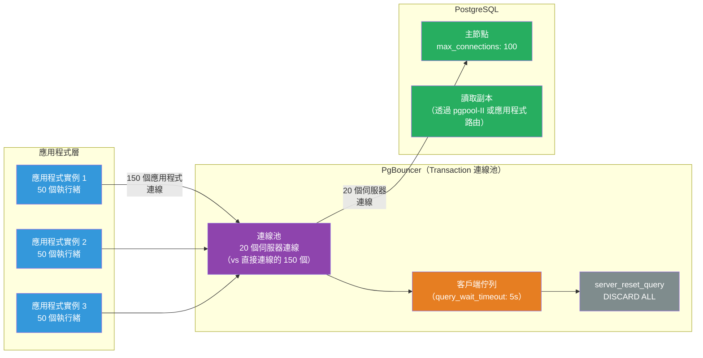

# [BEE-481] 資料庫連線代理與連線池架構

:::info
資料庫連線代理位於應用程式實例和資料庫之間，維護少量長存的伺服器連線供多個應用程式執行緒共享——將會壓垮資料庫的 O(應用程式實例 × 執行緒) 連線數轉換為資料庫設計所支援的 O(資料庫核心) 數量。
:::

## 情境

每個到 PostgreSQL 的 TCP 連線都會產生一個後端程序（在 PG 17 的 Walsender 重構使其成本降低之前）。每個程序消耗記憶體、一個檔案描述符和上下文切換的 CPU 時間——即使閒置時也是如此。PostgreSQL 的預設 `max_connections = 100` 不是一個軟性建議；它是拒絕新連線的硬性限制。一個系統有 10 個應用程式 Pod，每個運行 50 個執行緒，每個持有一個連線，需要 500 個連線——是預設值的五倍，且由於程序排程器中的鎖爭用而效能已經下降。

連線池透過將應用程式端連線數與資料庫端連線數解耦來解決這個問題。應用程式與連線池通信；連線池維護少量長存的伺服器連線，並根據需要將它們分配給應用程式請求。資料庫只看到連線池的連線。這種模式到 2010 年在大規模場景中已廣為人知，並隨著無狀態微服務的興起而成為必要的基礎設施，因為每個服務副本都會開啟自己的連線池。

連線**代理**通過額外功能來概括連線池：查詢路由（將讀取定向到副本，將寫入定向到主節點）、協議感知邏輯（改寫查詢、執行逾時）和受管連線（AWS RDS Proxy 整合了 IAM 秘密管理）。連線池和代理之間的界限是模糊的——PgBouncer 是純連線池；ProxySQL 和 pgpool-II 是代理。

## 設計思維

### 連線池模式與功能取捨

連線池模式決定了可以使用什麼會話狀態：

| 模式 | 連線返回池的時機 | 會話狀態保留 | 實際限制 |
|---|---|---|---|
| **Session（會話）** | 客戶端斷線時 | 完整會話狀態 | 對長存應用程式幾乎沒有多路復用優勢 |
| **Transaction（交易）** | COMMIT / ROLLBACK 後 | 無（交易之間重置） | 不能使用 `SET`（非 LOCAL）、advisory locks、`LISTEN` 或 `PREPARE`（1.21 前） |
| **Statement（陳述句）** | 每個陳述句後 | 無 | 不能使用多陳述句交易；有效強制自動提交 |

**Transaction 連線池**是大多數 Web 應用程式的最佳選擇：每個 Web 請求通常運行一個交易，因此連線在每個請求邊界返回到連線池。這提供了最高的多路復用比率。限制——無持久會話狀態——符合無狀態 Web 服務設計。

**Statement 連線池**用於每個陳述句都是自包含的分析查詢，在此情況下最大連線重用值得犧牲交易限制。

### 連線池 vs 功能豐富的代理

| | PgBouncer | pgpool-II | ProxySQL | RDS Proxy |
|---|---|---|---|---|
| 資料庫 | PostgreSQL | PostgreSQL | MySQL/MariaDB | AWS RDS/Aurora |
| 協議解析 | 無 | 完整 SQL | 完整 SQL | 部分 |
| 讀寫分離 | 無 | 有 | 有 | 無 |
| 連線池 | 有 | 有 | 有 | 有 |
| 負擔 | 最小 | 較高 | 中等 | 受管 |
| 預備陳述句 | 1.21 起 | 有限 | 有 | 有 |

當只需要連線池時選擇 **PgBouncer**——它是最低延遲的選項。當還需要跨副本的負載平衡時選擇 **pgpool-II**。對於無伺服器工作負載（Lambda）或需要基於 IAM 的憑證管理時選擇 **RDS Proxy**。當需要查詢路由規則和讀寫分離時，對 MySQL 選擇 **ProxySQL**。

### 調整連線池大小

HikariCP 的研究（和 PostgreSQL 社群）的反直覺結果：帶佇列的較小連線池通常優於較大的連線池。原因是 CPU 上下文切換——當活躍執行緒多於 CPU 核心時，上下文切換負擔超過了並行的優勢。

**起始公式**（來自 HikariCP 的「關於連線池大小」）：
```
pool_size = (2 × 資料庫核心數) + 有效磁碟軸數
```
對於 4 核心資料庫伺服器：`(2 × 4) + 1 = 9 個連線`。不是 100。不是 500。

對於應用程式端：將 `max_connections` 減去安全餘量（管理工具用 10）均勻分配給連線池實例。有 `max_connections = 200` 和 4 個連線池實例：每個 47 個伺服器連線。

## 最佳實踐

**MUST（必須）對無狀態 Web 服務使用 Transaction 連線池模式（而非 Session 模式）。** Session 連線池對在請求之間關閉連線的服務幾乎沒有多路復用優勢。Transaction 連線池在每個交易邊界返回伺服器連線，使單個伺服器連線能夠服務數百個應用程式執行緒。

**MUST（必須）在 Transaction 連線池模式下設置會話變數時使用 `SET LOCAL` 而非 `SET`。** `SET LOCAL` 在交易結束時重置。`SET SESSION`（或裸 `SET`）持續存在於伺服器連線上，並洩漏到取得該連線的下一個客戶端。這是一個靜默的正確性錯誤：租戶 ID、搜尋路徑或應用程式名稱洩漏到不相關的請求中。

**MUST（必須）在 Session 連線池模式下配置 `server_reset_query = DISCARD ALL`。** 當伺服器連線在 Session 連線池中的客戶端之間重新分配時，殘留狀態（預備陳述句、臨時資料表、advisory locks）可能洩漏。`DISCARD ALL` 清除所有會話狀態。在 Transaction 連線池模式下，這是不必要的，因為連線在交易邊界重置。

**MUST（必須）在 `max_connections` 規劃中考慮連線池。** 連線池作為客戶端連接到資料庫。保留容量：`max_connections = (連線池連線數 × 連線池實例數) + 管理員預留`。不要將 `max_connections` 設置為總應用程式執行緒數——這違背了目的。

**SHOULD（應該）在需要 Transaction 連線池時在 PgBouncer 1.21+ 中透過協議層預備陳述句（而非 SQL `PREPARE`）使用具名預備陳述句。** 在 PgBouncer 中配置 `max_prepared_statements` 以啟用陳述句追蹤。避免在 Transaction 模式下使用 SQL 層面的 `PREPARE` 陳述句——PgBouncer 無法攔截它們，連線重新分配時它們將失敗。

**SHOULD（應該）在 PgBouncer 中設置與應用程式請求逾時對齊的 `query_wait_timeout`。** 當連線池耗盡時，客戶端排隊等待。等待時間超過 HTTP 逾時的請求在浪費佇列空間——即使最終被服務，客戶端也會放棄。設置 `query_wait_timeout` 短於客戶端逾時會導致 PgBouncer 快速失敗請求，而不是提供過時的回應。

**SHOULD（應該）使用 PgBouncer 中的 `SHOW POOLS` 監控連線池飽和度。** `sv_idle`（閒置伺服器連線）、`sv_used`（使用中）、`cl_waiting`（等待連線的客戶端）和 `maxwait`（最長等待時間）欄位指示連線池健康狀況。持續的 `cl_waiting > 0` 意味著連線池太小或資料庫速度慢。

**MAY（可以）對 AWS Lambda 工作負載使用 RDS Proxy。** Lambda 實例在每次冷啟動時開啟新連線。沒有代理，Lambda 呼叫的爆發會創建資料庫連線的爆發——正是資料庫最難處理的模式。RDS Proxy 維護 Lambda 實例共享的溫連線池，吸收爆發。

## 視覺化



## 範例

**Transaction 連線池的 PgBouncer 配置：**

```ini
[databases]
; 將 "myapp" 資料庫名稱路由到實際的 PostgreSQL 伺服器
myapp = host=postgres-primary port=5432 dbname=myapp

[pgbouncer]
listen_addr = 0.0.0.0
listen_port = 5432

; Transaction 連線池：COMMIT/ROLLBACK 後連線返回池
pool_mode = transaction

; 每個資料庫/使用者對的最大伺服器連線數
; 公式：(2 × 資料庫核心數) + 1，分配給各連線池實例
default_pool_size = 20

; 突發流量的備用連線池——在 reserve_pool_timeout 後添加連線
reserve_pool_size = 5
reserve_pool_timeout = 3.0

; 等待時間超過此值的客戶端將失敗（與 HTTP 請求逾時對齊）
query_wait_timeout = 5

; 在 Transaction 連線池中，不需要 server_reset_query
; （連線在交易邊界自動重置）
; 只在 Session 連線池中使用 DISCARD ALL：
; server_reset_query = DISCARD ALL

; 啟用預備陳述句追蹤（PgBouncer 1.21+）
max_prepared_statements = 100

; 管理介面用於監控
admin_users = pgbouncer
stats_users = monitoring
```

**監控連線池健康——`SHOW POOLS` 的關鍵指標：**

```sql
-- 連接到 PgBouncer 管理介面
-- psql -h localhost -p 5432 -U pgbouncer pgbouncer

SHOW POOLS;
-- 關鍵欄位：
-- database   : 資料庫名稱
-- user       : 使用者名稱
-- cl_active  : 目前與伺服器連線配對的客戶端
-- cl_waiting : 等待伺服器連線的客戶端（若持續 > 0 則需警覺）
-- sv_active  : 使用中的伺服器連線
-- sv_idle    : 連線池中可用的伺服器連線
-- maxwait    : 最長等待時間（秒）（若 > 1s 則需警覺）

SHOW STATS;
-- total_query_count : 自啟動以來處理的查詢數
-- avg_query_time    : 平均查詢持續時間（微秒）
-- avg_wait_time     : 等待連線的平均時間（微秒）
```

**應用程式碼——Transaction 連線池中正確的 SET LOCAL 使用：**

```python
# db.py — 使用 Transaction 連線池時安全的會話變數使用
import psycopg
from contextlib import contextmanager

@contextmanager
def app_transaction(pool, app_name: str, tenant_id: int):
    """
    使用 SET LOCAL 設置會話變數，使其在交易結束時重置。
    對 PgBouncer Transaction 連線池至關重要：SET（不帶 LOCAL）會
    持續存在於伺服器連線上，並洩漏到下一個客戶端。
    """
    with pool.connection() as conn:
        with conn.transaction():
            # SET LOCAL：交易結束時自動重置
            # 安全：伺服器連線可被下一個客戶端重用
            conn.execute("SET LOCAL application_name = %s", (app_name,))
            conn.execute("SET LOCAL app.current_tenant_id = %s", (str(tenant_id),))
            yield conn

# 使用方式
with app_transaction(pool, "orders-service", tenant_id=42) as conn:
    rows = conn.execute("SELECT * FROM orders").fetchall()
# 交易已提交；SET LOCAL 值已重置；連線返回 PgBouncer 連線池
```

**ProxySQL 讀寫分離配置（MySQL）：**

```sql
-- ProxySQL 管理介面
-- mysql -h 127.0.0.1 -P 6032 -u admin -padmin

-- 定義主機群組：10 = 主節點（寫入），20 = 副本（讀取）
INSERT INTO mysql_servers (hostgroup_id, hostname, port) VALUES
    (10, 'mysql-primary', 3306),
    (20, 'mysql-replica-1', 3306),
    (20, 'mysql-replica-2', 3306);

-- 查詢規則：SELECT 路由到副本（主機群組 20），其他全部到主節點（10）
INSERT INTO mysql_query_rules (rule_id, active, match_pattern, destination_hostgroup, apply)
VALUES
    (1, 1, '^SELECT.*FOR UPDATE', 10, 1),  -- SELECT FOR UPDATE → 主節點
    (2, 1, '^SELECT', 20, 1);              -- 所有其他 SELECT → 副本
    -- （寫入無規則 → 預設主機群組 = 10，主節點）

LOAD MYSQL SERVERS TO RUNTIME;
LOAD MYSQL QUERY RULES TO RUNTIME;
SAVE MYSQL SERVERS TO DISK;
SAVE MYSQL QUERY RULES TO DISK;
```

## 實作注意事項

**PgBouncer 與預備陳述句**：在 PgBouncer 1.21（2024 年發布）之前，具名預備陳述句與 Transaction 連線池不相容。Prisma、SQLAlchemy 和 Django ORM 等 ORM 在內部使用預備陳述句。解決方法是在 ORM 中停用預備陳述句（例如 Prisma 的連線字串中的 `?prepared_statement_cache_queries=0`）。從 1.21 起，設置 `max_prepared_statements = 100` 以啟用透明協議層追蹤。SQL 層面的 `PREPARE` 陳述句在 Transaction 模式下仍不支援。

**連線字串目標**：應用程式連接到 PgBouncer 的主機/端口，而不是直接連接到 PostgreSQL。在 Kubernetes 中，將 PgBouncer 部署為 sidecar 或共享服務（DaemonSet 或 Deployment）。Sidecar 最小化網路躍點；共享服務減少總伺服器連線數。

**PgBouncer 與 TLS**：PgBouncer 可以終止來自應用程式的 TLS，並在私有網路上維護到 PostgreSQL 的未加密連線，或透傳 TLS。對於合規環境，配置 `client_tls_sslmode = require` 和 `server_tls_sslmode = require`。

**RDS Proxy 固定**：RDS Proxy 支援 MySQL 和 PostgreSQL 的交易層多路復用，但某些操作會將連線「固定」到客戶端以維持會話持續時間：SQL 層面的預備陳述句、`SET` 命令、臨時資料表、advisory locks。監控 `DatabaseConnectionsCurrentlySessionPinned` CloudWatch 指標——高固定率表示應用程式需要調整。

## 相關 BEE

- [BEE-6006](connection-pooling-and-query-optimization.md) -- 連線池與查詢優化：從應用程式角度涵蓋連線池和查詢層優化
- [BEE-13003](../performance-scalability/connection-pooling-and-resource-management.md) -- 連線池與資源管理：涵蓋應用程式層的連線池大小調整理論和資源管理
- [BEE-18007](../multi-tenancy/database-row-level-security.md) -- 資料庫行層安全：在 PgBouncer Transaction 連線池環境中，RLS 依賴會話變數時必須使用 `SET LOCAL app.current_tenant_id`（而非裸 `SET`）
- [BEE-19034](../distributed-systems/graceful-shutdown-and-connection-draining.md) -- 優雅關閉與連線排空：連線池層在部署期間必須優雅地排空連線，以避免進行中的交易丟失

## 參考資料

- [PgBouncer 配置 — pgbouncer.org](https://www.pgbouncer.org/config.html)
- [PgBouncer FAQ — pgbouncer.org](https://www.pgbouncer.org/faq.html)
- [關於連線池大小 — HikariCP](https://github.com/brettwooldridge/HikariCP/wiki/About-Pool-Sizing)
- [ProxySQL 讀寫分離 — proxysql.com](https://www.proxysql.com/documentation/proxysql-read-write-split-howto/)
- [Amazon RDS Proxy — AWS 文件](https://docs.aws.amazon.com/AmazonRDS/latest/UserGuide/rds-proxy.howitworks.html)
- [max_connections — PostgreSQL 文件](https://www.postgresql.org/docs/current/runtime-config-connection.html)
