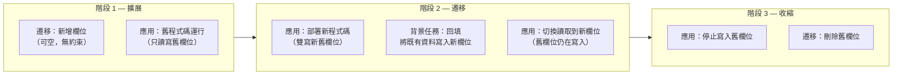

# [BEE-126] 資料庫遷移

:::info
在不停機的情況下進行結構演進，以及向後相容的變更。
:::

## 背景

每個生產系統都會演進。業務需求改變、資料模型需要修正、效能問題要求結構性修復。**資料庫遷移（database migration）**是對資料庫結構或資料的版本化、可重複的變更。遷移是讓運行中的資料庫從一個狀態移動到另一個狀態的受控機制。

挑戰在於資料庫是共享的有狀態基礎設施。不像應用程式碼可以在部署期間替換，結構和資料必須在系統運行時進行轉換，而新舊版本的應用程式碼可能同時在讀寫。

做得不好，遷移可能鎖住資料表數分鐘、損壞資料，或讓運行中的服務崩潰。做得好，遷移對終端使用者是透明的。

**關鍵參考：**

- [Stripe: Online migrations at scale](https://stripe.com/blog/online-migrations) — Stripe 的四階段雙寫方法，不停機遷移即時資料儲存
- [Prisma Data Guide: Expand and Contract Pattern](https://www.prisma.io/dataguide/types/relational/expand-and-contract-pattern) — 擴展-收縮技術的標準描述
- [Martin Fowler: Parallel Change (bliki)](https://martinfowler.com/bliki/ParallelChange.html) — 擴展-收縮所基於的介面變更模式

## 原則

> 將結構變更視為向後相容的增量步驟。每次遷移都必須讓資料庫處於新舊版本應用程式都能安全使用的狀態。

## 遷移工具與版本追蹤

遷移工具（Flyway、Liquibase、golang-migrate、Alembic、Rails Active Record migrations 等）解決兩個問題：

1. **排序** — 遷移按確定性順序執行，通常按時間戳或序號。
2. **追蹤** — `schema_migrations`（或等效）資料表記錄哪些遷移已套用，工具不會重複執行同一遷移。

每次遷移有兩個方向：

| 方向 | 目的 |
|------|------|
| **up** | 套用變更（例如 `ALTER TABLE ... ADD COLUMN`） |
| **down** | 還原變更（例如 `ALTER TABLE ... DROP COLUMN`） |

`down` 遷移是你的緊急出口。即使你認為永遠不會用到，也要寫。

:::tip 深入探討
關於資料庫層級的結構演進模式和向後相容性，請見 [DEE Schema Evolution 系列](https://alivedise.github.io/database-engineering-essentials/300)。
:::

## 安全 vs 危險操作

不是所有結構變更都有相同風險。下表總結常見操作：

| 操作 | 風險 | 說明 |
|------|------|------|
| 新增可空欄位 | 低 | 舊程式碼忽略它；新程式碼可以寫入 |
| 新增帶預設值的欄位 | 中 | PostgreSQL 11+ 有效處理；舊版本會重寫整張表 |
| 新增索引 `CONCURRENTLY` | 低 | 不會鎖住讀寫 |
| 新增索引（標準） | 高 | 取得 `ShareLock`，在大表上阻塞寫入 |
| 重新命名欄位 | 高 | 舊程式碼立即中斷 — 改用擴展-收縮 |
| 刪除欄位 | 高 | 引用該欄位的舊程式碼中斷 |
| 新增 `NOT NULL` 約束且無預設值 | 高 | 需要全表掃描和鎖定 |
| 變更欄位型別 | 高 | 可能需要重寫每一列 |
| 刪除表 | 不可逆 | 舊程式碼立即中斷 |

### 安全建立索引（PostgreSQL 範例）

```sql
-- 不安全：建立索引期間鎖住資料表
CREATE INDEX idx_orders_user_id ON orders(user_id);

-- 安全：不阻塞讀寫
CREATE INDEX CONCURRENTLY idx_orders_user_id ON orders(user_id);
```

`CONCURRENTLY` 需要更長時間，但它是在大型生產表上唯一安全的選項。

## 零停機遷移：擴展-收縮模式

**擴展-收縮模式（expand-contract pattern）**（也稱為*平行變更*）將任何破壞性結構變更分為三個獨立的部署階段，確保在每個時間點新舊版本的應用程式碼都能安全操作。



在階段 1 和階段 2 之間，部署新的應用程式碼。結構已經有兩個欄位，所以舊實例（在滾動部署期間仍在運行）繼續正常工作。在階段 2 和階段 3 之間，確認沒有運行中的程式碼讀取舊欄位，此時刪除是安全的。

## 實作範例：安全重新命名欄位

**目標：** 將 `users.full_name` 重新命名為 `users.display_name`

### 步驟 1 — 擴展：新增新欄位

```sql
-- 遷移：add_display_name_to_users (up)
ALTER TABLE users ADD COLUMN display_name VARCHAR(255);

-- down
ALTER TABLE users DROP COLUMN display_name;
```

舊程式碼繼續讀寫 `full_name`。新欄位對既有資料列為 `NULL`。

### 步驟 2 — 部署：應用程式碼雙寫

```python
# 新的應用程式碼同時寫入兩個欄位
def update_user_name(user_id, name):
    db.execute(
        "UPDATE users SET full_name = %s, display_name = %s WHERE id = %s",
        (name, name, user_id)
    )
```

### 步驟 3 — 回填：為既有資料列填入新欄位

```sql
-- 作為獨立的資料遷移執行，不在結構遷移交易中
-- 分批處理以避免長時間鎖定
UPDATE users
SET display_name = full_name
WHERE display_name IS NULL
  AND id BETWEEN :start_id AND :end_id;
```

回填完成後，新增 `NOT NULL` 約束：

```sql
ALTER TABLE users ALTER COLUMN display_name SET NOT NULL;
```

### 步驟 4 — 切換讀取到新欄位

部署新版本，讀取 `display_name` 但仍寫入兩個欄位。監控錯誤。

### 步驟 5 — 收縮：停止寫入舊欄位

部署只寫入 `display_name` 的應用程式碼。此時 `full_name` 不再接收新資料。

### 步驟 6 — 收縮：刪除舊欄位

```sql
-- 遷移：drop_full_name_from_users (up)
ALTER TABLE users DROP COLUMN full_name;

-- down（資料已消失；這是不可逆的）
ALTER TABLE users ADD COLUMN full_name VARCHAR(255);
```

這六個步驟跨越多次部署，可能需要數天的營運時間。這是零停機遷移的代價。回報是在任何時間點，沒有任何運行中的程式碼會遇到缺失的欄位。

## 資料遷移 vs 結構遷移

結構遷移和資料遷移性質不同，必須分開處理：

| | 結構遷移 | 資料遷移 |
|--|---------|---------|
| 變更什麼 | 表結構（欄位、索引、約束） | 資料列 |
| 交易範圍 | 短 DDL 語句 | 可能數百萬列 |
| 在遷移檔案中執行？ | 是 | **否** — 作為獨立任務執行 |
| 回滾 | 刪除新增的物件 | 可能需要反向資料轉換 |

在結構遷移交易中執行大型資料遷移是常見錯誤。交易在整個過程中持有鎖。在大表上，這可能是數分鐘或數小時，導致應用程式的級聯故障。

**規則：** 回填和資料轉換作為背景任務執行，使用明確的批次處理，而不是在遷移檔案的 `BEGIN ... COMMIT` 區塊中。

## CI/CD 中的遷移順序

滾動部署環境中安全的遷移管線遵循以下順序：

```
1. 部署前遷移   （擴展：新增欄位、CONCURRENTLY 新增索引）
      ↓
2. 部署新的應用程式碼（滾動，新舊實例同時運行）
      ↓
3. 驗證部署健康狀態
      ↓
4. 部署後遷移   （收縮：刪除舊欄位、移除舊約束）
```

部署前遷移必須向後相容 — 舊程式碼在執行後仍必須正常運作。部署後遷移僅在新程式碼完全上線並驗證後才執行。

## 常見錯誤

### 1. 一步重新命名欄位

```sql
-- 錯誤：這會中斷任何引用 old_column_name 的運行中程式碼
ALTER TABLE orders RENAME COLUMN status TO order_status;
```

改用擴展-收縮。六個步驟，多次部署，零停機。

### 2. 新增 NOT NULL 欄位且無預設值

```sql
-- 在大表上錯誤：取得排他鎖並重寫每一列
ALTER TABLE payments ADD COLUMN processed_at TIMESTAMP NOT NULL;
```

正確方法：先新增可空欄位，回填，然後新增約束。

### 3. 在結構遷移交易中執行資料遷移

```python
# 錯誤
def up():
    op.add_column('orders', sa.Column('new_status', sa.String))
    # 此 UPDATE 在與上面 DDL 相同的交易中執行
    op.execute("UPDATE orders SET new_status = status")  # 數百萬列
```

DDL 期間持有的鎖現在持續到 UPDATE 完成。

### 4. 不可逆操作沒有回滾計畫

刪除欄位會銷毀資料。一旦 `down` 遷移執行，除非有備份，否則資料消失。務必：

- 在破壞性遷移前建立快照。
- 將 `DROP` 遷移作為等待期後的獨立部署步驟。
- 在確信前將收縮階段放在功能旗標後面。

### 5. 未在生產規模資料上測試遷移

在開發資料庫 500 列上跑 50 毫秒的遷移，在 2 億列的生產表上可能需要 45 分鐘。務必：

- 在最近的匿名化生產資料副本上測試。
- 測量鎖持續時間，而非只是總執行時間。
- 使用 `EXPLAIN ANALYZE` 確認遷移前後的索引使用。

## 相關 BEE

- **[BEE-104] 絞殺者無花果模式** — 相同的增量、平行操作哲學應用於服務拆分；擴展-收縮是其資料庫對應版本。
- **[BEE-142] 結構演進與向後相容** — 更深入探討服務間的結構版本控制契約。
- **[BEE-361] 部署策略** — 滾動部署、藍綠部署和金絲雀模式，與遷移順序的互動。
