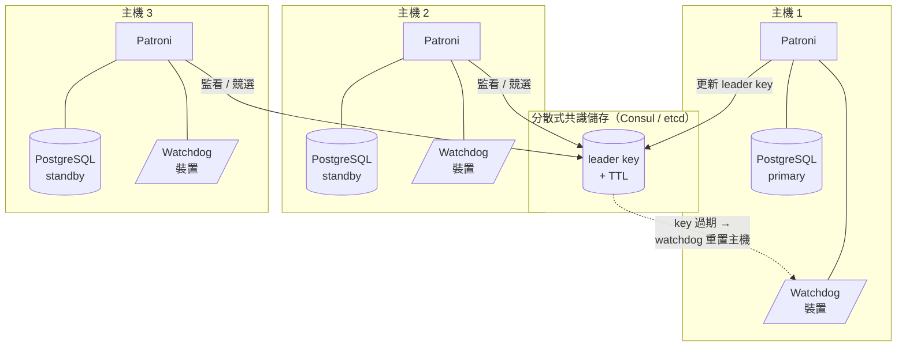

# [BEE-6012] Hot Standby、Failover 與 Switchover 維運操作

:::info
Hot standby 是一台仍在套用 primary WAL、同時已能接受唯讀查詢的 PostgreSQL replica；把 standby 升級為新的 primary，正是所有 replica promotion 事件的維運主軸。維運人員會遇到兩種觸發 promotion 的流程：在健康叢集上進行的計畫性 switchover，以及 primary 已經失效後進行的非計畫性 failover。本文走過 PostgreSQL 提供的機械原語（`pg_promote`、`pg_rewind`）、包裝它們的編排層（Patroni、repmgr、GitLab 的 PgBouncer cutover），以及拓撲變動後維運人員必須遵守的限制，避免 split-brain、資料遺失與 WAL 卡死。
:::

## Context

PostgreSQL 官方文件把 hot standby 定義為：伺服器處於 archive recovery 或 standby 模式期間仍能接受唯讀查詢的模式，並指出 hot standby 同時對 replication 與將備份還原至特定狀態都有用處（PostgreSQL Documentation, "Hot Standby"）。因此 hot standby 是讓同一台實體 replica 同時支援讀取分流與 replica promotion 的底層機制。

Failover 是 primary 失效時的回應。一旦 standby 完成 failover，叢集就只剩單一伺服器在運作，PostgreSQL 官方文件稱此為退化（degenerate）狀態：原本的 standby 現在是 primary、原本的 primary 已停機且可能持續停機，叢集在新 standby 重建之前都失去冗餘（PostgreSQL Documentation, "Failover"）。維運上的意涵是：failover 事件要等到叢集回到 N 台 replica 的規模才算結束。

Replication 拓撲決定該次 promotion 的資料遺失範圍。PostgreSQL streaming replication 預設為 asynchronous，若 primary 崩潰，部分已 commit 的交易可能尚未送達 standby，造成資料遺失。Synchronous replication 透過要求每筆寫入交易的 commit 等待 primary 與 standby 雙方磁碟上 WAL 都已寫入才算確認，藉此消除這個視窗（PostgreSQL Documentation, "Log-Shipping Standby Servers"）。維運人員選擇 replication 模式的同時，等於也選擇了 RPO。

把讀取流量分流到 hot standby 還有一個獨立於 promotion 的失效模式。PostgreSQL 官方文件指出取消機制有兩個參數，`max_standby_archive_delay` 與 `max_standby_streaming_delay`，用來定義 WAL 套用的最大允許延遲；衝突的查詢一旦讓新到 WAL 資料的套用時間超過對應的 delay 設定，就會被取消（PostgreSQL Documentation, "Hot Standby"）。調這兩個旋鈕就是讀取分流的取捨：調高則 replay 落後，調低則 standby 上的長時間分析查詢被取消。

## Visual

Patroni 透過分散式共識儲存（DCS）儲存叢集狀態並選舉 leader，DCS 例如 etcd、Consul、ZooKeeper 或 Kubernetes。GitLab 官方文件直接寫道，Patroni 高度依賴 Consul 來儲存叢集狀態與選舉 leader，因此 leader 選舉是 DCS 的特性，而 PostgreSQL 本身並不負責這件事（GitLab Documentation, "Configure PostgreSQL replication and failover"）。Watchdog 裝置位於每台主機上 Patroni 之下，當 leader key 無法持續維持時，會重置該主機（Patroni Documentation, "Watchdog support"）。

## Example

每次 promotion 事件的機械核心都很小。PostgreSQL 官方文件指出，當執行 `pg_ctl promote` 或呼叫 `pg_promote()` 時，伺服器就會離開 standby 模式並切換為一般運作（PostgreSQL Documentation, "Log-Shipping Standby Servers"）。所有更高階工具最終都會呼叫其中之一。

對於計畫性的角色互換，repmgr 把這個操作包成單一指令。repmgr 官方文件描述其使用情境：「然而某些情況下我們希望以計畫性方式 promote standby，例如為了在 primary 上進行維護；這種 switchover 由 `repmgr standby switchover` 指令支援」（repmgr Documentation, "Performing a Switchover with repmgr"）。該指令依序執行：乾淨關閉現任 primary、把選定的 standby 升級為 primary、把其餘節點重新組態以追隨新的 primary。

光做 promotion 並不會搬動 client 流量。GitLab 的參考架構透過讓 Consul 監看 Patroni leader key 來解決 client cutover 問題：GitLab 官方文件寫道「若狀態改變，Consul 會執行一段腳本，更新 PgBouncer 組態指向新的 PostgreSQL leader 節點，並重新載入 PgBouncer 服務」（GitLab Documentation, "Configure PostgreSQL replication and failover"）。DCS 上的 leader key 變動是觸發點，PgBouncer reload 則是讓 cutover 對應用程式可見的資料平面效果。

## Best Practices

- **MUST** 提供 fencing 機制，保證回來的舊 primary 不能再接受寫入。PostgreSQL 官方文件要求「若 primary 伺服器失效、standby 變成新的 primary，之後舊 primary 又重啟，必須有機制告知舊 primary 它已不再是 primary」，並提到 STONITH（Shoot The Other Node In The Head），警告若沒有它，兩邊系統都可能以為自己是 primary，導致資料遺失（PostgreSQL Documentation, "Failover"）。
- **MUST** 在使用 Patroni 時設定 watchdog 裝置，因為 Patroni 必須確保當 DCS 中的 leader key 過期後，PostgreSQL 不會再接受任何交易 commit；watchdog 在指定時間內未收到 keepalive 心跳就會重置整個系統（Patroni Documentation, "Watchdog support"）。Watchdog 是軟體層級的 fencing 層，能在 split-brain 顯現之前把 DCS 分裂轉化為主機重置。
- **MUST** 在計畫性 switchover 之前讓現任 primary 靜默下來。repmgr 官方文件指出：「你應確保現任 primary 能快速且乾淨地關閉。特別是來自應用程式的存取應降到最低，最好完全阻擋。也要注意若有檔案在等待 archive，PostgreSQL 會等到 archive 完成才會關閉」（repmgr Documentation, "Performing a Switchover with repmgr"）。Archive backlog 會把「30 秒的維護窗口」變成沒有上限的窗口。
- **MUST** 把已沒有消費者的 replication slot 刪除，或以 `max_slot_wal_keep_size` 限制其用量。PostgreSQL 官方文件警告「replication slot 可能造成伺服器保留過多 WAL 區段而塞滿 `pg_wal` 配置的空間」，並指出 `max_slot_wal_keep_size` 可用於限制 replication slot 保留的 WAL 檔案大小（PostgreSQL Documentation, "Log-Shipping Standby Servers"）。
- **MUST** 把已移除的 standby 視為同樣需要在 primary 上進行 slot 清理，因為 PostgreSQL 官方文件指出，未使用的 slot「即使沒有任何連線在使用它們，仍會阻止必要資源被回收……極端情況下這可能造成資料庫為了避免 transaction ID wraparound 而停機……所以若某個 slot 已不再需要就應該被刪除」（PostgreSQL Documentation, "Logical Decoding Concepts"）。每次拓撲變動後，slot 衛生就是維運衛生。
- **SHOULD** 在應用程式 RPO 為零時優先選擇 synchronous replication。Synchronous replication 消除了 asynchronous streaming 在 failover 視窗的資料遺失風險，代價是每次 commit 都要等待 standby 上的 WAL 持久化（PostgreSQL Documentation, "Log-Shipping Standby Servers"）。
- **SHOULD** 在連線池層自動化 client cutover，沿用 GitLab 的參考模式：以 Consul 監看 leader key 並 reload PgBouncer（GitLab Documentation, "Configure PostgreSQL replication and failover"）。

## Switchover 與 Failover 決策矩陣

Patroni 把這項維運差異直接編進它的 REST API。Patroni 官方文件指出，`/switchover` 端點僅在叢集健康（有 leader）時才能使用，而 `/failover` 端點可在沒有任何健康節點時用來執行手動 failover（Patroni Documentation, "REST API"）。repmgr 也劃出同樣的界線：把 `repmgr standby switchover` 暴露為計畫性操作，與由 repmgrd 處理的非計畫性失效路徑分開（repmgr Documentation, "Performing a Switchover with repmgr"）。

| 維度 | Switchover | Failover |
| --- | --- | --- |
| 前置條件 | 叢集健康，現任 leader 可達（Patroni `/switchover`）。 | 叢集不健康，primary 不可達或失效（Patroni `/failover`）。 |
| 觸發 | 維運人員在維護窗口內下達指令（`repmgr standby switchover`、Patroni `/switchover`）。 | 偵測到 primary 失聯；維運人員或編排器啟動緊急 promotion。 |
| 候選選擇 | 由維運人員指定目標 standby；現任 primary 先被乾淨關閉。 | Patroni `/failover` 需要指定候選；編排器挑選追進度最完整的 standby。 |
| 預期時長 | 上限為乾淨關閉 + WAL archive 排空 + promotion 的時間。 | 上限為 leader key 過期 + promotion 的時間；若需 fencing 則更長。 |
| 資料遺失預期 | 為零，因為角色互換前 primary 已靜默。 | asynchronous replication 最多到尚未複製的 WAL 視窗；synchronous 則為零（PostgreSQL Documentation, "Log-Shipping Standby Servers"）。 |
| 之後的叢集狀態 | 對稱拓撲、N 台節點數量相同，僅角色互換。 | 退化為單台伺服器狀態，直到新的 standby 重建（PostgreSQL Documentation, "Failover"）。 |
| 維運模式 | 計畫性、排程內、可逆。 | 非計畫性、有時間壓力，可能需要 pg_rewind 才能讓舊 primary 重新加入。 |

## 用 pg_rewind 重新接回舊 Primary

非計畫性 failover 之後，舊 primary 通常停在一條已與新 primary 分歧的 timeline 上。對 TB 等級的叢集做一次全新的 base backup 成本太高，所以 PostgreSQL 提供了一個工具，能就地把分歧的伺服器倒帶。PostgreSQL 官方文件描述 pg_rewind 為：「在叢集 timeline 已經分歧之後，用來把一個 PostgreSQL 叢集與同一叢集的另一份副本同步的工具……典型情境是在 failover 後讓舊 primary 以追隨新 primary 的 standby 角色重新上線」（PostgreSQL Documentation, "pg_rewind"）。

pg_rewind 有一個必須在叢集初始化時或在分歧發生前就在 `postgresql.conf` 中滿足的硬性前置條件。PostgreSQL 官方文件指出：「pg_rewind 要求目標伺服器必須在 `postgresql.conf` 啟用 `wal_log_hints` 選項，或在用 `initdb` 初始化叢集時啟用 data checksums（預設啟用）」（PostgreSQL Documentation, "pg_rewind"）。一個沒有啟用 checksum、運作時也沒開 `wal_log_hints` 的叢集，failover 後無法回頭使用 pg_rewind；唯一的回退路徑就是完整的 base backup。希望 failover 後拓撲可恢復的維運人員，**MUST** 在還沒用到這兩個旗標之前就先設好其中一個。

正確性模型是：pg_rewind 從來源（新的 primary）複製區塊覆蓋目標（舊 primary）上的區塊，僅針對在分歧 timeline 上有變動的區塊；接著從分歧點開始在新 timeline 上前向 replay WAL。目標接著以來源的 standby 身分啟動。這在維運上與 failover 互補：failover 恢復可用性，pg_rewind 在不需重做完整映像的前提下恢復冗餘。

## Related Topics

- [Replication Strategies](/zh-tw/data-storage/replication-strategies)
- [Database Backup Strategies and Point-in-Time Recovery](/zh-tw/data-storage/database-backup-strategies-and-point-in-time-recovery)
- [Durability, fsync, and the Crash-Safety Contract](/zh-tw/data-storage/durability-fsync-and-the-crash-safety-contract)
- [VACUUM, Bloat, and Transaction ID Wraparound](/zh-tw/data-storage/vacuum-bloat-and-transaction-id-wraparound)
- [Distributed Locking](/zh-tw/distributed-systems/distributed-locking)
- [Service Discovery](/zh-tw/distributed-systems/service-discovery)

## References

- PostgreSQL Global Development Group, "Hot Standby," PostgreSQL Documentation (current). https://www.postgresql.org/docs/current/hot-standby.html
- PostgreSQL Global Development Group, "Log-Shipping Standby Servers," PostgreSQL Documentation (current). https://www.postgresql.org/docs/current/warm-standby.html
- PostgreSQL Global Development Group, "Failover," PostgreSQL Documentation (current). https://www.postgresql.org/docs/current/warm-standby-failover.html
- PostgreSQL Global Development Group, "pg_rewind," PostgreSQL Documentation (current). https://www.postgresql.org/docs/current/app-pgrewind.html
- PostgreSQL Global Development Group, "Logical Decoding Concepts," PostgreSQL Documentation (current). https://www.postgresql.org/docs/current/logicaldecoding-explanation.html
- Patroni Authors, "REST API," Patroni Documentation (current). https://patroni.readthedocs.io/en/latest/rest_api.html
- Patroni Authors, "Watchdog support," Patroni Documentation (current). https://patroni.readthedocs.io/en/latest/watchdog.html
- 2ndQuadrant / EnterpriseDB, "Performing a Switchover with repmgr," repmgr Documentation (current). https://repmgr.org/docs/current/performing-switchover.html
- GitLab Inc., "Configure PostgreSQL replication and failover for Linux package installations," GitLab Documentation (current). https://docs.gitlab.com/administration/postgresql/replication_and_failover/
