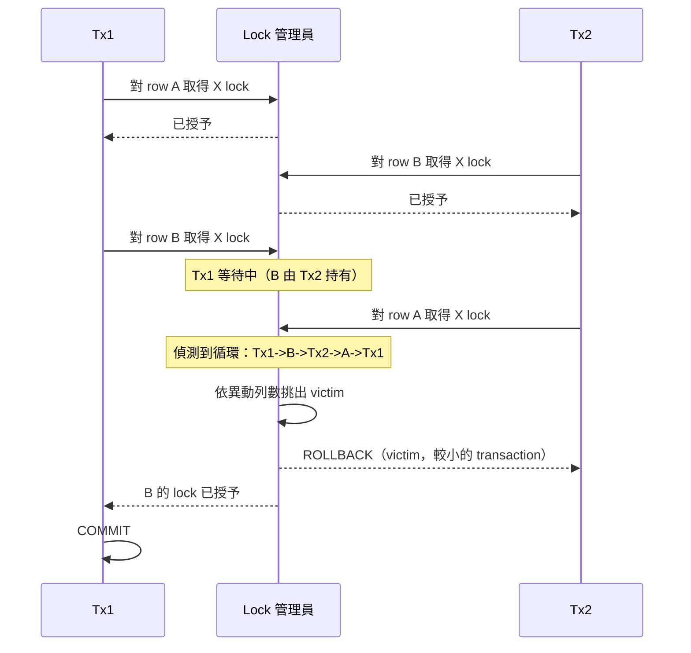

# [BEE-6013] 生產環境中的鎖衝突與死結

:::info
PostgreSQL 與 InnoDB 都把死結視為預期會發生的運行狀況。引擎偵測到循環後，挑出一個 transaction 當 victim 並回滾它，其餘的 transaction 繼續執行。本文沿著操作者的視角走過幾個層次：從理解為何 retry 是強制的，到引擎用以暴露 lock 等待與死結循環的觀測機制，再到限制衝突範圍的 timeout 旋鈕與 migration 模式。資料來源包含 PostgreSQL Documentation、MySQL 8.4 與 9.7 Reference Manuals、PostgreSQL Wiki、Christensen 在 Crunchy Data 的文章（2022）、Oda 在 pganalyze 的文章（2022），以及 Samokhvalov 在 postgres.ai 的文章（2021）。
:::

## Context

MySQL 8.4 Reference Manual 直接點出操作者契約：「When deadlock detection is enabled (the default) and a deadlock does occur, InnoDB detects the condition and rolls back one of the transactions (the victim). ... Thus, even if your application logic is correct, you must still handle the case where a transaction must be retried」（Oracle Corporation, "Deadlocks in InnoDB," MySQL 8.4 Reference Manual）。應用程式碼因此 MUST 把 deadlock 錯誤當成可重試的訊號來處理，不能視為永久失敗。

MySQL 9.7 Reference Manual 強化了這個立場：「Deadlocks are not dangerous unless they are so frequent that you cannot run certain transactions at all. Normally, you must write your applications so that they are always prepared to re-issue a transaction if it gets rolled back because of a deadlock」（Oracle Corporation, "How to Minimize and Handle Deadlocks," MySQL 9.7 Reference Manual）。運維上的判斷門檻是死結發生的頻率，死結本身的存在則屬正常。一個在多列並發寫入下零死結的系統，要嘛負載很輕，要嘛已經把所有東西串接在單一 lock 後方序列化執行。

本文後續內容以這個基線為前提。各節依序推進：(1) 把死結當成正常事件，(2) 讓操作者得以判讀的引擎輸出，(3) 限制衝突範圍的 timeout 旋鈕，(4) 法醫式逐步分析，以及 (5) 在 migration 期間 lock 佇列會放大損害的模式。

## Visual



偵測器透過中止其中一個 transaction 來解開循環（claim 1, MySQL 8.4 Reference Manual）。InnoDB 的選擇規則以新增、更新或刪除的列數為基準，挑選較小的 transaction（claim 11, MySQL 8.4 Reference Manual, "Deadlock Detection"）。

## Example

本節走過三個具體模式：以 `SELECT FOR UPDATE SKIP LOCKED` 建構的 queue worker、一個讀 `pg_locks` 的 PostgreSQL 事故，以及一個讀 InnoDB 引擎狀態輸出的 MySQL 事故。

### (a) 以 `SELECT FOR UPDATE SKIP LOCKED` 實作的 queue worker

PostgreSQL Documentation 對 `SELECT` 的描述說明了這個原語：「With SKIP LOCKED, any selected rows that cannot be immediately locked are skipped. Skipping locked rows provides an inconsistent view of the data, so this is not suitable for general purpose work, but can be used to avoid lock contention with multiple consumers accessing a queue-like table」（PostgreSQL Documentation, "SELECT"）。

從 queue 表中拉取工作的 worker：

```sql
BEGIN;
SELECT id, payload
FROM jobs
WHERE state = 'pending'
ORDER BY enqueued_at
LIMIT 1
FOR UPDATE SKIP LOCKED;

-- worker processes the row, then:
UPDATE jobs SET state = 'done' WHERE id = :id;
COMMIT;
```

`SKIP LOCKED` 允許 N 個 worker 並發執行同一個語句，每個 worker 會搶到不同的列，避免在 queue 頭部序列化。文件指出的取捨是：讀取視圖被刻意設計成不一致的，worker 看不到同儕已 lock 的列，因此結果集並非所有可選工作的快照（PostgreSQL Documentation, "SELECT"）。對 queue dispatch 來說，這份不一致正是設計目的。

### (b) PostgreSQL 事故：對 `pg_locks` 與 `pg_stat_activity` 做 join 查詢

PostgreSQL Wiki 的 Lock Monitoring 頁面是經典參考：「Looking at pg_locks shows you what locks are granted and what processes are waiting for locks to be acquired. ... This query may be helpful to see what processes are blocking SQL statements (these only find row-level locks, not object-level locks)」（PostgreSQL Wiki, "Lock Monitoring"）。

事故發生時，操作者查詢 `pg_locks` 中 `granted = false` 的列，並 join `pg_stat_activity` 來辨識等待者及其阻擋者：

```sql
SELECT
    blocked.pid       AS blocked_pid,
    blocked.query     AS blocked_query,
    blocking.pid      AS blocking_pid,
    blocking.query    AS blocking_query,
    blocking.state    AS blocking_state
FROM pg_stat_activity AS blocked
JOIN pg_locks AS bl_lock
       ON bl_lock.pid = blocked.pid AND NOT bl_lock.granted
JOIN pg_locks AS bk_lock
       ON bk_lock.locktype = bl_lock.locktype
      AND bk_lock.database IS NOT DISTINCT FROM bl_lock.database
      AND bk_lock.relation IS NOT DISTINCT FROM bl_lock.relation
      AND bk_lock.granted
JOIN pg_stat_activity AS blocking
       ON blocking.pid = bk_lock.pid;
```

Christensen 在 Crunchy Data 的文章（2022）給了操作者正確的判讀規則：「An ungranted lock for any significant length of time indicates an issue and is something that should be looked into」（Christensen, "Postgres Locking — When Is It Concerning?," Crunchy Data Blog, 2022）。已授予 lock 的數量本身屬正常現象，持續存在的未授予 lock 才是訊號。

### (c) MySQL 事故：判讀 `SHOW ENGINE INNODB STATUS`

MySQL 8.4 Reference Manual 的 "An InnoDB Deadlock Example" 頁面展示了 `LATEST DETECTED DEADLOCK` 區塊的逐字格式：

```text
*** (1) HOLDS THE LOCK(S):
RECORD LOCKS space id 28 page no 4 ... lock mode S locks rec but not gap
*** (1) WAITING FOR THIS LOCK TO BE GRANTED:
RECORD LOCKS space id 27 page no 4 ... lock_mode X locks rec but not gap waiting
*** WE ROLL BACK TRANSACTION (2)
```

操作者依序判讀的四個地標是：每個參與者的 `TRANSACTION` 標頭、指出每邊已持有什麼的 `HOLDS THE LOCK(S)` 行、指出每邊想要什麼的 `WAITING FOR THIS LOCK TO BE GRANTED` 行，以及最後標示出 victim 的 `WE ROLL BACK TRANSACTION (N)` 行（Oracle Corporation, "An InnoDB Deadlock Example," MySQL 8.4 Reference Manual）。同樣的紀錄會對循環中每個參與者重複出現。

## Best Practices

- **MUST** 在所有程式碼路徑中以一致的順序對多個物件取得 lock：PostgreSQL Documentation 寫道「The best defense against deadlocks is generally to avoid them by being certain that all applications using a database acquire locks on multiple objects in a consistent order」（PostgreSQL Documentation, "Explicit Locking"）。這條規則涵蓋整個應用程式，包括在不同 transaction 中觸及相同表的程式碼路徑。
- **MUST** 把持續存在的 `granted = false` 的 `pg_locks` 列當成運維告警依據，不要看 lock 數量的原始計數：Christensen 在 Crunchy Data 的文章（2022）寫道「An ungranted lock for any significant length of time indicates an issue and is something that should be looked into」。
- **SHOULD** 在生產環境的 session 上設定 `lock_timeout`：PostgreSQL Documentation 將其定義為「Abort any statement that waits longer than the specified amount of time while attempting to acquire a lock on a table, index, row, or other database object. The time limit applies separately to each lock acquisition attempt」（PostgreSQL Documentation, "Client Connection Defaults — Statement Behavior"）。每次嘗試各自計時的設計意味著一個內部會 retry 的語句，每次 retry 都會分配到自己的時間預算。
- **SHOULD** 設定 `idle_in_transaction_session_timeout`，限制閒置 transaction 持有 lock 與阻擋 vacuum 的時間：PostgreSQL Documentation 寫道「This option can be used to ensure that idle sessions do not hold locks for an unreasonable amount of time. Even when no significant locks are held, an open transaction prevents vacuuming away recently-dead tuples that may be visible only to this transaction; so remaining idle for a long time can contribute to table bloat」（PostgreSQL Documentation, "Client Connection Defaults — Statement Behavior"）。
- **SHOULD** 在應用程式對受爭用列已有定義好的退路時優先採用 `NOWAIT`：MySQL 8.4 Reference Manual 描述其語意為「A locking read that uses NOWAIT never waits to acquire a row lock. The query executes immediately, failing with an error if a requested row is locked」（Oracle Corporation, "Locking Reads," MySQL 8.4 Reference Manual）。錯誤就是應用程式退避或挑選另一列的提示。
- **MAY** 在極高並發負載下停用 `innodb_deadlock_detect`，改依賴 `innodb_lock_wait_timeout`：MySQL 8.4 Reference Manual 寫道「On high concurrency systems, deadlock detection can cause a slowdown when numerous threads wait for the same lock. At times, it may be more efficient to disable deadlock detection and rely on the innodb_lock_wait_timeout setting for transaction rollback when a deadlock occurs」（Oracle Corporation, "Deadlock Detection," MySQL 8.4 Reference Manual）。這個選項把死結解決機制從循環偵測改為以時鐘 timeout 為準。

## 死結法醫分析

死結法醫分析是在引擎已經選出 victim 並回滾之後才開始的工作。操作者要做的事情是從引擎發出的證據重建循環，並找出根源持有者。

**在 PostgreSQL 上追溯 lock 鏈。** Oda 在 pganalyze 的文章（2022）描述 `pg_blocking_pids(pid)` 這個函式「returns 'the list of PIDs a particular query is waiting for (is blocked by).' ... follow the whole story, from queries that are waiting to the connection that is causing the lock waits in the first place」（Oda, "Postgres Lock Monitoring," pganalyze blog, 2022）。這個函式回傳一個 PID 陣列，所以操作者可以對每個阻擋者遞迴呼叫它，沿著鏈條一路追到根源持有者，不必停在直接的阻擋者身上。

**判讀 InnoDB 的 victim 選擇。** MySQL 8.4 Reference Manual 寫出規則：「InnoDB tries to pick small transactions to roll back, where the size of a transaction is determined by the number of rows inserted, updated, or deleted」（Oracle Corporation, "Deadlock Detection," MySQL 8.4 Reference Manual）。當法醫輸出顯示 transaction (2) 被回滾時，意味著在循環閉合那一刻 transaction (2) 觸碰過的列數較少。長時間執行的批次寫入因此往往會勝過短的互動式 transaction，這會讓 OLTP 的 retry 路徑在與穩定批次 worker 競爭時持續打轉。

**判讀引擎狀態區塊。** 來自 `SHOW ENGINE INNODB STATUS` 的 `LATEST DETECTED DEADLOCK` 區塊（claim 12, MySQL 8.4 Reference Manual, "An InnoDB Deadlock Example"）會對每個參與者標示：它在 `HOLDS THE LOCK(S)` 持有哪些 lock、它在 `WAITING FOR THIS LOCK TO BE GRANTED` 等待什麼 lock，以及最底下的 `WE ROLL BACK TRANSACTION (N)`。操作者藉由判讀每邊的 lock 模式（`S` 為 shared、`X` 為 exclusive，`locks rec but not gap` 與其他變體）來重建衝突矩陣。

**記錄每一個死結。** MySQL 9.7 Reference Manual 指出 `SHOW ENGINE INNODB STATUS`「only retains the most recent deadlock」並建議「If frequent deadlock warnings cause concern, collect more extensive debugging information by enabling the innodb_print_all_deadlocks variable. Information about each deadlock, not just the latest one, is recorded in the MySQL error log」（Oracle Corporation, "How to Minimize and Handle Deadlocks," MySQL 9.7 Reference Manual）。在任何死結率不可忽略的生產系統上，操作者 SHOULD 啟用 `innodb_print_all_deadlocks`，讓每個事件都保存在 error log 中，避免被下一個事件覆蓋。

## 對 lock 敏感的 migration 模式

schema migration 是 lock 衝突轉變為服務中斷的所在。Samokhvalov 在 postgres.ai 的文章（2021）描述失敗模式：「when DDL attempts to acquire locks, 'it starts blocking others' even while waiting for earlier transactions to complete. ... The solution avoids this by failing fast — timing out quickly allows other transactions to proceed unobstructed while retry loops handle the eventual lock acquisition」（Samokhvalov, "Zero-Downtime Postgres Schema Migrations Need This: Lock Timeout and Retries," postgres.ai blog, 2021）。

機制在於 PostgreSQL 的 FIFO lock 佇列：要取得 `ACCESS EXCLUSIVE` 的 DDL 語句會排在所有現有持有者之後，後續所有與 `ACCESS EXCLUSIVE` 衝突的讀者與寫者也會排在該 DDL 之後。等待長時間執行 transaction 的 DDL 因此會擋住流量，這些流量本來無論單獨遇到 DDL 或長 transaction 都不會受影響。

Samokhvalov 規範的模式是把每次 DDL 嘗試包在短的 `lock_timeout` 與外層 retry 迴圈中：

```sql
SET lock_timeout = '100ms';
ALTER TABLE orders ADD COLUMN priority INT NOT NULL DEFAULT 0;
-- on lock_timeout error: sleep, then retry
```

如果 DDL 在 100ms 內無法取得 lock 就會中止，排隊中的讀者與寫者得以繼續，retry 在下一個安靜時刻執行。應用程式維持可用，因為單次 migration 嘗試阻擋無關流量的時間不會超過 timeout 視窗。

## Related Topics

- [Durability、fsync 與 crash 安全契約](/zh-tw/data-storage/durability-fsync-and-the-crash-safety-contract)
- [Vacuum、Bloat 與 Transaction ID Wraparound](/zh-tw/data-storage/vacuum-bloat-and-transaction-id-wraparound)
- [Hot Standby、Failover 與 Switchover 操作](/zh-tw/data-storage/hot-standby-failover-and-switchover-operations)
- [資料庫 Migration](/zh-tw/data-storage/database-migrations)
- [兩階段鎖定](/zh-tw/distributed-systems/two-phase-locking)
- [樂觀與悲觀並行控制](/zh-tw/concurrency/optimistic-vs-pessimistic-concurrency-control)
- [Lock、Mutex 與 Semaphore](/zh-tw/concurrency/locks-mutexes-and-semaphores)

## References

- PostgreSQL Global Development Group, "Explicit Locking," PostgreSQL Documentation (current). https://www.postgresql.org/docs/current/explicit-locking.html
- PostgreSQL Global Development Group, "SELECT," PostgreSQL Documentation (current). https://www.postgresql.org/docs/current/sql-select.html
- PostgreSQL Global Development Group, "Client Connection Defaults — Statement Behavior," PostgreSQL Documentation (current). https://www.postgresql.org/docs/current/runtime-config-client.html
- PostgreSQL Wiki, "Lock Monitoring" (current). https://wiki.postgresql.org/wiki/Lock_Monitoring
- Oracle Corporation, "Deadlocks in InnoDB," MySQL 8.4 Reference Manual (current). https://dev.mysql.com/doc/refman/8.4/en/innodb-deadlocks.html
- Oracle Corporation, "How to Minimize and Handle Deadlocks," MySQL 9.7 Reference Manual (current). https://dev.mysql.com/doc/refman/9.7/en/innodb-deadlocks-handling.html
- Oracle Corporation, "Deadlock Detection," MySQL 8.4 Reference Manual (current). https://dev.mysql.com/doc/refman/8.4/en/innodb-deadlock-detection.html
- Oracle Corporation, "An InnoDB Deadlock Example," MySQL 8.4 Reference Manual (current). https://dev.mysql.com/doc/refman/8.4/en/innodb-deadlock-example.html
- Oracle Corporation, "Locking Reads," MySQL 8.4 Reference Manual (current). https://dev.mysql.com/doc/refman/8.4/en/innodb-locking-reads.html
- David Christensen, "Postgres Locking — When Is It Concerning?," Crunchy Data Blog (2022). https://www.crunchydata.com/blog/postgres-locking-when-is-it-concerning
- Keiko Oda, "Postgres Lock Monitoring," pganalyze blog (2022). https://pganalyze.com/blog/postgres-lock-monitoring
- Nikolay Samokhvalov, "Zero-Downtime Postgres Schema Migrations Need This: Lock Timeout and Retries," postgres.ai blog (2021). https://postgres.ai/blog/20210923-zero-downtime-postgres-schema-migrations-lock-timeout-and-retries
