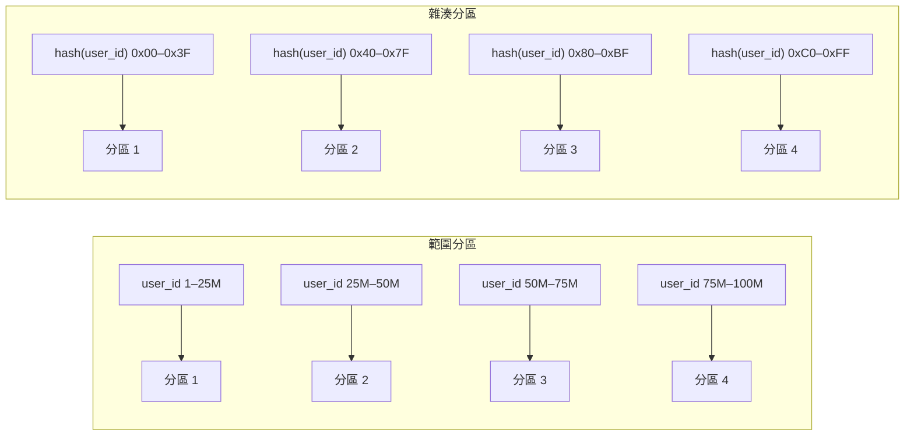
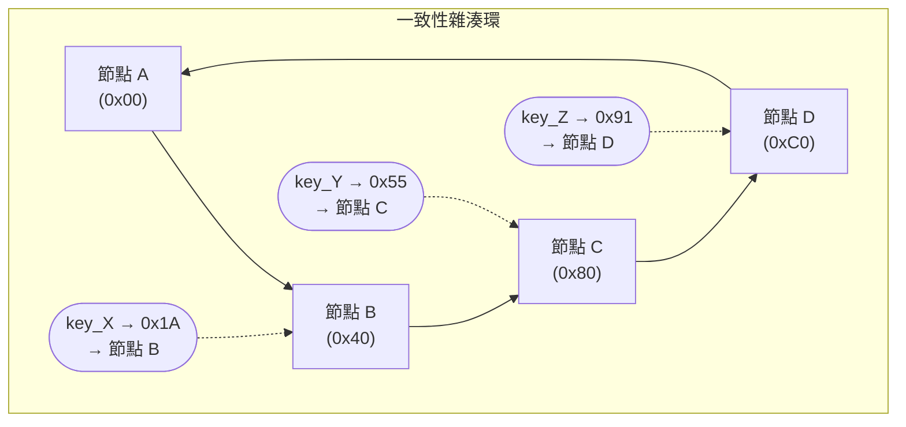

# [BEE-6004] 分區與分片

:::info
範圍分區、雜湊分區與一致性雜湊——分區鍵選擇、熱點緩解與重新分片的取捨。
:::

## 背景

單一資料庫節點的儲存容量與寫入吞吐量皆有上限。當資料集超出單機規模，或寫入量讓單一主節點飽和時，唯一的出路是將資料分散到多個節點上。這就是分區（Partitioning），在應用層語境中也常稱為分片（Sharding）。

分區的概念很直觀：將每筆記錄指派到恰好一個分區，將每個查詢路由到正確的分區，讓各分區各自處理自己的資料子集。複雜性在於：如何決定分配方式、選擇正確的分區鍵、在資料成長時保持平衡，以及在分區拓撲異動時管理運維開銷。

本文涵蓋兩種基本分區策略、一致性雜湊作為最小化資料遷移的實務技術、分區鍵選擇，以及現實分片工作中最常見的橫切關注點——熱點、跨分區查詢與重新分片。

**參考資料：**
- [Designing Data-Intensive Applications, Chapter 6: Partitioning](https://www.oreilly.com/library/view/designing-data-intensive-applications/9781491903063/ch06.html) — Martin Kleppmann
- [Vitess Sharding Reference](https://vitess.io/docs/22.0/reference/features/sharding/) — vitess.io
- [Consistent Hashing Explained](https://blog.algomaster.io/p/consistent-hashing-explained) — Ashish Pratap Singh, AlgoMaster

## 分區與分片的術語區別

兩個詞常被交替使用，但有約定俗成的區別：

**分區（Partitioning）** 是將資料集分割為互不重疊子集的通用概念，包含垂直分區（欄位拆分到不同資料表）和水平分區（資料列拆分到不同儲存單元）。

**分片（Sharding）** 通常特指跨獨立資料庫節點的水平分區。每個分片是一個獨立的資料庫實例，持有部分資料列。分片意味著分區之間存在網路邊界——讀寫必須路由到正確的節點。

本文聚焦水平分區。出現「分片」一詞時，意指位於獨立資料庫節點上的分區。

## 分區策略

兩種策略主導實務應用，差異在於鍵如何指派到分區，以及支援哪些查詢模式。



### 範圍分區

依據分區鍵的連續範圍將記錄指派至分區。`user_id` 在 1 到 2500 萬之間的所有使用者歸入分區 1；2500 萬至 5000 萬歸入分區 2，以此類推。HBase 和 MongoDB 的預分片設定均使用範圍分區。

**優點：**
- 範圍掃描高效。查詢使用者 1,000–2,000 只需存取一個分區。
- 分區邊界人類可讀，運維透明。
- 分區內的排序儲存（LSM-tree 或 B-tree）使範圍查詢在儲存層更快。

**缺點：**
- 熱點容易形成。若以單調遞增鍵寫入（時間戳、自增 ID），所有寫入集中在最後一個分區，其他分區閒置。
- 再平衡需要手動操作或事先精心規劃邊界。

範圍分區系統中寫入熱點的標準緩解方案：對鍵加前綴或轉換，使寫入分散至各範圍。Cassandra 的做法是對衍生雜湊分區，僅在分區內保留排序。

### 雜湊分區

對分區鍵套用雜湊函式，結果決定分區。常見做法是將雜湊輸出映射到固定數量的桶。Cassandra、Vitess 和 DynamoDB 預設使用雜湊分區。

**優點：**
- 均勻分佈。好的雜湊函式無論底層鍵的分佈如何，都能將鍵均勻散布至各分區。
- 單調遞增鍵不會造成熱點風險。

**缺點：**
- 範圍查詢需要散播-聚合（scatter-gather）。無法確定哪個分區持有某範圍內的鍵，查詢必須傳送到所有分區後合併結果。
- 分區路由層不支援排序存取模式。

## 一致性雜湊

簡單的 `hash(key) mod N` 雜湊分區有一個災難性特性：改變 N（增減節點）會導致幾乎所有鍵重新指派。對線上系統而言，這意味著近乎全量的資料遷移。

一致性雜湊解決了此問題。節點與鍵都被放置在概念環上（從 0 到 2^32 - 1 的環形雜湊空間）。一個鍵被指派給從其環上位置順時針走遇到的第一個節點。

新增節點時，它只接管位於它與前驅節點之間的鍵——大約佔全部鍵的 `1/N`（N 為節點數）。移除節點時，其鍵轉移給後繼節點。所有其他節點不受影響。



**虛擬節點（vnodes）。** 每個物理節點只有一個環位置時，節點數少或節點容量異質會導致鍵分佈不均。虛擬節點解決了這個問題：每個物理節點被指派環上的多個位置（通常 100–1,000 個）。Cassandra 預設每個物理節點 256 個虛擬節點。效果是，任何節點增減時，其負載分散至所有其他節點，而非集中在單一鄰居節點上。

在一個包含 100 個節點和 1,000 萬個鍵的測試中，新增一個擁有 1,000 個虛擬節點的節點，只遷移了約 0.9% 的鍵。樸素的取模雜湊則需遷移約 99%。

一致性雜湊被 Cassandra、DynamoDB 和分散式快取系統使用（參見 [BEE-9004](../caching/distributed-caching.md)）。Vitess 使用變體：它為每個分片定義明確的鍵範圍（十六進位編碼的二進位字串），並在重新分片時調整範圍。

## 分區鍵選擇

分區鍵是分片系統中影響最深遠的架構決策，選錯了無法在不全量重新分片的情況下修正。請用四個標準評估候選鍵：

**高基數（High Cardinality）。** 鍵必須有足夠的不同值，以支援當前及未來所需的分區數量。布林欄位（`active/inactive`）不能作為分區鍵。GUID 或數字型使用者 ID 通常有足夠的基數。

**均勻分佈。** 鍵的值分佈必須將記錄大致均勻地分散到各分區。`user_id` 通常良好；`country` 通常糟糕——美國和中國會主導，導致這些分區出現大量熱點。

**查詢對齊（Query Alignment）。** 最頻繁的查詢應能透過路由到單一分區來處理。若最常見的查詢是「取得使用者 X 的所有記錄」，就對 `user_id` 分區。若最常見的查詢是「取得租戶 Y 的所有訂單」，就對 `tenant_id` 分區。跨分區查詢代價高昂。

**寫入模式感知。** 避免使連續寫入集中在單一分區的鍵。時間戳和自增 ID 是範圍分區系統中的經典陷阱。雜湊分區能安全處理單調鍵，範圍分區則不能。

## 實例：4 個分片上的使用者資料

Schema：`users(user_id BIGINT PRIMARY KEY, name TEXT, country VARCHAR, created_at TIMESTAMP)`

分區策略：對 `user_id` 做雜湊分區，共 4 個分片，每個分片涵蓋四分之一的雜湊空間。

| 分片 | 鍵範圍 |
|------|--------|
| shard-0 | 0x0000000000000000 – 0x3FFFFFFFFFFFFFFF |
| shard-1 | 0x4000000000000000 – 0x7FFFFFFFFFFFFFFF |
| shard-2 | 0x8000000000000000 – 0xBFFFFFFFFFFFFFFF |
| shard-3 | 0xC000000000000000 – 0xFFFFFFFFFFFFFFFF |

**寫入：插入 user_id = 8472910**

```
hash(8472910) → 0x6A3F...  → shard-1
將 INSERT 路由至 shard-1。
```

**依主鍵讀取：`SELECT * FROM users WHERE user_id = 8472910`**

```
hash(8472910) → 0x6A3F...  → shard-1
將 SELECT 路由至 shard-1。
代價：單分片查詢，分片內 O(log n)。
```

**依非分區鍵讀取：`SELECT * FROM users WHERE country = 'DE'`**

```
country 不是分區鍵。
無法透過雜湊確定哪些分片持有德國使用者。
→ 散播-聚合：同時向全部 4 個分片傳送查詢。
→ 在應用層或查詢路由層合併結果。
代價：I/O 是單分片查詢的 4 倍，隨分片數線性增長。
```

散播-聚合模式本身並無問題——對於確實橫跨所有分區的查詢，它是正確答案。問題在於，當散播-聚合成為應該對齊分區鍵之高頻查詢的預設路徑時，系統就出了問題。

## 跨分區查詢

只要查詢條件不包含分區鍵，就會發生跨分區查詢（散播-聚合）。查詢路由器將查詢傳送到每個分片，各分片在本地執行，路由器再合併結果——包括任何排序、分組或聚合。

散播-聚合的代價隨分片數增長。4 個分片時，跨分區查詢讀取的資料量是等效單分區查詢的 4 倍；128 個分片時是 128 倍。

管理跨分區查詢代價的策略：

**次要索引。** 部分資料庫（DynamoDB Global Secondary Indexes、Cassandra materialized views）維護次要索引，將非分區鍵屬性映射到持有匹配行的分片。以儲存和寫入放大換取讀取效率。

**非正規化（Denormalization）。** 若 `country` 查詢頻繁，維護一個以 `country` 為分區鍵的獨立 `users_by_country` 資料表，同時寫入兩個資料表。這是標準的 Cassandra 模式。

**CQRS / 讀取模型。** 維護獨立的讀取最佳化儲存（如 Elasticsearch、報表資料庫），使用不同的分區鍵。對橫切查詢使用讀取模型；對交易工作負載寫入分片儲存。

**接受代價。** 對於不頻繁的分析查詢，若查詢量低，對所有分片的散播-聚合是可以接受的。不要過度工程化每小時只跑一次的查詢。

## 熱點與緩解

熱點是接收到不成比例的讀寫量的分區，是分片系統中最常見的運維問題。

**成因：**

- 鍵分佈不均（以 `country` 作為分區鍵；某個國家佔 60% 的流量）。
- 範圍分區搭配單調遞增鍵（所有寫入打到最新的分區）。
- 明星記錄（celebrity row）：單一鍵（爆紅貼文、知名使用者）的流量比平均值高出好幾個數量級。

**緩解措施：**

對於鍵分佈傾斜：切換到雜湊分區，或選擇基數更高的分區鍵。

對於範圍分區搭配單調鍵：在鍵前加隨機鹽或使用雜湊前綴。用 `shard_id = hash(created_at) mod N` 替代 `shard_id = range(created_at)`。這會破壞範圍掃描，但消除寫入熱點。

對於明星記錄：分區鍵方法無法完全解決——單一鍵仍是單一分區。緩解措施包括應用層快取（[BEE-9004](../caching/distributed-caching.md)）、在熱分區上加讀取副本，或將明星記錄拆分為多個使用不同鍵的虛擬記錄（讀取時需要應用層合併）。

## 重新分片

重新分片是改變分區拓撲的過程——通常是隨著資料增長而增加分片數量。這是分片系統中運維代價最高的操作之一，應在設計階段就納入規劃。

**重新分片的難點：**

- 資料必須從舊分區物理移動到新分區。
- 遷移過程中寫入必須暫停或雙寫，以避免資料遺失。
- 次要索引、外鍵引用和快取都需更新。
- 在舊分片退役前必須驗證遷移。

**方法：**

*預防性過度分片。* 初始設定比當前需要更多的邏輯分片（例如 256 個邏輯分片映射到 4 個物理節點）。隨著資料增長，將邏輯分片移至新物理節點，無需改變邏輯分區拓撲。Vitess 和 Cassandra 均支援此模式：邏輯分片數固定，物理節點數可擴展。這推遲了真正重新分片的需求。

*雙寫遷移。* 開始同時寫入新舊兩套分片拓撲，將歷史資料回填到新分片。回填完成並驗證後，將讀取切換到新拓撲，再退役舊拓撲。

*線上重新分片。* 部分資料庫（CockroachDB、Vitess）支援線上分割和合併範圍。熱範圍被分成兩個，低負載範圍與鄰居合併。資料庫在內部處理資料移動，應用不停機。這需要系統從一開始就針對此能力設計。

## 應用層 vs. 資料庫層分片

**應用層分片：** 路由邏輯在應用（或中間代理）中實現。它計算每個鍵的分片並直接連接到對應的資料庫節點。範例：手動分片的 MySQL、有每個租戶獨立資料庫的傳統電商系統。

*優點：* 對路由邏輯有完全控制，不依賴特定資料庫廠商功能。

*缺點：* 每個應用服務都必須實現路由。跨分片事務需要應用層協調。Schema 變更必須對每個分片獨立套用。運維複雜性完全由工程團隊承擔。

**資料庫層分片：** 中介軟體層或原生資料庫功能透明地處理路由。Vitess 提供 MySQL 相容代理（vtgate），根據 VSchema 路由查詢。CockroachDB 和 Google Spanner 在內部處理分區，對外暴露單一 SQL 端點。

*優點：* 應用看到單一邏輯資料庫。跨分片查詢執行、連線池和容錯移轉由該層處理。

*缺點：* 引入額外的元件需要運維。偵錯查詢路由需要理解中介軟體層。使用受管服務時有廠商鎖定風險。

對於大多數需要規模化的新系統，資料庫層分片（透過 Vitess、CockroachDB 或雲端受管分散式資料庫）是首選方式。應用層分片通常是在良好資料庫層解決方案出現之前就已存在的系統有機增長的結果。

## 原則

在最頻繁存取模式對齊、且基數高分佈均勻的鍵上做分區。任何查詢條件中不含分區鍵的查詢都會對所有分片進行散播-聚合——設計 Schema 時要確保常見查詢不會觸發這條路徑。

除非有跨分區邊界範圍掃描的強需求，否則使用雜湊分區。雜湊分區消除寫入熱點，均勻分散負載。若需要範圍掃描，使用範圍分區，並在鍵的設計中明確緩解熱點風險。

不要過早分片。一個調優良好的 PostgreSQL 或 MySQL 單實例，配合適當的索引（[BEE-6002](indexing-deep-dive.md)），可處理數百 GB 的資料集和每秒數萬次查詢。分片帶來顯著的運維開銷，應在有具體的容量問題且無法透過垂直擴展、讀取副本或快取解決時才使用。

決定分片時，從第一天就為重新分片做計劃。使用邏輯過度分片，讓增加物理節點不需要重新計算鍵。在需要之前就文件化重新分片程序。

## 常見錯誤

1. **使用低基數或傾斜的鍵作為分區鍵。** `country`、`status`、布林欄位——所有這些都會立即產生大量熱點。分區鍵必須有足夠的不同值和均勻分佈，以填滿所有當前和未來的分片。

2. **在熱路徑中建立跨分區 JOIN。** 兩個使用不同分區鍵的資料表之間的 JOIN，至少在一側需要散播-聚合。在高 QPS 系統中，這會成為瓶頸。請進行非正規化、使用相同分區鍵對關聯資料表進行同置（co-locate），或接受 JOIN 必須存在於離線儲存中。

3. **不為重新分片做計劃。** 「之後再說」是常見立場。到後來，系統已有 100 億行記錄，且沒有線上重新分片能力，遷移需要數週的雙寫、影子流量和驗證。在有資料之前就設計重新分片方案。

4. **過早分片。** 對不需要的系統加入分片，帶來所有運維複雜性——路由、跨分片查詢、重新分片風險——卻沒有獲得容量收益。先用盡垂直擴展、讀取副本和快取。

5. **忽視分片系統中的次要索引挑戰。** 分片系統中的全局次要索引（跨所有分片對非分區鍵欄位的索引）維護和查詢代價高昂。要麼接受次要鍵查詢的散播-聚合讀取，要麼維護非正規化的次要資料表，要麼使用獨立的搜尋索引。不要假設分片資料庫中的次要索引行為與單節點資料庫相同。

## 相關 BEE

- [BEE-6001: SQL vs NoSQL](./120.md) — 儲存引擎的選擇往往決定了可用的分片模型
- [BEE-6002: 索引深度解析](./121.md) — 分片系統中次要索引的行為
- [BEE-6002: 複製策略](./121.md) — 分片通常搭配複製；分區與複製可組合使用
- [BEE-9004: 分散式快取](203.md) — 一致性雜湊在快取叢集路由中使用相同原則
