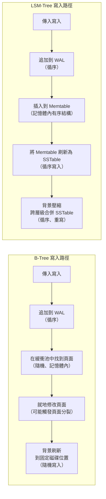

# [BEE-6005] 儲存引擎

:::info
資料庫如何將邏輯讀寫轉換為實體磁碟 I/O，以及為何在 B-tree 與 LSM-tree 引擎之間的選擇在規模化時至關重要。
:::

## 背景

當你呼叫 `INSERT`、`UPDATE` 或 `SELECT` 時，你是在與儲存引擎溝通。引擎是負責決定位元組如何落在磁碟上、如何被取回，以及兩者各需要多少 I/O 的元件。主要有兩大系列：

- **B-tree 引擎**（PostgreSQL heap + B-tree 索引、InnoDB、讀取最佳化模式的 WiredTiger）——以頁面為導向、就地更新、讀取效能強。
- **LSM-tree 引擎**（RocksDB、LevelDB、Cassandra、ScyllaDB、寫入最佳化模式的 WiredTiger）——僅追加寫入、背景壓縮、高寫入吞吐量。

了解這一層不是選修知識。即使在中等規模下，錯誤的引擎選擇——或正確引擎但調校錯誤——都會導致難以解釋的寫入停頓、令人意外的磁碟使用量，或在開發環境中根本看不到的讀取延遲退化。

**延伸閱讀：**
- [DDIA Chapter 3 — Storage and Retrieval (摘要)](https://timilearning.com/posts/ddia/part-one/chapter-3/) — SSTables、LSM-tree 與 B-tree 的清晰說明
- [RocksDB Compaction 概覽](https://github.com/facebook/rocksdb/wiki/Compaction) — 分層與分桶壓縮的官方 wiki
- [PostgreSQL WAL 內部原理](https://postgrespro.com/blog/pgsql/5967951) — 緩衝快取、WAL 與髒頁生命週期

## 原則

**根據你的主要存取模式選擇儲存引擎，再針對你的放大容忍度進行調校。**

沒有任何引擎在所有情境下都是最佳的。這些取捨是真實且可量測的。不了解某個資料庫使用哪種引擎的工程師，對於資料量成長時效能為何改變，沒有可靠的心智模型。

## 核心概念

### 儲存引擎的職責

每個引擎必須對每個邏輯操作回答三個問題：

1. **這筆資料在磁碟的哪個位置？**（定址）
2. **如何有效率地讀回它？**（讀取路徑）
3. **如何在不損壞現有資料的情況下寫入新資料？**（寫入路徑與持久性）

這些答案決定了引擎在負載下的效能特性。

### 預寫日誌（WAL）

B-tree 和 LSM-tree 引擎都使用 WAL 來保證持久性。在任何資料頁面或 SSTable 被修改之前，變更會被追加到一個循序日誌檔案。由於 WAL 是循序追加，即使在旋轉式磁碟上也很快速。

若行程崩潰，引擎在啟動時重放 WAL 以恢復到一致狀態。WAL 寫入是幾乎所有生產儲存引擎崩潰安全性的基石。

### 頁面快取與緩衝池

在任何資料到達磁碟之前，它會先經過記憶體緩衝區。在 PostgreSQL 中這是 `shared_buffers`；在 InnoDB 中是緩衝池。作業系統也在緩衝池之下維護自己的頁面快取。

當記憶體中的頁面被修改後，它就成為**髒頁**。髒頁最終由背景寫入器刷新到磁碟。關鍵不變式：某個變更的 WAL 記錄必須在髒資料頁之前到達磁碟。這就是「預寫」保證。

### 三個放大因子

每個儲存引擎在這三者之間取捨：

| 因子 | 定義 | 過高的代價 |
|---|---|---|
| **寫入放大** | 寫入儲存的位元組 / 應用程式寫入的位元組 | 磁碟損耗加快、寫入吞吐量降低 |
| **讀取放大** | 每次邏輯讀取的 I/O 操作次數 | 讀取延遲增加 |
| **空間放大** | 磁碟上的位元組 / 活躍資料的位元組 | 儲存成本增加 |

沒有任何引擎能同時最小化這三者。了解你的工作負載最在乎哪個因子，是引擎選擇的第一步。

## B-Tree 引擎

### 結構

B-tree 引擎將所有資料組織在固定大小的**頁面**中（通常為 8 KB 或 16 KB）。每個頁面持有一個排序後的鍵/值對或子指標列表。樹保持平衡，使得每個葉節點深度相同——保證對任何鍵的遍歷為 O(log n)。

葉頁面以雙向鏈結串列連接，使得範圍掃描無需重新遍歷樹就能有效進行。

### 寫入路徑（就地更新）

當一列資料被寫入時：

1. 引擎遍歷 B-tree 找到目標葉頁面。
2. 若頁面已在緩衝池中，在記憶體內修改它。
3. WAL 記錄被追加（必須在髒頁之前到達磁碟）。
4. 背景寫入器最終將髒頁刷新到磁碟上的固定位置。

寫入是**就地**的：頁面在磁碟上一直佔據的相同位置被覆寫。這就是 B-tree 寫入可能昂貴的原因——隨機寫入必須尋址到磁碟上的任意位置。

### 讀取路徑

點查詢以 O(log n) 遍歷 B-tree。由於頁面位置固定，已快取的頁面永久有效。緩衝池對頻繁存取資料的命中率很高。

### 放大特性

- **寫入放大：** 中等。單個邏輯寫入可能觸碰葉頁面、一個或多個父頁面（若發生分裂級聯），加上 WAL。典型寫入放大：2–5 倍。
- **讀取放大：** 低。點查詢觸碰 O(log n) 個頁面，通常完全來自緩衝池。
- **空間放大：** 中等。頁面分裂留下部分填充的頁面；碎片化隨時間累積。`VACUUM`（PostgreSQL）或頁面整理（InnoDB）回收空間。

### B-Tree 引擎擅長的情境

- 讀取密集的 OLTP 工作負載（電商、使用者個人資料查詢、金融帳本）
- 依主鍵或唯一索引進行的點查詢
- 讀寫大致平衡的混合工作負載
- 需要低且可預期讀取延遲的工作負載

## LSM-Tree 引擎

### 結構

LSM-tree（Log-Structured Merge-Tree）引擎從不就地覆寫資料。寫入流過三個層次：

1. **Memtable** — 記憶體中的有序資料結構（通常是紅黑樹或跳躍串列）。所有寫入首先落在這裡。
2. **SSTables**（Sorted String Tables）— 磁碟上不可變的有序檔案。當 memtable 填滿時，它被刷新為新的 SSTable。
3. **壓縮（Compaction）** — 背景行程合併 SSTable、丟棄過時版本，並將資料重組到各層級中。

WAL 仍然存在：memtable 內容未持久化，因此崩潰恢復時重放 WAL 以重建 memtable。

### 寫入路徑（僅追加）

1. 寫入追加到 WAL（循序、快速）。
2. 寫入插入到 memtable（記憶體內、快速）。
3. 當 memtable 達到大小限制時，刷新到磁碟作為不可變的 SSTable（循序寫入、快速）。
4. 背景壓縮合併 SSTable 以保持讀取效能在可接受範圍內。

所有磁碟寫入都是循序的。沒有隨機寫入尋址。這是 LSM-tree 寫入吞吐量優勢的核心來源。

### 讀取路徑

點查詢必須檢查：
1. Memtable（記憶體中）。
2. 每個層級的 SSTable（從最新到最舊）——使用布隆過濾器跳過不可能包含該鍵的檔案。

沒有布隆過濾器，每個層級的每個 SSTable 都可能需要一次 I/O。有布隆過濾器，大多數 SSTable 在 O(1) 內被跳過。儘管如此，讀取放大仍然高於 B-tree，特別是當有許多壓縮層級或布隆過濾器記憶體受限時。

### 壓縮（Compaction）

壓縮將多個 SSTable 合併成更少、更大的 SSTable。兩種主要策略：

| 策略 | 行為 | 取捨 |
|---|---|---|
| **分層壓縮**（RocksDB 預設） | 積極地將小型有序執行合併到更大的層級中。每個層級恰好有一個有序執行。 | 較低的空間放大、較高的寫入放大 |
| **分桶/通用壓縮** | 等待幾個相同大小的 SSTable 後再合併。 | 較高的寫入吞吐量、較高的空間放大 |

壓縮不是免費的。它消耗磁碟 I/O 和 CPU。若寫入速度超過壓縮速度，SSTable 會堆積，讀取放大急劇上升，引擎可能限制寫入——即**壓縮停頓**。

### 放大特性

- **寫入放大：** 在寫入時低（循序追加）。分層壓縮在資料生命週期內增加 10–30 倍的寫入放大——資料在向下移動層級時被多次重寫。
- **讀取放大：** 中等到高。點讀取檢查多個層級。布隆過濾器在實踐中顯著降低此值。
- **空間放大：** 在壓縮延遲期間高於 B-tree；壓縮後因循序資料有更好的壓縮率而較低。

### LSM-Tree 引擎擅長的情境

- 寫入密集的工作負載（IoT 遙測、稽核日誌、事件流）
- 舊資料很少被更新的時間序列資料
- 覆寫不頻繁的追加密集工作負載
- 需要高寫入吞吐量且能容忍稍高讀取延遲的工作負載

## 示意圖：寫入路徑比較

關鍵差異：B-tree 隨機寫入會命中磁碟上的任意位置。LSM-tree 的磁碟寫入在壓縮前始終是循序追加——即使壓縮本身也是循序的。

## 範例：插入 100 萬列，再進行點查詢

考慮向有主鍵的資料表插入 100 萬列，然後依主鍵讀取 1 萬列。

### B-Tree 引擎

**插入階段：**
- 每次插入遍歷 B-tree，修改葉頁面，追加到 WAL。
- 每 10 萬列產生約 8 MB 的 WAL（小型資料列）。
- 頁面寫入到隨機位置；緩衝池吸收許多寫入，但刷新是隨機的。
- 插入期間估計的 I/O 放大：約 3–5 倍。

**讀取階段：**
- 每次主鍵查詢為 O(log n)——100 萬列使用 8KB 頁面，B-tree 有 3–4 層深度。
- 熱門頁面（根節點、上層內部節點）留在緩衝池中。
- 每次未快取的點讀取：1–2 次實際 I/O。
- 1 萬次讀取：實際上非常快；暖緩衝池大多從記憶體提供服務。

### LSM-Tree 引擎

**插入階段：**
- 每次插入命中 WAL（循序）和 memtable（記憶體）。
- Memtable 刷新產生 SSTable——循序寫入。
- 插入階段完全沒有隨機寫入 I/O。
- 寫入時估計的 I/O 放大：約 1–2 倍（WAL + memtable 刷新）。
- 背景壓縮放大：10–30 倍（但隨時間攤銷，不阻塞寫入）。

**讀取階段：**
- 每次主鍵查詢使用布隆過濾器檢查 memtable，然後是多個 SSTable 層級。
- 沒有暖的作業系統頁面快取時，點讀取可能需要 3–5 次 I/O（每層一次）。
- 1 萬次點讀取：對於冷資料，I/O 明顯多於 B-tree。
- 布隆過濾器將大多數未命中減少到接近零，但確認命中仍需要取得 SSTable 區塊。

**總結：**

| 階段 | B-Tree | LSM-Tree |
|---|---|---|
| 100 萬次插入——寫入 I/O | 隨機，中等放大 | 循序，寫入時放大低 |
| 1 萬次點讀取——讀取 I/O | 低（2–4 層，暖快取） | 中等（多層檢查，布隆過濾） |
| 大量寫入後 | 立即就緒 | 可能需要壓縮才能達到最佳讀取延遲 |

對於批量寫入後提供高吞吐量點讀取的系統，B-tree 在讀取延遲上勝出。對於持續寫入、偶爾查詢的系統，LSM-tree 在寫入吞吐量和磁碟損耗上勝出。

## MVCC（多版本並發控制）

大多數生產資料庫在儲存引擎之上疊加 MVCC，以允許並發讀寫而不需要鎖定。

在 MVCC 下，更新不會覆寫舊資料列——它寫入一個帶有更高交易 ID 的新版本。讀取者看到在其交易開始前已提交的版本。舊版本最終由垃圾回收行程回收（PostgreSQL：`VACUUM`；RocksDB：壓縮墓碑刪除）。

MVCC 與儲存引擎的互動：
- 在 B-tree 引擎中，舊的資料列版本以「死亡元組」的形式在堆積中累積，直到 VACUUM 清理它們。大量更新工作負載會導致堆積膨脹。
- 在 LSM-tree 引擎中，舊版本只是較舊的 SSTable 條目。壓縮會丟棄它們。MVCC 自然與僅追加的設計對齊。

## 常見錯誤

1. **不了解你的引擎的寫入放大。** 有 12 個次要索引的 B-tree 資料表具有約 13 倍的寫入放大。採用分層壓縮的 LSM-tree 在資料生命週期內具有 10–30 倍的放大。兩者本身都不是壞事——但如果你不考慮它，在磁碟 I/O 飽和時你會感到驚訝。

2. **將 LSM-tree 引擎用於大量隨機讀取。** 由 RocksDB 驅動的事件流資料庫是絕佳選擇。使用相同引擎來提供每秒需要數百萬次隨機主鍵查詢的推薦動態就不然了。LSM-tree 在冷快取條件下的讀取放大明顯比 B-tree 差。

3. **忽略壓縮開銷。** 當壓縮跟不上時，LSM-tree 引擎可能會停止寫入。這不是 bug——這是引擎保護資料完整性的機制。如果你的寫入速率持續超過壓縮吞吐量，你需要更多 I/O 頻寬、更大的 memtable，或不同的壓縮策略。在生產環境中監控壓縮延遲是必要的。

4. **不針對工作負載調校頁面或區塊大小。** B-tree 的 8 KB 頁面對 OLTP 點讀取是最佳的。掃描寬資料列的分析工作負載可能受益於 32 KB 或 64 KB 頁面。RocksDB 的 SSTable 預設區塊大小為 4 KB；具有大型值的工作負載可能受益於更大的區塊以減少每次讀取的開銷。

5. **假設儲存引擎的選擇無關緊要。** 它確實重要——在規模化時。在 PostgreSQL InnoDB 上每秒 1 萬次寫入運行良好的系統，在基於 RocksDB 的儲存上可能順暢處理每秒 5 萬次寫入，或者如果引擎與存取模式不符則完全崩潰。儲存引擎不是實作細節——它是架構決策。

## 相關 BEE

- [BEE-6001 — SQL vs NoSQL](sql-vs-nosql-tradeoffs.md)：資料庫類別通常決定了哪種儲存引擎可用且相關。
- [BEE-6002 — 索引深度解析](indexing-deep-dive.md)：B-tree 索引內部原理、索引何時有幫助、何時有害。
- [BEE-6003 — 複製策略](replication-strategies.md)：WAL 傳送和邏輯複製直接依賴儲存引擎的 WAL 格式。

## 參考資料

- Kleppmann, M. (2017). *Designing Data-Intensive Applications*, Chapter 3: Storage and Retrieval. O'Reilly. 摘要：https://timilearning.com/posts/ddia/part-one/chapter-3/
- Facebook/RocksDB. *Compaction*. RocksDB Wiki. https://github.com/facebook/rocksdb/wiki/Compaction
- Postgres Professional. *WAL in PostgreSQL: 1. Buffer Cache*. https://postgrespro.com/blog/pgsql/5967951
