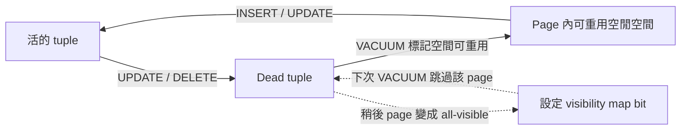
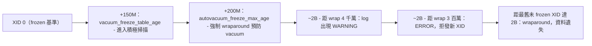

# [BEE-6011] VACUUM、Bloat 與交易 ID Wraparound

:::info
PostgreSQL 的 MVCC 設計在每次 `UPDATE` 與 `DELETE` 時都會留下舊的 row 版本，叢集仰賴 `VACUUM` 回收這些空間，並在 32-bit XID 計數器繞回之前 freeze 舊的交易 ID。當 autovacuum 在大型表上跟不上進度時，資料庫會累積 bloat，最終為了避免災難性資料遺失而拒絕寫入。本文沿著維運者的視角依序走過：`VACUUM` 為何存在、autovacuum 預設值、wraparound 緊急狀態，以及 bloat 修復選項。在大型表上把 `autovacuum_vacuum_scale_factor` 調低，並監控 `pg_stat_user_tables`，叢集就不會在生產環境碰到剩 3 百萬 XID 拒絕寫入的門檻。
:::

## Context

PostgreSQL 採用多版本並行控制（MVCC），更新時寫入新的 row 版本，而原地的舊版本會被保留。PostgreSQL 文件〈Routine Vacuuming〉指出：「In PostgreSQL, an `UPDATE` or `DELETE` of a row does not immediately remove the old version of the row... The space it occupies must then be reclaimed for reuse by new rows, to avoid unbounded growth of disk space requirements. This is done by running `VACUUM`.」每一個寫入工作負載都會累積 dead tuple，每一個叢集因此都依賴一個能正常運作的 vacuum 迴圈。

一般的 `VACUUM` 會把 dead tuple 占用的空間在同一個 table 檔案內回收以供重用。PostgreSQL 文件〈VACUUM〉寫得很直白：「Plain `VACUUM` (without `FULL`) simply reclaims space and makes it available for re-use... However, extra space is not returned to the operating system (in most cases); it's just kept available for re-use within the same table.」如果維運者期待跑完一般 vacuum 之後磁碟使用量會下降，他會感到意外；檔案大小不變，內部會出現可供後續 insert 使用的空閒空間。

VACUUM 緩解的第二個壓力來源是 32-bit 交易 ID 計數器。PostgreSQL 文件〈Routine Vacuuming〉指出：「since transaction IDs have limited size (32 bits) a cluster that runs for a long time (more than 4 billion transactions) would suffer _transaction ID wraparound_: the XID counter wraps around to zero, and all of a sudden transactions that were in the past appear to be in the future — which means their output become invisible. In short, catastrophic data loss.」同一份文件頁也訂出了維運者必須遵守的硬性條件：「To avoid this, it is necessary to vacuum every table in every database at least once every two billion transactions.」

dead tuple 回收與 XID freeze 這兩項職責加在一起，正是 PostgreSQL 維運者必須把 `VACUUM` 視為儲存層第一線元件的原因。

## Visual

兩張圖串起整個機制：dead tuple 生命週期解釋了為什麼需要例行 vacuum，XID 空間圖則標出多道連續門檻。

第一張圖追蹤一筆 row 從活資料、dead tuple 到可重用空閒空間的歷程：

visibility map 是這個生命週期旁邊的一層最佳化機制。PostgreSQL 文件〈Routine Vacuuming〉指出：「Vacuum maintains a visibility map for each table to keep track of which pages contain only tuples that are known to be visible to all active transactions... vacuum itself can skip such pages on the next run, since there is nothing to clean up.」少了這份地圖，在大型 append-only 表上的 vacuum 每一次都得重新走過每一個 page。

第二張圖把 XID 空間水平攤開，標出維運者必須認得的四道門檻：

門檻來源：4 千萬警告與少於 3 百萬剩餘 XID 拒絕寫入的條件出自 PostgreSQL 文件〈Routine Vacuuming〉：「the system will refuse to assign new XIDs once there are fewer than three million transactions left until wraparound.」2 億的 `autovacuum_freeze_max_age` 預設值與 1.5 億的積極掃描觸發點出自 PostgreSQL 文件〈Automatic Vacuuming〉。Autovacuum 本身在預設 `autovacuum_naptime`（一分鐘）就會醒一次，同份文件指出：「Specifies the minimum delay between autovacuum runs on any given database... The default is one minute (`1min`).」每一個 naptime 內，會啟動一個 worker 對某個資料庫執行，啟動間隔等於 naptime 除以資料庫數量，這代表叢集裡資料庫越多，每個資料庫每分鐘被喚醒的次數越少。

## Example

Sentry Engineering Blog〈Transaction ID Wraparound in Postgres〉（David Cramer，2015）描述了一個教科書等級的事故。Sentry 的寫入集中在某個巨大的 event-rollup 表上。Autovacuum 在這個表上反覆嘗試 wraparound 預防 vacuum，其餘資料庫則維持正常，而 ingest 工作負載讓 XID 計數器前進的速度比 vacuum 能 freeze row 的速度更快。事後檢討寫到：「By querying Postgres' internal statistics we identified that the autovacuums actually had finished on all of the relations except one... Our only choice at this point was to shut down the database and restart in single-user mode... we made the call to truncate the table. Five minutes later, the system was fully restored.」

從維運者位置走一遍，復原順序是：

1. 叢集越過警告門檻，接著越過拒絕寫入門檻；新需要分配 XID 的交易開始以 wraparound 錯誤失敗。
2. 對內部統計表的診斷查詢確認某一張特定大表的 autovacuum 在可用時間窗內無法完成。
3. 標準補救手段（等 autovacuum 跑完、調高 cost limit）力有未逮，因為該表的 vacuum 成本超過寫入推進 XID horizon 的速度。
4. 團隊把叢集關掉，重啟進入 single-user mode，此時 wraparound 限制對維運者解除。
5. 對問題表執行 truncate，一次清掉所有未 frozen XID，之後叢集就能正常重啟並重新接受寫入。

Sentry 這次事故是每一位 PostgreSQL 維運者在親眼看到 wraparound 預防錯誤訊息之前都應該認識的代表性實戰案例。

## Best Practices

預設的 autovacuum 設定是針對小型叢集與小型表校準的。維運大規模生產工作負載的人應該調整預設值，並直接觀察執行中的清理迴圈。

- **MUST** 監控每一張表的 `last_autovacuum` 與 `n_dead_tup`，讓進度落後的表在演變成 wraparound 緊急狀態之前就能被看見。AWS Prescriptive Guidance〈Vacuuming and analyzing tables automatically〉建議使用查詢 `SELECT relname AS TableName, n_live_tup AS LiveTuples, n_dead_tup AS DeadTuples, last_autovacuum AS Autovacuum, last_autoanalyze AS Autoanalyze FROM pg_stat_user_tables;` 並說明理由：「Monitoring the number of dead tuples in each table, especially in frequently updated tables, helps you determine if the autovacuum processes are periodically removing the dead tuples so their disk space can be reused for better performance.」
- **MUST** 依 PostgreSQL 文件〈Routine Vacuuming〉的硬性限制，至少每 20 億個交易就要對每個資料庫的每張表 vacuum 一次。讓任何一張表越過這條 horizon，就會發生 wraparound 與資料遺失。
- **SHOULD** 在大型表上把 `autovacuum_vacuum_scale_factor` 從預設的 0.2 往下調。PostgreSQL 文件〈Automatic Vacuuming〉記載預設值：「Specifies a fraction of the table size to add to `autovacuum_vacuum_threshold` when deciding whether to trigger a `VACUUM`. The default is `0.2` (20% of table size).」Tomas Vondra〈Autovacuum Tuning Basics〉（EnterpriseDB blog，2024）談到後果：「for a 1TB table this means we can accumulate up to 200GB of dead rows, and then when the cleanup finally happens it will have to do a lot of work at once... The proper solution is to trigger the cleanup more often. This can be done by significantly decreasing the scale factor, perhaps like this: `autovacuum_vacuum_scale_factor = 0.01`.」
- **SHOULD** 用 `SELECT pid, query FROM pg_stat_activity WHERE query LIKE 'autovacuum: %';` 觀察當下的 autovacuum 活動，這是 Lukas Fittl〈Visualizing and tuning Postgres autovacuum〉（pganalyze blog）的建議。同一個 relation 上反覆連續出現 vacuum 表示 autovacuum 跟不上該表的寫入速度，必須收緊該表的 autovacuum 設定。
- **SHOULD** 把任何結尾為 `(to prevent wraparound)` 的 query 字串都當成高優先級訊號處理。依 PostgreSQL 文件〈Routine Vacuuming〉，這類 autovacuum「is not automatically interrupted」於 lock 衝突，會擋住其他作業直到完成。習慣性手動取消長時間 vacuum 的維運者應該調整工具，讓 wraparound 預防型的執行不被取消。
- **MAY** 謹慎使用「停掉 autovacuum」這個逃生口：依 PostgreSQL 文件〈Automatic Vacuuming〉，「the system will launch autovacuum processes to prevent wraparound even when autovacuum is otherwise disabled.」停用 autovacuum 會壓掉一般清理動作，但仍允許強制執行 wraparound 行程，最終的工作模式會變成長時間平靜搭配偶發性的緊急 freeze 掃描。

## Wraparound 事故處置 Playbook

三道門檻定義了 wraparound 狀態機，維運者的應對動作取決於叢集越過了哪一道。

### 門檻 1：達到 `autovacuum_freeze_max_age`（預設 2 億）

PostgreSQL 文件〈Automatic Vacuuming〉指出：「Specifies the maximum age (in transactions) that a table's `pg_class`.`relfrozenxid` field can attain before a `VACUUM` operation is forced to prevent transaction ID wraparound within the table. Note that the system will launch autovacuum processes to prevent wraparound even when autovacuum is otherwise disabled.」

越過這道門檻是正常的背景行為；叢集會對該 relation 強制觸發一次 wraparound 預防 vacuum。維運動作是透過 `pg_stat_progress_vacuum`（在有埋點的版本）確認進度，並確保不會有人手動取消。Wraparound autovacuum 會穿過會中斷一般 autovacuum 的 lock 衝突直到跑完。〈Routine Vacuuming〉寫到：「if the autovacuum is running to prevent transaction ID wraparound (i.e., the autovacuum query name in the `pg_stat_activity` view ends with `(to prevent wraparound)`), the autovacuum is not automatically interrupted.」

### 門檻 2：距 wraparound 4 千萬 XID 時的警告 log

PostgreSQL 文件〈Routine Vacuuming〉在同一段裡同時定下警告層級與拒寫層級：「the system will refuse to assign new XIDs once there are fewer than three million transactions left until wraparound.」警告層級在這條 horizon 之前。

維運動作：找出 `relfrozenxid` 最舊的 relation，提升該 relation 的 vacuum 優先級，並考慮在 autovacuum worker 上調高 `vacuum_cost_limit`，讓 freeze 掃描在 3 百萬 horizon 之前完成。

### 門檻 3：距 wraparound 少於 3 百萬 XID 時拒絕寫入

叢集會吐出 `ERROR: database is not accepting commands that assign new XIDs to avoid wraparound data loss in database "mydb"`。同一份文件指出：「In this condition any transactions already in progress can continue, but only read-only transactions can be started. Operations that modify database records or truncate relations will fail.」

Sentry 2015 年的事故就是在某張表上抵達了這個狀態。此時的復原選項相當受限：

1. 把叢集關掉，重啟進入 single-user mode，此時 wraparound 限制對維運者解除。
2. 在離線狀態下對問題 relation 執行 wraparound 預防 `VACUUM` 直到完成。當 relation 的資料必須保留時，這是預設復原路徑。
3. 如果未 frozen 的 XID 集中在某個可拋棄的 relation，就像 Sentry 一樣對那個 relation 執行 `TRUNCATE`。這是針對資料可重建的表的最後手段。

容量與停機時間的規劃以選項 2 作為預設路徑為基準。選項 3 在五分鐘內就清掉 Sentry 的 wraparound 狀態，但前提是該 rollup 表的內容能從上游資料重建。

## Bloat 修復：VACUUM FULL 與 pg_repack 的取捨

一般 `VACUUM` 不會把空間還給作業系統。當一張表 bloat 到必須把磁碟空間還給作業系統的程度（通常發生在大量歷史資料清除之後），維運者要在兩條重整路徑之間選擇。

### `VACUUM FULL`

`VACUUM FULL` 會把整張表改寫到一個新的檔案。PostgreSQL 文件〈VACUUM〉指出：「Selects 'full' vacuum, which can reclaim more space, but takes much longer and exclusively locks the table. This method also requires extra disk space, since it writes a new copy of the table and doesn't release the old copy until the operation is complete.」

容量規劃要承擔兩項成本：

- 重寫期間在表上的 `ACCESS EXCLUSIVE` lock，會擋住併發的讀與寫。
- 重寫期間至少要有等同於該表活資料大小的可用磁碟空間，因為原檔案會一直保留到新檔案完成為止。

### `pg_repack`

`pg_repack` 是線上的替代方案。github.com/reorg/pg_repack 專案 README 指出：「pg_repack is a PostgreSQL extension which lets you remove bloat from tables and indexes... Unlike CLUSTER and VACUUM FULL it works online, without holding an exclusive lock on the processed tables during processing.」

執行 `pg_repack` 的維運者可以在整個重整過程中讓表持續對外提供讀寫，代價是必須安裝 extension、在重建期間接受以 trigger 為基礎的變更追蹤，並且仍然要為複本檔案準備等量的磁碟空間餘裕。

### 兩者之間如何選

當有維護視窗，且樹內操作的單純性比 lock 成本更值得時，選 `VACUUM FULL`。當該表處於 24x7 工作負載的熱路徑上，重寫期間的 `ACCESS EXCLUSIVE` lock 無法接受時，選 `pg_repack`。

## Related Topics

- [Storage Engines](/zh-tw/data-storage/storage-engines)
- [Database Backup Strategies and Point-in-Time Recovery](/zh-tw/data-storage/database-backup-strategies-and-point-in-time-recovery)
- [Durability, fsync, and the Crash-Safety Contract](/zh-tw/data-storage/durability-fsync-and-the-crash-safety-contract)
- [MVCC: Multi-Version Concurrency Control](/zh-tw/distributed-systems/mvcc-multi-version-concurrency-control)
- [B-Tree Internals](/zh-tw/distributed-systems/b-tree-internals)

## References

- PostgreSQL Global Development Group, "Routine Vacuuming," PostgreSQL Documentation (current). https://www.postgresql.org/docs/current/routine-vacuuming.html
- PostgreSQL Global Development Group, "Automatic Vacuuming," PostgreSQL Documentation (current). https://www.postgresql.org/docs/current/runtime-config-autovacuum.html
- PostgreSQL Global Development Group, "VACUUM," PostgreSQL Documentation (current). https://www.postgresql.org/docs/current/sql-vacuum.html
- Daniele Varrazzo et al., "pg_repack — Reorganize tables in PostgreSQL databases with minimal locks," GitHub project README. https://github.com/reorg/pg_repack
- Tomas Vondra, "Autovacuum Tuning Basics," EnterpriseDB blog (2024). https://www.enterprisedb.com/blog/autovacuum-tuning-basics
- Lukas Fittl, "Visualizing and tuning Postgres autovacuum," pganalyze blog. https://pganalyze.com/blog/visualizing-and-tuning-postgres-autovacuum
- AWS Prescriptive Guidance, "Vacuuming and analyzing tables automatically," AWS Documentation. https://docs.aws.amazon.com/prescriptive-guidance/latest/postgresql-maintenance-rds-aurora/autovacuum.html
- David Cramer, "Transaction ID Wraparound in Postgres," Sentry Engineering Blog (2015). https://blog.sentry.io/transaction-id-wraparound-in-postgres/
