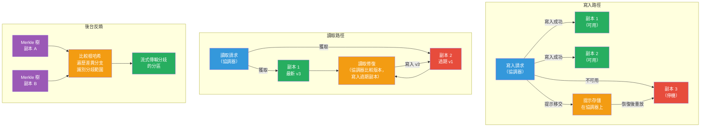

# [BEE-19022] 反熵與副本修復

:::info
反熵是分散式數據庫用於檢測和協調已分歧副本的一組機制——提示移交修復暫時不可用節點錯過的寫入，讀取修復修復讀取期間發現的過期數據，後台反熵使用 Merkle 樹比較副本狀態以查找和修復從未被讀取的數據中的不一致——這三層合在一起在實踐中實現了最終一致性。
:::

## Context

分散式系統中「反熵」一詞源自 Alan Demers、Dan Greene、Carl Hauser 及其 Xerox PARC 同事在「複製數據庫維護的流行病演算法」（ACM PODC，1987 年）中的工作。他們將複製建模為信息流行病：每個節點定期選擇一個隨機伙伴，交換數據庫狀態，並應用接收到的任何更新——他們稱這個過程為**反熵**，因為它系統性地減少了由網絡故障和並發更新引入的無序（熵）。他們的流行病模型表明，對數輪次的 Gossip 協議足以以高概率將更新傳播到所有副本。

Amazon 的 Dynamo 論文（DeCandia 等人，SOSP 2007）將這些思想具體化為生產鍵值存儲的三種互補修復機制。Dynamo 的架構——無主節點、CAP 的 AP 端、寬鬆仲裁——意味著在網絡中斷或節點故障期間副本會定期分歧。論文描述了三層修復，每層針對不同的故障場景：**提示移交**用於臨時節點不可用（幾秒到幾小時），**讀取修復**用於讀取期間發現的不一致（被動的、按需驅動），以及**Merkle 樹反熵**用於對所有數據（包括從未被讀取的數據）進行全面後台協調。Werner Vogels 在「最終一致性」（CACM，2009 年）中正式化了這種區別：僅有讀取修復的系統只對頻繁訪問的數據實現最終一致性；完整的最終一致性——包括對冷數據——需要後台反熵。

Cassandra（Lakshman 和 Malik，ACM SIGOPS 2010）從 Dynamo 採用了所有三種機制，並將它們作為操作原語公開。提示移交是自動的，默認啟用。讀取修復在協調器讀取時以概率方式觸發（可通過每個表的 `read_repair` 選項配置）。後台反熵通過 `nodetool repair` 命令執行，MUST（必須）在外部調度——Cassandra 不提供內置調度器。Riak 在 1.3 版本（2013 年）引入了**主動反熵（AAE）**，將 Merkle 樹比較作為連續的、自主的後台守護進程運行，而非觸發命令，消除了手動修復調度的操作負擔。

所有這些實現共同的關鍵洞見是：最終一致性不是系統自動以零成本提供的屬性——它是在修復機制運行的情況下系統提供的屬性。禁用修復的 Cassandra 集群不是最終一致的；它是一個將積累漂移直到節點永久分歧的集群。

## Design Thinking

**三種修復機制解決故障時間線上的不同節點。** 提示移交在寫入後幾秒內觸發，在本地存儲寫入，並在目標節點恢復後立即重放——它處理短暫不可用（網絡閃斷、滾動重啟）的常見情況，無需完整的修復週期。讀取修復在讀取後幾毫秒內觸發，在帶內與請求比較副本版本並更新過期的副本——它處理正在被主動訪問的最近分歧數據。後台反熵按計劃運行（小時到天），使用 Merkle 樹系統性地比較副本範圍——它處理冷數據、過期的提示和其他機制未解決的任何分歧。生產系統需要全部三者；每個的盲點是下一個的主要使用場景。

**修復完整性MUST（必須）受墓碑垃圾回收窗口的限制。** Cassandra（和類似系統）將刪除標記為墓碑——一個表示「此鍵已被刪除」的寫入。墓碑在所有副本確認刪除且安全窗口（`gc_grace_seconds`，默認 10 天）過去後才能被垃圾回收。如果節點停機時間超過 `gc_grace_seconds`，且墓碑被回收前未運行修復，節點恢復時將復活已刪除的行——這是靜默數據損壞。反熵修復MUST（必須）在每個副本上的 `gc_grace_seconds` 窗口內運行。這是 Cassandra 修復調度中最關鍵的操作約束。

**修復資源成本隨分歧量而非數據集大小擴展。** Merkle 樹實現了這種效率：兩個副本首先比較根哈希（O(1) 網絡往返），然後只遍歷不同的分支，直到識別出需要數據傳輸的葉子段（令牌範圍）。一個有 10 TB 數據但只有 1 MB 分歧的集群每個修復週期交換約 1 MB 數據。這使頻繁的增量修復比偶爾的完整修復更便宜——每次運行之間積累的分歧更少，因此每次運行傳輸的數據更少。然而，構建 Merkle 樹本身的 I/O 成本是固定的，與數據集大小成正比：生成樹需要讀取所有 sstable 數據。

## Visual



## Best Practices

**在每個節點的 `gc_grace_seconds` 內調度反熵修復。** Cassandra 的默認值是 10 天。如果節點每 7 天經歷一次修復週期，在墓碑可能在副本仍然過期的情況下在其他節點被垃圾回收之前，有 3 天的安全緩衝。高刪除量、短 TTL 的表SHOULD（應該）使用更短的 `gc_grace_seconds` 配合相應更頻繁的修復。

**使用增量修復進行日常維護；保留完整修復用於恢復後。** 增量修復標記已修復的 SSTable 並在後續運行中跳過它們，只在未修復的數據上構建 Merkle 樹。這大幅減少了大型數據集每個修復週期的 I/O。完整修復（Cassandra 4.0 之前的默認值）在所有數據上重建樹，SHOULD（應該）在節點替換後或增量修復狀態丟失時使用。

**在低流量窗口期間運行修復並限制 I/O。** Merkle 樹構建是磁盤讀取密集型的。在非高峰時段調度 `nodetool repair`。使用 `nodetool setcompactionthroughput` 和修復並發設置來限制 I/O 影響。在 Cassandra 4.0+ 上，`nodetool repair --rate-limit` 選項以 MB/s 為單位限制流式傳輸帶寬。

**MUST NOT（不得）僅依賴讀取修復來保證數據正確性。** 讀取修復只修復在修復窗口期間提供讀取的副本。寫入後再也不被讀取的數據——審計日誌、歸檔事件、很少訪問的用戶記錄——在沒有後台反熵的情況下會永久漂移。如果您的工作負載有任何冷數據，後台修復就不是可選的。

**將修復延遲作為操作指標進行監控。** 跟蹤每個節點和每個令牌範圍的最後一次成功修復時間戳。當任何範圍超過 `gc_grace_seconds - 安全緩衝` 時發出警報。Cassandra 通過 `system_distributed.repair_history` 公開修復歷史。Riak 的 AAE 通過 `riak-admin aae-status` 公開樹齡和交換統計信息。

**節點恢復後驗證提示移交交付。** 提示存儲在嘗試寫入的協調器本地。如果協調器在交付提示前重啟，這些提示就丟失了。節點從長時間停機（超過幾分鐘）恢復後，SHOULD（應該）運行修復，而不是信任所有提示都已被交付。

## Example

**Cassandra：修復調度和監控：**

```bash
# 在單個節點上進行增量修復（日常維護——只修復未修復的 SSTable）
# -pr：只修復此節點擁有的主令牌範圍（避免對同一數據修復兩次）
nodetool repair -pr --incremental keyspace_name

# 節點替換後的完整修復（在所有數據上重建 Merkle 樹）
nodetool repair keyspace_name

# 只修復特定表
nodetool repair keyspace_name table_name

# 按令牌範圍查看修復歷史
cqlsh> SELECT * FROM system_distributed.repair_history
       WHERE keyspace_name = 'keyspace_name'
       ORDER BY started_at DESC LIMIT 10;

# 監控正在進行的修復進度
nodetool compactionstats   -- 顯示與修復相關的流式傳輸任務
nodetool tpstats           -- 檢查 AntiEntropyStage 的背壓
```

**Cassandra：表級讀取修復配置：**

```sql
-- 啟用概率讀取修復（Cassandra 4+ 中默認為 BLOCKING）
-- BLOCKING：在返回客戶端前等待修復完成（更強的一致性，更高的延遲）
-- NONE：禁用讀取修復（最高吞吐量，更弱的一致性）
CREATE TABLE orders (
    order_id uuid PRIMARY KEY,
    status text,
    total decimal
) WITH read_repair = 'BLOCKING';

-- 對高寫入、低一致性表（分析數據攝取）：
CREATE TABLE events (
    event_id timeuuid PRIMARY KEY,
    payload text
) WITH read_repair = 'NONE';
```

**讀取修復流程（匹配 Dynamo 協調器行為的偽代碼）：**

```python
def coordinated_read(key, replicas, consistency_level):
    # 聯繫所有副本（即使超出 consistency_level 所需）
    responses = [replica.get(key) for replica in replicas]

    # 找到最新版本
    latest = max(responses, key=lambda r: r.timestamp)
    stale_replicas = [r for r in responses if r.timestamp < latest.timestamp]

    # 異步地將最新值寫回過期副本
    # （異步以使客戶端響應不被修復延遲）
    for stale in stale_replicas:
        async_write(stale.replica, key, latest.value, latest.timestamp)

    # 一旦 consistency_level 個副本同意最新值就返回
    quorum = [r for r in responses if r.timestamp == latest.timestamp]
    if len(quorum) >= consistency_level:
        return latest.value
    else:
        raise ConsistencyException("仲裁數量不足")
```

**Merkle 樹反熵（樹比較協議的偽代碼）：**

```python
def anti_entropy_repair(node_a, node_b, token_range):
    # 兩個節點在令牌範圍內的數據上構建 Merkle 樹
    # 葉節點 = hash(該哈希桶中行的所有列值)
    tree_a = node_a.build_merkle_tree(token_range)
    tree_b = node_b.build_merkle_tree(token_range)

    # 從根比較——O(1) 檢測任何分歧
    if tree_a.root_hash == tree_b.root_hash:
        return  # 副本相同——不需要修復

    # 向下遍歷以找到分歧的葉子段
    diverged_ranges = find_diverged_leaves(tree_a, tree_b)
    # diverged_ranges：哈希不同的令牌子範圍

    # 只流式傳輸分歧的段（與差異成正比，而非數據集大小）
    for token_sub_range in diverged_ranges:
        rows_a = node_a.read_range(token_sub_range)
        rows_b = node_b.read_range(token_sub_range)
        # 對每個鍵應用最後寫入勝出（或應用程序定義的合併）
        merged = merge_by_timestamp(rows_a, rows_b)
        node_a.write_range(token_sub_range, merged)
        node_b.write_range(token_sub_range, merged)

def find_diverged_leaves(tree_a, tree_b):
    # 通過樹的 BFS——只遍歷哈希不匹配的分支
    queue = [(tree_a.root, tree_b.root)]
    diverged = []
    while queue:
        node_a, node_b = queue.pop(0)
        if node_a.hash == node_b.hash:
            continue  # 此子樹相同——跳過
        if node_a.is_leaf:
            diverged.append(node_a.token_range)
        else:
            queue.extend(zip(node_a.children, node_b.children))
    return diverged
```

**Riak：檢查主動反熵狀態：**

```bash
# 檢查 AAE 樹狀態——顯示樹最後一次構建和交換的時間
riak-admin aae-status

# 示例輸出：
# ======================== Exchanges ===========================
# Index   Last (ago)   All    Errors
# -----------------------------------------------------------
# 0       1.2 min      all       0
# 91      2.1 min      all       0
# ...
# ========================== Trees ============================
# Index   Built (ago)
# ----------------------------------------------------------
# 0       2.3 days
# 91      2.1 days
```

## Related BEEs

- [BEE-19013](merkle-trees.md) -- Merkle 樹：反熵使用 Merkle 樹作為高效比較副本狀態的核心數據結構——樹根哈希以 O(1) 識別任何分歧，遍歷縮小到具體不同的令牌範圍，無需交換完整數據集內容
- [BEE-19014](quorum-systems-and-nwr-consistency.md) -- 仲裁系統與 NWR 一致性：寬鬆仲裁（W+R ≤ N）允許寫入在只到達部分副本時成功；反熵和提示移交是最終將這些寫入交付給錯過副本的機制
- [BEE-19001](cap-theorem-and-the-consistency-availability-tradeoff.md) -- CAP 定理：AP 系統（Cassandra、DynamoDB、Riak）在分區期間選擇可用性，以犧牲即時一致性為代價；反熵是將「可用但不一致」轉化為「最終一致」的機制——沒有修復，AP 只是可用且錯誤的
- [BEE-19015](failure-detection.md) -- 故障檢測：反熵修復決策由故障檢測驅動——被檢測為停機的節點觸發提示移交；恢復的節點觸發提示重放，並發出信號表示可能需要修復以補上錯過的寫入

## References

- [複製數據庫維護的流行病演算法 -- Demers, Greene, Hauser 等人, ACM PODC 1987](https://dl.acm.org/doi/10.1145/41840.41841)
- [Dynamo：Amazon 的高可用鍵值存儲 -- DeCandia 等人, ACM SOSP 2007](https://dl.acm.org/doi/10.1145/1294261.1294281)
- [Cassandra：去中心化結構化存儲系統 -- Lakshman and Malik, ACM SIGOPS 2010](https://dl.acm.org/doi/10.1145/1773912.1773922)
- [最終一致性 -- Werner Vogels, CACM 2009 年 1 月](https://dl.acm.org/doi/10.1145/1435417.1435432)
- [修復 -- Apache Cassandra 文檔](https://cassandra.apache.org/doc/4.0/cassandra/operating/repair.html)
- [主動反熵 -- Riak 文檔](https://docs.riak.com/riak/kv/latest/learn/concepts/active-anti-entropy/index.html)
- [反熵修復 -- DataStax Enterprise 架構](https://docs.datastax.com/en/dse/6.9/architecture/database-architecture/anti-entropy-repair.html)
