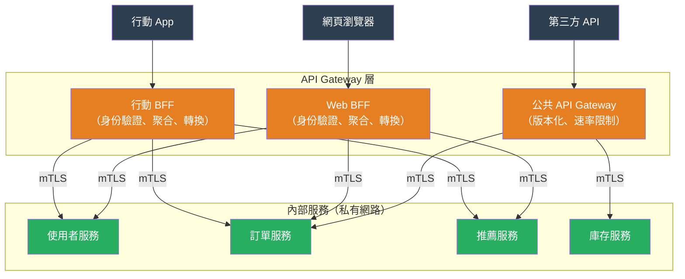

# [BEE-19036] API Gateway 模式

:::info
API Gateway 是客戶端流量進入微服務架構的單一入口點——一個在第七層（Layer 7）運作的反向代理，在一處集中執行身份驗證、速率限制、路由與可觀測性，而不是在每個服務中重複這些邏輯。
:::

## 背景

當系統分解成多個服務時，就會出現一類橫切關注點（cross-cutting concerns）：每個服務都需要驗證呼叫者身份、每個服務都需要處理 CORS 標頭、每個服務都應該發送指標、每個服務都需要 TLS 終止。在每個服務中個別實作這些功能會導致重複、不一致和版本漂移——六個月前上線的服務可能使用較舊版本的身份驗證函式庫，而新服務則使用最新版本。

API Gateway 模式透過將橫切關注點提取到單一中介層來解決此問題。Netflix 是最早將這種架構形式化的大型網際網路公司之一。他們的 Zuul Gateway（2013 年開源）負責 Netflix 所有 API 流量的路由、身份驗證、動態腳本和洞察/監控，以單一策略執行點取代了錯綜複雜的服務間客戶端函式庫。這個模式在 Chris Richardson 將其納入 microservices.io 模式語言後，成為微服務文獻中的標準模式。

Sam Newman 在 2015 年提出了一個互補模式：**Backend for Frontend（BFF）**。與其使用一個服務所有客戶端的單體 Gateway，每種客戶端類型——行動 App、網頁瀏覽器、第三方 API 使用者——都有自己的專屬 Gateway 實例，由開發該客戶端的團隊擁有。行動 BFF 以行動 App 需要的方式聚合並轉換資料；Web BFF 則為網頁前端做同樣的事。這避免了「凍結原地」的問題，即通用 Gateway 積累了不同客戶端的衝突需求而變得難以演進。

不使用 Gateway 的替代方案——讓客戶端直接呼叫服務——稱為「客戶端服務發現」或「直接服務存取」。當服務數量少、都在受信任的網路上、且只有單一類型客戶端存取時，這是合適的做法。隨著服務數量、客戶端多樣性和法規範圍（誰可以呼叫什麼）的增長，Gateway 成為正確的取捨。

## 設計思維

### Gateway 擁有什麼 vs. 服務擁有什麼

Gateway 應執行普遍且對客戶端可見的策略：

| 關注點 | Gateway | 服務 |
|---|---|---|
| TLS 終止 | 是 | 否（內部流量可使用明文或 mTLS） |
| 身份驗證（JWT/OAuth 驗證） | 是 | 應驗證傳播的身份標頭 |
| 粗粒度授權（scope 檢查） | 是 | 細粒度授權（列級別權限） |
| 每個客戶端的速率限制 | 是 | 每資源的速率限制 |
| 請求路由 | 是 | 服務內部路由 |
| 可觀測性（存取日誌、指標、追蹤） | 是 | 業務邏輯指標 |
| 酬載業務邏輯 | 否 | 是 |
| 跨服務資料聚合 | 僅 BFF | 否 |

**抵制在 Gateway 中放置業務邏輯的衝動。** 一旦 Gateway 需要理解領域——「如果使用者是高級訂閱者，路由到高級服務」——Gateway 就成為業務變更的瓶頸，並開始將邊緣層與領域模型耦合。依據技術條件路由（路徑前綴、標頭值、JWT 聲明）；將領域規則留給服務。

### 單一 Gateway vs. BFF vs. 直接存取

三種架構存在於一個光譜中：

**單一 Gateway** 是一個良好的起點：一個 Gateway 路由所有流量、執行所有策略。運維簡單。其限制在於不同客戶端（行動、網頁、第三方）有衝突的需求——行動需要更小的酬載，網頁需要更豐富的資料，第三方需要穩定的版本化合約——單一 Gateway 積累這些需求直到變得僵化。

**BFF（Backend for Frontend）** 為每種客戶端類型創建一個 Gateway，各由開發該客戶端介面的團隊擁有。允許每個介面獨立演進。代價是運維：N 個 Gateway 需要部署、監控和保護。

**直接服務存取** 完全跳過服務間通信的 Gateway。在私有網路上的服務間內部流量通常直接進行，不經過公共 API Gateway。Gateway 只處理外部、客戶端發起的流量。

### Gateway 增加的成本多於價值的時機

以下情況不需要 Gateway：系統是單一服務或單體架構；所有客戶端都是內部且受信任的；沒有客戶端類型多樣性；速率限制和身份驗證在更高層處理（CDN、負載均衡器）。對簡單系統添加 Gateway 會增加網路跳轉、部署依賴和運維負擔，而獲益甚少。

## 最佳實踐

**必須（MUST）在 Gateway 而非僅在個別服務中執行身份驗證。** JWT 驗證——驗證簽章、到期時間、發行者、受眾和令牌未被撤銷——應在 Gateway 邊界處執行一次。服務應該（SHOULD）信任 Gateway 在成功驗證後注入的傳播身份標頭（例如 `X-User-ID`、`X-User-Roles`），而不是重新驗證令牌。服務必須不（MUST NOT）接受繞過 Gateway 的直接外部流量，通過網路策略（安全群組、Kubernetes NetworkPolicy）執行。

**必須不（MUST NOT）在 Gateway 中放置領域業務邏輯。** Gateway 是基礎設施，不是應用程式程式碼。Gateway 中的路由規則應基於：URL 路徑前綴、HTTP 方法、標頭值、JWT 聲明（用於路由到不同服務層級）和流量百分比（用於金絲雀發布）。如果路由決策需要資料庫查詢或領域模型評估，該邏輯屬於服務，不屬於 Gateway。

**當服務多種資料需求差異顯著的客戶端類型時，應該（SHOULD）使用 BFF 模式。** 受限連線上的行動客戶端受益於更小、預先聚合的回應。瀏覽器客戶端可能需要帶有巢狀物件的更豐富資料。第三方 API 使用者需要穩定的版本化合約。每種客戶端類型的獨立 BFF 允許各自客製化，而不需要耦合。每個 BFF 應由擁有其所服務客戶端的同一團隊擁有。

**應該（SHOULD）在 BFF 層實作請求聚合以減少客戶端往返次數。** 需要三個服務資料的頁面——使用者個人資料、最近訂單和推薦——應收到一個 API 回應，而不是從客戶端進行三次串行 API 呼叫。BFF 平行發出三個請求，等待所有三個完成，並返回合成的回應。這在 BFF 中是合適的；在通用 Gateway 中則不合適（應保持精簡）。

**必須（MUST）在 Gateway 中依據已驗證身份而非 IP 地址進行速率限制。** 基於 IP 的速率限制很容易被繞過（VPN、輪換代理、共享企業 NAT 地址），並懲罰共享 IP 的使用者。以 JWT `sub`（主體）、API 金鑰或 OAuth 客戶端 ID 為鍵的速率限制執行了正確的語義：限制已驗證的主體，而不是網路地址。Gateway 速率限制應是粗粒度的（每個客戶端，每個時間段）；服務層速率限制處理細粒度的每資源保護。

**應該（SHOULD）在 Gateway 為所有上游服務配置斷路器。** 當後端服務變慢或不可用時，Gateway 應快速失敗，而不是無限期排隊請求。Gateway 的斷路器偵測故障率，當超過閾值時，直接向客戶端返回錯誤回應而不訪問故障後端。這防止了延遲級聯：慢速後端使 Gateway 排隊連接，耗盡 Gateway 的連接池，使 Gateway 對所有客戶端（不僅是訪問故障後端的客戶端）變慢。

**必須（MUST）在 Gateway 應用 TLS 終止；應該（SHOULD）在內部流量上執行 mTLS。** 來自客戶端的外部流量應始終使用 HTTPS。Gateway 終止 TLS 並可能通過明文（如果內部網路受信任）或 TLS（如果需要零信任內部網路）轉發到服務。在零信任環境中，Gateway 和每個服務之間的雙向 TLS（mTLS）對雙方進行身份驗證——服務知道請求來自 Gateway，而不是來自惡意的內部進程。

## 視覺說明



## 範例

**Gateway 的 JWT 驗證與身份傳播（偽程式碼）：**

```python
import httpx
from jose import jwt, JWTError
from functools import lru_cache

JWKS_URL = "https://auth.example.com/.well-known/jwks.json"
AUDIENCE = "api.example.com"
ISSUER = "https://auth.example.com/"

@lru_cache(maxsize=1)  # 快取 JWKS 以避免每次請求都去獲取
def get_jwks():
    return httpx.get(JWKS_URL).json()

def gateway_middleware(request, upstream_call):
    """
    驗證 JWT，注入身份標頭，然後轉發到上游服務。
    服務信任這些標頭，無需重新驗證令牌。
    """
    auth_header = request.headers.get("Authorization", "")
    if not auth_header.startswith("Bearer "):
        return Response(401, "缺少或格式錯誤的 Authorization 標頭")

    token = auth_header[len("Bearer "):]
    try:
        claims = jwt.decode(
            token,
            get_jwks(),
            algorithms=["RS256"],
            audience=AUDIENCE,
            issuer=ISSUER,
        )
    except JWTError as e:
        return Response(401, f"無效令牌: {e}")

    # 將已驗證身份作為下游服務的受信任標頭注入
    # 服務收到預先驗證的身份——它們不重新驗證令牌
    request.headers["X-User-ID"] = claims["sub"]
    request.headers["X-User-Roles"] = ",".join(claims.get("roles", []))
    request.headers["X-Oauth-Scopes"] = " ".join(claims.get("scope", "").split())

    # 依據已驗證身份而非 IP 進行速率限制
    if not rate_limiter.allow(key=claims["sub"], limit=1000, window_seconds=60):
        return Response(429, "超過速率限制", headers={"Retry-After": "60"})

    return upstream_call(request)
```

**BFF 聚合——一個客戶端請求，多個上游呼叫：**

```python
import asyncio
import httpx

async def get_dashboard(user_id: str, auth_token: str) -> dict:
    """
    平行聚合來自三個服務的資料。
    客戶端發出一個呼叫；BFF 扇出三個。
    """
    headers = {"Authorization": f"Bearer {auth_token}"}

    async with httpx.AsyncClient() as client:
        # 平行發出所有三個請求
        profile_task = client.get(f"http://user-svc/users/{user_id}", headers=headers)
        orders_task = client.get(f"http://order-svc/users/{user_id}/orders?limit=5", headers=headers)
        recs_task = client.get(f"http://rec-svc/users/{user_id}/recommendations", headers=headers)

        profile_res, orders_res, recs_res = await asyncio.gather(
            profile_task, orders_task, recs_task,
            return_exceptions=True  # 不讓一個失敗中止其他的
        )

    # 如果某些服務不可用，返回部分結果
    return {
        "profile": profile_res.json() if not isinstance(profile_res, Exception) else None,
        "recent_orders": orders_res.json() if not isinstance(orders_res, Exception) else [],
        "recommendations": recs_res.json() if not isinstance(recs_res, Exception) else [],
    }
```

**Kong 宣告式路由配置（kong.yaml）：**

```yaml
# Kong Gateway 宣告式配置——路由、插件、服務
services:
  - name: order-service
    url: http://order-svc:8080
    routes:
      - name: orders-api
        paths: ["/api/v1/orders"]
        methods: ["GET", "POST"]
    plugins:
      - name: jwt          # 在 Gateway 驗證 JWT；下游信任 X-Consumer 標頭
      - name: rate-limiting
        config:
          minute: 1000      # 每個已驗證的消費者
          policy: local
      - name: prometheus    # 為 Prometheus 抓取提供指標
      - name: correlation-id  # 注入 X-Correlation-ID 用於分散式追蹤
```

## 相關 BEE

- [BEE-3006](../networking-fundamentals/proxies-and-reverse-proxies.md) -- 代理與反向代理：Gateway 是專業化的反向代理；BEE-3006 涵蓋網路層；本文涵蓋建立在其上的應用層關注點
- [BEE-1001](../auth/authentication-vs-authorization.md) -- 身份驗證 vs. 授權：Gateway 執行粗粒度身份驗證（有效的 JWT？）和 scope 級授權；細粒度授權（此使用者能讀取此記錄嗎？）保留在服務中
- [BEE-12007](../resilience/rate-limiting-and-throttling.md) -- 速率限制與節流：Gateway 速率限制在邊緣應用；BEE-12007 涵蓋其背後的演算法
- [BEE-12001](../resilience/circuit-breaker-pattern.md) -- 斷路器模式：Gateway 的斷路器防止上游故障級聯到所有 Gateway 客戶端
- [BEE-5006](../architecture-patterns/sidecar-and-service-mesh-concepts.md) -- Sidecar 與服務網格概念：服務網格使用 mTLS 和可觀測性處理東西向（服務間）流量；API Gateway 處理南北向（客戶端到服務）流量；兩者互補，不是替代

## 參考資料

- [API Gateway Pattern -- microservices.io (Chris Richardson)](https://microservices.io/patterns/apigateway.html)
- [Backends for Frontends -- Sam Newman (2015)](https://samnewman.io/patterns/architectural/bff/)
- [Amazon API Gateway Documentation -- AWS](https://docs.aws.amazon.com/apigateway/latest/developerguide/welcome.html)
- [Envoy Gateway Documentation -- envoyproxy.io](https://gateway.envoyproxy.io/)
- [Kong Gateway Documentation -- Kong Inc.](https://developer.konghq.com/gateway/)
- [Backends for Frontends Pattern -- Azure Architecture Center](https://learn.microsoft.com/en-us/azure/architecture/patterns/backends-for-frontends)
