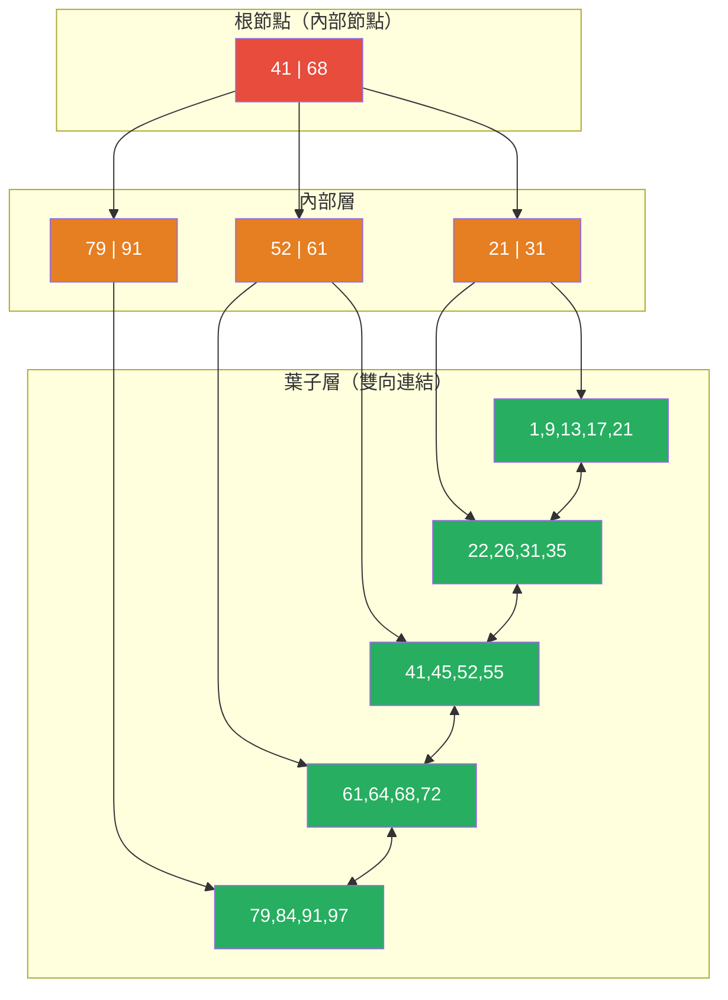

# [BEE-446] B-Tree 內部原理

:::info
B-tree 是一種自平衡的多路搜尋樹，以排序方式儲存資料，並在 O(log n) 時間內完成搜尋、插入和刪除；透過使用大小與磁碟或記憶體頁面對齊的寬節點，它最大限度地減少了遍歷大型排序資料集所需的 I/O 次數——使其成為超過五十年來關聯式資料庫的主流索引結構。
:::

## 背景

Rudolf Bayer 與 Edward M. McCreight 於 1970 年在波音研究實驗室發明了 B-tree（首次發表於 Acta Informatica，1972 年，"Organization and Maintenance of Large Ordered Indexes"），回應了一個具體的工程限制：磁碟尋道比 RAM 存取慢了幾個數量級，而二元搜尋樹需要 O(log₂ n) 次節點存取——每次都可能是一次獨立的磁碟尋道。B-tree 達到了相同的 O(log n) 漸近複雜度，但分支因子（度）為幾百而非兩個，將十億列資料表的節點存取次數降至兩到三次。

Douglas Comer 的重要綜述〈The Ubiquitous B-Tree〉（ACM Computing Surveys，1979）記錄了到 1970 年代末，B-tree 已取代幾乎所有其他大型檔案存取方法。Comer 也普及了 B+ tree 變體——幾乎所有現代資料庫引擎所使用的形式——其中所有資料記錄存放在葉子層，內部節點僅存放鍵值作為導航分隔符號。這種分離實現了兩個關鍵特性：(1) 內部節點每頁可容納更多分隔符號，因為它們不攜帶記錄資料，從而提高了扇出；(2) 葉子節點以雙向鏈結串列連接，無需回到樹上方即可完成高效的範圍掃描。

B+ tree 扇出的實際效果相當顯著。InnoDB 的預設頁面大小為 16 KB。存放 8 位元組整數鍵和 6 位元組頁面指標的內部節點每頁可容納約 1,170 個分隔符號條目。三層 B+ tree 因此可索引約 1,170² × 468 ≈ 6.42 億筆資料列——幾乎涵蓋大多數生產 OLTP 系統的整個資料集——且任何隨機查詢恰好需要三次 I/O 操作，可預測性極強。

## 設計思考

**B-tree 針對讀取最佳化；LSM-tree 針對寫入最佳化。** B-tree 更新會就地修改現有頁面（隨機寫入），這需要在頁面上取得獨佔鎖，並可能觸發頁面分裂。LSM-tree 寫入則將記錄附加到順序日誌，從不修改現有儲存——最大化寫入吞吐量，但需要壓縮以控制讀取放大。大約在寫入比例達 70% 時出現交叉點：低於此閾值，B-tree 在讀取延遲和可預測性上勝出；高於此閾值，LSM-tree 在寫入吞吐量上勝出。這就是為什麼 PostgreSQL 和 MySQL 使用 B-tree 作為索引，而 RocksDB（TiKV、Kafka）使用 LSM-tree 作為寫入密集型儲存。

**鍵類型決定插入碎片化程度。** 順序鍵（自動遞增整數、按時間排序的 UUIDv7）始終插入最右側葉子——不會分裂現有頁面，且頁面在分配新葉子前達到近 100% 填充。隨機鍵（UUIDv4、雜湊衍生值）均勻地插入整個樹，在頁面約 50% 滿時分裂——導致樹的平均填充率約 69%，頁面數比最優多約 45%。對於 InnoDB，由於主鍵是叢集索引（整列儲存在 B+ tree 葉子節點中），隨機主鍵還會導致列查詢的隨機 I/O，並因頁面分裂而使寫入放大加倍。

**填充因子是一個預留寫入空間，而非浪費空間。** 刻意讓頁面欠填（PostgreSQL `fillfactor=70`，InnoDB `innodb_fill_factor=80`）意味著就地更新可以擴展列而不立即觸發頁面分裂。對於 UPDATE 與 INSERT 比率高的資料表，較低的填充因子可降低分裂頻率，代價是使用更多頁面。對於僅附加或讀取密集型資料表，`fillfactor=100` 是最優選擇。

## 視覺化



*內部節點（橙色）只存放分隔鍵；葉子節點（綠色）存放實際資料並雙向連結以支援範圍掃描。搜尋鍵值 55 需遍歷根節點 → I2 → L3，恰好 3 次比較。*

## 最佳實務

**為 InnoDB 叢集索引使用單調遞增的主鍵。** 由於在 InnoDB 中叢集索引就是資料表本身，隨機主鍵（例如 UUIDv4）會導致每次插入分裂一個隨機葉子頁面，頁面僅填充約 50%，並在讀取時產生隨機 I/O。在高吞吐量寫入的資料表中，**必須（MUST）** 使用自動遞增整數或按時間排序的識別符（UUIDv7、ULID、Snowflake ID）作為主鍵。

**調整頁面大小以匹配儲存存取粒度。** 標準的 16 KB InnoDB 頁面大小假設使用塊導向的磁碟或 SSD 存取；對於 NVMe 儲存，8 KB 或 4 KB 頁面可降低寫入放大。PostgreSQL 使用 8 KB 頁面。更改頁面大小需要重新執行 `initdb`——根據硬體特性在叢集建立時決定。

**根據更新模式選擇填充因子。** 僅接受 INSERT 的資料表**應該（SHOULD）** 使用 `fillfactor=100`（無保留空間，最大密度）。頻繁接受會擴大列的就地 UPDATE 的資料表**應該（SHOULD）** 使用 `fillfactor=70–80`。在 PostgreSQL 中，每資料表填充因子僅適用於堆積頁面；索引填充因子在每個索引上單獨設定：`CREATE INDEX ... WITH (fillfactor=80)`。

**使用覆蓋索引消除堆積查詢。** InnoDB 的二級索引只存放索引列加上主鍵參考——查詢未覆蓋的列需要對叢集索引進行第二次隨機 I/O（"雙重查找"）。透過 `INCLUDE`（PostgreSQL）或在 InnoDB 二級鍵列中包含這些列，可將索引掃描從需要堆積存取的讀取轉換為僅索引讀取，完全避免叢集索引查找。

**定期重建隨機鍵工作負載的碎片化索引。** 經過大量隨機鍵插入和刪除後，B-tree 頁面平均填充率可能降至 50-60%，並包含許多死槽。`REINDEX CONCURRENTLY`（PostgreSQL）或 `OPTIMIZE TABLE`（MySQL InnoDB）以最優頁面填充重建索引。在大型資料表的非高峰時段安排此操作；監控 `pg_stat_user_indexes.idx_blks_read` 和 `pg_relation_size` 以發現膨脹。

**切勿單獨在低基數列上建立索引。** 在具有三個值的布林或列舉列上建立 B-tree 索引幾乎沒有選擇性——資料庫將執行返回三分之一所有列的完整索引掃描，由於堆積查詢的隨機 I/O 模式，這比順序堆積掃描更慢。**應該（SHOULD）** 改用部分索引（`WHERE active = true`）、多列索引或 Bloom 過濾器索引。

## 深入探討

**頁面分裂演算法。** 當葉子頁面溢出時（新記錄無法放入），B+ tree 分裂頁面：約一半的記錄移至新分配的頁面（"右兄弟"），中間鍵作為分隔符號條目提升至父內部節點，並更新雙向連結兄弟串列。若父節點在接收新分隔符號後也溢出，則遞歸分裂——最壞情況下，分裂傳播至根節點，此時根節點分裂並建立新根節點，使樹高增加一層。在已填充的樹上，實際上每 N/2 次插入（N 為分支因子）約分裂一次根節點。

對於單調（右側）插入，PostgreSQL 應用了一個優化：不在中點分裂，而是在最右側記錄處分裂（"右分裂優化"），建立一個幾乎為空的右頁面並保持左頁面滿載。這確保了單調工作負載達到近 100% 的填充率。

**頁面合併演算法。** 刪除記錄後，頁面可能降至合併閾值以下（InnoDB 50% 填充；PostgreSQL 由 VACUUM 觸發）。合併演算法將欠填頁面的剩餘記錄複製到相鄰兄弟頁面，移除現已空的頁面，並從父節點移除對應的分隔符號。合併可向上傳播，但比分裂少見，因為刪除通常分布更均勻。

**InnoDB 叢集索引與二級索引結構。** 在 InnoDB 中，主鍵索引是*叢集索引*——葉子節點存放完整的列資料。二級索引存放二級鍵列加上主鍵值。使用二級索引並需要未覆蓋列的查詢，必須使用從二級索引葉子檢索到的主鍵執行對叢集索引的第二次查找——當主鍵較大（UUID 字串 vs bigint）時，這種"雙重查找"是常見的效能陷阱，因為較大的主鍵會增加二級索引大小和緩衝池的記憶體壓力。

**PostgreSQL nbtree 優化。** PostgreSQL 的 `nbtree` 實作包含幾個超越教科書 B+ tree 的生產優化：(1) *去重*（PG 13+）：當多個索引條目指向同一邏輯鍵的不同列版本時（由 MVCC 導致），它們被合併為一個包含 TID 排序陣列的"發布列表"元組，顯著減少高寫入資料表上的索引膨脹。(2) *自底向上刪除*（PG 14+）：當預期因版本流失（MVCC 死亡元組）導致葉子頁面分裂時，nbtree 在分裂前主動掃描並移除死亡索引條目，減少頁面數量。(3) *帶可見性映射的僅索引掃描*：nbtree 與堆積可見性映射協作，當保證列的所有可見版本都在索引中時，直接從索引返回查詢結果（無需堆積存取）。

## 範例

**在 PostgreSQL 中診斷索引膨脹：**

```sql
-- 檢查索引大小與資料表大小的比率（比率高 = 可能膨脹）
SELECT
    schemaname,
    tablename,
    indexname,
    pg_size_pretty(pg_relation_size(indexrelid)) AS index_size,
    pg_size_pretty(pg_relation_size(indrelid))   AS table_size,
    round(pg_relation_size(indexrelid)::numeric /
          NULLIF(pg_relation_size(indrelid), 0) * 100, 1) AS index_pct_of_table
FROM pg_stat_user_indexes
JOIN pg_index USING (indexrelid)
ORDER BY pg_relation_size(indexrelid) DESC
LIMIT 10;

-- 使用 pgstattuple 估計索引膨脹（大資料表上代價較高）
CREATE EXTENSION IF NOT EXISTS pgstattuple;
SELECT
    index_size,
    round(avg_leaf_density, 1) AS avg_leaf_fill_pct,
    round((100 - avg_leaf_density) * index_size / 100)::bigint AS estimated_waste_bytes
FROM pgstatindex('users_email_idx');
-- 非更新密集型資料表的 avg_leaf_fill_pct < 70% 表示碎片化

-- 不鎖定的情況下重建碎片化索引（PG 12+）
REINDEX INDEX CONCURRENTLY users_email_idx;

-- 為預期頻繁就地更新的索引設定填充因子
CREATE INDEX users_email_idx ON users(email) WITH (fillfactor = 70);
ALTER INDEX users_email_idx SET (fillfactor = 70);
```

**InnoDB 頁面分裂監控：**

```sql
-- 監控 InnoDB 葉子頁面分裂次數（高速率表示隨機鍵工作負載）
SHOW GLOBAL STATUS LIKE 'Innodb_page_splits';
-- Innodb_page_splits: 14237  ← 自伺服器啟動以來的累積值

-- 監控索引碎片化（data_free = 未回收頁面空間）
SELECT
    table_name,
    index_name,
    stat_value AS pages,
    stat_value * 16 / 1024 AS size_kb
FROM mysql.innodb_index_stats
WHERE stat_name = 'size'
  AND table_name = 'orders';

-- 重建 InnoDB 資料表（重建叢集 B+ tree，回收空間）
OPTIMIZE TABLE orders;

-- 為批量載入設定填充因子（減少葉子頁面保留空間）
SET innodb_fill_factor = 95;  -- 批量插入時填充至 95%
LOAD DATA INFILE 'orders.csv' INTO TABLE orders;
SET innodb_fill_factor = 80;  -- 恢復生產設定
```

**順序 vs 隨機主鍵的影響（InnoDB）：**

```sql
-- 差：UUID 主鍵導致隨機頁面分裂和 50% 填充
CREATE TABLE events_bad (
    id CHAR(36) PRIMARY KEY DEFAULT (UUID()),  -- UUIDv4：隨機
    payload JSON,
    created_at TIMESTAMP DEFAULT CURRENT_TIMESTAMP
);

-- 好：自動遞增保持插入在右側邊緣；約 100% 填充
CREATE TABLE events_good (
    id BIGINT UNSIGNED AUTO_INCREMENT PRIMARY KEY,
    payload JSON,
    created_at TIMESTAMP DEFAULT CURRENT_TIMESTAMP
);

-- 分散式系統更佳選擇：UUIDv7 / ULID 保持時間排序
-- 同時保持全域唯一性——像自動遞增一樣插入在右側邊緣
-- 使用產生時間前綴 UUID 的函式庫：例如 uuid-ossp + 擴充
```

## 相關 BEE

- [BEE-6002](../data-storage/indexing-deep-dive.md) -- Indexing Deep Dive：索引選擇策略（何時使用複合索引、部分索引、覆蓋索引）是 B-tree 內部原理的應用層視角；理解頁面分裂和填充因子解釋了索引選擇具有特定效能特性的原因
- [BEE-6005](../data-storage/storage-engines.md) -- Storage Engines：B-tree 是磁碟型儲存引擎（InnoDB、PostgreSQL heap+nbtree）的主流結構；儲存引擎架構決定了 B-tree 頁面如何被快取、寫入和恢復
- [BEE-19024](log-structured-merge-trees.md) -- Log-Structured Merge Trees：LSM-tree 是寫入密集型工作負載中 B-tree 的主要替代方案；兩者之間的寫入放大與讀取放大取捨決定了哪種結構適合特定工作負載
- [BEE-19026](mvcc-multi-version-concurrency-control.md) -- MVCC：Multi-Version Concurrency Control：MVCC 版本流失會在 B-tree 葉子頁面中積累死亡索引條目；PostgreSQL 的自底向上刪除和去重優化正是為了管理這種互動而引入的

## 參考資料

- [Organization and Maintenance of Large Ordered Indexes -- Bayer and McCreight, Acta Informatica, 1972](https://link.springer.com/article/10.1007/BF00288683)
- [The Ubiquitous B-Tree -- Douglas Comer, ACM Computing Surveys, 1979](https://dl.acm.org/doi/10.1145/356770.356776)
- [B+Tree Index Structures in InnoDB -- Jeremy Cole, 2013](https://blog.jcole.us/2013/01/10/btree-index-structures-in-innodb/)
- [PostgreSQL B-Tree Index Documentation](https://www.postgresql.org/docs/current/btree.html)
- [InnoDB Page Merging and Page Splitting -- Percona Blog](https://www.percona.com/blog/innodb-page-merging-and-page-splitting/)
- [B-trees and Database Indexes -- PlanetScale Blog](https://planetscale.com/blog/btrees-and-database-indexes)
