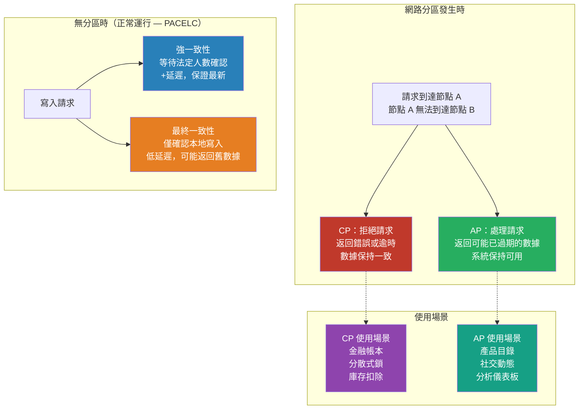

# [BEE-420] CAP 定理與一致性-可用性取捨

:::info
CAP 定理證明了在遭遇網路分區的分散式系統中，必須在「返回一致的答案」和「返回任何答案」之間做出選擇——理解這個選擇的真實含義，是正確推理資料庫、快取、訊息佇列及每個分散式元件的先決條件。
:::

## Context

2000 年 7 月，時任 UC Berkeley 教授、Inktomi 共同創辦人的 Eric Brewer，在 ACM 分散式計算原理研討會（PODC）上提出了一個猜想：分散式系統無法同時保證**一致性**、**可用性**和**分區容錯性**。兩年後，MIT 的 Seth Gilbert 和 Nancy Lynch 正式證明了這個猜想，發表於 *ACM SIGACT News*（2002）的「Brewer's Conjecture and the Feasibility of Consistent, Available, Partition-Tolerant Web Services」。該定理進入工程主流，成為推理分散式資料庫取捨中被引用最多的框架。

Gilbert 和 Lynch 定義的三個屬性：

- **一致性**（CAP 意義下，即*線性化*）：每次讀取都返回最近寫入的值。從任何客戶端的角度來看，系統表現得如同一台機器按全序依次執行操作。
- **可用性**：發送到非故障節點的每個請求都能收到回應——系統永不返回錯誤，也不會無限期掛起。
- **分區容錯性**：即使節點間的任意數量訊息被丟棄或延遲，系統仍能正確運行。

隨之而來的「選二」框架——CA、CP 或 AP——影響深遠，卻同樣具有誤導性。Brewer 本人在 *IEEE Computer*（2012）的回顧文章「CAP Twelve Years Later: How the 'Rules' Have Changed」中收回了這個框架。問題在於：**分區容錯性不是可選的**。任何跨越多台機器的系統都可能遭遇網路分區——這是由故障交換機、配置錯誤的防火牆或資料中心分裂引發的真實事件。假設分區永遠不會發生的 CA 系統不是分散式系統，它只是一個單一節點。真正的問題不是從三個屬性中選兩個，而是：**當分區發生時，犧牲一致性還是可用性？** 在正常運行期間——沒有活躍分區時——設計良好的系統可以同時提供兩者。

Martin Kleppmann 的 2015 年論文「A Critique of the CAP Theorem」（arXiv:1509.05393）指出了進一步的局限性：定理的定義模糊到難以嚴格應用，它對正常運行期間的取捨隻字未提，而且被廣泛誤用來為它實際上無法支撐的架構決策辯護。

Daniel Abadi 的 **PACELC 模型**（IEEE Computer，2012）填補了這個空白。PACELC 通過增加第二個決策軸來擴展 CAP：當沒有分區時（正常情況，標記為「E」表示 Else），系統仍必須在**延遲**（L）和**一致性**（C）之間做出選擇。強一致性要求副本在確認寫入前進行協調，這增加了延遲。較弱的一致性模型跳過這種協調，以可能讀到舊數據為代價降低延遲。一致性-延遲取捨始終存在；一致性-可用性取捨只在分區期間才會浮現。對大多數生產系統而言，日常的延遲取捨比罕見的分區取捨對設計的影響更大。

一個持續存在的混淆是將 **CAP 一致性**與 **ACID 一致性**混為一談。它們毫無關係。ACID 一致性是應用層屬性：事務使資料庫保持在由應用約束和業務規則定義的有效狀態。CAP 一致性是系統層屬性，關於副本同步：寫入完成後，任何節點的所有後續讀取都返回該值。一個系統可以具有線性化複製（CAP-C），但如果應用邏輯有誤，仍會違反業務不變量。Kleppmann 的《設計資料密集型應用》（O'Reilly，2017）明確指出了這一點。

## Design Thinking

**從分區問題開始，而不是從資料庫標籤開始。** 應用於資料庫產品的 CP/AP 分類（Cassandra = AP，etcd = CP）遮蓋的多於揭示的。大多數生產資料庫提供可調節的一致性：Cassandra 的一致性級別 `QUORUM` 使其偏向 CP 行為；DynamoDB 的強一致性讀取也是如此。設計問題是：對於*這個特定操作*，當副本無法訪問時會發生什麼？

**分區容錯性是底線，不是選擇。** 決策樹是：假設分區會發生（確實會），然後決定系統在分區期間應該做什麼。如果操作必須返回正確答案或不返回任何答案（金融帳本、庫存扣除、分散式鎖），系統對該操作應該是 CP 的。如果系統必須保持響應，並且可以容忍最終協調分散的狀態（用戶資料快取、產品目錄、會話親和性），AP 是合適的。

**正常運行的延遲通常更為主導。** PACELC 框架比 CAP 對許多設計決策更實用。要求跨可用區副本法定人數確認的強一致性寫入，每次寫入增加幾十毫秒的延遲。對高吞吐量系統而言，這個成本可能比每月發生一次的分區更重要。

**一致性是一個頻譜。** 線性化、順序一致性、因果一致性和最終一致性之間的選擇，各自代表正確性保證和協調成本之間的不同取捨。CAP 將所有較弱的模型歸為「不一致」。實際上，因果一致性——確保因果相關的操作按順序被觀察到，無需全局協調——通常已足夠，且比線性化便宜得多。

## Best Practices

工程師 MUST（必須）在評估儲存系統時區分 CAP 一致性（線性化）和 ACID 一致性（事務正確性）。將 AP 資料庫應用於需要事務完整性的工作負載，不只是會產生舊讀取——它可能產生永久不一致的數據，違反業務不變量。

工程師 MUST NOT（不得）將 CP/AP 視為統一適用於所有操作的資料庫級別屬性。逐操作評估一致性要求。使用法定人數讀取訪問的 AP 資料庫，行為不同於使用最終一致性讀取訪問的同一資料庫。

工程師 SHOULD（應該）在評估延遲敏感型系統時使用 PACELC 視角，而不只是 CAP。在正常運行期間，一致性-延遲取捨始終存在。跨區域副本的強一致性讀取可能增加 50-150 毫秒的延遲，影響每個請求，而不只是分區事件期間的請求。

工程師 SHOULD（應該）在選擇 AP 行為時為部分可用性進行設計。在分區期間接受不一致性，只有在系統同時實現衝突檢測和解決——最後寫入勝、向量時鐘、應用層合併函數或 CRDT（無衝突複製資料類型）——時才是安全的。沒有解決策略地接受不一致性會產生永久分散的狀態。

工程師 MUST NOT（不得）假設「最終一致」意味著「最終正確」。最終一致性只有在寫入最終停止時才保證收斂——在活躍系統中，收斂需要明確的衝突解決。衝突解決策略的選擇（最後寫入勝、應用層合併、CRDT）是正確性決策，而非實現細節。

工程師 SHOULD（應該）對以難以或不可能撤銷的方式修改共享狀態的操作偏好 CP 行為：金融事務、庫存扣除、用戶配置、分散式鎖獲取。分區期間 CP 的不可用性代價——這是罕見且有界的——比可能是永久性的數據損壞更可取。

工程師 MAY（可以）對舊數據代價有界且可理解的讀密集工作負載選擇 AP 行為：社交媒體動態、產品目錄讀取、推薦結果、分析儀表板。明確記錄舊數據界限，以便依賴服務能做出明智的決策。

## Visual



## Example

**診斷真實取捨——分散式庫存扣除：**

```
情景：兩個倉庫節點共享庫存。商品數量 qty=1。
兩個訂單同時到達不同節點。

AP 行為（最後寫入勝，無協調）：
  節點 A：讀取 qty=1，扣除 → qty=0，寫入節點 A
  節點 B：讀取 qty=1，扣除 → qty=0，寫入節點 B
  分區癒合：兩者都寫入了 qty=0 → 使用 LWW 協調
  結果：一個訂單可能未被履行，或 qty 變為負數
  問題：超賣——真實的經濟損失

CP 行為（線性化寫入，需要法定人數）：
  節點 A：讀取 qty=1，嘗試扣除
  節點 A 向節點 B 請求法定人數 → 分區 → 節點 B 無法訪問
  節點 A：返回錯誤「無法確認寫入」
  訂單失敗，客戶看到錯誤，可以稍後重試
  結果：無超賣，有界的可用性故障

結論：庫存扣除 MUST（必須）是 CP 的。
  接受可用性代價——不可用是可恢復的，
  超賣可能無法恢復。

反例——產品目錄讀取：
  節點 A 返回 30 秒前的產品詳情（舊數據）
  顯示的價格可能與實際價格相差幾分錢
  可接受：用戶繼續，結帳從權威來源重新計算
  結果：目錄讀取可以安全地使用 AP；結帳必須是 CP 的
```

**每操作調整一致性級別（偽代碼）：**

```python
# 目錄讀取：AP，可接受低延遲
product = db.read("product:42",
                  consistency=EVENTUAL)   # 從最近的副本提供

# 訂單創建：CP，需要正確性
with db.transaction(consistency=STRONG):  # 需要法定人數寫入
    inventory = db.read("inventory:42", consistency=STRONG)
    if inventory.qty < order.qty:
        raise InsufficientInventoryError
    inventory.qty -= order.qty
    db.write("inventory:42", inventory)
    db.write("order:new", order)
```

## Related BEEs

- [BEE-8001](../transactions/acid-properties.md) -- ACID 屬性：ACID 一致性是應用層正確性；CAP 一致性是複製同步——不同的概念
- [BEE-8002](../transactions/isolation-levels-and-their-anomalies.md) -- 隔離級別：隔離級別控制並發事務看到什麼；CAP 控制分散式副本返回什麼
- [BEE-8003](../transactions/distributed-transactions-and-two-phase-commit.md) -- 分散式事務與兩階段提交：2PC 是 CP 協議——它在協調器故障時停止，而不允許不一致性
- [BEE-8006](../transactions/eventual-consistency-patterns.md) -- 最終一致性模式：AP 系統的實現策略，包括衝突解決和 CRDT 方法
- [BEE-9004](../caching/distributed-caching.md) -- 分散式快取：快取本質上是 AP 的——理解 CAP 解釋了為什麼快取失效如此困難
- [BEE-6003](../data-storage/replication-strategies.md) -- 複製策略：同步與異步複製是 CP/AP 選擇背後的物理機制

## References

- [Brewer's Conjecture and the Feasibility of Consistent, Available, Partition-Tolerant Web Services -- Gilbert & Lynch, ACM SIGACT News 2002](https://dl.acm.org/doi/10.1145/564585.564601)
- [CAP Twelve Years Later: How the "Rules" Have Changed -- Eric Brewer, IEEE Computer 2012](https://ieeexplore.ieee.org/document/6133253)
- [A Critique of the CAP Theorem -- Martin Kleppmann, arXiv:1509.05393](https://arxiv.org/abs/1509.05393)
- [Consistency Tradeoffs in Modern Distributed Database System Design: CAP is Only Part of the Story -- Daniel Abadi, IEEE Computer 2012](https://dl.acm.org/doi/10.1109/MC.2012.33)
- [The CAP FAQ -- Henry Robinson, The Paper Trail](https://www.the-paper-trail.org/page/cap-faq/)
- [設計資料密集型應用 -- Martin Kleppmann（2017），O'Reilly](https://www.oreilly.com/library/view/designing-data-intensive-applications/9781491903063/)
