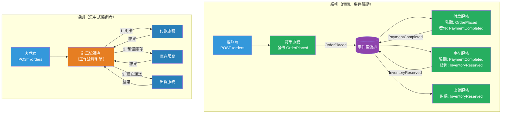

# [BEE-19052] 分散式工作流程中的編排 vs 協調

:::info
編排（Choreography）與協調（Orchestration）是跨分散式服務協調工作的兩種模型：在編排中，每個服務對事件作出反應並自行決定下一步動作；在協調中，中央協調者明確地逐步指示每個服務。
:::

## 背景

當電商系統收到一筆訂單時，必須跨多個服務依序執行一系列工作：收取款項、預留庫存、建立出貨任務，以及發送確認電子郵件。執行這些工作的服務各自獨立部署，可能由不同的團隊所有。*這些服務如何協調*是分散式系統中最關鍵的架構決策之一。

Martin Fowler 在 2017 年的一篇文章中識別出四種事件驅動架構風格——事件通知、事件攜帶狀態傳輸、事件溯源與 CQRS——並指出編排與協調是橫跨所有這些風格的正交關注點。這兩個術語早於微服務架構而存在：TIBCO 和 BEA BPEL 伺服器等工作流程協調引擎在 2000 年代初期就已存在，而編排模型也在 WS-CDL（Web 服務編排描述語言）規範中被正式定義。Sam Newman 在《Building Microservices》（第 2 版，2021 年）中將此選擇視為核心架構決策，而非實作細節。

在編排模型中，服務透過發佈事件進行通訊。付款服務發佈 `PaymentCompleted`；庫存服務監聽後回應，發佈 `InventoryReserved`；出貨服務監聽後建立運送任務。沒有任何服務了解其他服務——每個服務只知道自己消費和產生的事件。系統的行為由這些反應的總和所浮現。

在協調模型中，協調者服務（Orchestrator）知道完整的工作流程：呼叫付款服務、再呼叫庫存服務、再呼叫出貨服務。協調者明確地調用每個參與者並處理結果。工作流程的邏輯集中於一處；各參與者是被動的執行者。

兩種模型都不是普遍優越的。編排可擴展性好且保持服務解耦，但讓整體工作流程變得隱性——它分散在多個服務的事件處理器中。協調使工作流程顯性且可觀測，但引入了協調者，若設計不慎，會成為耦合點和單點故障。

## 設計思考

### 核心取捨

| 面向 | 編排（Choreography） | 協調（Orchestration） |
|---|---|---|
| 耦合程度 | 低——服務只知道事件 | 較高——協調者知道所有參與者 |
| 工作流程可見性 | 隱性——需從事件日誌重建 | 顯性——定義在同一處 |
| 錯誤處理 | 分散——每個服務自行處理故障 | 集中——協調者實作重試 / 回滾邏輯 |
| 測試難度 | 困難——需端對端事件模擬 | 較易——協調者邏輯可單元測試 |
| 除錯難度 | 困難——需跨服務因果追蹤 | 較易——工作流程狀態集中於一處 |
| 新增步驟 | 低風險——新增監聽器，其他不變 | 需更新協調者 |
| 長時間運行的工作流程 | 複雜——狀態分散在各服務 | 自然——協調者持有狀態 |
| 團隊自主性 | 高——團隊發佈事件，消費者獨立 | 較低——新增步驟需修改協調者 |

### 何時選擇編排

編排適用於以下情況：
- 服務由獨立團隊擁有，需要在不協調變更的情況下各自演進
- 工作流程較短（2–3 個步驟），或為錯誤情境簡單的無環流程
- 主要關切是解耦：新消費者應能在不更改生產者的情況下對事件作出反應
- 事件對多個消費者有價值（扇出）：`OrderPlaced` 同時觸發付款、庫存、分析和電子郵件

### 何時選擇協調

協調適用於以下情況：
- 工作流程為長時間運行（分鐘至天），且有複雜的分支、重試和補償交易
- 業務流程必須作為一個單元可見：「訂單 #1234 目前的狀態是什麼？」
- 錯誤處理複雜：需跨多個參與者協調的回滾邏輯
- 步驟有強烈的排序保證或難以用事件序列表達的依賴關係
- 合規性要求對工作流程步驟的執行時間和結果保有耐久的稽核軌跡

### Saga 模式的關聯

Saga 模式（BEE-8004）可以用任一模型實作。基於編排的 Saga 使用事件：`PaymentCompleted` 觸發庫存預留，`InventoryReserved` 觸發出貨，而補償事件（`PaymentRefunded`、`InventoryReleased`）在失敗時反向傳遞。基於協調的 Saga 使用一個協調者，明確呼叫每個步驟並在失敗時發出補償呼叫。基於協調的 Saga 更易於推論，也是 Temporal 和 Netflix Conductor 等系統所採用的模型。

### 混合方法

大型系統很少單獨使用一種模型。常見模式：對關鍵的長時間運行業務工作流程（訂單出貨、用戶引導）使用協調，此時可見性和錯誤處理至關重要；對預期會有新消費者的鬆散整合（分析、通知、稽核日誌）使用編排。邊界通常是工作流程的主要路徑（協調）與其副作用（編排）。

## 最佳實踐

**必須（MUST）無論選擇哪種模型，都要讓工作流程可見。** 在編排中，透過事件日誌中的關聯 ID 重建工作流程狀態。在協調中，使用能揭露當前步驟、歷史和錯誤的工作流程狀態資料表或引擎。無法被檢視的工作流程，在生產環境中無法被除錯。

**必須（MUST）為每個具有外部可見副作用的步驟實作補償交易。** 在分散式工作流程中，部分失敗是常態：付款可能成功，庫存預留可能失敗。每個提交外部狀態的步驟（刷卡、發送電子郵件、預留庫存）都必須有明確的補償（退款、確認重複、釋放預留）。這適用於編排和協調，但在協調模型中更容易實作和驗證。

**不得（MUST NOT）在事件處理器本身中實作長時間運行的工作流程狀態。** 在編排中，如果一個服務接收到事件後需要「記住」它針對某個關聯 ID 做了什麼，那它實際上是在偽裝成事件處理器的協調者。如果事件處理器正在累積每個工作流程的狀態，代表工作流程已超出編排的適用範疇。

**應該（SHOULD）對關鍵工作流程的協調使用耐久工作流程引擎（Temporal、Conductor、AWS Step Functions），而非自行建置自訂狀態機。** 自訂協調者必須處理行程崩潰、重試、逾時和精確一次執行——這些都是耐久工作流程引擎已解決的問題。針對絕不能靜默失敗的工作流程，框架特定 SDK 的程式碼開銷是值得的。

**應該（SHOULD）為每個分散式工作流程指定一個關聯 ID，並在所有事件和服務呼叫中傳播它。** 關聯 ID 將單一工作流程實例的所有事件、日誌和追蹤連結在一起。沒有它，除錯基於編排的故障需要依賴時間戳記跨多個服務日誌進行合併——在凌晨三點這是一項痛苦的工作。

**應該（SHOULD）明確定義事件契約並為其版本化。** 在編排中，事件是被未知監聽器消費的公開 API。更改其 Schema 是破壞性變更。對事件應用與對 REST API（BEE-4002）和 Protocol Buffers（BEE-19049）相同的 Schema 演進紀律：新增欄位，絕不在沒有版本化遷移路徑的情況下移除或重新命名它們。

**可以（MAY）對副作用扇出使用編排，對主要工作流程路徑使用協調。** 當訂單確認時，主要路徑（付款 → 庫存 → 出貨）可以被協調；副作用（分析事件、通知電子郵件、欺詐信號）可以是 `OrderConfirmed` 事件上的編排監聽器。這在重要的地方提供可見性，在團隊需要自主性的地方提供可擴展性。

## 視覺化



## 範例

**編排——事件驅動的訂單工作流程：**

```python
# 每個服務獨立訂閱事件；沒有服務知道其他服務的存在

# payment_service/handlers.py
@event_handler("OrderPlaced")
def on_order_placed(event: OrderPlaced) -> None:
    result = charge_card(event.payment_method, event.amount)
    if result.success:
        publish("PaymentCompleted", {
            "order_id": event.order_id,
            "correlation_id": event.correlation_id,
            "amount": event.amount,
        })
    else:
        publish("PaymentFailed", {
            "order_id": event.order_id,
            "correlation_id": event.correlation_id,
            "reason": result.error,
        })

# inventory_service/handlers.py
@event_handler("PaymentCompleted")
def on_payment_completed(event: PaymentCompleted) -> None:
    reserved = reserve_items(event.order_id)
    if reserved:
        publish("InventoryReserved", {
            "order_id": event.order_id,
            "correlation_id": event.correlation_id,
        })
    else:
        # 觸發補償：退款
        publish("InventoryReservationFailed", {
            "order_id": event.order_id,
            "correlation_id": event.correlation_id,
        })

# payment_service/handlers.py（補償處理器）
@event_handler("InventoryReservationFailed")
def on_inventory_failed(event: InventoryReservationFailed) -> None:
    refund_charge(event.order_id)
    publish("PaymentRefunded", {"order_id": event.order_id})
```

**協調——針對相同流程的 Temporal 工作流程：**

```python
# workflows/order_workflow.py
# 完整的業務流程定義在同一處；每個步驟都是明確的

from temporalio import workflow, activity
from datetime import timedelta

@workflow.defn
class OrderWorkflow:
    @workflow.run
    async def run(self, order: Order) -> OrderResult:
        # 步驟 1：收取款項——暫時性故障時自動重試
        payment = await workflow.execute_activity(
            charge_payment,
            args=[order.payment_method, order.total_amount],
            start_to_close_timeout=timedelta(seconds=30),
            retry_policy=RetryPolicy(maximum_attempts=3),
        )

        # 步驟 2：預留庫存——失敗時補償
        try:
            reservation = await workflow.execute_activity(
                reserve_inventory,
                args=[order.items],
                start_to_close_timeout=timedelta(seconds=30),
            )
        except ActivityError:
            # 補償：在傳播失敗之前先退款
            await workflow.execute_activity(
                refund_payment,
                args=[payment.charge_id],
                start_to_close_timeout=timedelta(seconds=30),
            )
            raise

        # 步驟 3：建立出貨任務
        shipment = await workflow.execute_activity(
            create_shipment,
            args=[order.id, reservation.items, order.shipping_address],
            start_to_close_timeout=timedelta(seconds=30),
        )

        return OrderResult(
            order_id=order.id,
            charge_id=payment.charge_id,
            shipment_id=shipment.id,
        )

# Activity 只是普通函數——它們可以存在於任何服務中
@activity.defn
async def charge_payment(method: PaymentMethod, amount: Money) -> PaymentResult:
    return await payment_client.charge(method, amount)

@activity.defn
async def reserve_inventory(items: list[OrderItem]) -> ReservationResult:
    return await inventory_client.reserve(items)
```

**關聯 ID 傳播（適用於兩種模型）：**

```python
import uuid

# 工作流程啟動時：指定關聯 ID
def place_order(request: OrderRequest) -> str:
    correlation_id = str(uuid.uuid4())
    publish("OrderPlaced", {
        **request.dict(),
        "correlation_id": correlation_id,  # 貫穿所有事件傳播
    })
    return correlation_id

# 在所有事件處理器中：以關聯 ID 記錄日誌以利追蹤
@event_handler("PaymentCompleted")
def on_payment_completed(event: PaymentCompleted) -> None:
    logger.info("payment completed",
        order_id=event.order_id,
        correlation_id=event.correlation_id,  # 讓跨服務日誌可被關聯
    )
```

## 實作說明

**Temporal / Cadence**：專為協調設計的耐久執行引擎。工作流程在行程崩潰後仍能存活——狀態以事件歷史的形式持久化，並在重啟時重新播放。程式設計模型使用一般的 async/await 程式碼；框架使其耐久化。Temporal 是新協調工作流程的推薦選擇；Cadence 是其前身，由 Uber 開發。

**Netflix Conductor**：基於 REST 的工作流程協調引擎。工作流程以 JSON 任務圖定義；Worker 輪詢任務。比 Temporal（使用語言特定 SDK）更具語言無關性，但維運開銷更大。

**AWS Step Functions**：受管的協調服務。狀態機以 Amazon States Language（JSON）定義。原生整合 Lambda、ECS 及其他 AWS 服務。Standard 與 Express 工作流程在耐久性和定價模型上有所不同。

**Apache Kafka / RabbitMQ / SQS**：實現編排的事件匯流排。事件發佈到 Topic / Queue；消費者訂閱。編排模式沒有特殊框架——它是一種透過程式碼審查和 Schema 登錄（Confluent Schema Registry、AWS Glue）強制執行的設計慣例。

**BPMN（業務流程模型和符號）**：由 OMG 維護的工作流程定義圖形標準。由 Camunda（開源 BPM 引擎）、Zeebe（Camunda 的雲原生引擎）等實作。BPMN 工作流程可直接匯入 Camunda 並執行。比 Temporal 基於程式碼的方式更重，但業務人員可讀。

## 相關 BEE

- [BEE-8004](../transactions/saga-pattern.md) -- Saga 模式：Saga 是需要編排或協調來協調跨服務補償交易的分散式交易模式
- [BEE-10002](../messaging/publish-subscribe-pattern.md) -- 發佈-訂閱模式：編排建立在發佈訂閱之上；理解扇出、消費者群組和事件排序是基於編排工作流程的前提
- [BEE-5003](../architecture-patterns/cqrs.md) -- CQRS：協調者非常適合作為 CQRS 命令端；協調者處理命令並產生更新讀取模型的事件
- [BEE-10003](../messaging/delivery-guarantees.md) -- 交付保證：在編排中，事件交付保證（至少一次、精確一次）決定了事件處理器是否必須是冪等的——它們必須是

## 參考資料

- [What do you mean by "Event-Driven"? — Martin Fowler](https://martinfowler.com/articles/201701-event-driven.html)
- [Building Microservices, 2nd Edition — Sam Newman（O'Reilly，2021）](https://www.oreilly.com/library/view/building-microservices-2nd/9781492034018/)
- [Practical Process Automation — Bernd Ruecker（O'Reilly，2021）](https://www.oreilly.com/library/view/practical-process-automation/9781492061441/)
- [Temporal 文件——工作流程與 Activity](https://temporal.io/)
- [BPMN 2.0 規範——Object Management Group](https://www.omg.org/spec/BPMN/2.0.2/About-BPMN)
