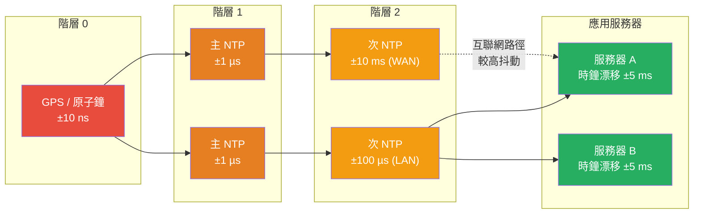

# [BEE-427] 時鐘同步與物理時間

:::info
分散式系統中的物理時鐘會獨立漂移，無法完美同步——迫使工程師在接受有界不確定性（NTP、PTP）、明確限定和暴露不確定性（TrueTime）、或結合物理和邏輯時鐘以同時獲得因果關係和時間語義（混合邏輯時鐘）之間做出選擇。
:::

## Context

每台計算機都有一個驅動其時鐘的晶體振盪器。晶體振盪器會漂移——典型的服務器級石英晶體每百萬分之二十到五十（20–50 ppm）的速率漂移，轉換為每天 1.7–4.3 秒的偏差。兩台從不通信的服務器，其時鐘會在數週內偏差數秒。這不是故障條件——而是物理基線。

Leslie Lamport 在 1978 年的「分散式系統中事件的時間、時鐘和排序」（Communications of the ACM，1978 年 7 月）中建立了理論基礎。他的核心觀察：分散式系統不能依賴同步的物理時鐘來確定事件排序，因為進程沒有共享的時間概念。他提出的解決方案——基於 happens-before 關係的邏輯時鐘——完全繞開了物理時間（完整處理見 BEE-422）。但邏輯時鐘不攜帶任何掛鐘時間信息，當您需要回答「這個系統在 UTC 14:00:00 的狀態是什麼？」或「這次提交是在那次之前還是之後？」這類問題時，物理時間就很重要了。

大多數系統的實際解決方案是 NTP（網絡時間協議），由特拉華大學的 David Mills 設計，協議最初發布於 RFC 958（1985 年），當前版本 NTPv4 規定在 RFC 5905（2010 年）中。NTP 將時間源組織成**階層（stratum）結構**：階層 0 包含 GPS 接收器和原子鐘；階層 1 服務器直接從階層 0 同步；階層 2 服務器從階層 1 同步，依此類推。在配置良好的局域網上，NTP 可在數百微秒內實現同步；在互聯網上，精度降至 1–10 毫秒。NTP 使用 Marzullo 算法（Keith Marzullo，1984 年）在多個時間源中選擇：每個源報告一個置信區間 `[c-r, c+r]`；算法找到與最多源一致的最小交集，拒絕可能是故障時鐘的離群值。

NTP 無法解決的問題是**限定不確定性**。NTP 會將您的時鐘校正到約 10ms 以內，但無法保證任何給定的讀數在該界限內是準確的。在時間 T 讀取時鐘的進程不知道真實時間是 T-5ms、T 還是 T+5ms。對大多數應用程序，這種不精確性是不可見的。對於想提供外部一致性的全球分散式數據庫——如果事務 A 在事務 B 開始之前提交，則每個觀察者都在 B 的寫入之前看到 A 的寫入——這就變得至關重要。

Google 的 Spanner 團隊用 **TrueTime** 解決了這個問題，在「Spanner：Google 的全球分散式數據庫」（Corbett 等人，OSDI 2012）中描述。TrueTime 的 API 返回一個區間而非點估計：`TT.now()` 返回 `[earliest, latest]`，保證真實的當前時間在區間內。Google 通過在每個數據中心部署 GPS 接收器和原子鐘來實現這一點；不確定性 epsilon（區間的半寬）在實踐中保持在 7ms 以下，通常為 1–4ms。Spanner 通過讓每個事務等待不確定性窗口到期再提交來實現外部一致性：如果事務希望在時間 `s` 提交，它會延遲直到 `TT.now().earliest > s`，確保沒有未來事務的提交時間戳會比 `s` 早超過不確定性窗口。

**混合邏輯時鐘（HLC）** 由 Kulkarni、Demirbas 等人在 2014 年引入（「全球分散式數據庫中的邏輯物理時鐘和一致快照」，OPODIS 2014），彌補了 Lamport 時鐘和物理時鐘之間的差距。HLC 時間戳是一對 `(physical_time, logical_counter)`。物理分量隨掛鐘時間前進；邏輯分量在物理時間單獨無法區分因果相關事件時遞增。HLC 時間戳在 epsilon 範圍內有界於物理時間，允許像「給我 UTC 14:00:00 的一致快照」這樣的查詢，同時仍然捕獲因果關係。CockroachDB 在內部使用 HLC 進行多版本並發控制和時間戳排序。

**IEEE 1588 PTP（精確時間協議）** 採用不同的方法：在 NIC 上的硬件時間戳，在以太網層捕獲同步包的發送和接收時間，消除了任何軟件抖動。在正確配置的 PTP 域上，可以實現亞微秒精度。PTP 用於高頻交易，微秒精度對合規性和排序至關重要；也用於 5G 電信基站，時序必須在 UTC ±1.5 微秒以內。

## Design Thinking

**根據工作負載中的失敗含義選擇同步層級。** NTP 足夠用於日誌記錄和指標時間戳，其中幾毫秒的偏差是不可觀察的。HLC 足夠用於需要因果一致快照而不需要絕對時間保證的分散式數據庫。只有當事務層面的外部一致性是正確性要求而非性能目標時，才需要 TrueTime（或使用原子鐘和 GPS 的近似方案）。

**切勿假設跨節點的時鐘單調性。** NTP 在校正期間可能會使時鐘後退。計算 `event_time = local_clock()` 並與遠程時間戳比較而不考慮偏差的分散式協議，將會行為不正確——有時對應該已見到寫入的讀取，有時對倒轉因果的排序。任何跨節點時間戳的比較都必須包含不確定性預算。

**時鐘偏差是有界的，而非不存在的。** 即使沒有 NTP，操作系統也會調整其時鐘（緩慢調整而非跳躍）以避免大的向後跳躍。實際關注的不是災難性漂移，而是節點間的穩態偏差——以及知道您的部署的偏差界限。CockroachDB 的 `max_offset` 配置（默認 500ms）是一個明確的聲明：「我們保證 NTP 將時鐘保持在此界限內。」系統圍繞這個保證設計。如果 NTP 失敗且漂移超過 `max_offset` 的 80%，CockroachDB 節點會自行關閉，而不是提供不一致的讀取。

## Visual



## Example

**TrueTime 風格的提交等待（Spanner 模式）：**

```
# 外部一致性要求：
# 如果事務 A 在事務 B 開始之前提交，每個讀取者必須在看到 B 的寫入之前看到 A 的寫入。

# 沒有 TrueTime：NTP 說是 14:00:00.005，但真實時間可能是 14:00:00.012
# 如果 B 分配 commit_time = 14:00:00.003（在 A 的實際提交之前），順序反轉。

# 使用 TrueTime：
#   TT.now() = [earliest=14:00:00.001, latest=14:00:00.008]   # 7ms 不確定性窗口
#   chosen_commit_timestamp = TT.now().latest  # = 14:00:00.008

# 提交等待：延遲直到 TT.now().earliest > chosen_commit_timestamp
#   即直到我們確定整個世界都已過了 14:00:00.008

while TT.now().earliest < chosen_commit_timestamp:
    sleep(1ms)                              # 等待不確定性消散

# 現在提交。在此之後開始的任何事務都將獲得 TrueTime 保證
# 大於 14:00:00.008 的時間戳 → 正確的排序得到保證。

# 預期延遲：epsilon ≈ 1–7ms（Google 的 GPS+原子鐘部署）
# 僅使用 NTP：epsilon 未知，可能為 50ms → 提交等待不安全
```

**混合邏輯時鐘（HLC）推進：**

```
# 每個進程的狀態：(physical_component, logical_counter)
# 符號：HLC = (pt, lc)

# 發送消息時：
local_pt = wall_clock_now()
if local_pt > hlc.pt:
    hlc = (local_pt, 0)          # 掛鐘超過 HLC → 重置計數器
else:
    hlc = (hlc.pt, hlc.lc + 1)  # HLC 已超前 → 遞增邏輯計數器
attach hlc to message

# 接收帶有 sender_hlc = (s_pt, s_lc) 的消息時：
local_pt = wall_clock_now()
if local_pt > hlc.pt and local_pt > s_pt:
    hlc = (local_pt, 0)
elif s_pt > hlc.pt:
    hlc = (s_pt, s_lc + 1)      # 採用發送者的物理時間，遞增計數器
elif hlc.pt == s_pt:
    hlc = (hlc.pt, max(hlc.lc, s_lc) + 1)  # 相同 pt：取最大計數器 + 1
else:
    hlc = (hlc.pt, hlc.lc + 1)

# 屬性：
# - HLC 時間戳始終 >= 物理時鐘（永不落後）
# - HLC.pt 在 ε 範圍內有界於真實物理時間（由 NTP 精度限制）
# - 如果 A happens-before B，則 HLC(A) < HLC(B)（因果關係保留）
# - 啟用在「掛鐘時間 T」的一致快照讀取：
#   包含所有 HLC.pt <= T 的提交
```

**時鐘偏差對 CockroachDB 讀取的影響：**

```
# CockroachDB 不確定性區間：
# 當事務在時間 T 開始時，它必須將 [T - max_offset, T] 中寫入的任何值
# 視為「不確定」，並可能重啟以在更高時間戳讀取。

# max_offset = 500ms（默認）
# 事務在 T = 1000ms 開始

# 不確定性窗口 [500ms, 1000ms] 中的值：
# → 事務可能看到這些，或重啟以讀取更新版本
# → 偶爾的不確定性重啟是正常且預期的

# 如果時鐘偏差超過 0.8 * max_offset = 400ms：
# → CockroachDB 節點關閉（「時鐘不可靠；拒絕提供讀取」）
# → 防止違反可序列化隔離的過期讀取

# 調整：如果 NTP 維護良好，max_offset 可降至 250ms
# → 更小的不確定性窗口 → 更少的重啟 → 更高的吞吐量
```

## Related BEEs

- [BEE-19003](vector-clocks-and-logical-timestamps.md) -- 向量時鐘和邏輯時間戳：Lamport 時鐘和向量時鐘在沒有物理時間的情況下解決排序；HLC 橋接了邏輯和物理方法
- [BEE-19002](consensus-algorithms-paxos-and-raft.md) -- 共識演算法：Raft 領導者選舉使用超時（而非時鐘），正是因為時鐘偏差會使基於時間的領導者有效性變得不安全；Spanner 使用 TrueTime 分配全球一致的提交時間戳
- [BEE-8001](../transactions/acid-properties.md) -- ACID 屬性：外部一致性（可序列化的全球泛化）是 TrueTime 在行星規模上實現的；本地 ACID 不需要同步時鐘
- [BEE-8005](../transactions/idempotency-and-exactly-once-semantics.md) -- 冪等性和恰好一次語義：事件去重通常依賴時間戳；如果由於時鐘偏差兩個事件共享時間戳，冪等鍵成為可靠的替代方案

## References

- [分散式系統中事件的時間、時鐘和排序 -- Leslie Lamport, Communications of the ACM, 1978 年 7 月](https://dl.acm.org/doi/10.1145/359545.359563)
- [Spanner：Google 的全球分散式數據庫 -- Corbett 等人, OSDI 2012](https://www.usenix.org/system/files/conference/osdi12/osdi12-final-16.pdf)
- [全球分散式數據庫中的邏輯物理時鐘和一致快照 -- Kulkarni 等人, OPODIS 2014](https://cse.buffalo.edu/tech-reports/2014-04.pdf)
- [網絡時間協議第 4 版：協議和算法規範 -- RFC 5905, IETF, 2010](https://datatracker.ietf.org/doc/html/rfc5905)
- [無需原子鐘生活：CockroachDB 的時鐘管理 -- CockroachDB 工程博客](https://www.cockroachlabs.com/blog/clock-management-cockroachdb/)
- [IEEE 1588-2008：網絡測量和控制系統的精確時鐘同步協議標準 -- IEEE](https://standards.ieee.org/standard/1588-2008.html)
