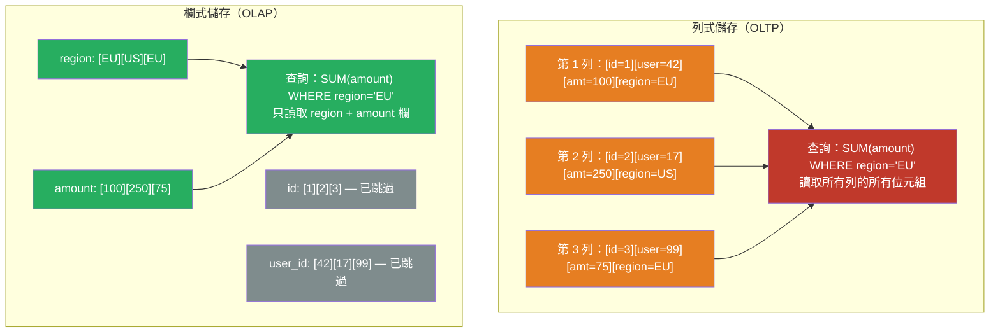

# [BEE-19045] 欄位導向儲存

:::info
欄位導向（Columnar）儲存以欄為單位而非以列為單位將資料排列在磁碟上，因此掃描百萬列表格中某一欄的查詢，只需讀取該欄值的連續資料塊，而無需跳過列交錯的位元組——對於以聚合為主的 OLAP 工作負載，可帶來數量級的效能提升。
:::

## 背景

傳統關聯式資料庫以列（row）為單位連續儲存：第 1 列的所有欄位，接著是第 2 列的所有欄位，依此類推。這種排列方式對於取得或更新完整列的 OLTP 查詢（`SELECT * FROM orders WHERE id = 42`）是最佳選擇，因為單次磁碟讀取就能取得所需的所有欄位。但對於跨越數百萬列聚合一或兩欄的分析查詢（`SELECT SUM(amount) FROM orders WHERE region = 'EU'`），列式排列方式強迫儲存引擎讀取每一列的每一欄，即使其中 90% 的位元組根本無關緊要。

Stonebraker 和 Abadi 在 2000 年代中期提出欄式儲存（column store）作為解決這種讀取放大（read amplification）問題的方案。Vertica（2005）、學術系統 C-Store（Stonebraker 等，2005）和 MonetDB（CWI 阿姆斯特丹歷經二十年開發）均證明，欄式儲存在分析工作負載上能以 10–100 倍的優勢勝過列式儲存，且無需特殊硬體。Abadi、Madden 和 Hachem 於 SIGMOD 2008 發表的論文《Column-Stores vs. Row-Stores: How Different Are They Really?》指出，樸素的欄式儲存實作未必優於最佳化的列式儲存；效能增益來自延遲具象化（late materialization）、壓縮和向量化執行三者的協同作用。

Google 的 Dremel 系統（Melnik 等，2010）將此模型擴展至嵌套資料（具有重複欄位的記錄），引入了 Dremel 編碼——Apache Parquet 的基礎，也是 Spark、Hive、BigQuery、Snowflake 和 DuckDB 使用的事實標準欄式檔案格式。

雲端資料倉儲（Snowflake、BigQuery、Redshift）和程序內分析引擎（DuckDB）的興起，使欄式儲存成為從業者必須關注的議題，而不僅僅是資料庫內部實作的學問。後端工程師越來越常撰寫產生 Parquet 檔案的 ETL 管線、對欄式儲存執行分析，並做出影響壓縮效率的 Schema 決策。

## 設計思維

### 實體排列方式

在列式儲存中，資料表 `orders(id, user_id, amount, region, created_at)` 的序列化方式為：

```
[1][user:42][100.00][EU][2024-01-01] [2][user:17][250.00][US][2024-01-01] ...
```

在欄式儲存中，同一張表被序列化為五個獨立的欄位檔案：

```
id:      [1][2][3]...
user_id: [42][17][99]...
amount:  [100.00][250.00][75.00]...
region:  [EU][US][US]...
```

查詢 `SELECT SUM(amount) FROM orders WHERE region = 'EU'` 只需讀取 `region` 欄（建立謂詞遮罩）和 `amount` 欄，`id`、`user_id` 和 `created_at` 欄完全不需要讀取。

### 壓縮效率

欄式排列讓壓縮效果大幅提升，因為同一欄的值是同質的（homogeneous），通常基數較低或有排序順序：

**行程長度編碼（RLE）**：若 `region` 的值為 `[EU, EU, EU, EU, US, US, US]`，則儲存為 `[(EU, 4), (US, 3)]`。適用於低基數欄或已排序資料。

**字典編碼（Dictionary Encoding）**：以整數代碼替換字串值，並單獨儲存字典。`[EU, US, EU, AU]` 變為 `[0, 1, 0, 2]`，字典為 `{0:EU, 1:US, 2:AU}`。20 個位元組的字串變成 1–2 個位元組的整數，對類別欄位通常可減少 10 倍儲存空間。

**位元壓縮（Bit-packing）/ 參考幀（Frame-of-Reference）**：值域範圍較小的整數以較少位元儲存。0 到 255 之間的欄位每個值只需 8 位元，而非 32 或 64 位元。

**差值編碼（Delta Encoding）**：對於單調遞增的值（時間戳記、自增 ID），儲存第一個值及相鄰值之間的差值。大整數變成小差值。

這些技術可以組合：Parquet 以頁（page）為單位儲存欄位資料，先套用字典編碼，再對編碼後的值使用 RLE 或位元壓縮。一個擁有 5 個不重複值、跨越 1000 萬列的真實 `region` 欄，壓縮後可能不到 3 MB，而列式儲存中可能超過 100 MB。

### 向量化執行

現代欄式引擎充分利用 CPU SIMD（單指令多資料，Single Instruction Multiple Data）指令。不同於每次迭代處理一個值：

```
for row in rows:
    sum += row.amount  # 純量
```

向量化引擎一次對 1024 個值的向量進行操作，讓 CPU 透過單條 SIMD 指令執行 8–32 次加法：

```
# 使用 AVX-512 指令，一次處理 1024 個 amount 值
sum = simd_sum(amount_batch)
```

MonetDB 開創了此模型；DuckDB 的執行引擎圍繞欄式資料的向量化處理而建構。欄位裁剪（讀取更少位元組）、更好的快取區域性（同質值適合 L1/L2 快取）和 SIMD 平行化的組合，解釋了為何在聚合工作負載上比列式儲存快 10–100 倍。

### Parquet 檔案格式

Apache Parquet 實作了 Dremel 嵌套資料模型。Parquet 檔案的組織方式為：

- **Row Group（列群組）**：資料表的水平分區（預設 128 MB）。每個列群組包含一部分列的所有欄位。
- **Column Chunk（欄位塊）**：列群組內某一欄的連續資料。
- **Page（頁）**：欄位塊內最小的編碼和壓縮單元（預設 1 MB）。
- **Footer（尾端）**：每個列群組的欄位統計資訊（最小值、最大值、null 數量），用於謂詞下推（predicate pushdown）——讀取器無需讀取資料即可跳過整個列群組。

基於統計資訊跳過列群組是選擇性查詢的關鍵最佳化。若查詢過濾 `WHERE amount > 1000`，而某列群組的 `amount` 欄最大值為 500，則整個列群組會被直接跳過。

## 最佳實踐

**必須（MUST）對分析工作負載和 ETL 管線使用欄式格式（Parquet、ORC），而非列式格式（CSV、JSON、Avro rows）。** 一個 10 GB 的 CSV 檔案，有 50 個欄位，轉換為使用 snappy 壓縮的 Parquet 後，通常變為 1–3 GB，對欄位選擇性查詢的讀取速度提升 5–20 倍。這同樣適用於儲存在物件儲存（S3、GCS）中由 Spark 或 Athena 處理的檔案。

**必須（MUST）按高基數過濾欄位對 Parquet 檔案內的資料排序，以最大化列群組跳過效果。** 若查詢頻繁按 `user_id` 過濾，請在寫入前按 `user_id` 排序 Parquet 檔案。列群組的 `user_id` min/max 範圍將會很小，大多數列群組在點查詢時可直接跳過。未排序的檔案需要讀取所有列群組。

**應該（SHOULD）根據基數和資料分布選擇欄位編碼：**

| 欄位類型 | 建議編碼 |
|---|---|
| 低基數字串（國家、狀態） | Dictionary + RLE |
| 高基數字串（名稱、電子郵件） | Dictionary + bit-packing |
| 單調整數（時間戳記、ID） | Delta + bit-packing |
| 浮點數聚合（金額、價格） | Plain 或 byte-stream split |
| 布林標誌 | RLE bit-packed |

大多數引擎（Parquet、DuckDB、Snowflake）會自動選擇編碼；理解預設值有助於判斷何時需要手動指定。

**不得（MUST NOT）對寫入頻繁的 OLTP 工作負載使用欄式儲存。** 向欄式儲存插入單一列需要向每個欄位檔案追加寫入——與列式儲存的單次順序寫入恰好相反。欄式儲存透過寫入最佳化的差量緩衝（delta buffer）處理插入（例如 Snowflake 的微分區暫存、DuckDB 的列群組緩衝），並定期合併到主要欄式儲存中。對於頻繁單列插入、更新和點查詢的交易型工作負載，列式儲存仍是正確的選擇。

**應該（SHOULD）按最常用的過濾維度對大型 Parquet 資料集進行分區。** 將 Parquet 檔案寫入如 `s3://bucket/orders/region=EU/year=2024/` 的路徑，可啟用分區裁剪：查詢 `WHERE region = 'EU' AND year = 2024` 只掃描匹配的分區目錄。結合列群組統計資訊，可實現兩層跳過。常見分區鍵：日期/時間戳記（時間序列）、tenant_id（多租戶分析）、region 或 status。

**應該（SHOULD）使用 Apache Arrow 作為程序間資料交換的記憶體內欄式格式。** Arrow 定義了語言無關的欄式記憶體排列方式，支援零拷貝序列化。Parquet 是磁碟格式；Arrow 是記憶體格式。現代分析管線使用 Parquet 儲存資料，使用 Arrow 在系統間傳輸資料（Python pandas/polars ↔ Spark ↔ DuckDB ↔ 查詢引擎），避免 JSON 或 Avro 的序列化開銷。

**必須（MUST）在 Parquet 尾端保留欄位統計資訊——不得停用統計資訊。** 統計資訊預設由寫入器生成，但某些寫入器可能會停用它。沒有統計資訊，查詢引擎無法跳過列群組，必須讀取整個檔案。對所有出現在 WHERE 子句中的欄位保持統計資訊啟用。

## 視覺說明



## 實作範例

**使用 PyArrow 寫入和讀取 Parquet：**

```python
import pyarrow as pa
import pyarrow.parquet as pq
import pyarrow.compute as pc

# 以明確型別定義 Schema，以獲得最佳編碼效果
schema = pa.schema([
    pa.field("order_id",   pa.int64()),
    pa.field("user_id",    pa.int32()),
    pa.field("amount",     pa.float64()),
    pa.field("region",     pa.dictionary(pa.int8(), pa.string())),  # 對低基數欄位使用字典編碼
    pa.field("created_at", pa.timestamp("ms", tz="UTC")),
])

table = pa.table({...}, schema=schema)

# 按 region 分區寫入——在查詢時啟用分區裁剪
pq.write_to_dataset(
    table,
    root_path="s3://my-bucket/orders/",
    partition_cols=["region"],
    compression="snappy",              # 快速壓縮；歸檔用途可使用 zstd
    row_group_size=128 * 1024 * 1024,  # 128 MB 列群組
    write_statistics=True,             # 必須（MUST）為 True 以啟用謂詞下推
)

# 以謂詞下推方式讀取——只有 EU 的列群組才會從磁碟讀取
dataset = pq.read_table(
    "s3://my-bucket/orders/region=EU/",
    columns=["order_id", "amount"],         # 欄位裁剪
    filters=[("amount", ">", 100.0)],       # 列群組統計資訊跳過
)
total = pc.sum(dataset.column("amount")).as_py()
```

**DuckDB 直接查詢 Parquet 檔案：**

```sql
-- DuckDB 可原生查詢 S3 上的 Parquet
-- 路徑包含 hive 風格分區（region=EU/）時，分區裁剪自動生效

INSTALL httpfs;
LOAD httpfs;
SET s3_region = 'us-east-1';

-- 同時套用欄位裁剪 + 分區裁剪 + 列群組統計資訊
SELECT region, SUM(amount) AS total
FROM read_parquet('s3://my-bucket/orders/**/*.parquet', hive_partitioning=true)
WHERE region = 'EU'
  AND created_at >= '2024-01-01'
GROUP BY region;

-- 檢查列群組統計資訊，驗證下推是否生效
SELECT *
FROM parquet_metadata('s3://my-bucket/orders/region=EU/data.parquet')
LIMIT 5;
```

**針對欄式壓縮效率設計 Schema：**

```sql
-- 差：高基數自由文字欄與分析欄混用
-- 字典編碼對 UUID 字串幾乎無效
CREATE TABLE events (
    event_id  TEXT,         -- UUID：36 字元，近乎唯一，壓縮效益極低
    user_id   INTEGER,      -- 相對事件而言基數較低：壓縮效果佳
    action    TEXT,         -- 10-20 個不同值：RLE + 字典壓縮效果極佳
    metadata  JSONB,        -- 不透明 blob：無法在欄位層級壓縮或裁剪
    ts        TIMESTAMPTZ   -- 單調：差值編碼，每個值約 4 位元組
);

-- 好：將 JSONB 分解為具型別欄位供分析路徑使用；
-- 列式儲存的 OLTP 端仍保留完整 JSONB 供彈性存取
CREATE TABLE events_parquet (
    event_id    BIGINT,     -- 自增；差值編碼：每個值約 2 位元組
    user_id     INTEGER,
    action      TEXT,       -- 字典編碼：若不同值 <= 256 個，每個值 1 位元組
    page        TEXT,       -- 分區鍵候選
    duration_ms INTEGER,
    ts          TIMESTAMP
);
-- 獨立的 OLTP 列式儲存保留完整 JSONB metadata 供點查詢使用
```

## 實作注意事項

**DuckDB**：程序內 OLAP 引擎，具有向量化欄式執行引擎。原生讀取 Parquet、CSV、Arrow 和 JSON。PRAGMA 語句可暴露執行細節（`EXPLAIN ANALYZE`）。適合在本機或 Lambda 函數中執行分析，無需啟動叢集。

**Apache Spark / Databricks**：預設寫入 Parquet（`df.write.parquet(path)`）。使用 `spark.sql.parquet.filterPushdown = true`（預設值）啟用謂詞下推。寫入前使用 `sortWithinPartitions("user_id")` 對每個分區內部排序，以改善列群組統計資訊。

**Amazon Athena / Google BigQuery**：兩者都從物件儲存讀取 Parquet，支援分區裁剪和謂詞下推。BigQuery 使用自有欄式格式（Capacitor），但可匯出/匯入 Parquet。Athena 費用與掃描位元組數成正比——欄式格式加上統計資訊是主要的成本最佳化手段。

**Snowflake**：使用微分區（50–500 MB 欄式檔案）並自動聚合。明確的 `CLUSTER BY` 鍵可啟用等同列群組跳過的微分區裁剪。載入順序的自然聚合通常已足夠；僅當頻繁過濾的高基數欄位確有需要時，才適合使用明確聚合。

**PostgreSQL**：預設為列式儲存。`pg_columnar` 擴充功能（Citus/Azure Cosmos）和 `timescaledb` 的欄式壓縮為僅追加資料添加了欄式儲存支援。適用於冷熱分層：近期資料以列式格式儲存以便插入；舊資料以欄式格式壓縮供範圍掃描使用。

## 相關 BEE

- [BEE-6005](../data-storage/storage-engines.md) -- 儲存引擎：涵蓋 LSM Tree 和 B-Tree，兩者均為列式儲存引擎；欄式儲存是針對分析讀取模式最佳化的第三種模型
- [BEE-7004](../data-modeling/encoding-and-serialization-formats.md) -- 編碼與序列化格式：涵蓋 Avro、Protocol Buffers 和 Thrift；Parquet 和 Arrow 是適用於分析工作負載的欄式等價格式
- [BEE-6002](../data-storage/indexing-deep-dive.md) -- 索引深度解析：欄式儲存使用基於統計資訊的跳過（每列群組 min/max），而非傳統 B-Tree 索引；了解兩者有助於選擇正確的工具
- [BEE-13004](../performance-scalability/profiling-and-bottleneck-identification.md) -- 效能分析與瓶頸識別：I/O 讀取放大是欄式儲存消除的主要瓶頸；在遷移前使用分析工具確認

## 參考資料

- [Designing Data-Intensive Applications, Chapter 3 — Martin Kleppmann (2017)](https://dataintensive.net/)
- [Dremel: Interactive Analysis of Web-Scale Datasets — Melnik et al., PVLDB 2010](https://dl.acm.org/doi/10.14778/1920841.1920886)
- [Column-Stores vs. Row-Stores: How Different Are They Really? — Abadi, Madden, Hachem, SIGMOD 2008](https://dl.acm.org/doi/10.1145/1376616.1376712)
- [Apache Parquet — Official Documentation](https://parquet.apache.org/)
- [Apache Arrow — Universal Columnar Format and Multi-Language Toolbox](https://arrow.apache.org/)
- [DuckDB — In-Process SQL OLAP Database](https://duckdb.org/)
- [MonetDB: Two Decades of Research in Column-Oriented Database Architectures — Idreos et al., IEEE Data Engineering Bulletin 2012](http://sites.computer.org/debull/a12mar/monetdb.pdf)
